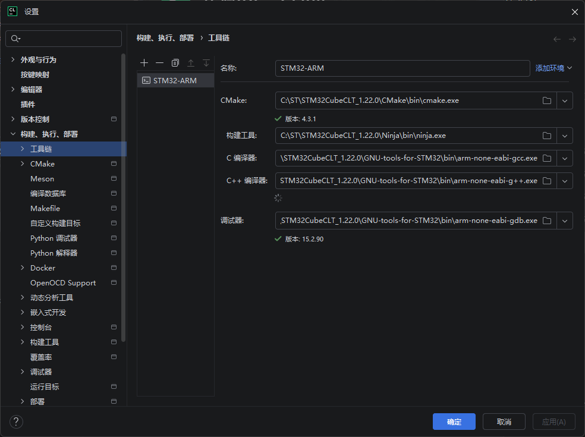
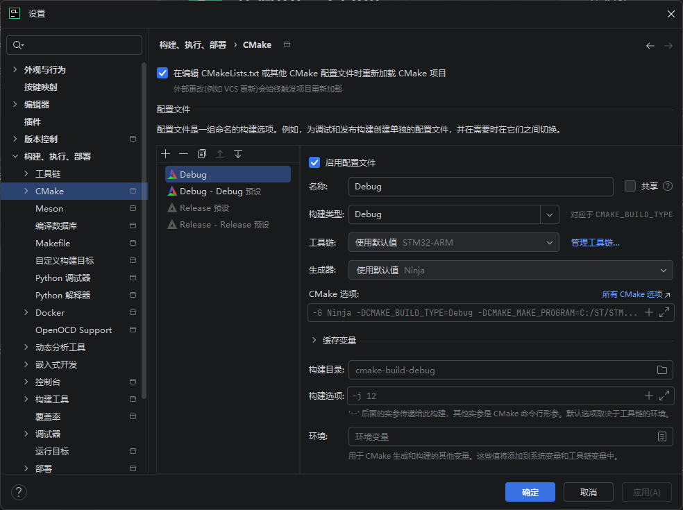
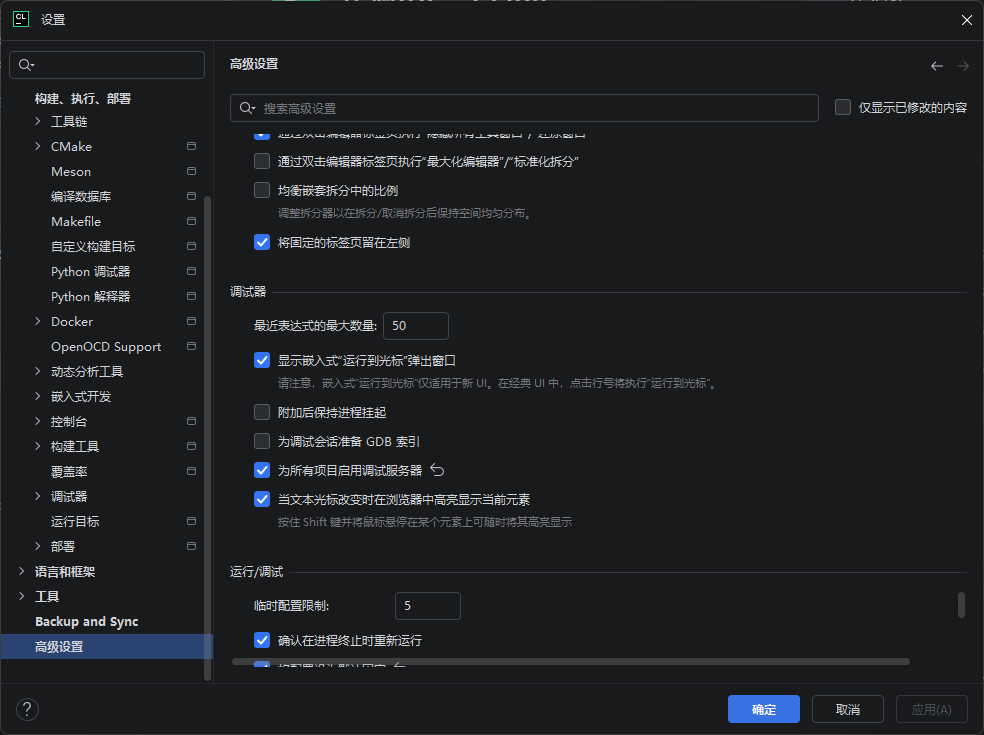
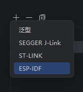
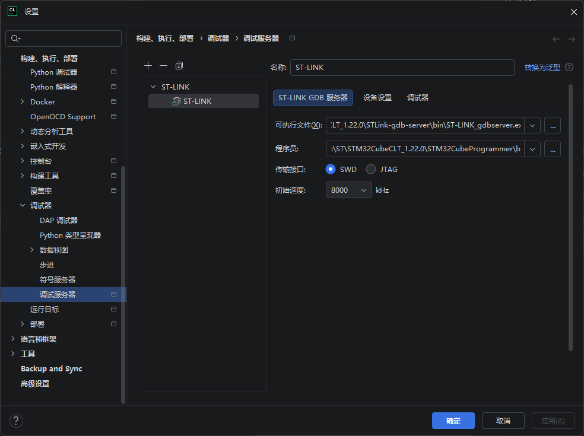
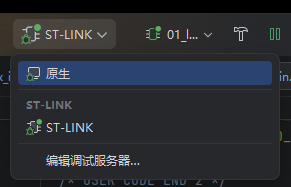

# 手把手教你用CLion开发STM32操作文档

## 一、安装STM32CubeMX
1. 方式一：前往ST官方网站下载安装包，下载后解压并运行安装程序。
2. 方式二：访问`fubemx.keysking.com`下载FubeMX，直接双击运行安装。
3. 安装过程中选择安装位置，勾选同意协议，保持默认安装路径，等待安装完成后点击“Done”。

## 二、安装STM32CubeCLT_1.22.0
1. 前往ST官网下载STM32CubeCLT_1.22.0安装包，解压后双击运行。
2. 点击“Next”，同意协议，保持默认安装路径，勾选安装STLink组件。
3. 等待安装完成，点击“Next”后点击“Finish”。

## 三、安装STM32CubeProgrammer并更新驱动
1. 前往ST官网下载对应系统的STM32CubeProgrammer安装包，运行安装程序。
2. 接受许可协议，选择安装路径，勾选主程序和ST-LINK USB驱动组件，完成安装。
3. 驱动更新：
   - 先将ST-Link调试器插入电脑。
   - 打开设备管理器，若ST-Link设备显示感叹号，右键选择“更新驱动程序”，浏览到STM32CubeProgrammer安装目录下的`drivers/STLink_WinUSB_Drivers.inf`文件完成安装。
   - 也可使用Zadig工具：运行Zadig → 勾选“List All Devices” → 选择“ST-LINK/V2/V3” → 目标驱动选择“WinUSB” → 点击“Replace Driver”。

## 四、安装CLion
1. 前往JetBrains官网下载CLion安装包，双击运行。
2. 选择安装目录（建议默认路径），根据需求勾选安装选项，点击安装，等待完成后点击“完成”。

## 五、创建STM32项目
1. 打开STM32CubeMX，选择目标芯片，配置硬件引脚和外设。
2. 进入“Project Manager”，设置项目名称和路径，工具链选择“CMake”。
3. 点击“Generate Code”生成项目文件。
4. 打开CLion，选择打开项目，指向STM32CubeMX生成的项目文件夹，信任项目后即可进入开发界面。

## 六、配置CLion调用链（工具链）
1. 打开CLion，进入设置界面。
2. 找到“工具链”选项，点击“+”新建工具链，命名为“STM32”。
3. 分别指定以下路径：
   - CMake：指向STM32CubeCLT安装目录下的`cmake.exe`
   - Ninja：指向STM32CubeCLT安装目录下的`ninja.exe`
   - C编译器：指向STM32CubeCLT安装目录下的`arm-none-eabi-gcc.exe`
   - C++编译器：指向STM32CubeCLT安装目录下的`arm-none-eabi-g++.exe`
   - 调试器：指向STM32CubeCLT安装目录下的`arm-none-eabi-gdb.exe`

## 七、配置CMake
1. 在CLion设置中找到“CMake”选项。
2. 选择新建的“STM32”工具链，设置默认构建类型（日常开发选Debug，发布选Release/MinSizeRel）。
3. 确认CMake路径与工具链中配置的路径一致，保存设置。

## 八、配置调试器
### 8.1 启用调试服务器
1. 进入CLion设置，找到“高级设置” → “调试器”。
2. 勾选“为所有项目启用调试服务器”，保存设置。

### 8.2 添加ST-Link调试服务
1. 进入CLion设置，找到“构建、执行、部署” → “调试器” → “调试器服务”。
2. 点击“+”新增服务，选择“ST-Link”，保持默认配置，点击确定保存。

