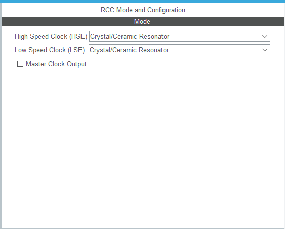
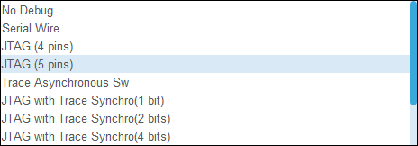
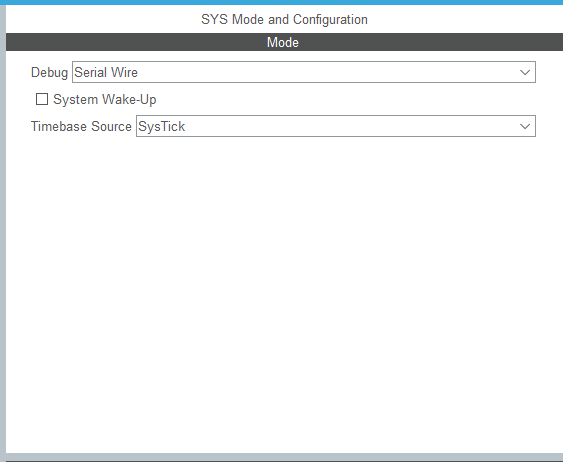

# STM32CubeMX 完整使用教程（适配 STM32F103ZET6 项目）

> 配套图片位于 `./cubemx/images/`

## 目录

1. [前期准备](#前期准备)
2. [第一步：Pinout & Configuration 引脚与外设配置](#第一步pinout--configuration-引脚与外设配置)
   - 1.1 [系统核心（System Core）配置](#1-系统核心system-core配置)
   - 1.2 [GPIO 配置](#2-gpio-配置)
   - 1.3 [通信外设（Connectivity 分组）按需开启](#3-通信外设connectivity-分组按需开启)
   - 1.4 [其他外设](#4-其他外设)
3. [第二步：Project Manager 工程参数配置](#第二步project-manager-工程参数配置)
4. [第三步：生成代码](#第三步生成代码)
5. [第四步：IDE 端后续开发规范](#第四步ide-端后续开发规范)
6. [高频踩坑清单](#高频踩坑清单)

---

## 前期准备

1. **安装固件包**：打开 CubeMX → `Help → Manage embedded software packages` → 下载 `STM32F1 Cube MCU Package` 对应版本固件
2. **新建项目**：主页点击 `New Project` → 芯片检索栏输入 `STM32F103ZET6` → 选中 `LQFP144` 封装
3. **存放规范**：工程保存路径全程使用英文，**禁止出现中文、空格、特殊符号**

---

## 第一步：Pinout & Configuration 引脚与外设配置

### 1. 系统核心（System Core）配置

System Core 下需要重点关注 3 个子系统：**RCC**（时钟）、**SYS**（调试与时基）、**NVIC**（中断优先级）。三者缺一不可，任何一项配错都会让"看似能跑"的程序在某个时点炸掉。

#### （1）RCC 时钟

**步骤 1：选择时钟源**

| 选项 | 含义 | 适用场景 |
| --- | --- | --- |
| `Crystal/Ceramic Resonator` | 板载晶振（HSE / LSE） | **本项目必选**——F103ZET6 板载 8MHz + 32.768kHz |
| `Bypass Clock Source` | 外部时钟输入（跳过晶振） | 由外部时钟芯片喂入时钟 |

- **HSE**：`Crystal/Ceramic Resonator` → 8MHz 外部晶振
- **LSE**：需要 RTC 就同样选晶振模式 → 32.768kHz 低速晶振

**步骤 2：配置时钟树**

跳转 `Clock Configuration` 标签，按下表填：

| 时钟 | 输入 | 配置 |
| --- | --- | --- |
| HSE | 8MHz | 外部晶振 |
| PLL | ×9 | 主频 = 72MHz |
| AHB | ÷1 | 72MHz |
| APB1 | ÷2 | **36MHz**（F103 限制 ≤36MHz） |
| APB2 | ÷1 | 72MHz |

> ⚠️ 必须保证**时钟树上没有任何红色警告**；红色 = 频率超限。

> **RCC 时钟不配置的后果**
>
> - **现象 1**：`HAL_Init()` 之后默认是内部 8MHz HSI，未经倍频，主频只有 8MHz，所有外设跑得极慢（`HAL_Delay` 不准、UART 波特率偏移、闪烁频率肉眼可见地慢）
> - **现象 2**：若代码里写了 `RCC_HSE_ON` 但板子上**没有焊外部晶振**，`HAL_RCC_OscConfig()` 会返回 `HAL_ERROR` 并进入 `Error_Handler`。若 `Error_Handler` 又写成 `__disable_irq() + while(1)`，CPU 假死、ST-LINK 失联，烧不进下一次
> - **现象 3**：`Clock Configuration` 里如果分频填错（如 APB1 不分频而总线高于 36MHz），USART1、I2C、定时器等挂在 APB1 上的外设直接失灵，通信完全失败
> - **现象 4**：忘记开 LSE 却又调用 `HAL_RTC_Init()`，RTC 起不来，会反复进入错误回调
>
> ✅ **正确做法**：始终在 CubeMX 的 `Clock Configuration` 标签里把树配通（不能有红色警告），HSE 8MHz → PLL ×9 = 72MHz → AHB 不分频、APB1 ÷2、APB2 不分频；然后在 `SystemClock_Config()` 里照搬即可。

#### （2）SYS 调试与时基

SYS 下分两块：

**Debug** —— 决定 SWD 是否可用

| 选项 | 含义 | 是否推荐 |
| --- | --- | --- |
| `Serial Wire` | SWD 模式，PA13/PA14 做调试 | ✅ **本项目必选**，适配 ST-LINK |
| `JTAG (4 pins)` | JTAG 模式，占用 PA13/14/15 + PB3 | ❌ 占用引脚多 |
| `Trace Asynchronous Sw` | SWD + 异步跟踪 | ⚠️ 占用额外引脚 |
| `JTAG with Trace Synchro` | JTAG + 同步跟踪 | ❌ 占用最多引脚 |
| `No Debug` | 关闭所有调试接口 | 🚫 烧完即失联，新手不要选 |

**Timebase Source** —— 决定 `HAL_Delay` 的心跳源

| 选项 | 含义 | 是否推荐 |
| --- | --- | --- |
| `SysTick` | Cortex-M3 内核 SysTick 定时器 | ✅ **本项目必选**，标准库默认 |
| `TIMx` | 任意通用定时器 | ⚠️ 必须自己写中断服务，否则 `HAL_Delay` 失效 |

**System Wake-up** —— 低功耗唤醒相关，本项目不需要，保持默认。

> **SYS 配置不正确的后果**
>
> - **现象 1（Debug 选 No Debug）**：芯片上电后 SWD 引脚立刻变成普通 GPIO，ST-LINK 永远连不上，表现为 `Target no device found`。必须 BOOT0=3V3 进 ISP 才能整片擦除救回
> - **现象 2（Debug 选 Trace Asynchronous Sw）**：保留 SWD 但额外占用部分引脚做跟踪输出，若这些引脚被外设复用，调试会时断时续
> - **现象 3（代码里写了 `__HAL_AFIO_REMAP_SWJ_DISABLE()`）**：运行时把 SWD 也禁掉，效果同"选 No Debug"，但只有在程序跑到那一行才生效——第一次烧录（程序还没跑起来）能成功，重启后即失联。这是新手最常忽略的隐形炸弹
> - **现象 4（Timebase Source 用 SysTick 之外的非 TIM6 定时器）**：若业务里用了 `HAL_Delay`，标准库默认时基是 SysTick；若换成其他定时器，`HAL_Delay` 计数不自增，延时不生效，调试时表现"代码卡住"
>
> ✅ **正确做法**：Debug 必选 `Serial Wire`，Timebase 保持默认 SysTick；若一定要复用调试引脚，至少改成 `__HAL_AFIO_REMAP_SWJ_NOJNTRST()`（保留 SWD，仅禁用 NJTRST）。

#### （3）NVIC 中断优先级

- 入门阶段：**沿用默认优先级**，不要乱改
- 启用串口、触控、定时器中断时：再回到这里调配**抢占优先级**与**子优先级**
- **抢占优先级 ≠ 子优先级**：抢占级别高的中断能打断抢占级别低的中断；抢占级别相同时，谁的子优先级高谁先响应
- 不要把任何中断优先级设为 0 并在中断里调 `__disable_irq()`——ST-LINK 调试会失联

### 2. GPIO 配置

1. 在芯片预览图点击目标引脚，下拉选择 `GPIO_Output`（输出，适配 LED）或者 `GPIO_Input`（输入，适配触控检测按键）
2. 进入 `System Core → GPIO` 精细化配置：推挽/开漏模式、上下拉选项、输出速率，还可以填写 `User Label` 自定义引脚别名，优化代码可读性
3. **BOOT0 引脚固定处于 `Reset_State`**，硬件完成启动电平控制，禁止软件修改

### 3. 通信外设（Connectivity 分组）按需开启

- **U(S)ART**：选择 `Asynchronous` 异步模式，配置波特率、校验位等参数，引脚会自动复用
- **SPI / CAN**：点开对应外设选项即可自动锁定引脚
- **FSMC**：适配 LCD 屏幕，选定 NOR/SRAM 模式、匹配原理图的片选通道，微调时序参数

### 4. 其他外设

定时器、ADC、DMA、RTC 等模块依照项目需求逐个启用，留意**引脚复用冲突**。

---

## 第二步：Project Manager 工程参数配置

### 1. Project 子标签

填写项目名称、存储路径，选择适配 IDE：**Keil MDK-ARM V5** 或者 **STM32CubeIDE**，设置堆栈大小（新手保持默认即可）。

### 2. Code Generator 子标签（沿用你当下合适的配置）

| 选项 | 推荐 | 说明 |
| --- | --- | --- |
| 库模式：`Copy only the necessary library files` | ✅ | 只拷贝用到的库文件 |
| Generated files 全部勾选 | ✅ | 拆 .c/.h、备份旧文件、保留 USER CODE 区间、自动清理废弃旧文件 |
| 两个 HAL Settings 复选框 | ❌（常规开发） | 低功耗场景再酌情开启 |
| 脚本模板（User Actions、Template Settings） | ✅ 保持默认 | 入门阶段保持空白 |

---

## 第三步：生成代码

点击右上角 `GENERATE CODE` 等待生成完成，弹窗可直接跳转 IDE 打开工程。

---

## 第四步：IDE 端后续开发规范

1. **代码编写限制**：自己写的业务代码必须放进 `/* USER CODE BEGIN ... */` 和 `/* USER CODE END ... */` 之间，重新生成 CubeMX 代码时才不会被覆盖；**不要手动修改外设自动生成的初始化源码**
2. **最小验证**：优先写 LED 循环翻转代码，测试时钟、GPIO、下载链路是否正常
3. **驱动开发**：屏幕、SPI 外设、CAN、触摸芯片等外设单独新建驱动文件夹存放代码
4. **编译下载**：完成代码编写后进行编译，排查警告报错；借助 ST-Link 下载，可开启断点调试排查问题

---

## 高频踩坑清单 💡

1. **烧录失败**：检查硬件 BOOT0 接地、SWD 调试模式已经开启、下载接线牢靠
2. **时钟异常**：确认 HSE 选型正确，时钟树没有出现红色超限提示
3. **引脚冲突**：复用外设前核对原理图，避免同一个引脚被多个外设占用
4. **版本留存**：妥善备份 `.ioc` 工程文件，后续修改硬件配置要回到 CubeMX 调整 ioc，**不要直接改动初始化源文件**
5. **移植项目**：完整拷贝整个工程文件夹，不要单独零散复制源码