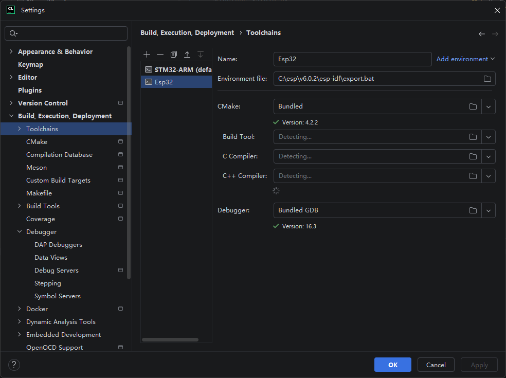
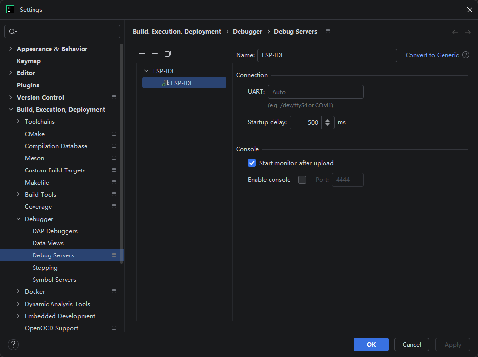

# ESP32 与 Clion的使用

> 参考文献
> <https://docs.espressif.com/projects/esp-idf/zh_CN/stable/esp32/third-party-tools/clion.html#id4>
> <https://developer.espressif.com/blog/clion/#configuring-an-esp-idf-project>
> <https://docs.espressif.com/projects/esp-idf/en/stable/esp32s3/get-started/windows-setup.html>

# 安装环境

## 必备组件

Git
Python

## 安装 esp-idf

https://dl.espressif.com/dl/eim/

打开后会有安装指引, 直接按照指引安装即可.
最好使用自定义安装, 完全安装 esp-idf.

配置 Clion ESP-IDF 工具链

配置 Clion 项目启动器

配置 Clion 运行环境

# 烧录工具 flash_download_tool 下载与安装

https://docs.espressif.com/projects/esp-test-tools/en/latest/esp32/production_stage/tools/flash_download_tool.html

https://dl.espressif.com/public/flash_download_tool.zip

# AT 下载

https://docs.espressif.com/projects/esp-at/zh_CN/release-v3.2.0.0/esp32c3/Get_Started/Downloading_guide.html

# AT 烧录

如果usb链接后, 不停地提示音, 需要短接 P9 与 GND, 激活boot模式, 进行烧写;

