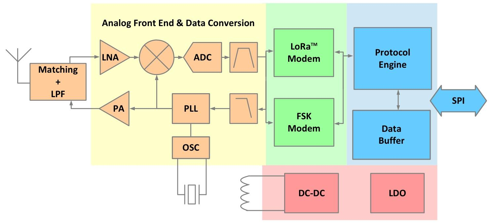
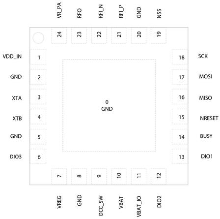
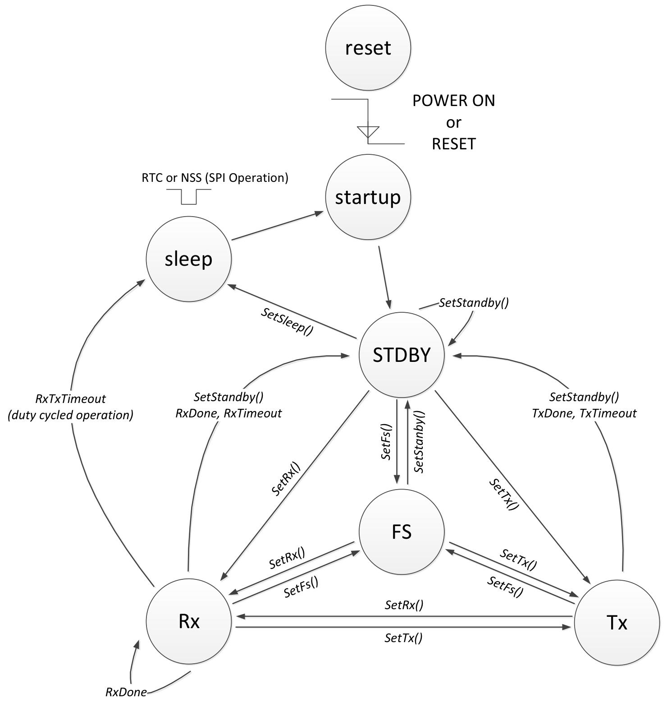

# Semtech LLCC68 数据手册（Rev.1.0 2019年7月）完整详细总结
## 一、芯片基础定位与核心概述
LLCC68是Semtech推出**Sub-GHz半双工远距离低功耗射频收发芯片**，面向LPWAN与传统无线物联网场景，支持LoRa、(G)FSK双调制方案，兼容LoRaWAN标准，满足全球主流ISM频段射频法规（ETSI EN 300 220、FCC Part15、中国无线电规范、日本ARIB T-108等）。

### 核心优势
1. **射频性能**：连续覆盖150~960MHz全Sub-GHz频段，最大发射功率+22dBm；接收典型电流仅4.2mA，极致低功耗适配电池供电设备。
2. **双调制兼容**：LoRa扩频远距离+FSK高速短距，兼顾长距离与传统设备兼容。
3. **高度集成**：内置PLL、ADC、256Byte硬件FIFO、DC-DC/LDO双电源方案、多路多功能DIO，外围极简；4×4mm QFN24无卤封装，适合小型化硬件。
4. **灵活控制**：标准化SPI主机接口，完整指令集，支持信道检测、低占空比监听、TCXO外部高精度时钟、射频开关自动控制。
### 典型应用场景
智能表计、供应链资产追踪、楼宇自动化、农业传感器、智慧城市路灯/车位检测、环境监测、医疗穿戴、安防传感器、无线遥控等物联网终端。

## 二、硬件架构（模块框图解析）

芯片分为四大核心模块：
1. **模拟前端（黄色区域）**
    - 接收通路：天线匹配网络+LPF→LNA低噪放大器→混频器→ADC模数转换；
    - 发射通路：PLL本振→功率放大器PA→天线输出RFO；
    - 时钟基准：32MHz晶振OSC，提供PLL基准；
    - 频率合成：三阶sigma-delta分数N PLL，0.95Hz超细频步进，支持自动校准。
2. **数字调制解调器（绿色）**：独立LoRa Modem、FSK Modem两套硬件解调通路，参数完全独立配置。
3. **数字控制内核（蓝色）**：协议引擎、256Byte共享数据FIFO、SPI通信外设，所有寄存器/数据包通过SPI读写。
4. **电源管理（红色）**：内置DC-DC降压转换器（高效率）+LDO线性稳压器（低成本少外围），双供电模式可选，独立PA供电VR_PA。

## 三、封装、引脚与电气极限参数
### 1. 封装规格
4×4mm QFN24封装，0.5mm引脚间距，无铅无卤、符合RoHS/WEEE；卷带出货最小起订3000片。

### 2. 关键引脚功能分类
| 类别 | 核心引脚 | 功能说明 |
|------|---------|---------|
| 电源引脚 | VBAT/VBAT_IO/VDD_IN/VR_PA | 主供电1.8~3.7V；VR_PA为功放独立供电；VREG/DCC_SW为DC-DC电感引脚 |
| 射频引脚 | RFI_P/RFI_N（差分接收）、RFO（发射输出） | 差分射频输入，单端射频发射口 |
| 时钟引脚 | XTA、XTB | 32MHz晶振；外接TCXO仅用XTA，XTB悬空 |
| SPI总线 | SCK、MOSI、MISO、NSS(片选低有效) | 标准Motorola SPI（CPOL=0,CPHA=0）最高16MHz |
| 控制引脚 | NRESET（硬件复位低有效）、BUSY（忙状态输出） | BUSY高=芯片正在处理指令，主机需等待 |
| 多功能DIO | DIO1/DIO2/DIO3 | DIO2可自动控制射频开关；DIO3可输出1.6~3.3V驱动TCXO；三路均可映射所有中断IRQ |
### 3. 电气额定参数
#### （1）极限最大额定（超过永久损坏）
- 供电VBAT：-0.5~3.9V；工作温度-55~125℃；射频输入最大10dBm。
#### （2）正常工作区间
- 供电1.8~3.7V，工作温度-40~85℃；天线驻波比最大10:1。
#### （3）ESD防护
HBM人体模型2kV，CDM充电器件模型1kV，闩锁电流100mA，量产可正常焊接。
#### （4）32MHz晶振规格
负载电容10pF，串联电阻30~60Ω，驱动功率100μW；芯片内置可编程匹配电容（11.3~33.4pF，0.47pF步进），无需外部负载电容。

## 四、电源系统：DC-DC / LDO两种方案
芯片内核支持两种稳压模式，通过`SetRegulatorMode`指令切换，仅能在STDBY_RC模式配置：

### 方案A：DC-DC模式（推荐电池低功耗产品）
1. 优势：转换效率约90%，RX/TX静态电流大幅降低；
2. 外围要求：VREG与DCC_SW之间串联15μH电感，搭配滤波电容；
3. 适用：电池供电、长期接收监听设备；
4. 功耗对比：DC-DC下LoRa接收4.6mA，LDO模式高达8.8mA。

### 方案B：LDO纯线性模式（低成本小型化）
1. 优势：省去15μH功率电感，BOM更少、PCB面积更小；
2. 劣势：静态电流几乎翻倍，功耗更高；
3. 适用：插电供电、发射为主、对功耗不敏感设备。

### 功放供电说明
PA独立供电VR_PA，最低需要VBAT比VR_PA高200mV才能达到额定功率：
- VBAT≥3.3V：支持+22dBm满功率；
- VBAT=2.7V：最大+20dBm；
- VBAT=1.8V：功率上限仅+17dBm。
内置OCP过流保护，默认限流140mA，可寄存器自定义。

## 五、功耗完整分级（3.3V供电，DC-DC模式）
| 工作模式 | 典型电流 | 补充说明 |
|---------|---------|---------|
| 冷启动SLEEP（全模块断电） | 160nA | 无配置保存，唤醒需完整校准 |
| 热启动SLEEP（保留寄存器） | 600nA / 1.2μA | 带64k RTC时钟时1.2μA，支持定时唤醒 |
| STDBY_RC（仅13M RC时钟） | 0.6mA | 配置芯片默认待机状态 |
| STDBY_XOSC（32M晶振开启） | 0.8mA | 快速切换射频模式 |
| FS锁相合成模式 | 2.1mA | PLL锁定，仅做频点预热 |
| LoRa接收（标准增益） | 4.6mA | 主流低功耗接收配置 |
| LoRa增强接收（高灵敏度） | 5.3mA | 牺牲功耗换取更好接收灵敏度 |
| TX +22dBm满功率发射 | 118mA | 峰值发射电流 |

## 六、双调制解调器：LoRa / (G)FSK 完整参数
### 6.1 LoRa扩频调制（远距离抗干扰）
#### 1. 核心可调参数
1. **带宽BW**：125/250/500kHz（双边带DSB），400MHz以下部分带宽受限；
2. **扩频因子SF**
    - 125kHz：SF5~9
    - 250kHz：SF5~10
    - 500kHz：SF5~11
    SF越高灵敏度越好、空中时长越长，解调最低SNR可达-17.5dB（SF11）；
3. **编码率CR**：4/5、4/6、4/7、4/8，纠错能力递增、包长增加；
4. **低速率优化LDRO**：符号时长≥16.38ms开启，放宽频漂容忍度16倍。
#### 2. 数据包结构
两种帧格式：
- **显式包头Explicit（默认）**：自带 payload长度、CR、CRC标志，收发无需预同步参数；
- **隐式包头Implicit**：去掉包头缩短空中时长，收发必须预先统一包长、CR、CRC；
数据包组成：前导码（10~65535符号可编程）→包头（可选）→有效载荷→可选16bit CRC。
#### 3. CAD信道活动检测（LoRa专属）
仅LoRa模式可用，检测空中LoRa前导，支持1/2/4/8/16符号扫描，可自动跳转RX接收，实现低功耗侦听，避免持续高功耗接收。

### 6.2 (G)FSK调制（高速短距离兼容传统设备）
1. 比特率范围：0.6kbps ~ 300kbps（低频段上限降低）；
2. 频偏Fdev可编程，满足`2*Fdev+BR < 接收带宽`约束；
3. 接收带宽多档可选（4.8kHz~467kHz）；
4. 支持高斯滤波BT=0.3/0.5/0.7/1，也可关闭滤波；
5. 数据包功能：8字节同步字、地址过滤、数据白化、高度自定义CRC（多项式/初值可改，支持IBM、CCITT标准），固定/可变长两种包格式。

## 七、射频接收与发射性能
### 1. 接收灵敏度（Boost高增益）
- FSK 0.6kbps：-125dBm；
- LoRa 125kHz SF9：-129dBm；
- LoRa 500kHz SF11：-127dBm；
内置两种接收增益：省电增益（低电流，灵敏度下降）、增强增益（极致接收）。
### 2. 发射特性
- 功率范围：-9 ~ +22dBm，1dB步进可调；
- PA斜坡上升时间10μs~3.4ms可编程，满足各国频谱杂散法规；
- 天线失配保护：内置PA钳位电路，手册提供寄存器优化方案改善驻波耐受；
- 支持连续波CW测试、无限前导测试模式，用于射频校准。

## 八、芯片六大工作状态与状态机

1. **SLEEP休眠**：最低功耗，可选保留配置、RTC定时唤醒；只能通过NSS下降沿/定时器退出。
2. **STDBY_RC**：默认待机，仅13M RC时钟，所有参数配置在此模式执行。
3. **STDBY_XOSC**：32M晶振持续开启，射频切换速度更快。
4. **FS频率合成**：PLL锁定目标频点，预启动射频前端，用于快速收发切换。
5. **RX接收**：支持单包接收、连续接收、RxDutyCycle低占空比间歇侦听（睡眠+循环RX）、CAD信道检测。
6. **TX发射**：单包发射、无限载波、无限前导，带超时保护防止卡死。

### 状态切换关键指令
`SetSleep/SetStandby/SetFs/SetRx/SetTx` 为主模式切换指令，所有SPI写指令下发后需等待BUSY引脚变低再发送下一条。

## 九、SPI接口、中断与DIO功能
### 1. SPI标准规范
- 模式：CPOL=0、CPHA=0，最高16MHz；
- 帧结构：NSS拉低→操作码Opcode+参数，NSS拉高结束传输；
- 专用BUSY输出引脚：芯片处理指令时保持高，主机必须轮询BUSY，否则指令失效；
- 读写接口分两类：寄存器读写（0x0D/0x1D）、256Byte FIFO读写（0x0E/0x1E）。

### 2. 10路硬件中断IRQ
所有中断可掩码控制，自由映射到DIO1/DIO2/DIO3：
1. TxDone：发包完成
2. RxDone：收包完成
3. PreambleDetect：检测到前导
4. SyncWordValid（FSK）：同步字匹配
5. HeaderValid/HeaderErr（LoRa）：包头正确/包头CRC错
6. CrcErr：载荷CRC校验失败
7. CadDone/CadDetect：信道检测完成/检测到LoRa信号
8. Timeout：接收/发射超时

### 3. DIO多功能复用
1. DIO1：通用IRQ输出；
2. DIO2：IRQ / 射频开关自动控制（TX时输出高，其余低）；
3. DIO3：IRQ / TCXO供电输出（1.6~3.3V 8档电压，驱动外部温补晶振）。

## 十、256Byte 共享数据FIFO
1. 全局0x00~0xFF单块RAM，收发分区由`SetBufferBaseAddress`配置独立起始地址；
2. 发送流程：WriteBuffer写入载荷→SetTx启动发射；
3. 接收流程：RxDone中断后，`GetRxBufferStatus`获取接收起始地址与包长度，ReadBuffer读取数据；
4. 特性：仅SLEEP模式清空缓存，其余模式数据保持；包溢出会覆盖发送缓冲区。

## 十一、核心SPI指令集分类
### 1. 模式控制指令（操作码0x80、0x83、0x84等）
睡眠、待机、收发、信道检测、占空比侦听、PA配置、校准指令（RC/PLL/ADC/镜像抑制校准）。
### 2. 寄存器/缓存读写
WriteRegister、ReadRegister、WriteBuffer、ReadBuffer，直接访问内部寄存器与FIFO。
### 3. DIO与中断控制
`SetDioIrqParams`（中断掩码映射）、`SetDIO2AsRfSwitch`、`SetDIO3AsTCXOCtrl`。
### 4. 射频与包配置
`SetRfFrequency`（设置频点）、`SetPacketType`（切换LoRa/FSK，**必须最先调用**）、`SetModulationParams`（调制参数）、`SetPacketParams`（帧格式）、`SetTxParams`（发射功率与斜坡）。
### 5. 状态读取指令
`GetStatus`（芯片当前模式）、`GetPacketStatus`（RSSI/SNR）、`GetRxBufferStatus`、`GetIrqStatus`、`GetDeviceErrors`（读取校准/时钟故障）。

## 十二、时钟方案：内置晶振 / 外部TCXO
### 方案1：内置32MHz无源晶振（低成本）
芯片内置可调匹配电容，PCB注意散热，大功率发射芯片升温会导致频漂，高SF长包可能丢包。
### 方案2：外部TCXO（高精度低温漂）
1. 硬件连接：TCXO输出串联220Ω电阻+10pF隔直电容接入XTA，XTB悬空；
2. DIO3输出1.6~3.3V给TCXO供电，可配置上电稳定延时；
3. 适用：小型化设备、高低温环境、高SF LoRa长报文场景，大幅降低频漂，提升接收稳定性。

## 十三、已知硬件限制与官方修复方案
手册第15章节列出4处芯片固有缺陷，提供寄存器修复代码：
1. **500kHz LoRa发射接收灵敏度衰减**：寄存器0x0889 bit2根据带宽置0/1；
2. **天线失配时发射功率跌落5~6dB**：TxClampConfig(0x08D8)修改钳位阈值；
3. **LoRa隐式包头接收超时异常**：收发结束关闭RTC定时器；
4. **反向IQ长报文丢包**：寄存器0x0736 bit2切换IQ极性配置。

## 十四、应用电路与设计要点
1. **标准射频参考电路**：集成PE4259射频开关，DIO2自动切换收发通路，匹配网络由L/C组成50Ω阻抗；
2. PCB热设计：大功率发射时芯片发热会偏移晶振频点，晶振区域做隔热、大面积地铺铜散热；
3. 校准要求：上电自动校准RC、PLL、ADC；更换工作频段需手动执行`CalibrateImage`镜像校准；
4. 合规设计：PA斜坡时间、发射功率根据当地ISM法规调整，抑制谐波杂散。

## 十五、封装、回流与物料规范
1. QFN4×4焊盘：中心大散热焊盘必须多散热过孔连接地层，保证散热与接地；
2. 丝印标识：LLCC68 + 生产日期 + 生产批次；
3. 回流曲线参考Semtech官网标准QFN工艺。

## 十六、文档附录术语表
完整缩写释义，覆盖射频、调制、电源、数字接口全部专业词汇（LoRa、SF、BW、CAD、TCXO、PLL、OCP、SPI等），方便开发查阅。