# STM32概述

## 关于ARM内核

要了解STM32，就需要先了解ARM。

## 什么是STM32

## STM32应用场景

## STM32系列MCU命名规则

##### 参考手册和数据手册

   

##### 芯片实物图

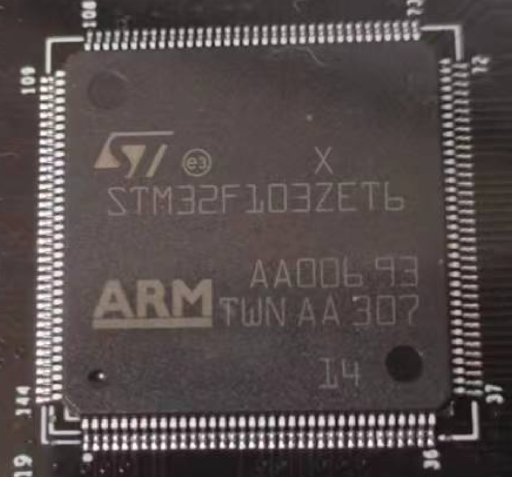

##### 命名规范

## STM32开发方式

目前STM32开发有三种方式

## STM32开发工具

### 开发工具选择

### Keil MDK的下载和安装

##### KEIL MDK介绍

KEIL是一个由ARM公司推出的基于ARM平台C\C++语言IDE（集成开发环境，使用KEIL就可以完成代码的编写、编译，将程序下载到开发板，和程序的调试工作。KEIL是STM32开发常用的工具之一。

先介绍KELMDK的使用，其他的工具以后再介绍。

##### 下载

官方下载地址：https://www.keil.com/download/product/

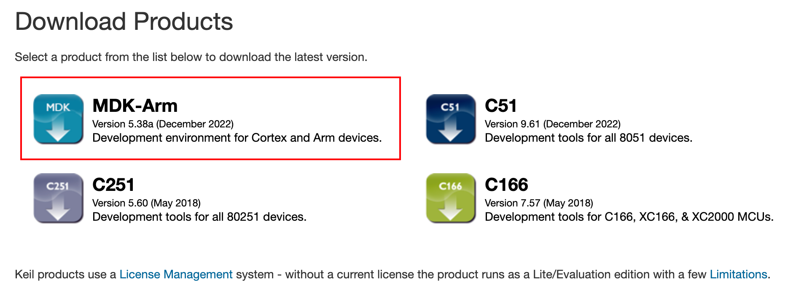

##### KEIL MDK的安装

下载完成之后双击安装。

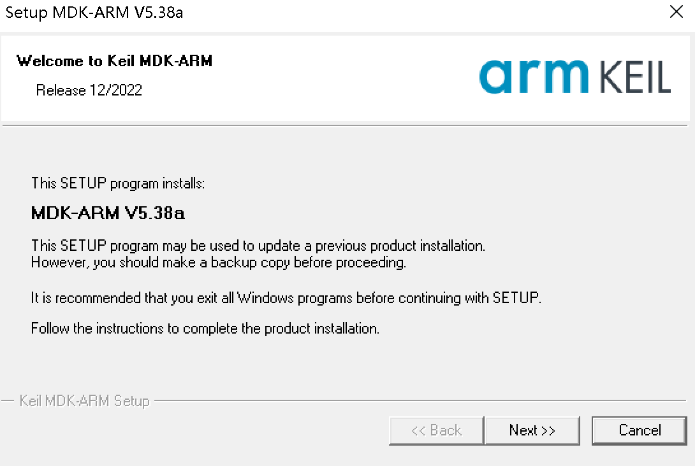

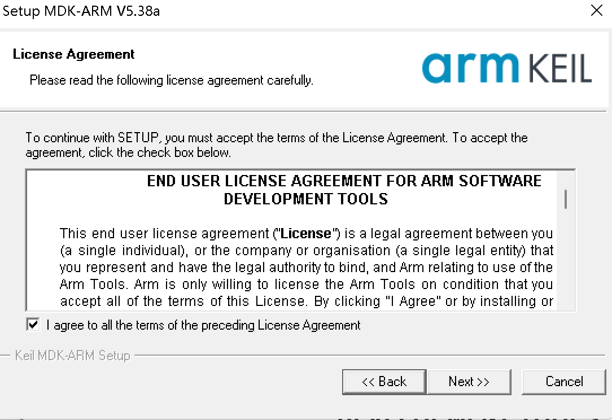

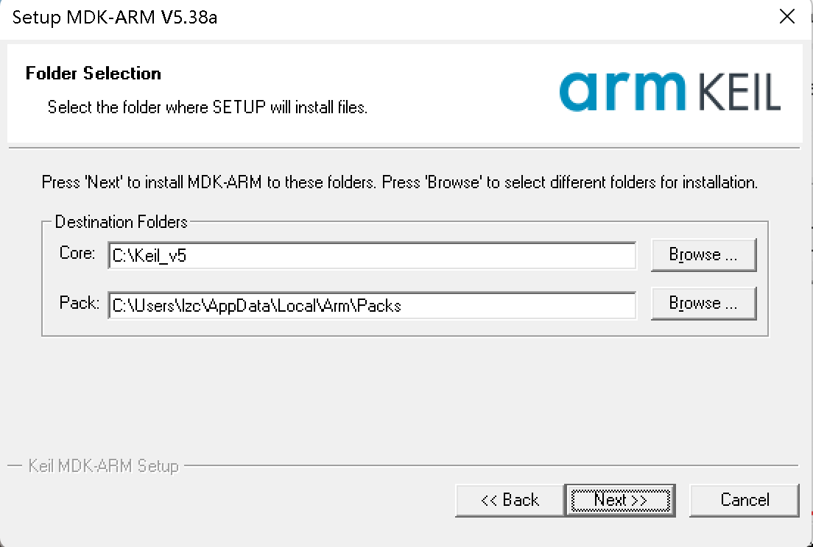

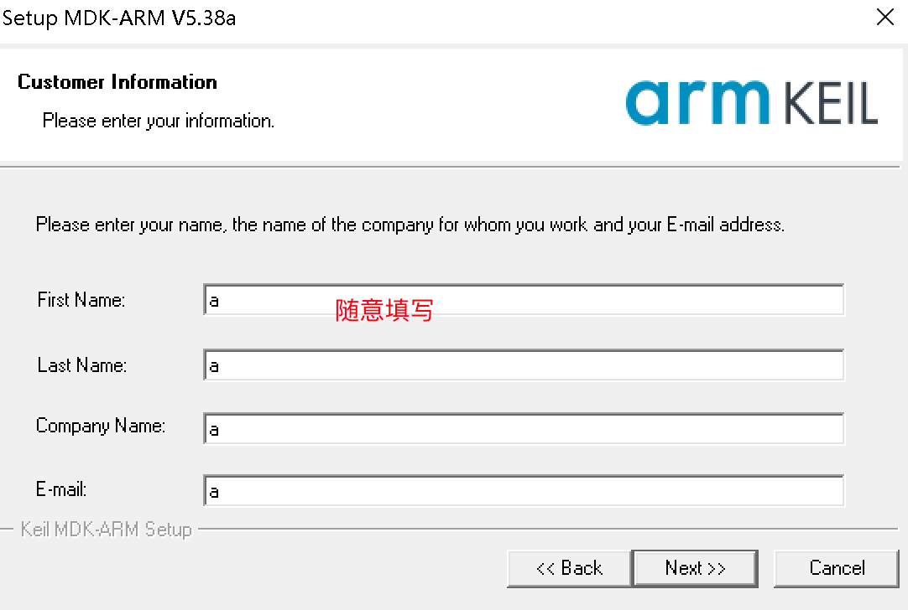

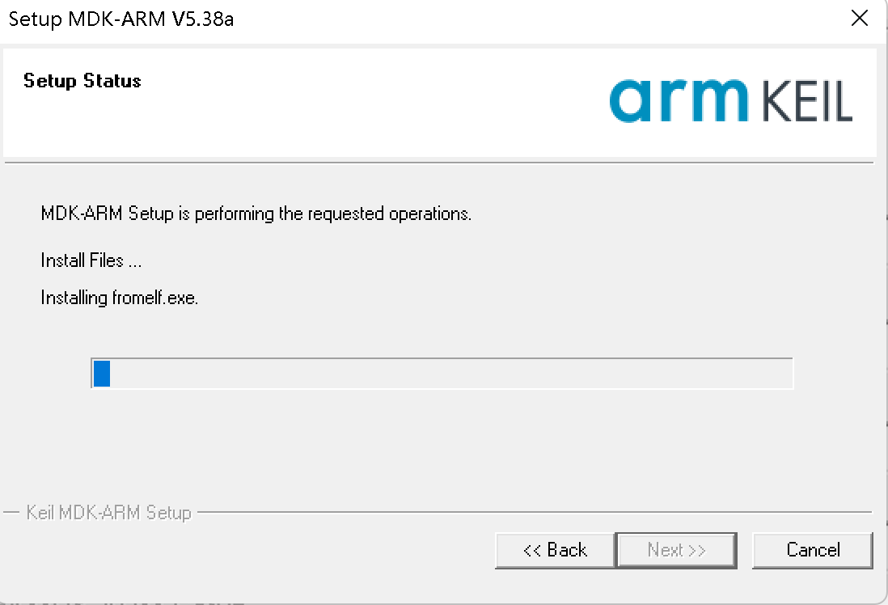

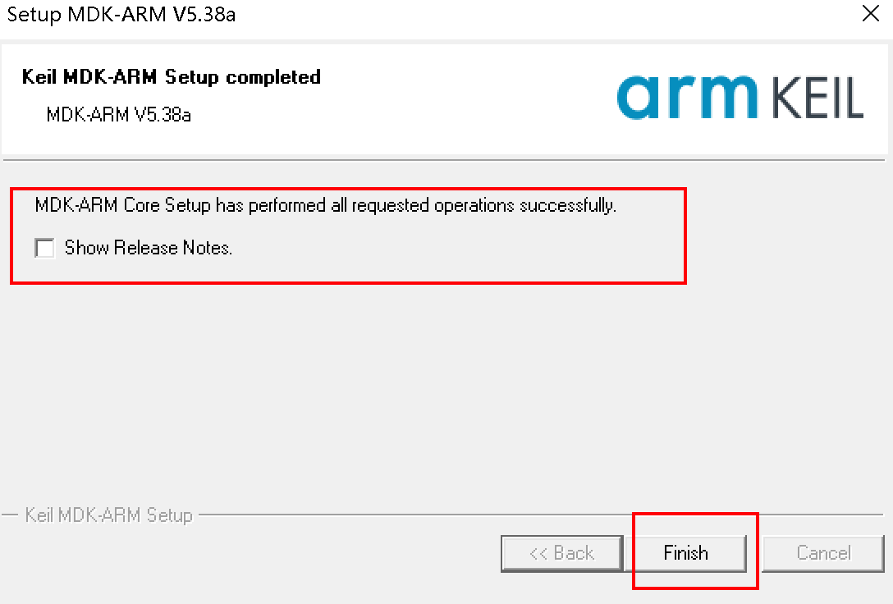

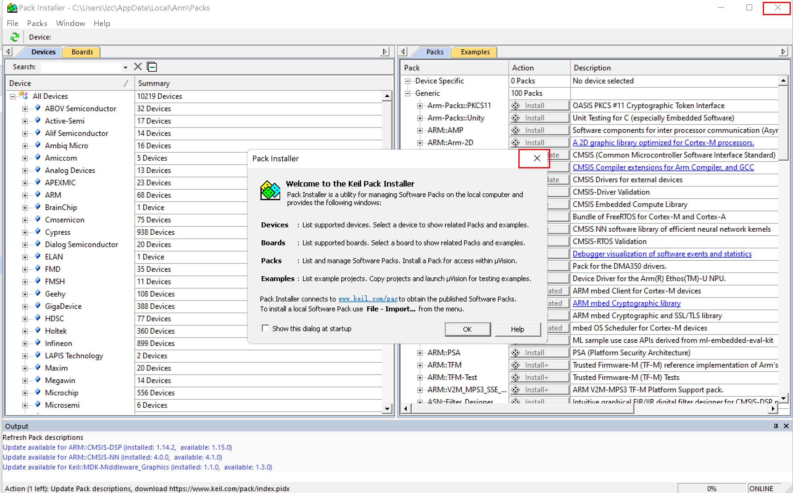

特别说明：

###### 芯片支持包在线安装先关闭，国内的网速太慢，在线安装需要的时间太长。最好是从官网下载和芯片匹配的芯片支持包之后，离线安装。

###### Keil MDK也需要注册，否则很多功能无法使用，具体注册方式参考前面学习C51时的操作。

##### 离线安装芯片支持包

Keil MDK 与前面学过的Keil C51不一样，并没有内置STM的MCU，所以需要手动安装。

下载芯片支持包（Keil提供）：https://www.keil.arm.com/devices/  根据自己使用的芯片型号下载对应的芯片支持包。

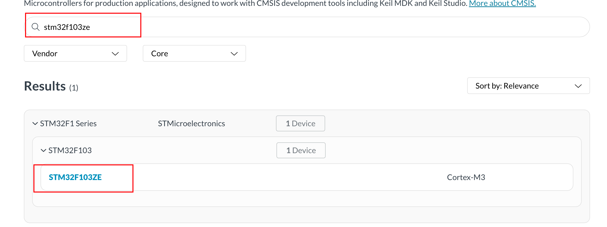

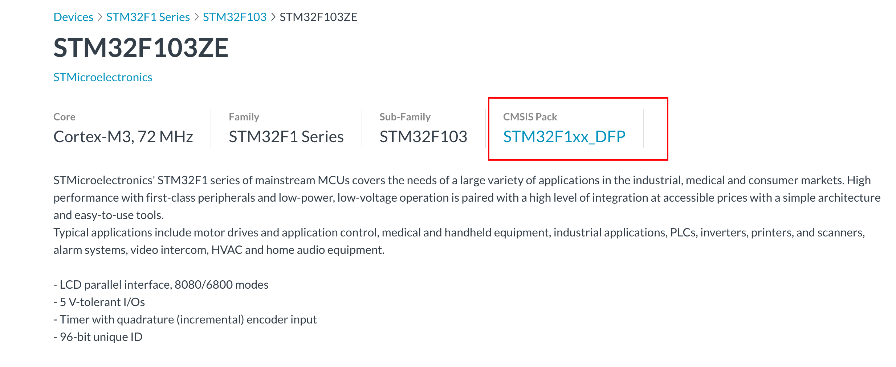

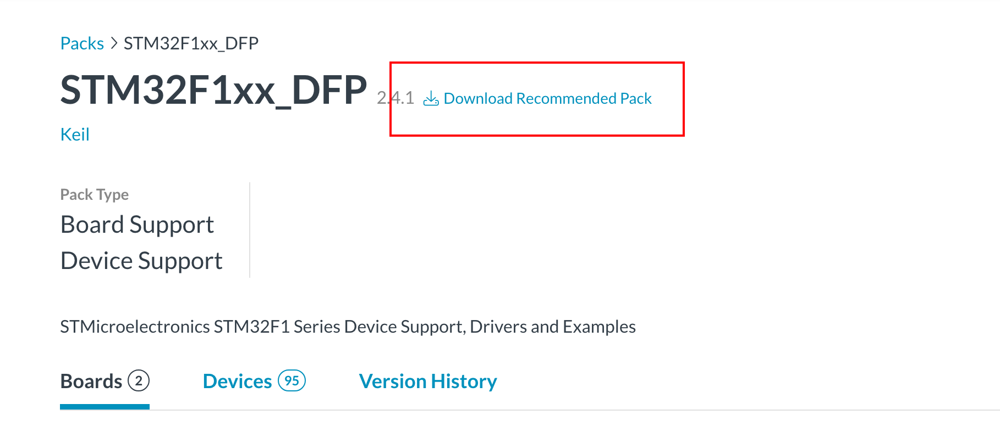

下载完成之后，双击安装即可。成功之后，再创建项目，就可以找到我们想要的芯片了。

