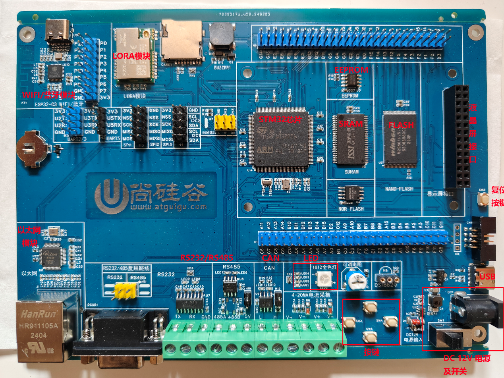
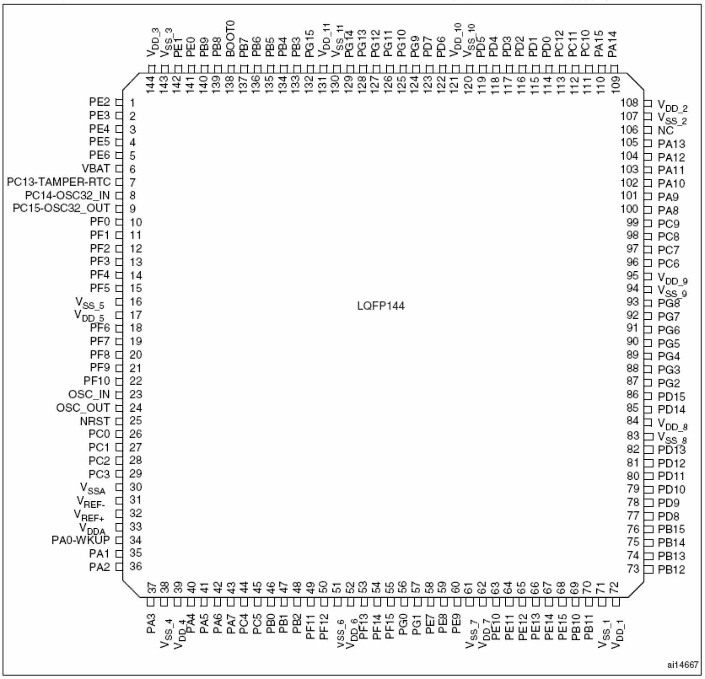
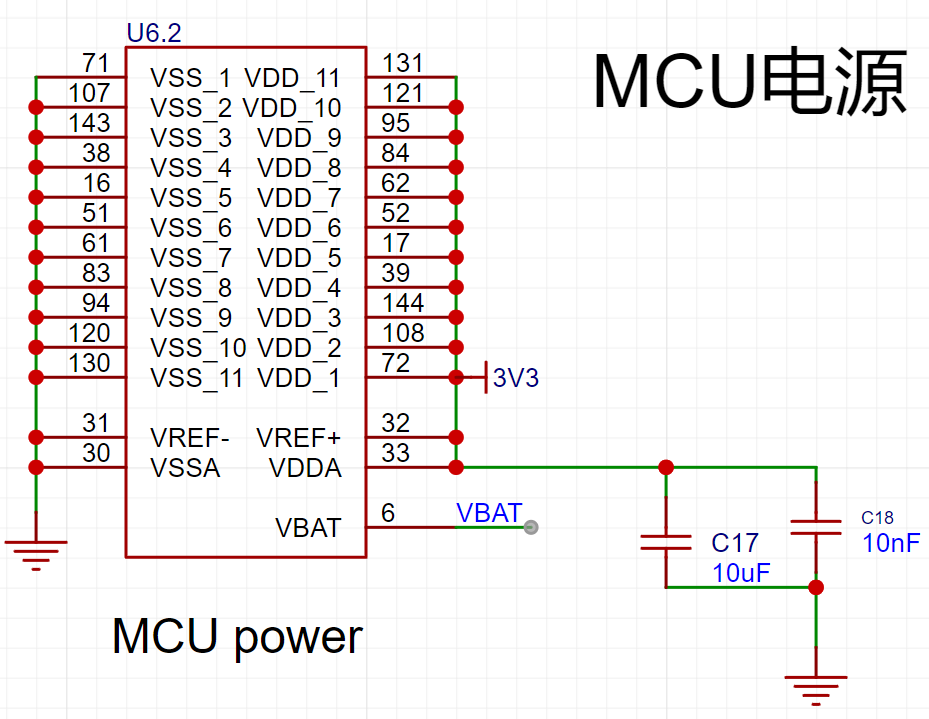
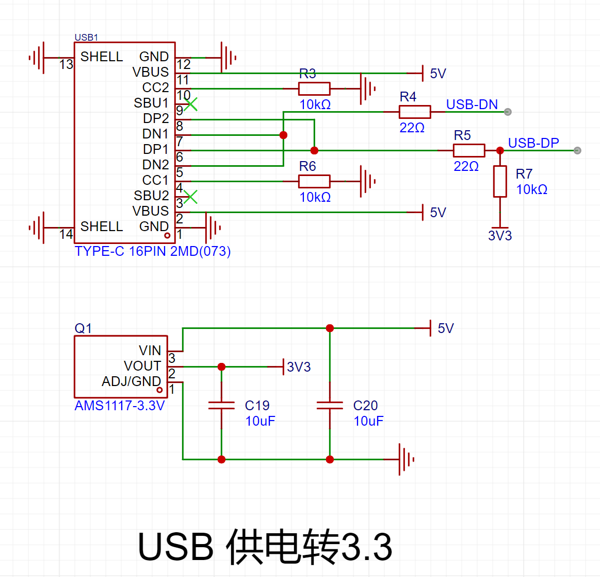
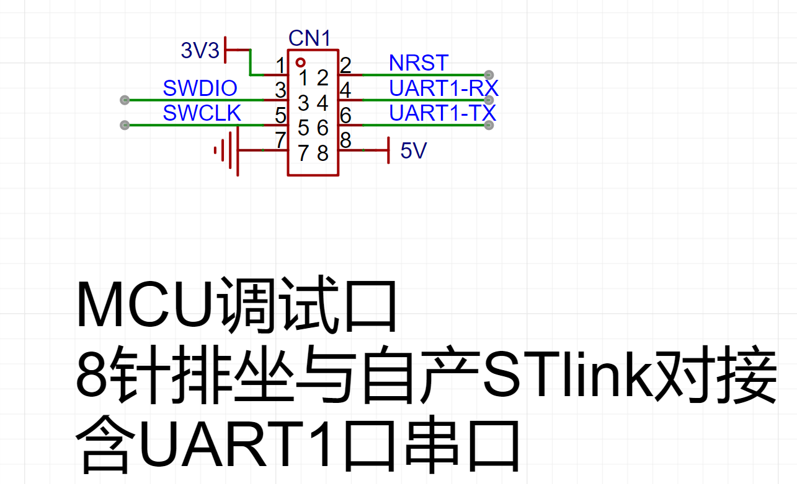
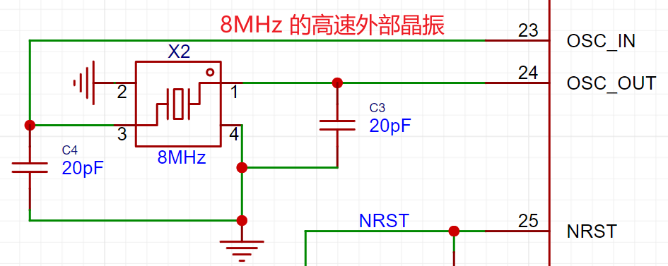
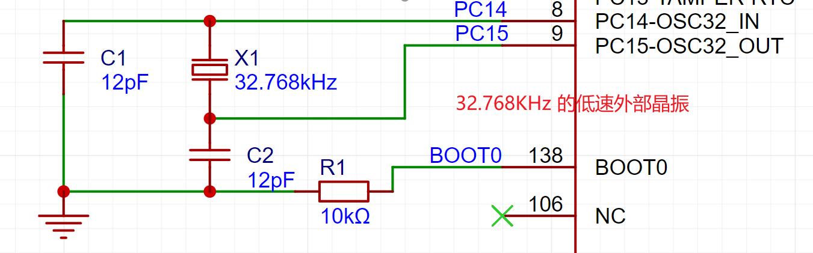
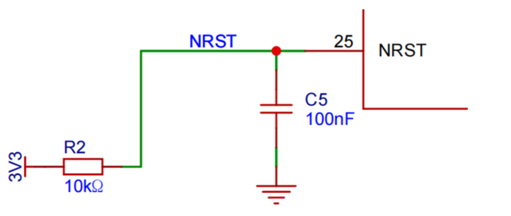
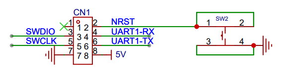

# 开发板简介

## 开发板实物图

## 原理图

## STM32最小系统

STM32单片机能工作的最小外围电路就叫最小系统。

最小系统通常包括：STM32芯片、电源、时钟、下载调试和复位5部分组成。

##### STM32芯片

我们选用的是STM32F103ZET6这款芯片。

##### 电源

采用3.3V电源供电。我们电路采用了两路供电。

一路是USB的TypeC供电， TypeC提供的是5V，使用芯片AMS1117把5V转成3.3V。

另一路是STLink下载器直接提供3.3V供电（下载器内部已经把5V转成了3.3V）。

###### MCU电源

###### USB供电转3.3v

###### MCU调试口

##### 时钟

SMT32提供了两路外部时钟：外部高速时钟和外部低速时钟。

##### 复位

##### 下载调试

