# GPIO外设


## GPIO概述

GPIO（General-purpose input/output），通用型输入输出。简单理解就是我们可以控制输入输出的STM32引脚，统称为GPIO。

GPIO存在的意义就是用程序控制或读取它们的输出或输入。


### GPIO总体说明

STM32有多组GPIO，比如我们使用的芯片：STM32F103ZET6共有7组GPIO端口，他们分别是GPIOx（x从A-G），每组控制16个引脚，共有112个GPIO引脚。具体一个其他STM32芯片有多少组GPIO，可以去查看他们的对应的数据手册。

每个引脚的电平是0-3.3V，部分引脚最高可以兼容到5V。

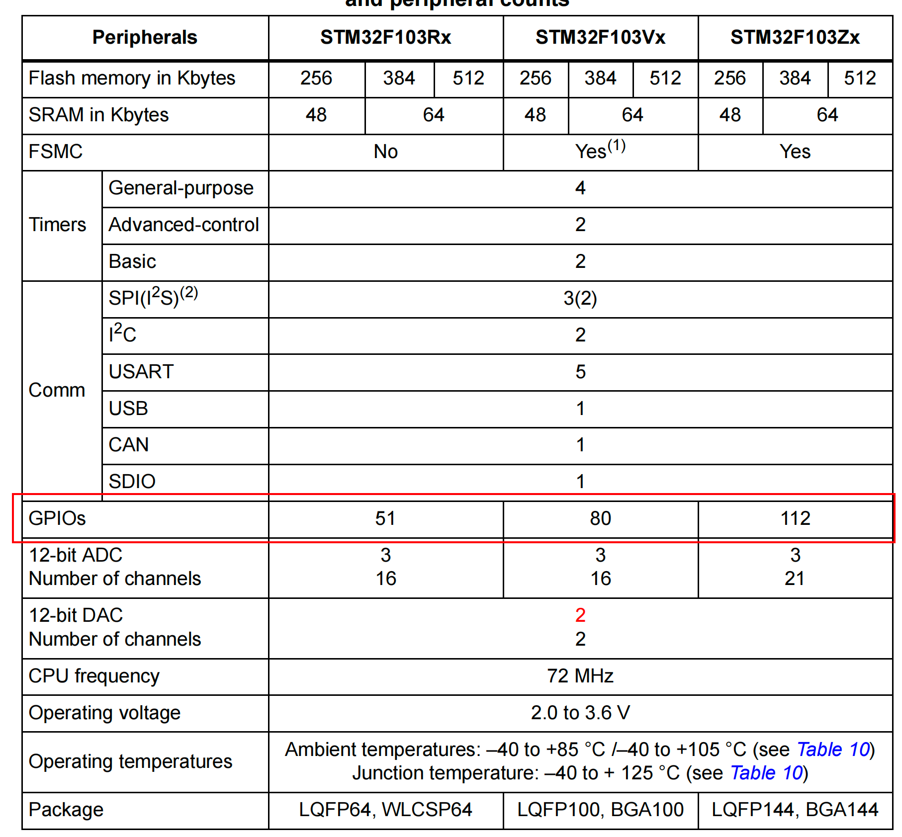


### GPIO的主要特点


###### 不同型号，IO口的数量可能不一样。


###### 快速翻转。最快可以达到每2个时钟周期翻转一次。（STM32F1系列最快可以达到50MHz的翻转速度）。


###### 每个IO都可以作为外部中断。


###### 支持8种工作模式。


### GPIO的8种工作模式

GPIO端口的每个位（引脚）可以由软件分别配置成8种模式，当然对同一个引脚同一时间只能处于某一种模式中。


###### 输入浮空（Input floating）


###### 输入上拉（Input pull-up）


###### 输入下拉（Input-pull-down）


###### 模拟输入（Analog）


###### 通用开漏输出（Output open-drain）


###### 通用推挽式输出（Output push-pull）


###### 推挽式复用功能（Alternate function push-pull）


###### 开漏复用功能（Alternate function open-drain）

每个I/O端口位可以自由编程，然而I/O端口寄存器必须按32位字被访问。

输出模式下可以控制端口输出高电平低电平，用于驱动LED，蜂鸣器等，如果是大功率器件（比如电机），还需要加上驱动器（小电流控制大电流）。

输入模式下可以读取端口的高低电平，用于读取外接按键，外接模拟信号的输入，ADC电压采集，模拟通信协议接受数据等。


## GPIO工作模式


### GPIO每位的具体电路结构

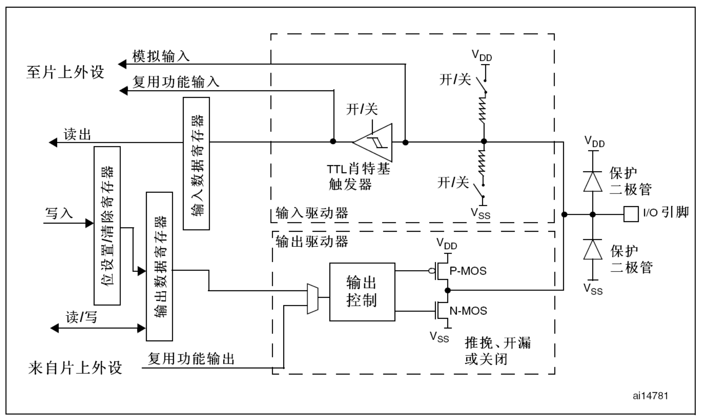


### 每种模式详解 


#### 输出模式


###### 输出缓冲器被激活。


###### 推挽模式：输出寄存器上的 1 将激活P-MOS，输出高电平。0 将激活N-MOS，输出低电平。


###### 开漏模式：PMOS永远关闭。 输出寄存器上的 0 激活N-MOS，而输出寄存器上的1 将端口置于高阻状态，所以外部必须要接上拉电阻。


###### 施密特触发输入被激活。


###### 弱上拉和下拉电阻被禁止。


###### 出现在I/O脚上的数据在每个APB2时钟被采样到输入数据寄存器。


###### 在开漏模式时，对输入数据寄存器的读访问可得到I/O状态。


###### 在推挽模式时，对输出数据寄存器的读访问得到最后一次写的值。


#### 复用输出模式

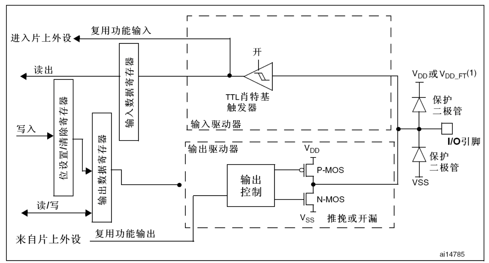


###### 在开漏或推挽式配置中，输出缓冲器被打开。


###### 内置外设的信号驱动输出缓冲器（复用功能输出）。


###### 施密特触发输入被激活。


###### 弱上拉和下拉电阻被禁止。


###### 在每个APB2时钟周期，出现在I/O脚上的数据被采样到输入数据寄存器。


###### 开漏模式时，读输入数据寄存器时可得到I/O口状态。


###### 在推挽模式时，读输出数据寄存器时可得到最后一次写的值。


#### 输入模式


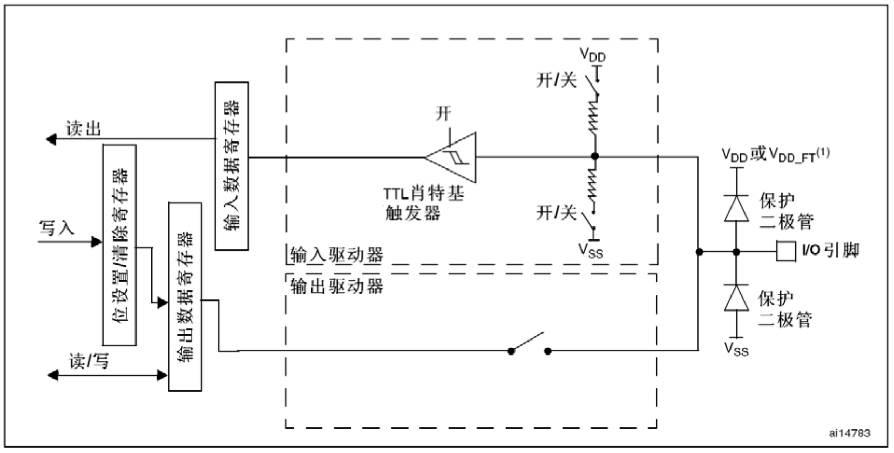


###### 2个保护二极管的作用是保护我们的芯片不会由于电压过高或过低而烧毁。

VDD是接电源（3.3V），VSS接地（0V）。如果IO引脚的输入电压高于VDD的值到一定程度，上方保护二极管导通，则引脚电压被拉低到VDD。如果IO引脚的输入电压（负电压）低于VSS到一定程度，则下方保护二极管导通，电压被拉高到VSS。


###### 2个开关控制引脚在没有输入的时候是上拉，下拉还是浮空。当上面的开关闭合的时候，输入被拉高到高电平。当下面的开关闭合的时候，输入被拉低到低电平。如果两个都不闭合，输入就是悬空状态。两个同时闭合，就是费电了，不会这么做的。

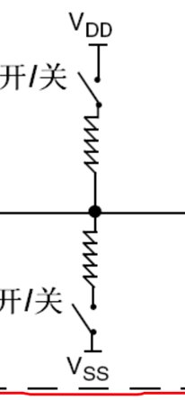


###### 施密特（图中翻译成肖特基触发器应该是翻译错误，英文版手册是TTL Schmitt trigger）触发器是包含正反馈的比较器电路。可以对信号进行波形整形。

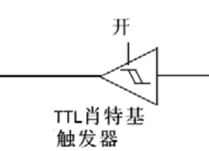

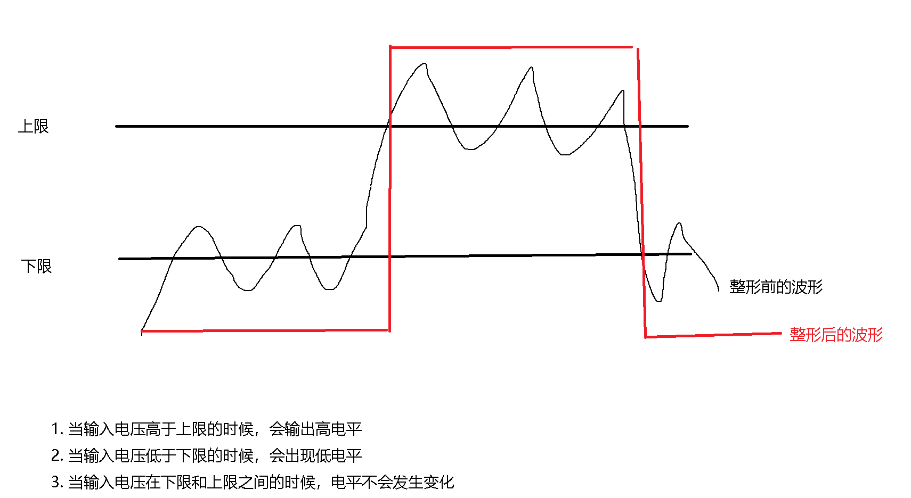


###### 从施密特触发起出来的数据，进入到输入数据寄存器中，我们就可以从中读取数据了。


#### 模拟输入模式


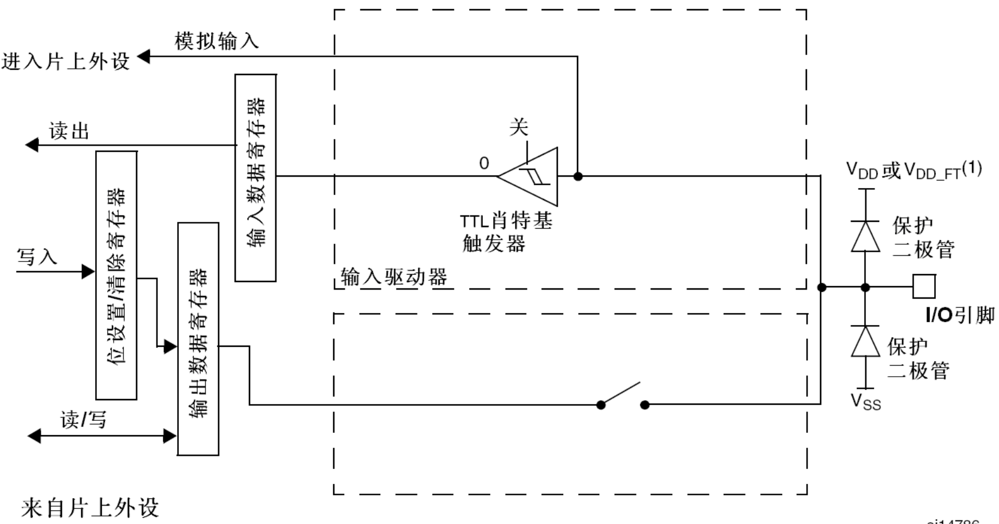

当配置为模拟输入时：


###### 输出部分被禁止。


###### 禁止施密特触发输入，实现了每个模拟I/O引脚上的零消耗。施密特触发输出值被强置为0。


###### 弱上拉和下拉电阻被禁止。


###### 读取输入数据寄存器时数值永远为0。


## 与GPIO相关的7个寄存器（重要）

每个GPIO端口有7个相关的寄存器：

2个32位配置寄存器（GPIOx_CRL，GPIOx_CRH）。

2个32位数据寄存器（GPIOx_IDR和GPIOx_ODR）。

1个32位置位/复位寄存器（GPIOx_BSRR）。

1个16位复位寄存器（GPIOx_BRR）。

1个32位锁定寄存器（GPIOx_LCKR）。


### GPIOx_CRL（端口配置低寄存器）

GPIOx_CRL（Port configuration register low），x可以是A-G。

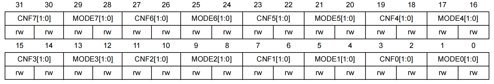

该寄存器配置的每个GPIO的 0-7 这个8个位，所以叫低寄存器。


##### MODE：每个端口有2个MODE位进行控制。

00：输入模式（复位后的状态） 

01：输出模式，最大速度10MHz 

10：输出模式，最大速度2MHz 

11：输出模式，最大速度50MHz


##### CNF：每个端口有2个CNF位进行控制。


###### 当MODE是00 （输入模式）

00：模拟输入模式 

01：浮空输入模式(复位后的状态) 

10：上拉/下拉输入模式 

11：保留 


###### 当MODE>00（输出模式）

00：通用推挽输出模式 

01：通用开漏输出模式 

10：复用功能推挽输出模式 

11：复用功能开漏输出模式


### GPIOx_CRH（端口配置高寄存器）

GPIOx_CRH（Port configuration register high）。

该寄存器配置的是每个端口的 8-15引脚，配置方式和低位寄存器完全一样。


### GPIOx_IDR（端口输入数据寄存器）

Port input data register

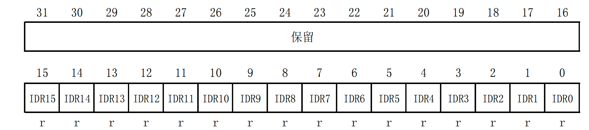

保留位始终读为0。剩下的分别对应每个引脚的输入值。


### GPIOx_ODR（端口输出数据寄存器）

Port output data register

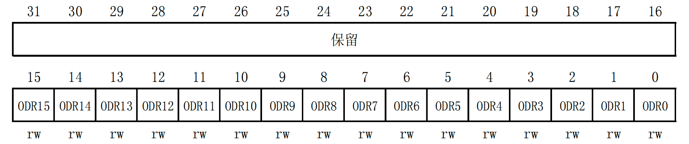

保留位始终读为0。剩下的分别对应每个引脚的输出值。


### GPIOx_BSRR（端口位设置/清除寄存器）

Port bit set/reset register

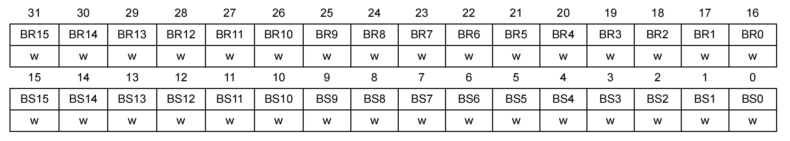


###### 高16位是用清除对应的数据输出寄存器的位（0-15）的值：设置为0不影响，设置为1会清除ODR对应的位的值（置为0）。


###### 低16位是用设置对应的数据输出寄存器的位（0-15）的值：设置为0不影响，设置为1会设置ODR对应的位的值（置为1）。


### GPIOx_BRR（端口位清除寄存器）

这个寄存器具有了GPIOx_BSRR一半的功能：清除。

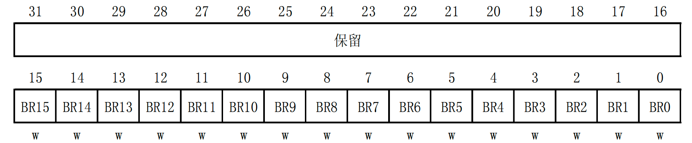


### GPIOx_LCKR（端口配置锁定寄存器）

Port configuration lock register

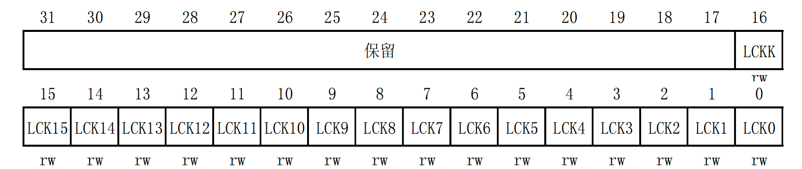

该寄存器用来锁定端口位的配置。位[15:0]用于锁定GPIO端口的配置。在规定的写入操作期间，不能改变LCKR[15:0]。当对相应的端口位执行了LOCK序列后，在下次系统复位之前将不能再更改端口位的配置。

每个锁定位锁定控制寄存器（CRL，CRH）中相应的4个位（CNF2位和MODE2位）。

第16位用来激活锁定寄存器，必须按照规定的时序来操作才行: 写1 -> 写0 -> 写1 -> 读0 -> 读1。

对0-15位：

0：不锁定对应端口的配置。

1：锁定对应端口的配置。


## Keil+VSCode优化开发体验 

Keil的开发调试能力很强，但是代码编辑体验很差。很多开发者喜欢用Keil编译调试下载，用VsCode编辑代码。


##### 安装VsCode

从官网下载之后,直接安装即可.

https://code.visualstudio.com


##### 安装插件

需要安装2个插件。


###### c/c++插件

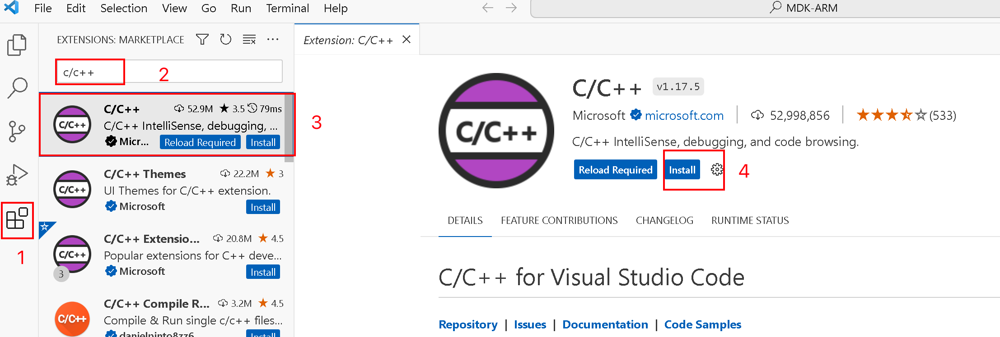


###### Keil Assisant插件

务必选择下载量最大的那个。其他的都是山寨。


##### 配置Keil 助手插件

我们在VsCode中编写代码，编译下载还是使用的Keil，所以要告诉VsCode你的Keil的位置。

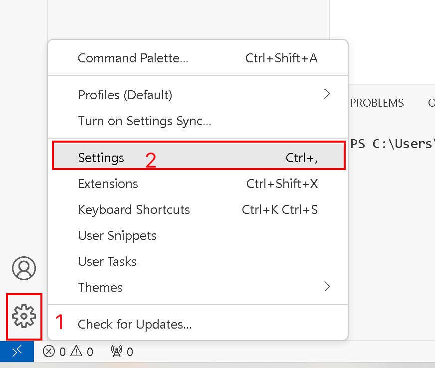

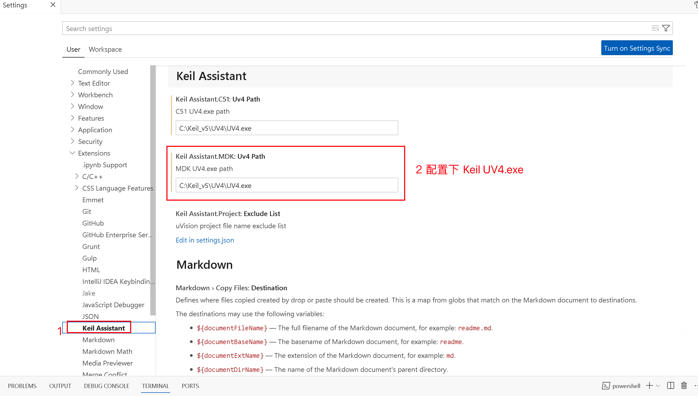


##### 使用方式1

想用VsCode进行编辑代码，必须所有的工作先在Keil完成。比如创建工程，配置环境等。

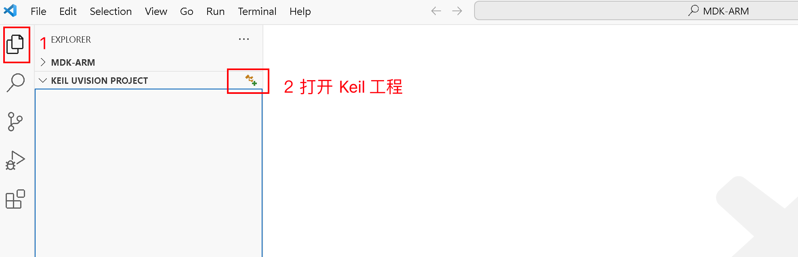

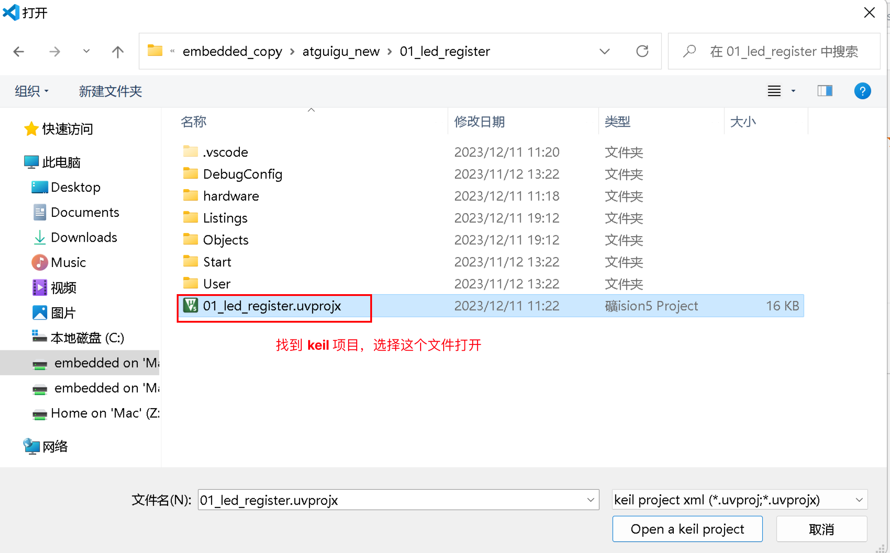

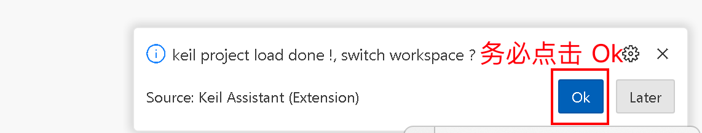

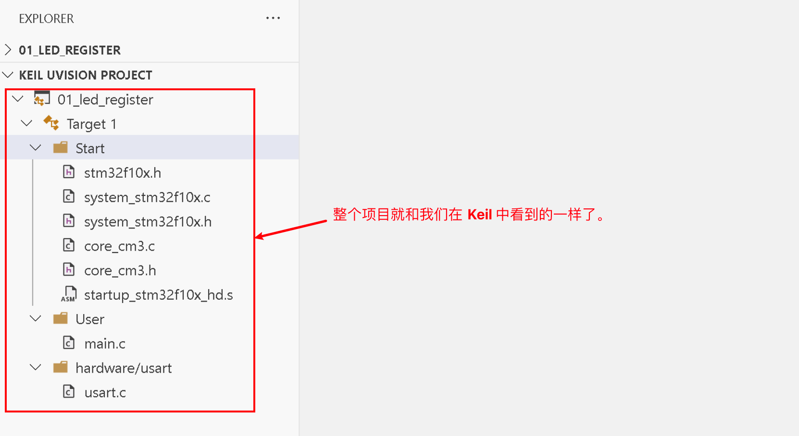


##### 使用方式2

打开Keil工程所在的目录，空白处点击右键，然后选择通过Code打开。

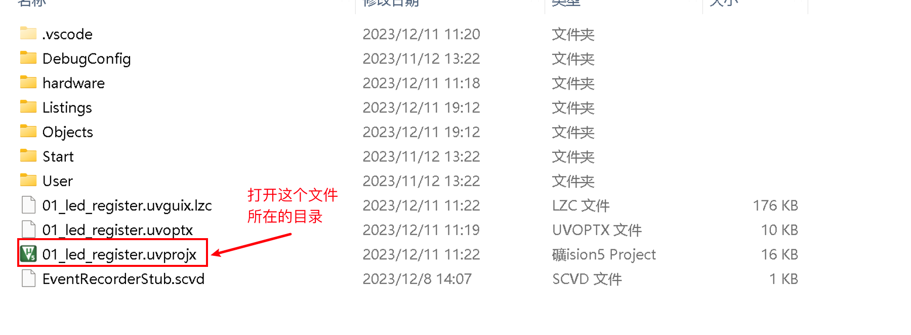

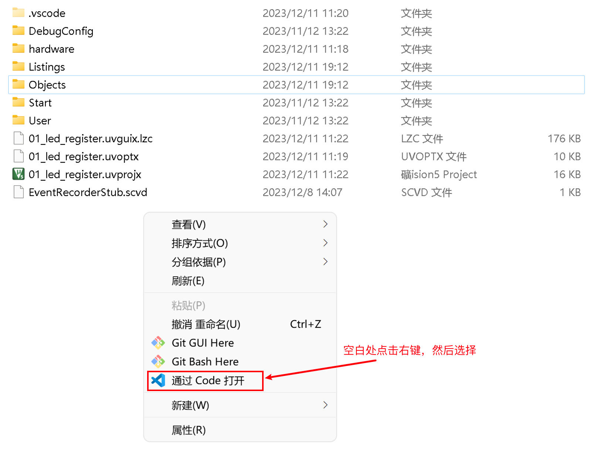


##### 编译下载

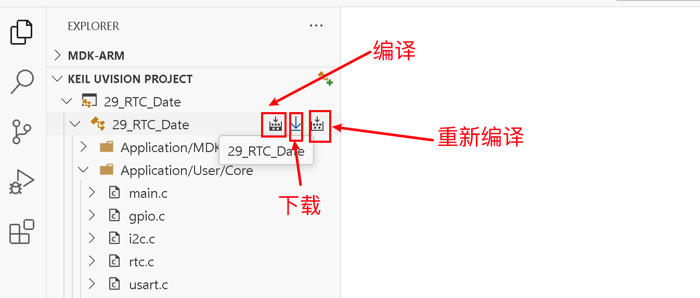

其实调用的仍然是Keil的编译和下载。


##### 注意

如果需要新增源文件和项目结构更改，这时仍然需要打开Keil，在Keil中新增和更改项目结构，并做相应的配置。然后把Keil关闭，VsCode才能读取到新增的文件和项目结构的更改。

用VsCode主要是为了方便代码的编写。但是仍然离不开Keil MDK。


## GPIO案例：流水灯


### 需求描述

在3个LED上实现流水灯效果。


### 硬件电路设计

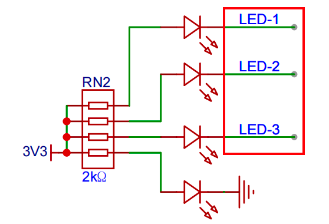

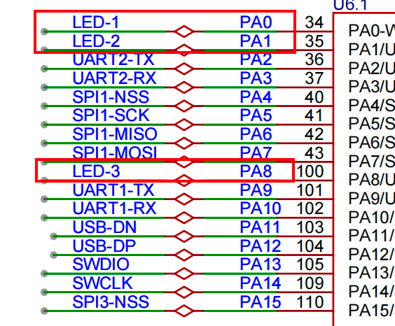


### 软件设计（寄存器）


#### 配置


##### copy上一个项目


##### 并做如下操作

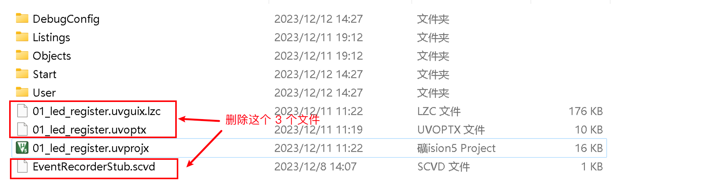

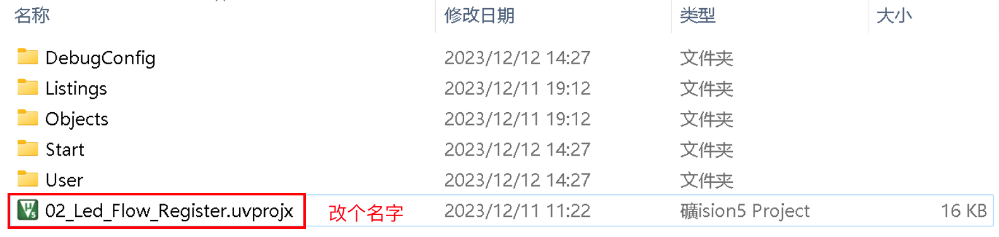


##### 创建一个目录： Hardware/Led 存储我们的LED驱动文件。


##### 在 Hardware/Led下创建2个文件 led.h和led.c。


##### 使用keil打开项目，做下简单配置。

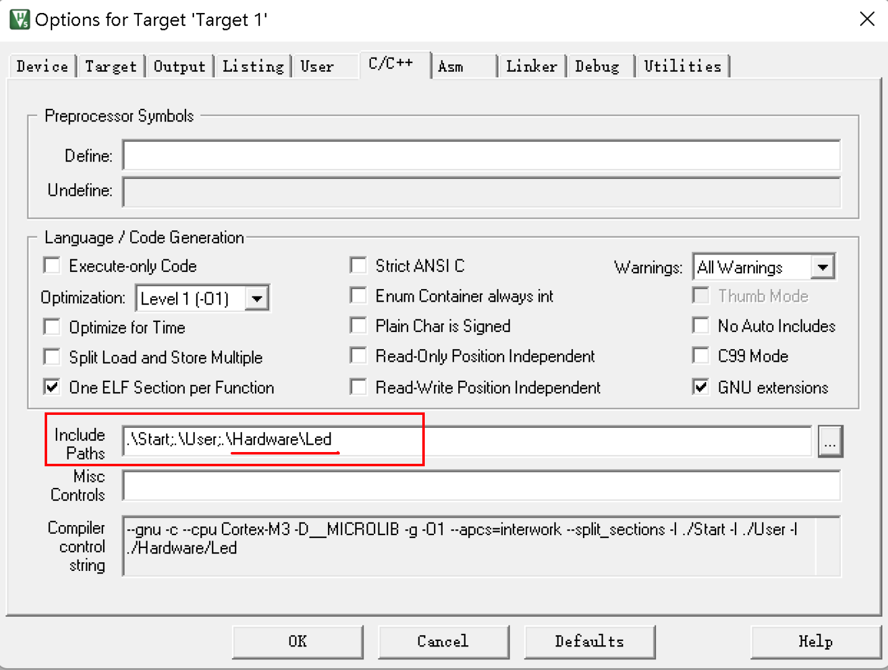

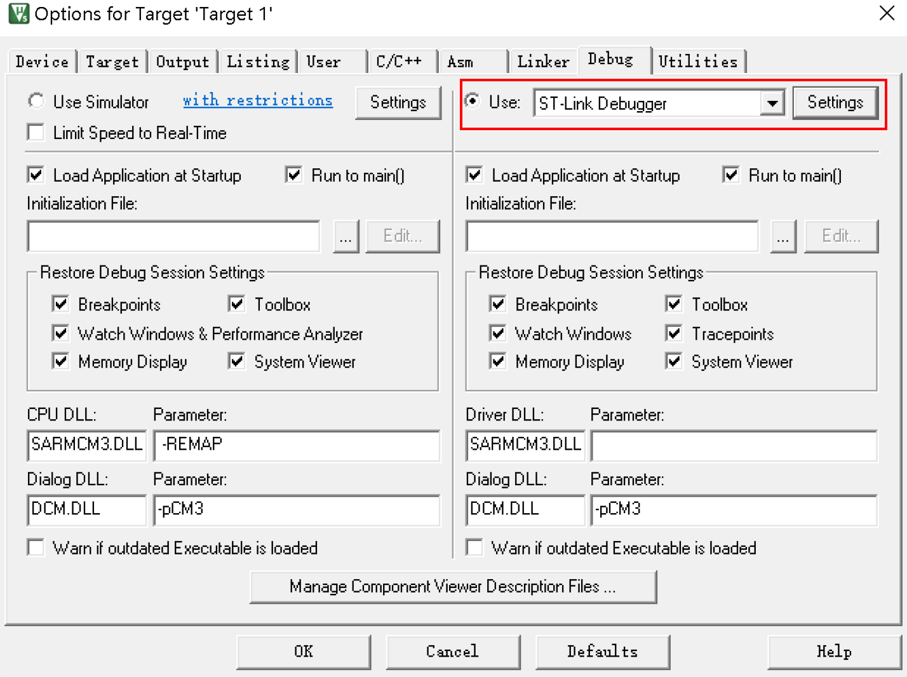

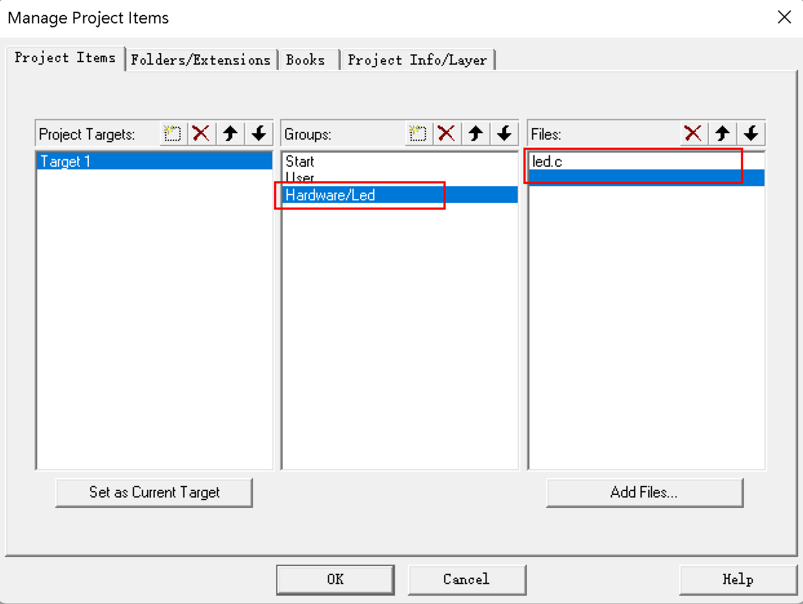


#### 具体代码


##### main.c

```c
#include "Driver_LED.h"
#include "Delay.h"

int main()
{
    uint32_t leds[] = {LED_1, LED_2, LED_3};
    /* 1. 初始化LED */
    Driver_LED_Init();

    Driver_LED_OffAll(leds, 3);

    while (1)
    {
        for (uint8_t i = 0; i < 3; i++)
        {
            Driver_LED_OffAll(leds, 3);
            Driver_LED_On(leds[i]);
            Delay_ms(500);
        }

        Driver_LED_OffAll(leds, 3);
        Driver_LED_On(leds[1]);
        Delay_ms(500);
    }
}
```


##### Delay.h

```c
#ifndef __DELAY_H
#define __DELAY_H
#include "stm32f10x.h"                  // Device header

void Delay_us(uint16_t us);
void Delay_ms(uint16_t ms);
void Delay_s(uint16_t s);

#endif
```


##### Delay.c

延时函数使用到了系统定时器，大家先使用，到提高篇时再学习具体为什么这么写。

```c
#include "Delay.h" // Device header

void Delay_us(uint16_t us)
{
    /* 定时器重装值 */
    SysTick->LOAD = 72 * us;
    /* 清除当前计数值 */
    SysTick->VAL = 0;
    /*设置内部时钟源（2位->1）,不需要中断（1位->0），并启动定时器(0位->1)*/
    SysTick->CTRL = 0x5;
    /*等待计数到0， 如果计数到0则16位会置为1*/
    while (!(SysTick->CTRL & SysTick_CTRL_COUNTFLAG));
    /* 关闭定时器 */
    SysTick->CTRL &= ~SysTick_CTRL_ENABLE; 
}

void Delay_ms(uint16_t ms)
{
    while (ms--)
    {
        Delay_us(1000);
    }
}

void Delay_s(uint16_t s)
{
    while (s--)
    {
        Delay_ms(1000);
    }
}
```


##### Driver_LED.h

```c
#ifndef __DRIVER_LED_H
#define __DRIVER_LED_H

#include "stm32f10x.h"

#define LED_1 GPIO_ODR_ODR0
#define LED_2 GPIO_ODR_ODR1
#define LED_3 GPIO_ODR_ODR8

void Driver_LED_Init(void);

void Driver_LED_On(uint32_t led);

void Driver_LED_Off(uint32_t led);

void Driver_LED_Toggle(uint32_t led);

void Driver_LED_OnAll(uint32_t leds[], uint8_t size);

void Driver_LED_OffAll(uint32_t leds[], uint8_t size);

#endif
```


##### Driver_LED.c

```c
#include "Driver_LED.h"

/**
 * @description: 对LED进行初始化
 */
void Driver_LED_Init(void)
{
    /* 1. 打开GPIOA的时钟 */
    RCC->APB2ENR |= RCC_APB2ENR_IOPAEN;

    /* 2. 给用到的端口的所有 PIN (PA0 PA1 PA8) 设置工作模式: 通用推挽输出 MODE:11  CNF:00 */
    GPIOA->CRL |= (GPIO_CRL_MODE0 | GPIO_CRL_MODE1);
    GPIOA->CRL &= ~(GPIO_CRL_CNF0 | GPIO_CRL_CNF1);

    GPIOA->CRH |= GPIO_CRH_MODE8;
    GPIOA->CRH &= ~GPIO_CRH_CNF8;

    /* 3. 关闭所有灯  */
    Driver_LED_Off(LED_1);
    Driver_LED_Off(LED_2);
    Driver_LED_Off(LED_3);
}

/**
 * @description: 点亮指定的LED
 * @param {uint32_t} led 要点亮的LED
 */
void Driver_LED_On(uint32_t led)
{
    GPIOA->ODR &= ~led;
}

/**
 * @description: 关闭指定的LED
 * @param {uint32_t} led 要关闭的LED
 */
void Driver_LED_Off(uint32_t led)
{
    GPIOA->ODR |= led;
}

/**
 * @description: 翻转LED的状态
 * @param {uint32_t} led 要翻转的LED
 */
void Driver_LED_Toggle(uint32_t led)
{
    /* 1. 读取引脚的电平,如果是1(目前是关闭), 打开, 否则就关闭 */
    if ((GPIOA->IDR & led) == 0)
    {
        Driver_LED_Off(led);
    }
    else
    {
        Driver_LED_On(led);
    }
}

/**
 * @description: 打开数组中所有的灯
 * @param {uint32_t} leds 所有灯
 * @param {uint8_t} size 灯的个数
 */
void Driver_LED_OnAll(uint32_t leds[], uint8_t size)
{

    for (uint8_t i = 0; i < size; i++)
    {
        Driver_LED_On(leds[i]);
    }
}

/**
 * @description: 关闭数组中所有的灯
 * @param {uint32_t} leds 所有灯
 * @param {uint8_t} size 灯的个数
 */
void Driver_LED_OffAll(uint32_t leds[], uint8_t size)
{
    for (uint8_t i = 0; i < size; i++)
    {
        Driver_LED_Off(leds[i]);
    }
}
```

