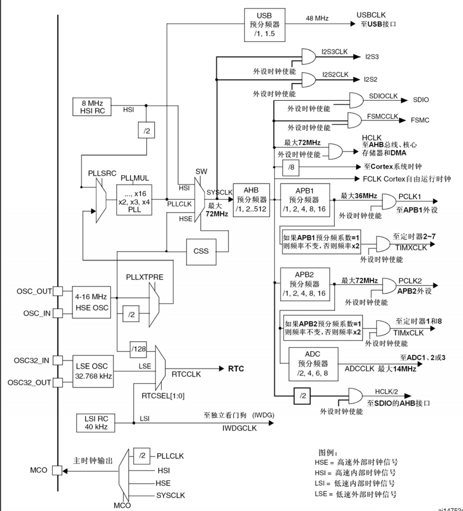
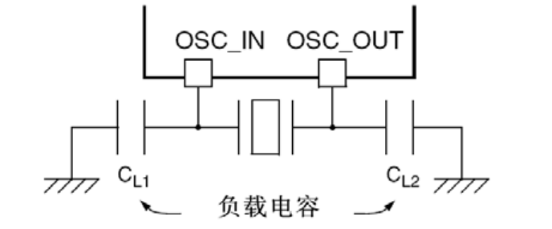
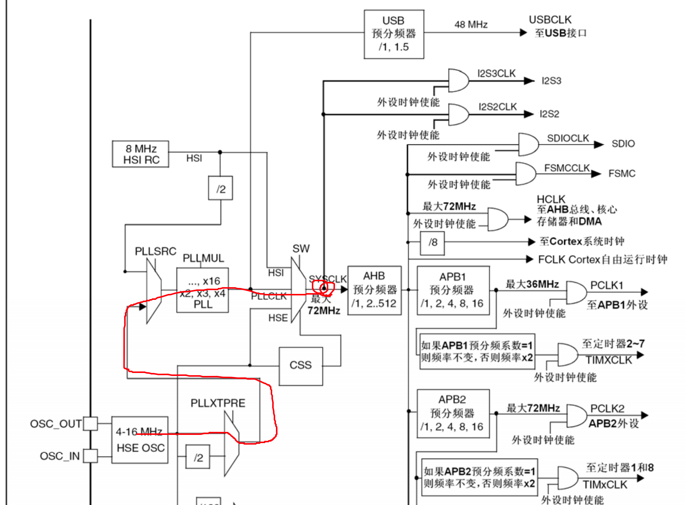
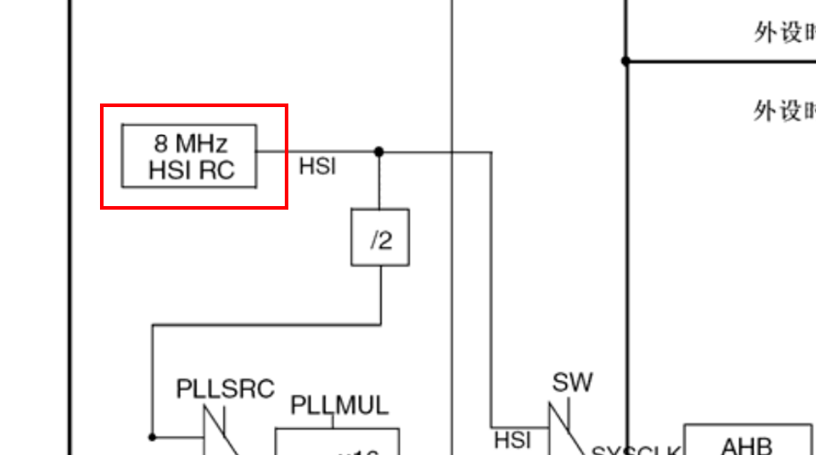
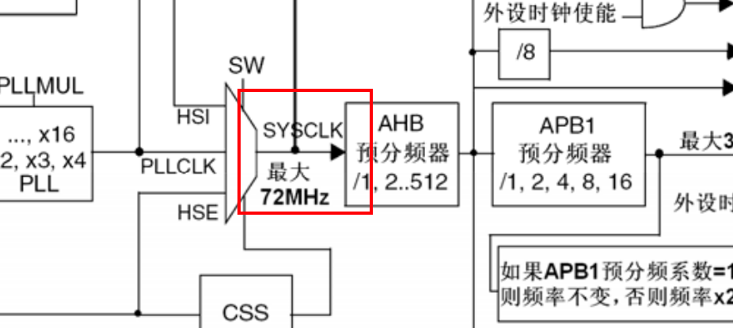
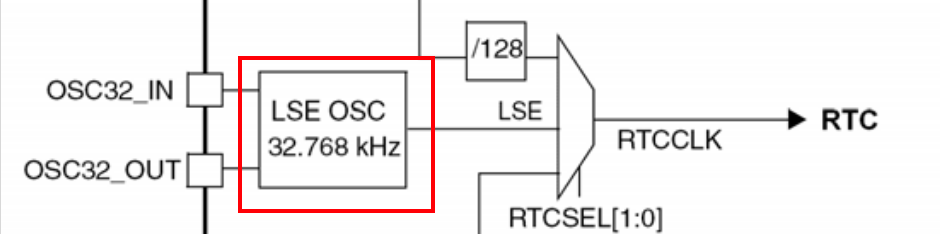
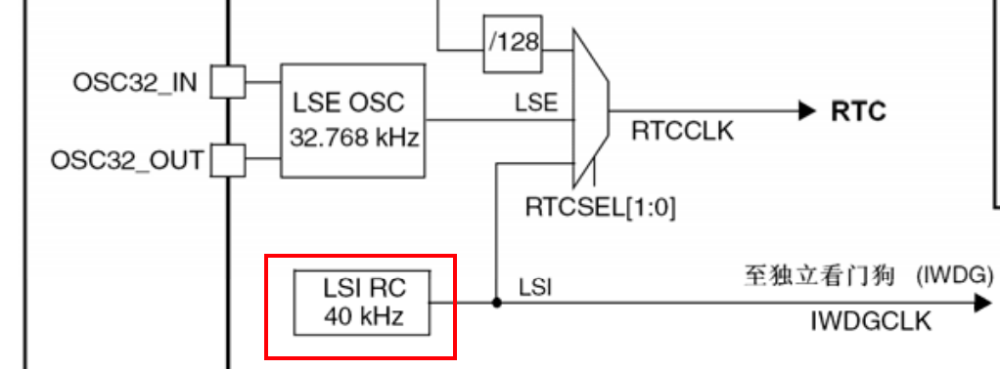

# 总体架构和时钟系统

## STM32总体架构

经过一段时间的学习，我们需要从宏观上了解下它的系统架构，各个模块之间的层级关系以及相互的影响。

## 时钟系统

### 时钟树

在STM32中有3种不同的时钟源用来驱动系统时钟(SYSCLK)：

###### HSI振荡器时钟（High Speed Internal oscillator，高速内部时钟）

###### HSE振荡器时钟（High Speed External（Oscillator / Clock），高速外部时钟）

###### PLL时钟（Phase Locked Loop 锁相环/倍频器）

还有2种2级时钟：

###### LSI时钟（Low Speed Internal，低速内部时钟）

###### LSE时钟（Low Speed External oscillator，低速外部时钟）。

为什么提供这么多的时钟？节能！高速设备接高速时钟，低速设备接低速时钟，可以最大程度的达到节能效果。详见下图时钟树。

该时钟树目前不要求记住，等以后编程时，只需要时不时回头翻看即可。代码写多了，这些知识自会烂熟于胸。

### 各个时钟介绍

##### HSE时钟

高速外部时钟是由外部时钟源提供，目前几乎所有的STM32单片机的设计都是在外部接一个8MHz的晶振，经过PLL倍频（9倍频）后得到一个72MHz的系统时钟。我们系统默认就是这个时钟。这个在启动文件可以看到。

 

##### HSI时钟

HSI时钟信号由内部8MHz的RC振荡器产生，可直接作为系统时钟或在2分频后作为PLL输入。HSI RC振荡器能够在不需要任何外部器件的条件下提供系统时钟。它的启动时间比HSE晶体振荡器短。然而，即使在校准之后它的时钟频率精度仍较差。

##### PLL时钟

内部PLL用来倍频HSI RC的输出时钟或HSE晶体输出时钟。PLL的设置必须在其被激活前完成。一旦PLL被激活，这些参数就不能被改动。如果PLL中断在时钟中断寄存器里被允许，当PLL准备就绪时，可产生中断申请。

PLL时钟一般都是对外部的8MHz的时钟信号经过9倍频后，得到72MHz的时钟频率，这是STM32F1系列允许的最高时钟频率。

##### LSE时钟

LSE晶体是一个32.768kHz的低速外部晶体或陶瓷谐振器。它为实时时钟或者其他定时功能提供一个低功耗且精确的时钟源。

LSE是不能驱动系统时钟的。

##### LSI时钟

LSI RC担当一个低功耗时钟源的角色，它可以在停机和待机模式下保持运行，为独立看门狗和自动唤醒单元提供时钟。LSI时钟频率大约40kHz（在30kHz和60kHz之间）。

LSI也是不能驱动系统时钟的。

