# STM32的中断系统


## 中断概述


### 中断的概念

在主程序运行过程中，出现了特定事件，使得CPU暂停当前正在运行的程序，转而去处理这个事件，等这个事件处理完成之后，CPU再回到刚才被打断的位置继续处理，这就是中断。

那个打断CPU执行的特定事件，我们一般称之为中断源。被中断源打断的位置我们称为断点。处理特定事件的过程，我们称为执行中断处理程序。

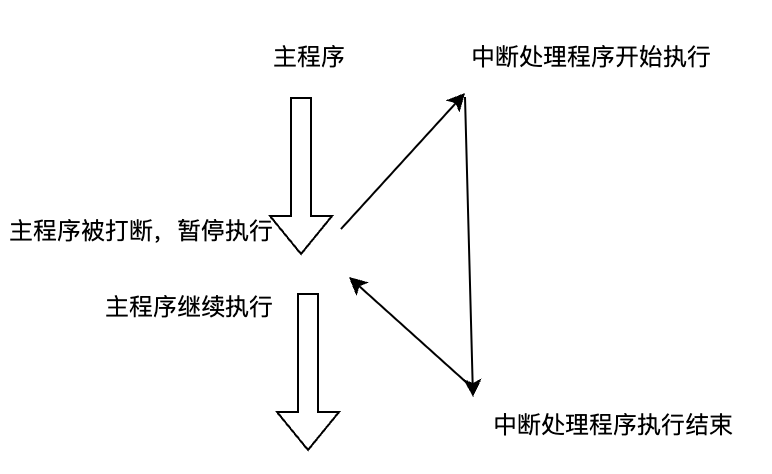

正在执行中断程序的时候，这个时候有可能被另外一个中断源给中断，CPU转而去执行另外一个中断源的中断处理程序，这叫中断嵌套。

中断B能否打断中断A，要看他们的优先级，优先级高的可以打断优先级低的，优先级低的无法打断优先级高的。

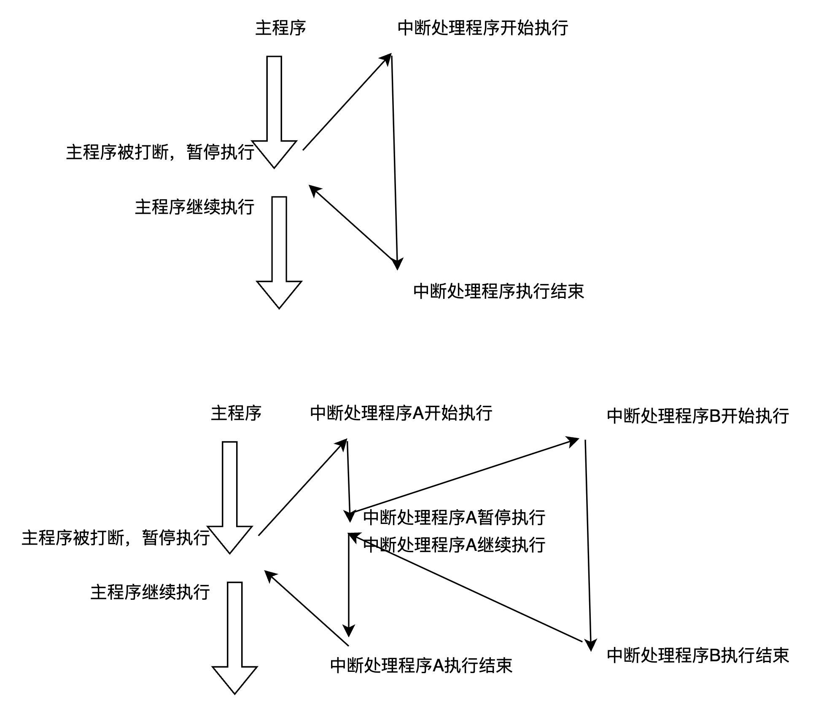

中断源可以是外部的，也可以是内部的。外部的叫外部中断源，内部的叫内部中断源（内部的中断有时候也叫异常）。


### 为什么需要中断

对单片机系统来说，中断至关重要。

比如我们要检测按键是否按下，如果没有中断，则需要循环的方式不断的去检测按键对应的IO口的电平，这是比较耗费CPU的时间的。如果要检测的更多的话，CPU有可能会导致阻塞。

有了中断事情就变的简单了，主程序不需要循环不断的去检测按键，当有按键按下的时候，CPU执行被打断，去执行按键处理程序就行了。当没有按键按下的时候，CPU完全可以正常执行代码，丝毫不受任何的影响。


### STM32的中断

Cortex-M3内核支持256个中断，其中包含了16个内核中断和240个外部中断，并且具有256级的可编程中断设置。

一般情况下，芯片厂商会对Cortex-M3的中断进行裁剪。

STM32有84个中断，包括16个内核中断和68个可屏蔽中断，具有16级可编程的中断优先级。

STM32F103系列70个中断（咱们目前使用的芯片）有10个内核中断和60个可编程的外部中断。

下面的列表中，灰色背景的是内部中断（或者异常），其他的为外部中断。

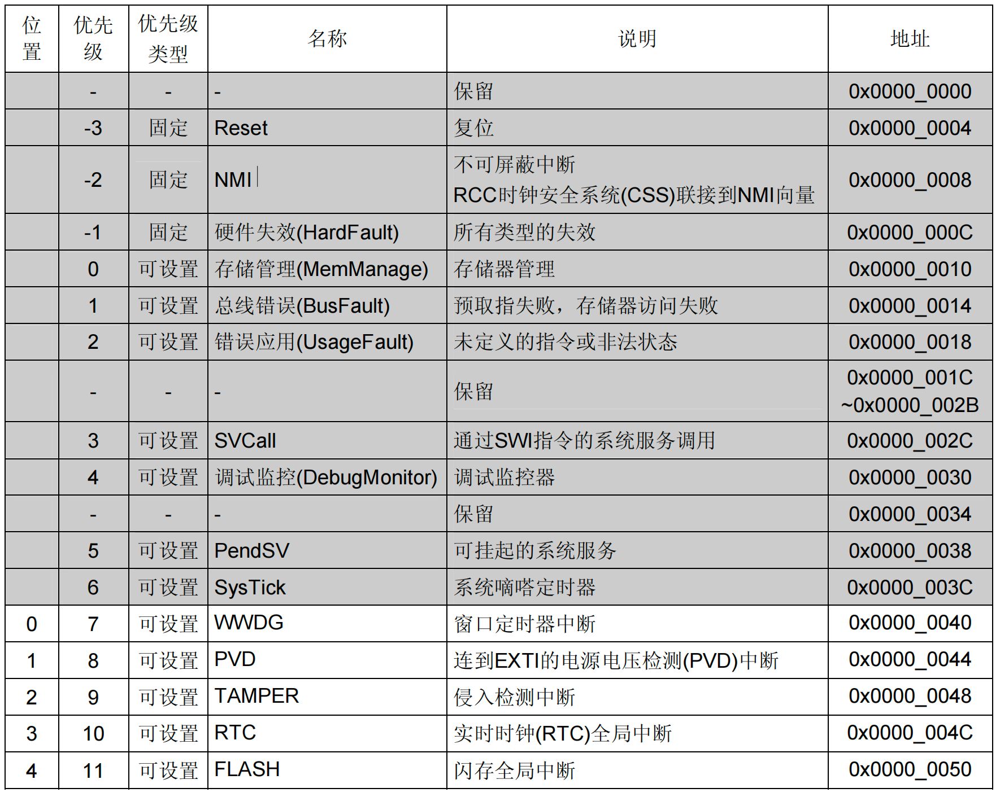

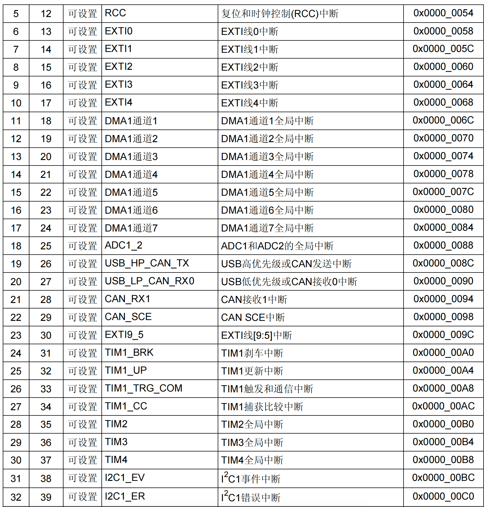

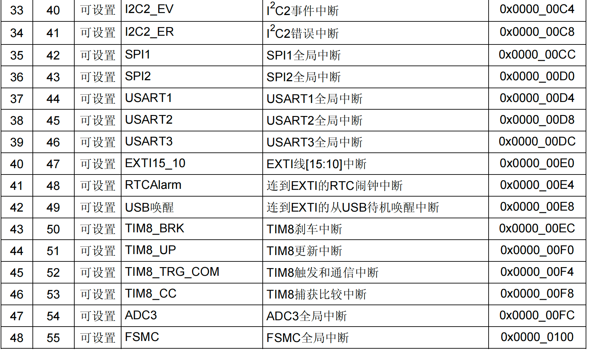

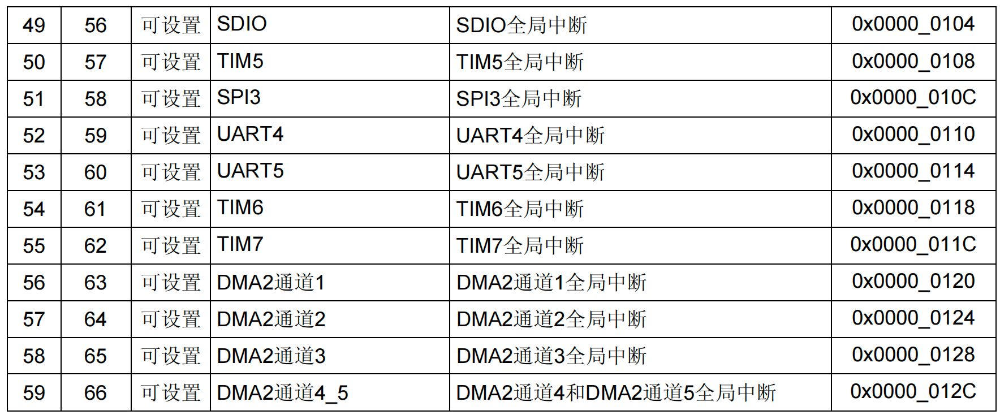


### STM32的中断体系架构


### NVIC嵌套向量中断控制器


##### NVIC的介绍

NVIC（Nested vectored interrupt controller嵌套向量中断控制器）和处理器核的接口紧密相连，可以实现低延迟的中断处理和高效地处理中断。嵌套向量中断控制器管理着包括内核异常，外部中断等所有中断。由NVIC决定哪个中断的处理程序交给CPU来执行。

每一个外部中断都可以被使能或者禁止，并且可以被设置为挂起状态或者清除状态。处理器的中断可以是电平形式的，也可以是脉冲形式的，这样中断控制器就可以处理任何中断源。

16个IO的中断与PVD(电源电压检测)，RTC(实时时钟)，USB，以太网检测这20个外部中断会通过EXTI来控制，然后交给NVIC。其他中断都是直接交给NVIC来处理。


##### 中断优先级

NVIC为了方便管理中断，可以通过软件给每个中断设置优先级。NVIC用4个位来控制优先级，值小的优先级高。把优先级分为两种：抢占优先级和响应优先级。

规则：

优先级值越小，优先级越高。

如果不设置优先级，则默认优先级为0。

先比较抢占优先级。抢占优先级高的可以打断抢占优先级低的。

若抢占优先级一样，再比较响应优先级。但是响应优先级不会导致中断嵌套。

若抢占优先级一样的同时挂起，则优先处理响应抢占优先级高的。

若挂起的优先级（抢占和响应）都一样，则查找中断向量表，值小的先响应。

NVIC对优先级分了5组，在程序中先对中断进行分组，而且分组只能分一次，若多次分，只有最后一次生效。

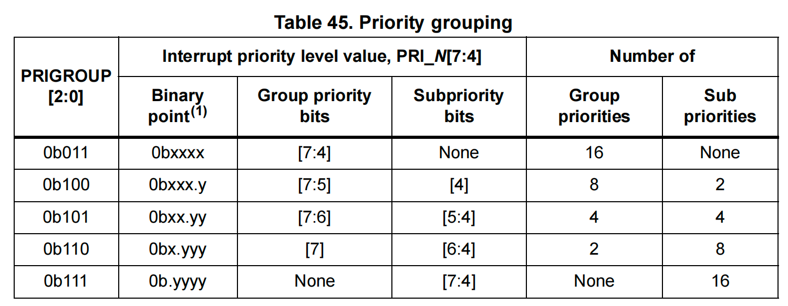

分组

抢占优先级

响应优先级

0

0位 取值范围：0

4位 取值范围：0-15

1

1位 取值范围：0-1

3位 取值范围：0-7

2

2位 取值范围：0-3

2位 取值范围：0-3

3

3位 取值范围：0-7

1位 取值范围：0-1

4

4位 取值范围：0-15

0位 取值范围：0


### 外部中断控制器 


## 中断案例：检测按键按下


### 需求描述

利用外部中断检测按键KEY3，当按键按下，翻转LED1显示。


### 硬件电路设计


#### LED1的硬件电路

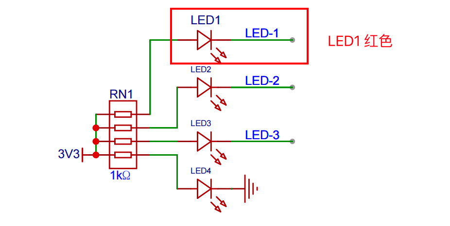

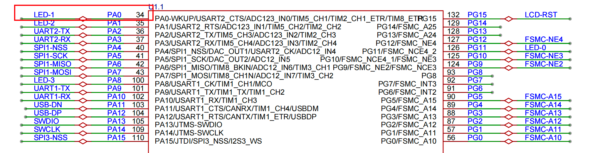


#### KEY的硬件电路

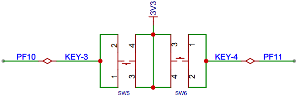

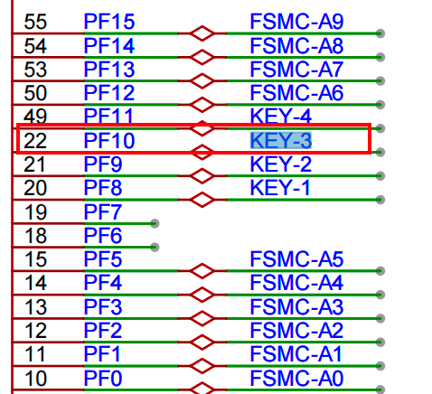

说明：


###### PF10对应的是KEY_3(SW5),我们可以设置PF10的模式为下拉输入，则当按键没有按下的时候是低电平，当按键按下的时候是高电平。


###### 由于按键没有设置硬件防抖，则我们需要软件设计防抖。一般延时10-15ms即可实现软件防抖。


### 软件设计（寄存器）

复制我们第一个项目，在第一个项目的基础上修改，可以省去一些配置步骤。

另外文件如何创建以后不再说明。


#### main.c

```c
#include "Driver_LED.h"
#include "Delay.h"
#include "Driver_Key.h"

int main()
{
    
    /* 1. 初始化LED */
    Driver_LED_Init();

    /* 2. 初始化按键 */
    Driver_Key_Init();

    while (1)
    {
       
    }
}
```


#### Delay.h

```c
#ifndef __delay_h
#define __delay_h
#include "stm32f10x.h"                  // Device header

void Delay_us(uint16_t us);
void Delay_ms(uint16_t ms);
void Delay_s(uint16_t s);

#endif
```


#### Delay.c

```c
#include "delay.h" // Device header

void Delay_us(uint16_t us)
{
    /* 定时器重装值 */
    SysTick->LOAD = 72 * us;
    /* 清除当前计数值 */
    SysTick->VAL = 0;
    /*设置内部时钟源（2位->1）,不需要中断（1位->0），并启动定时器(0位->1)*/
    SysTick->CTRL = 0x5;
    /*等待计数到0， 如果计数到0则16位会置为1*/
    while (!(SysTick->CTRL & SysTick_CTRL_COUNTFLAG));
    /* 关闭定时器 */
    SysTick->CTRL &= ~SysTick_CTRL_ENABLE; 
}

void Delay_ms(uint16_t ms)
{
    while (ms--)
    {
        Delay_us(1000);
    }
}

void Delay_s(uint16_t s)
{
    while (s--)
    {
        Delay_ms(1000);
    }
}
```


#### Driver_LED.h

```c
#ifndef __DRIVER_LED_H
#define __DRIVER_LED_H

#include "stm32f10x.h"

#define LED_1 GPIO_ODR_ODR0
#define LED_2 GPIO_ODR_ODR1
#define LED_3 GPIO_ODR_ODR8

void Driver_LED_Init(void);

void Driver_LED_On(uint32_t led);

void Driver_LED_Off(uint32_t led);

void Driver_LED_Toggle(uint32_t led);

void Driver_LED_OnAll(uint32_t leds[], uint8_t size);

void Driver_LED_OffAll(uint32_t leds[], uint8_t size);

#endif
```


#### Driver_LED.c

```c
#include "Driver_LED.h"

/**
 * @description: 对LED进行初始化
 */
void Driver_LED_Init(void)
{
    /* 1. 打开GPIOA的时钟 */
    RCC->APB2ENR |= RCC_APB2ENR_IOPAEN;

    /* 2. 给用到的端口的所有 PIN (PA0 PA1 PA8) 设置工作模式: 通用推挽输出 MODE:11  CNF:00 */
    GPIOA->CRL |= (GPIO_CRL_MODE0 | GPIO_CRL_MODE1);
    GPIOA->CRL &= ~(GPIO_CRL_CNF0 | GPIO_CRL_CNF1);

    GPIOA->CRH |= GPIO_CRH_MODE8;
    GPIOA->CRH &= ~GPIO_CRH_CNF8;

    /* 3. 关闭所有灯  */
    Driver_LED_Off(LED_1);
    Driver_LED_Off(LED_2);
    Driver_LED_Off(LED_3);
}

/**
 * @description: 点亮指定的LED
 * @param {uint32_t} led 要点亮的LED
 */
void Driver_LED_On(uint32_t led)
{
    GPIOA->ODR &= ~led;
}

/**
 * @description: 关闭指定的LED
 * @param {uint32_t} led 要关闭的LED
 */
void Driver_LED_Off(uint32_t led)
{
    GPIOA->ODR |= led;
}

/**
 * @description: 翻转LED的状态
 * @param {uint32_t} led 要翻转的LED
 */
void Driver_LED_Toggle(uint32_t led)
{
    /* 1. 读取引脚的电平,如果是1(目前是关闭), 打开, 否则就关闭 */
    if ((GPIOA->IDR & led) == 0)
    {
        Driver_LED_Off(led);
    }
    else
    {
        Driver_LED_On(led);
    }
}

/**
 * @description: 打开数组中所有的灯
 * @param {uint32_t} leds 所有灯
 * @param {uint8_t} size 灯的个数
 */
void Driver_LED_OnAll(uint32_t leds[], uint8_t size)
{

    for (uint8_t i = 0; i < size; i++)
    {
        Driver_LED_On(leds[i]);
    }
}

/**
 * @description: 关闭数组中所有的灯
 * @param {uint32_t} leds 所有灯
 * @param {uint8_t} size 灯的个数
 */
void Driver_LED_OffAll(uint32_t leds[], uint8_t size)
{
    for (uint8_t i = 0; i < size; i++)
    {
        Driver_LED_Off(leds[i]);
    }
}
```


#### Driver_Key.h

```c
#ifndef __DRIVER_KEY_H
#define __DRIVER_KEY_H

#include "stm32f10x.h"
void Driver_Key_Init(void);

#endif
```


#### Driver_Key.c

```c
#include "Driver_Key.h"
#include "Driver_LED.h"
#include "Delay.h"

/**
 * @description: 初始化按键.
 *  1. 给按键对应的io口设置工作模式: 下拉输入
 *  2. 配置复用为外部中断
 *  3. 配置外部中断控制器 EXTI
 *  4. 配置NVIC
 */
void Driver_Key_Init(void)
{
    /* 1. 开启时钟 */
    /* 1.1  GPIOF*/
    RCC->APB2ENR |= RCC_APB2ENR_IOPFEN;
    /* 1.2  AFIO*/
    RCC->APB2ENR |= RCC_APB2ENR_AFIOEN;

    /* 2. 配置 PF10为下拉输入: MODE=00 CNF=10  ODR=0 */
    GPIOF->CRH &= ~GPIO_CRH_MODE10;
    GPIOF->CRH |= GPIO_CRH_CNF10_1;
    GPIOF->CRH &= ~GPIO_CRH_CNF10_0;
    GPIOF->ODR &= ~GPIO_ODR_ODR10;

    /* 3. 配置AFIO 配置PF10引脚为外部中断  EXTICR3  0101*/
    AFIO->EXTICR[2] &= ~AFIO_EXTICR3_EXTI10;
    AFIO->EXTICR[2] |= AFIO_EXTICR3_EXTI10_PF;

    /* 4. 配置EXTI */
    /* 4.1. 配置上升沿触发 RTSR TR10=1*/
    EXTI->RTSR |= EXTI_RTSR_TR10;
    /* 4.2 开启 LINE10, 配置的中断屏蔽寄存器 */
    EXTI->IMR |= EXTI_IMR_MR10;

    /* 5. 配置 NVIC */
    /* 5.1 配置优先级组 (3-7) 配置3表示4个二进制位全部用于表示抢占优先级*/
    NVIC_SetPriorityGrouping(3);
    /* 5.2 配置优先级 参数1:中断号*/
    NVIC_SetPriority(EXTI15_10_IRQn, 3);
    /* 5.3 使能Line10 */
    NVIC_EnableIRQ(EXTI15_10_IRQn);
}

/**
 * @description: line 15-10的中断服务函数.
 *  一旦按键下按键1,则会执行一次这个函数
 * @return {*}
 */
void EXTI15_10_IRQHandler(void)
{
    /* 务必一定必须要清除中断标志位 */
    EXTI->PR |= EXTI_PR_PR10;

    Delay_ms(5);
    if ((GPIOF->IDR & GPIO_IDR_IDR10) != 0)
    {
        Driver_LED_Toggle(LED_1);
    }
}
```


### 软件设计（HAL库）


#### STM32CubeMX配置 

配置LED1的PA0引脚。

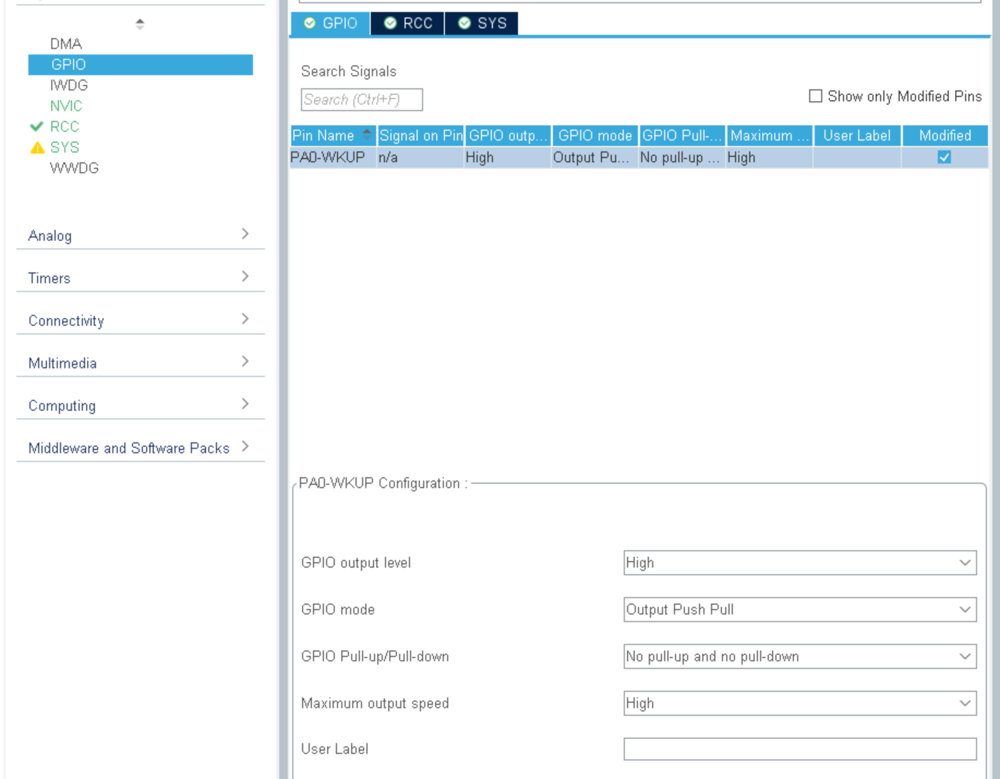

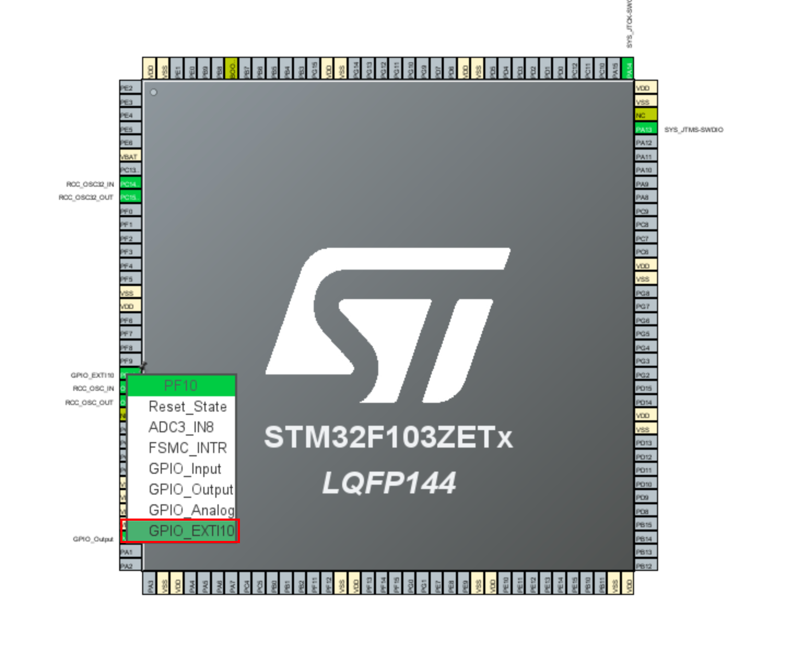

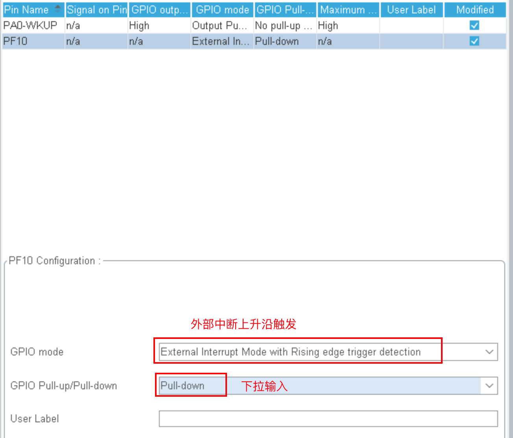


调整下滴答定时器和外部中断的优先级。否则使用延时消抖会卡死。

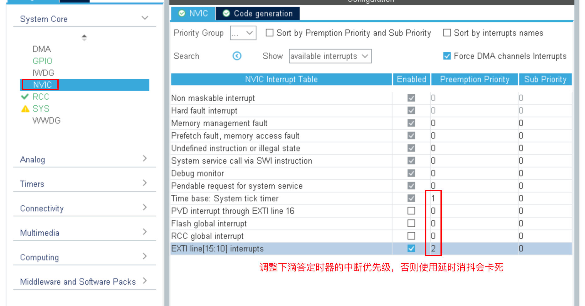


#### GPIO初始化代码

```c
void MX_GPIO_Init(void)
{

    GPIO_InitTypeDef GPIO_InitStruct = {0};

    /* GPIO Ports Clock Enable */
    __HAL_RCC_GPIOE_CLK_ENABLE();
    __HAL_RCC_GPIOC_CLK_ENABLE();
    __HAL_RCC_GPIOG_CLK_ENABLE();
    __HAL_RCC_GPIOA_CLK_ENABLE();

    /*Configure GPIO pin Output Level */
    HAL_GPIO_WritePin(GPIOE, GPIO_PIN_3, GPIO_PIN_SET);

    /*Configure GPIO pin : PE3 */
    GPIO_InitStruct.Pin = GPIO_PIN_3;
    GPIO_InitStruct.Mode = GPIO_MODE_OUTPUT_PP;
    GPIO_InitStruct.Pull = GPIO_NOPULL;
    GPIO_InitStruct.Speed = GPIO_SPEED_FREQ_LOW;
    HAL_GPIO_Init(GPIOE, &GPIO_InitStruct);

    /*Configure GPIO pin : PG6 */
    GPIO_InitStruct.Pin = GPIO_PIN_6;
    GPIO_InitStruct.Mode = GPIO_MODE_IT_RISING;
    GPIO_InitStruct.Pull = GPIO_PULLDOWN;
    HAL_GPIO_Init(GPIOG, &GPIO_InitStruct);

    /* EXTI interrupt init*/
    HAL_NVIC_SetPriority(EXTI9_5_IRQn, 0, 0);
    HAL_NVIC_EnableIRQ(EXTI9_5_IRQn);
}
```


#### 添加中断处理函数

当有按键按下的时候，检测到上升沿会执行中断服务函数：EXTI15_10_IRQHandler，内部又会调用HAL库总的外部中断处理函数HAL_GPIO_EXTI_IRQHandler，然后会调用中断回调函数HAL_GPIO_EXTI_Callback，它是一个弱实现函数（用__weak修饰，如果有新的同名函数实现，则执行时会自动调用新的实现函数），我们重新实现这个函数就可以了。

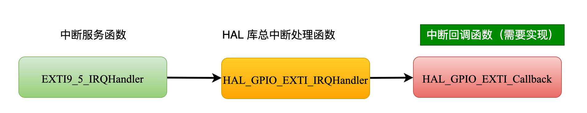

```c
void EXTI15_10_IRQHandler(void)
{
    /* USER CODE BEGIN EXTI15_10_IRQn 0 */

    /* USER CODE END EXTI15_10_IRQn 0 */
    HAL_GPIO_EXTI_IRQHandler(GPIO_PIN_10);
    /* USER CODE BEGIN EXTI15_10_IRQn 1 */

    /* USER CODE END EXTI15_10_IRQn 1 */
}

void HAL_GPIO_EXTI_IRQHandler(uint16_t GPIO_Pin)
{
  /* EXTI line interrupt detected */
  if (__HAL_GPIO_EXTI_GET_IT(GPIO_Pin) != 0x00u)
  {
    __HAL_GPIO_EXTI_CLEAR_IT(GPIO_Pin);
    HAL_GPIO_EXTI_Callback(GPIO_Pin);
  }
}

__weak void HAL_GPIO_EXTI_Callback(uint16_t GPIO_Pin)
{
  /* Prevent unused argument(s) compilation warning */
  UNUSED(GPIO_Pin);
  /* NOTE: This function Should not be modified, when the callback is needed,
           the HAL_GPIO_EXTI_Callback could be implemented in the user file
   */
}
```

在gpio.c中实现中断回调函数即可。

```c
/* USER CODE BEGIN 2 */
void HAL_GPIO_EXTI_Callback(uint16_t GPIO_Pin)
{
    if (GPIO_Pin == GPIO_PIN_10)
    {
        HAL_Delay(15);
        // 防抖： 延迟15ms之后再次检测是否仍然是高电平，
        if (HAL_GPIO_ReadPin(GPIOF, GPIO_Pin) == GPIO_PIN_SET)
        {
            HAL_GPIO_TogglePin(GPIOA, GPIO_PIN_0);
        }
    }
}
/* USER CODE END 2 */
```

