# USART串口通讯


## 通讯基础知识


### 并行通讯和串行通讯


### 单工，半双工，全双工通讯


### 同步和异步通讯


### 串口介绍

串口通讯（Serial Communication）是一种设备间非常常用的串行通讯方式，因为它简单便捷，因此大部分电子设备都支持该通讯方式，电子工程师在调试设备时也经常使用该通讯方式输出调试信息。

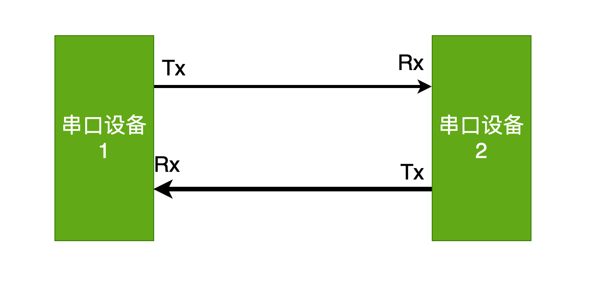


### 串口通讯协议

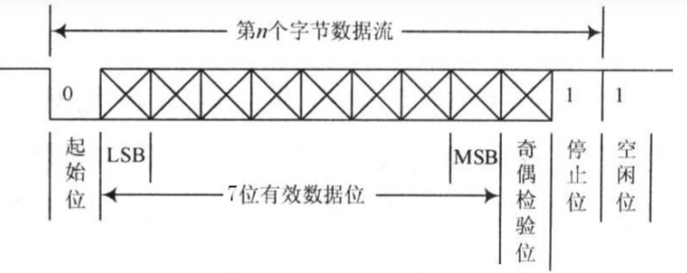


##### 波特率

“波特率”（Baudrate），它表示每秒钟传输了多少个码元。在二进制的世界码元和位是等价的。用每秒传输的比特数表示波特率。

STM32提供了串口异步通讯，异步通讯中由于没有时钟信号，所以两个通讯设备之间需要约定好波特率，即每个码元的长度，以便对信号进行解码。常见的波特率为 4800、9600、115200等。


##### 空闲位

串口协议规定，当总线处于空闲状态时信号线的状态为‘1’即高电平，表示当前线路上没有数据。


##### 通讯的起始位

每开始一次通信时发送方先发出一个逻辑”0”的信号（低电平），表示传输字符的开始。因为总线空闲时为高电平所以开始一次通信时先发送一个明显区别于空闲状态的信号即低电平。


##### 通讯的停止位

停止信号可由 0.5、1、1.5 或 2个逻辑1的数据位表示，只要双方约定一致即可。


##### 有效数据位

在数据包的起始位之后紧接着的就是要传输的主体数据内容，也称为有效数据，有效数据的长度常被约定为 5、6、7 或8位长。构成一个字符（一般都是8位）。先发送最低位，最后发送最高位，使用低电平表示‘0’高电平表示‘1’完成数据位的传输。


##### 校验位

数据位加上这一位后，使得“1”的位数应为偶数（偶校验）或奇数（奇校验），以此来校验数据传送的正确性。串口校验分几种方式：


###### 无校验（no parity）。


###### 奇校验（odd parity）：如果数据位中“1”的数目是偶数，则校验位为“1”，如果“1”的数目是奇数，校验位为“0”。


###### 偶校验（even parity）：如果数据为中“1”的数目是偶数，则校验位为“0”，如果为奇数，校验位为“1”。


## USART外设

STM32提供了USART（Universal Synchronous Asynchronous Receiver and Transmitter）通用同步异步收发器。是一个串行通信设备，可以灵活地与外部设备进行全双工数据交换。

还有UART相比USART去掉了同步通讯功能。

一共提供5个串口供开发者选择。

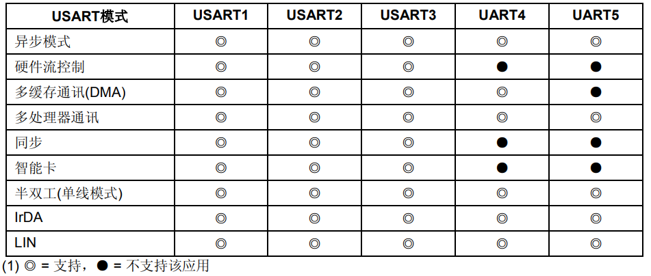

STM32的USART功能框图如下：


##### 功能引脚说明

TX：发送数据输出引脚。

RX：接收数据输入引脚。

SW_RX：数据接收引脚，只用于单线和智能卡模式，属于内部引脚，没有具体外部引脚。

nRTS：请求以发送（Request To Send），n 表示低电平有效。如果使能RTS流控制，当 USART接收器准备好接收新数据时就会将nRTS变成低电平；当接收寄存器已满时，nRTS 将被设置为高电平。该引脚只适用于硬件流控制。

nCTS：清除以发送（Clear To Send），n 表示低电平有效。如果使能CTS流控制，发送器在发送下一帧数据之前会检测nCTS引脚，如果为低电平，表示可以发送数据，如果为高电平则在发送完当前数据帧之后停止发送。该引脚只适用于硬件流控制。

SCLK：发送器时钟输出引脚。这个引脚仅适用于同步模式。


##### 波特率的产生

发送器和接收器的波特率是一致的，都是通过设置BRR寄存器来得到。

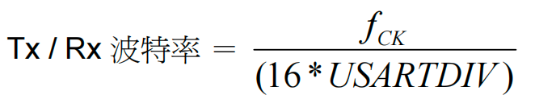

这里的是给外设的时钟（usart1在APB2上一般是72MHz，usart2，3，4，5在APB1上一般为36MHz）。

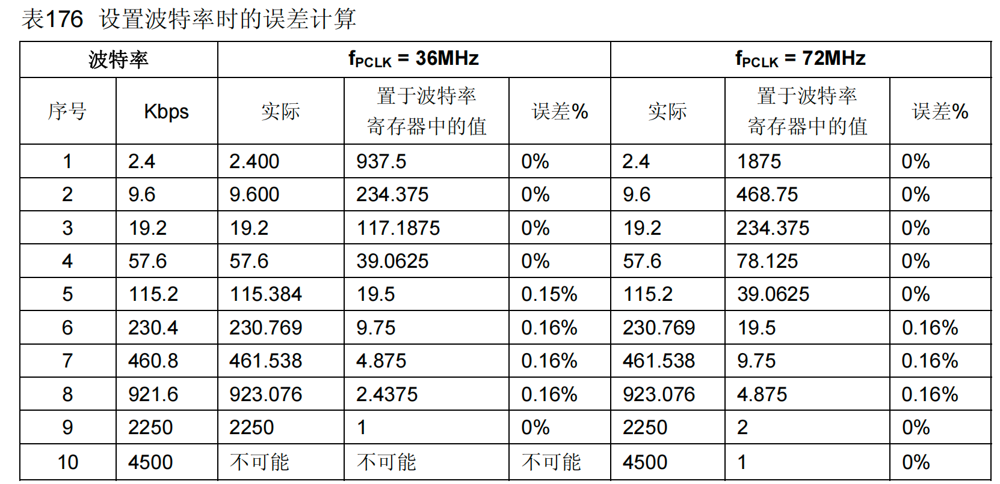

假设我们需要的波特率是115200，则对应的分频值应该是：39.0625，把这个值写入到BRR寄存器中。39.0625的小数部分：0.0625 * 16 = 1, 整数部分是：39(0x27)。


所以写入到BRR寄存器的值是：0x0271。


##### 相关寄存器

查阅参考手册540页，这里就不一一列举了。


## 串口案例1：计算机和串口通讯


### 需求描述

电脑通过串口向STM32发送数据，STM32原封不动的再发送过来。电脑可以借助串口助手来发送或接受数据。


### 硬件电路设计

目前很多电脑已经没有串口接口了，为了使用串口，我们自制的下载器STLink2.1拥有USB转串口的功能。


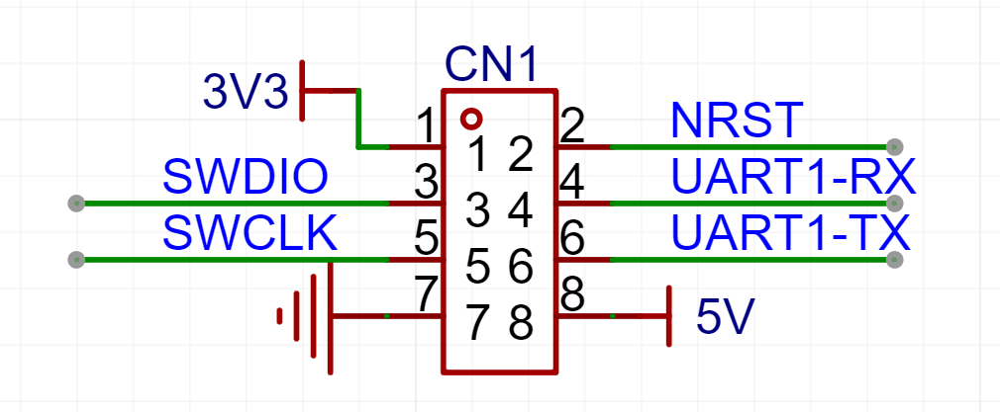

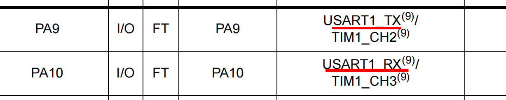


### 软件设计：轮询的方式接收（寄存器）


#### main.c

```c
#include "Driver_USART.h"
#include "Delay.h"
#include "string.h"

uint8_t buff[100] = {0};
uint8_t len = 0;
int main()
{
    Driver_USART1_Init();
    // Driver_USART1_SendChar('a');
    while (1)
    {
        // uint8_t *str = "Hello atguigu!\r\n";
        // Driver_USART1_SendString(str, strlen((char *)str));

        /* uint8_t *str = "尚硅谷\r\n";
        Driver_USART1_SendString(str, strlen((char *)str));
        Delay_s(1); */

        // uint8_t c =  Driver_USART1_ReceiveChar();
        // Driver_USART1_SendChar(c);

        Driver_USART1_ReceiveString(buff, &len);
        Driver_USART1_SendString(buff, len);
    }
}
```


#### Driver_USART.h

```c
#ifndef __DRVIER_USART_H
#define __DRVIER_USART_H

#include "stm32f10x.h"

void Driver_USART1_Init(void);

void Driver_USART1_SendChar(uint8_t byte);

void Driver_USART1_SendString(uint8_t *str, uint16_t len);

uint8_t Driver_USART1_ReceiveChar(void);

void Driver_USART1_ReceiveString(uint8_t buff[], uint8_t *len);

#endif
```


#### Driver_USART.c

```c
#include "Driver_USART.h"

/**
 * @description: 初始化串口1
 */
void Driver_USART1_Init(void)
{
    /* 1. 开启时钟 */
    /* 1.1 串口1外设的时钟 */
    RCC->APB2ENR |= RCC_APB2ENR_USART1EN;
    /* 1.2 GPIO时钟 */
    RCC->APB2ENR |= RCC_APB2ENR_IOPAEN;

    /* 2. 配置GPIO引脚的工作模式  PA9=Tx(复用推挽 CNF=10 MODE=11)  PA10=Rx(浮空输入 CNF=01 MODE=00)*/
    GPIOA->CRH |= GPIO_CRH_CNF9_1;
    GPIOA->CRH &= ~GPIO_CRH_CNF9_0;
    GPIOA->CRH |= GPIO_CRH_MODE9;

    GPIOA->CRH &= ~GPIO_CRH_CNF10_1;
    GPIOA->CRH |= GPIO_CRH_CNF10_0;
    GPIOA->CRH &= ~GPIO_CRH_MODE10;

    /* 3. 串口的参数配置 */
    /* 3.1 配置波特率 115200 */
    USART1->BRR = 0x271;
/* 3.2 串口使能，并使能接收和发送 */
USART1->CR1 |= USART_CR1_UE;
    USART1->CR1 |= USART_CR1_TE;
USART1->CR1 |= USART_CR1_RE;    
    /* 3.3 配置一个字的长度 8位 */
    USART1->CR1 &= ~USART_CR1_M;
    /* 3.4 配置不需要校验位 */
    USART1->CR1 &= ~USART_CR1_PCE;
    /* 3.5 配置停止位的长度 */
    USART1->CR2 &= ~USART_CR2_STOP;
}

/**
 * @description: 发送一个字节
 * @param {uint8_t} byte 要发送的字节
 */
void Driver_USART1_SendChar(uint8_t byte)
{
    /* 1. 等待发送寄存器为空 */
    while ((USART1->SR & USART_SR_TXE) == 0)
        ;

    /* 2. 数据写出到数据寄存器 */
    USART1->DR = byte;
}

/**
 * @description: 发送一个字符串
 * @param {uint8_t} *str 要发送的字符串
 * @param {uint16_t} len 字符串中字节的长度
 * @return {*}
 */
void Driver_USART1_SendString(uint8_t *str, uint16_t len)
{
    for (uint16_t i = 0; i < len; i++)
    {
        Driver_USART1_SendChar(str[i]);
    }
}

/**
 * @description: 接收一个字节的数据
 * @return {*} 接收到的字节
 */
uint8_t Driver_USART1_ReceiveChar(void)
{
    /* 等待数据寄存器非空 */
    while ((USART1->SR & USART_SR_RXNE) == 0)
        ;
    return USART1->DR;
}

/**
 * @description: 接收变长数据.接收到的数据存入到buff中
 * @param {uint8_t} buff 存放接收到的数据
 * @param {uint8_t} *len 存放收到的数据的字节的长度
 */
void Driver_USART1_ReceiveString(uint8_t buff[], uint8_t *len)
{
    uint8_t i = 0;
    while (1)
    {
        // 等待接收非空
        while ((USART1->SR & USART_SR_RXNE) == 0)
        {
            //在等待期间, 判断是否收到空闲帧
            if (USART1->SR & USART_SR_IDLE)
            {
                *len = i;
                return;
            }
        }
        buff[i] = USART1->DR;
        i++;
    }
}
```


### 软件设计：中断的方式接收（寄存器）

USART提供了多个中断事件。

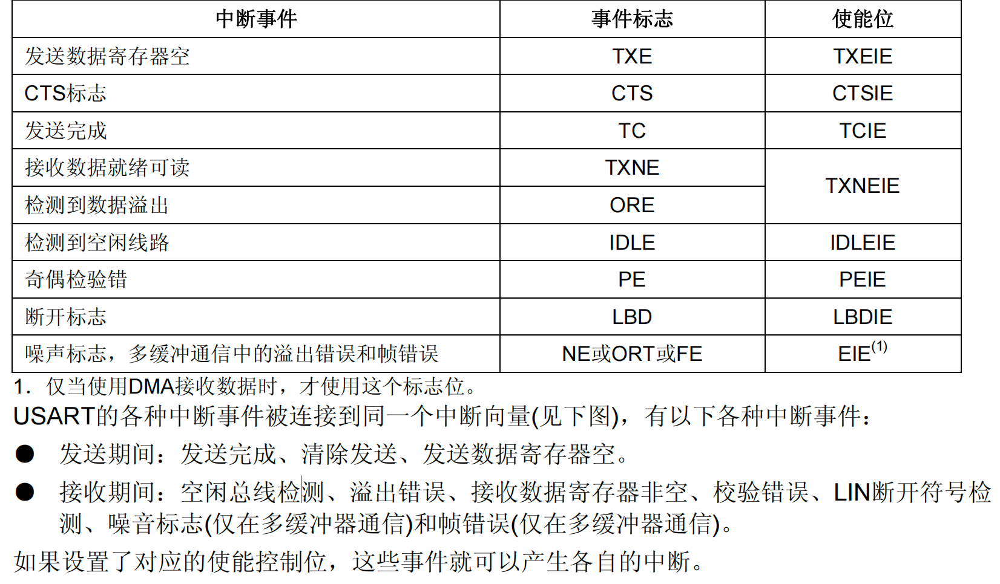


#### Driver_USART.c 添加中断相关代码

```c
#include "Driver_USART.h"

/**
 * @description: 初始化串口1
 */
void Driver_USART1_Init(void)
{
    /* 1. 开启时钟 */
    /* 1.1 串口1外设的时钟 */
    RCC->APB2ENR |= RCC_APB2ENR_USART1EN;
    /* 1.2 GPIO时钟 */
    RCC->APB2ENR |= RCC_APB2ENR_IOPAEN;

    /* 2. 配置GPIO引脚的工作模式  PA9=Tx(复用推挽 CNF=10 MODE=11)  PA10=Rx(浮空输入 CNF=01 MODE=00)*/
    GPIOA->CRH |= GPIO_CRH_CNF9_1;
    GPIOA->CRH &= ~GPIO_CRH_CNF9_0;
    GPIOA->CRH |= GPIO_CRH_MODE9;

    GPIOA->CRH &= ~GPIO_CRH_CNF10_1;
    GPIOA->CRH |= GPIO_CRH_CNF10_0;
    GPIOA->CRH &= ~GPIO_CRH_MODE10;

    /* 3. 串口的参数配置 */
    /* 3.1 配置波特率 115200 */
    USART1->BRR = 0x271;
    /* 3.2 配置一个字的长度 8位 */
    USART1->CR1 &= ~USART_CR1_M;
    /* 3.3 配置不需要校验位 */
    USART1->CR1 &= ~USART_CR1_PCE;
    /* 3.4 配置停止位的长度 */
    USART1->CR2 &= ~USART_CR2_STOP;
    /* 3.5 使能接收和发送 */
    USART1->CR1 |= USART_CR1_TE;
    USART1->CR1 |= USART_CR1_RE;

    /* 3.6 使能串口的各种中断 */
    USART1->CR1 |= USART_CR1_RXNEIE; /* 接收非空中断 */
    USART1->CR1 |= USART_CR1_IDLEIE; /* 空闲中断 */

    /* 4. 配置NVIC */
    /* 4.1 配置优先级组 */
    NVIC_SetPriorityGrouping(3);
    /* 4.2 设置优先级 */
    NVIC_SetPriority(USART1_IRQn, 2);
    /* 4.3 使能串口1的中断 */
    NVIC_EnableIRQ(USART1_IRQn);

    /* 4. 使能串口 */
    USART1->CR1 |= USART_CR1_UE;
}

/**
 * @description: 发送一个字节
 * @param {uint8_t} byte 要发送的字节
 */
void Driver_USART1_SendChar(uint8_t byte)
{
    /* 1. 等待发送寄存器为空 */
    while ((USART1->SR & USART_SR_TXE) == 0)
        ;

    /* 2. 数据写出到数据寄存器 */
    USART1->DR = byte;
}

/**
 * @description: 发送一个字符串
 * @param {uint8_t} *str 要发送的字符串
 * @param {uint16_t} len 字符串中字节的长度
 * @return {*}
 */
void Driver_USART1_SendString(uint8_t *str, uint16_t len)
{
    for (uint16_t i = 0; i < len; i++)
    {
        Driver_USART1_SendChar(str[i]);
    }
}

/**
 * @description: 接收一个字节的数据
 * @return {*} 接收到的字节
 */
uint8_t Driver_USART1_ReceiveChar(void)
{
    /* 等待数据寄存器非空 */
    while ((USART1->SR & USART_SR_RXNE) == 0)
        ;
    return USART1->DR;
}

/**
 * @description: 接收变长数据.接收到的数据存入到buff中
 * @param {uint8_t} buff 存放接收到的数据
 * @param {uint8_t} *len 存放收到的数据的字节的长度
 */
void Driver_USART1_ReceiveString(uint8_t buff[], uint8_t *len)
{
    uint8_t i = 0;
    while (1)
    {
        // 等待接收非空
        while ((USART1->SR & USART_SR_RXNE) == 0)
        {
            // 在等待期间, 判断是否收到空闲帧
            if (USART1->SR & USART_SR_IDLE)
            {
                
                *len = i;
                return;
            }
        }
        buff[i] = USART1->DR;
        i++;
    }
}

/* 缓冲接收到的数据 */
uint8_t buff[100] = {0};
/* 存储接收到的字节的长度 */
uint8_t len = 0;
uint8_t isToSend = 0;
void USART1_IRQHandler(void)
{
    /* 数据接收寄存器非空 */
    if (USART1->SR & USART_SR_RXNE)
    {
        // 对USART_DR的读操作可以将接收非空的中断位清零。 所以不用单独清除了.
        //USART1->SR &= ~USART_SR_RXNE;
        buff[len] = USART1->DR;
        len++;
    }
    else if (USART1->SR & USART_SR_IDLE)
    {
        /* 清除空闲中断标志位: 先读sr,再读dr.就可以实现清除了 */
        USART1->SR;
        USART1->DR;
        /* 变长数据接收完毕 */
        //Driver_USART1_SendString(buff, len);
        isToSend = 1;
        /* 把接收字节的长度清0 */
        // len = 0;
    }
}
```


#### main.c

```c
#include "Driver_USART.h"
/* 缓冲接收到的数据 */
extern uint8_t buff[100];
/* 存储接收到的字节的长度 */
extern uint8_t len;
extern uint8_t isToSend;

int main()
{
    Driver_USART1_Init();
    Driver_USART1_SendString("abc", 3);
    while (1)
    {
        if(isToSend){
            Driver_USART1_SendString(buff, len);
            isToSend = 0;
            len = 0;
        }
    }
}
```


### 软件设计（HAL库）


#### 使用STM32CubeMx搭建工程


##### 基本配置

选择芯片，配置debug，配置时钟参考前面的内容。


##### 配置串口

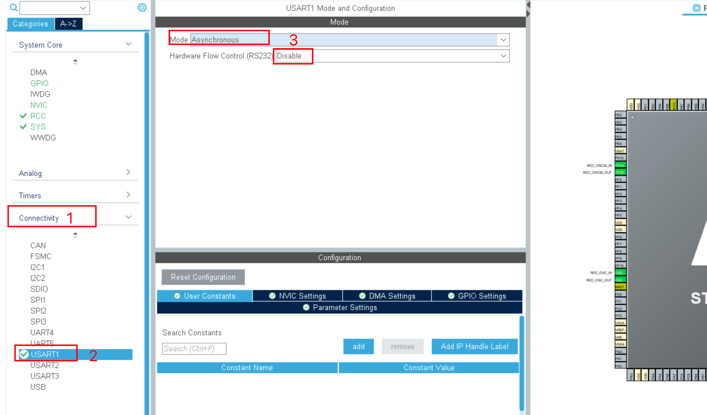

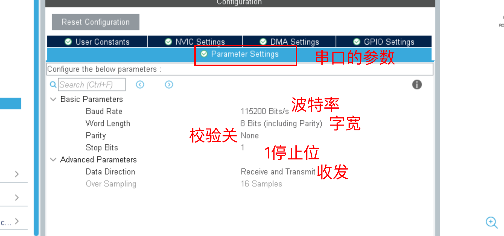

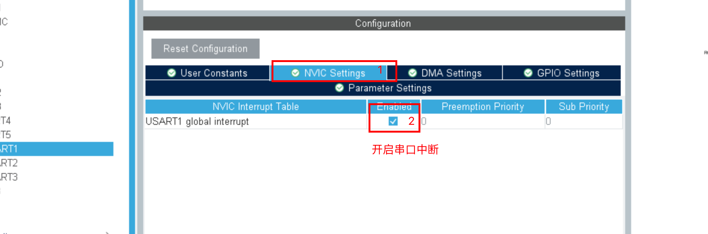

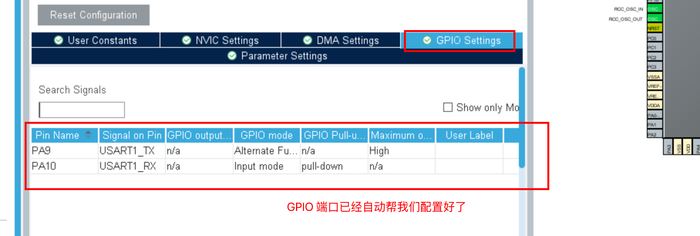


##### 添加我们的代码

时钟初始化，串口初始化工具已经帮我们完成了。我们可以轮询方式收发数据，也可以采用中断的方式收发数据。 


#### 轮询的方式收发

轮询的方式就是在循环中一直检测串口，是否有数据进来，如果有就读进来，然后再原封不动的发出。

```c
uint8_t buff[10];
int main(void)
{
   
    HAL_Init();
    SystemClock_Config();
    MX_GPIO_Init();
    MX_USART1_UART_Init();
    while (1)
    {
        /* 从串口读取数据：
               参数1 指定的串口
               参数2：存储读取到的数据
               参数3：一共接收多少条数据
               参数4：超时时间
       */
        if (HAL_UART_Receive(&huart1, buff, 10, HAL_MAX_DELAY) == HAL_OK)
        {
            // 把收到的数据原封不动的发出去
            HAL_UART_Transmit(&huart1, buff, 10, HAL_MAX_DELAY);
        }
    }
}
```

轮询方式的一些问题：轮询模式使用起来最简单，但是会占用大量的CPU时间，在等待接收和等待发送完毕时，CPU不能去做别的运算，只能在这里空等，运行的效率很低。


#### 中断的方式接收：定长数据 

stm32f1xx_hal_uart.c中关于中断回调函数的描述。

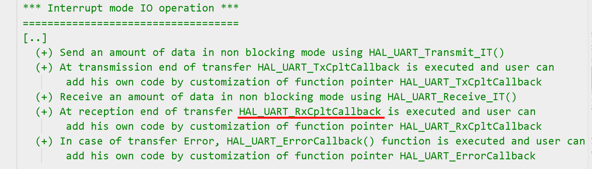

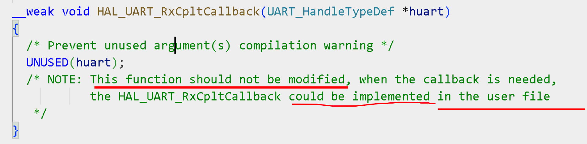

这里函数用了__weak 修饰，当有其他实现的时候，编译器会忽略这里的。我们只要在这个函数中写收发逻辑就行了。

```c
uint8_t buff[1];        // 接收缓冲， 一次接受一个字节的数据
void HAL_UART_RxCpltCallback(UART_HandleTypeDef *huart)
{
    if (huart1.Instance == USART1)
    {
        HAL_UART_Transmit(&huart1, buff, 1, HAL_MAX_DELAY);
        HAL_UART_Receive_IT(&huart1, buff, 1); // 继续接收
    }
}

int main(void)
{
    HAL_Init();
    MX_GPIO_Init();
    MX_USART1_UART_Init();
    /* 用中断的方式接收一个字节的数据 */
    HAL_UART_Receive_IT(&huart1, buff, 1);

    while (1)
    {
    }
}
```


#### 中断的方式接收：变长数据

```c
/* USER CODE BEGIN 0 */
uint8_t rxBuff[1000]; // 接收缓冲区
// Size 是实际接收的数据的长度
void HAL_UARTEx_RxEventCallback(UART_HandleTypeDef *huart, uint16_t Size) 
{
    if (huart1.Instance == USART1)
    {
        HAL_UART_Transmit(&huart1, rxBuff, Size, HAL_MAX_DELAY);
        HAL_UARTEx_ReceiveToIdle_IT(&huart1, rxBuff, 1000);
    }
}
/* USER CODE END 0 */

/**
 * @brief  The application entry point.
 * @retval int
 */
int main(void)
{
    HAL_Init();
    SystemClock_Config();
    MX_GPIO_Init();
    MX_USART1_UART_Init();
    /* 当接收到1000个字符或者碰到空闲帧, 则接收结束 */
    HAL_UARTEx_ReceiveToIdle_IT(&huart1, rxBuff, 1000);
    while (1)
    {
    }
}
```


## 串口案例2：重定向printf


### 需求描述

C语言中经常使用printf来输出调试信息，打印到屏幕。由于在单片机中没有屏幕，但是我们可以重定向printf，把数据打印到串口，从而在电脑端接收调试信息。这是除了debug外，另外一个非常有效的调试手段。


### 软件设计（寄存器）


#### Driver_USART.c添加fputc函数

```c
// 当调用printf的时候,会自动调用这个方法来执行,只需要调用一个通过串口发送字符的函数
int fputc(int c, FILE *file)
{
    Driver_USART1_SendChar(c);
    return c;
}
```


#### main.c

```c
#include "Driver_USART.h"

#include "Delay.h"

int main()
{
    Driver_USART1_Init();

    while (1)
    {
        printf("hello atguigu\r\n");
        Delay_ms(500);
    }
}
```


#### Keil设置

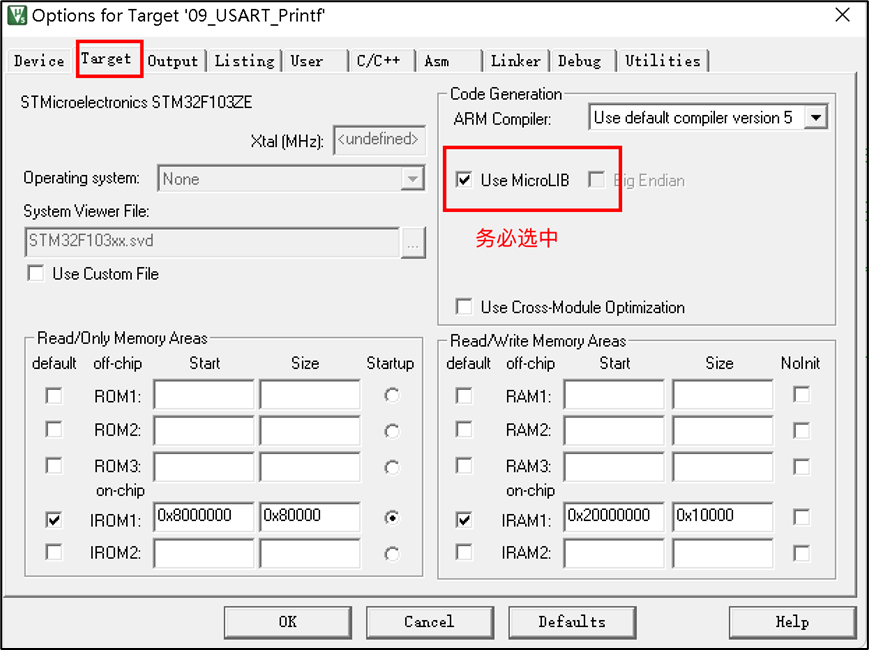


### 软件设计（HAL库）


#### usart.h 代码清单

```c
#include "main.h"
#include <stdio.h>
extern UART_HandleTypeDef huart1;
void MX_USART1_UART_Init(void);
```


#### usart.c 代码清单

```c
/* USER CODE BEGIN 0 */
int fputc(int ch, FILE *f)
{
    /* 发送一个字节数据到串口DEBUG_USART */
    HAL_UART_Transmit(&huart1, (uint8_t *)&ch, 1, 1000);    
    
    return (ch);
}
/* USER CODE END 0 */
```

