# I2C 通讯


## I2C基础知识

I2C 通讯协议（Inter-Integrated Circuit）是由Phiilps公司开发的，由于它引脚少，硬件实现简单，可扩展性强，不需要 USART、CAN等通讯协议的外部收发设备，现在被广泛地使用在系统内多个集成电路（IC）间的通讯。

是一种简单的双向两线制总线协议标准，支持同步串行半双工通讯。


## I2C案例1：软件模拟I2C

EEPROM芯片最常用的通讯方式就是I2C协议。我们使用的芯片是M24C02。


### 需求描述

我们向E2PROM写入一段数据，再读取出来，最后发送到串口，核对是否读写正确。


### 硬件电路设计


#### 硬件原理图

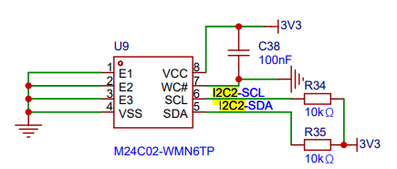

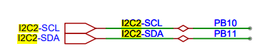

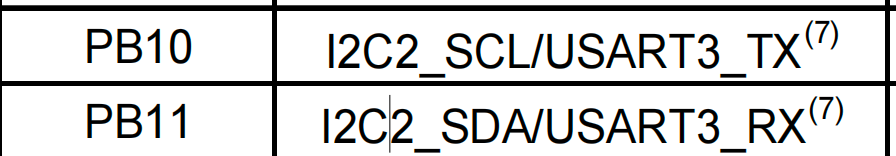


#### M24C02简介

M24C02的SCL及SDA 引脚连接到了STM32对应的I2C引脚中，结合上拉电阻，构成了I2C通讯总线，它们通过I2C总线交互。

E2PROM芯片的设备地址一共有7位，其中高4位固定为：1010，低3位则由E3/E2/E1信号线的电平决定E2PROM设备地址。

R/W是读写方向控制位，与地址无关。

在我们电路图中由于E1/E2/E3均是接的低电平，所以它的地址是1010000即0x50。

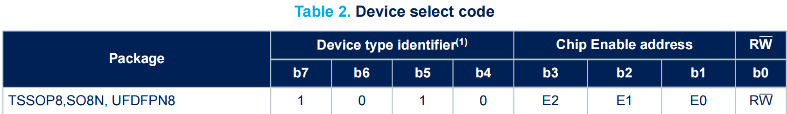

由于I2C通讯时常常是地址跟读写方向连在一起构成一个8位数，且当R/W位为0 时，表示写方向，所以加上7位地址，其值为“0xA0”，常称该值为I2C设备的“写地址”。

当R/W位为1时，表示读方向，加上7位地址，其值为“0xA1”，常称该值为“读地址”。


### 操作时序图整理


##### 起始和停止信号

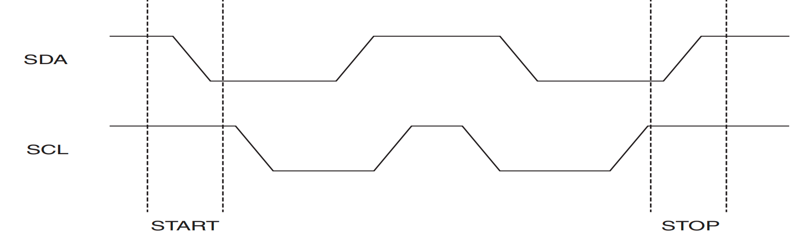


##### 数据有效性

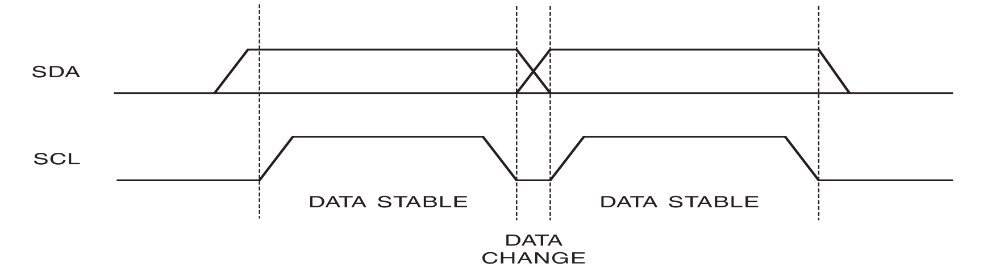


##### 响应和非响应

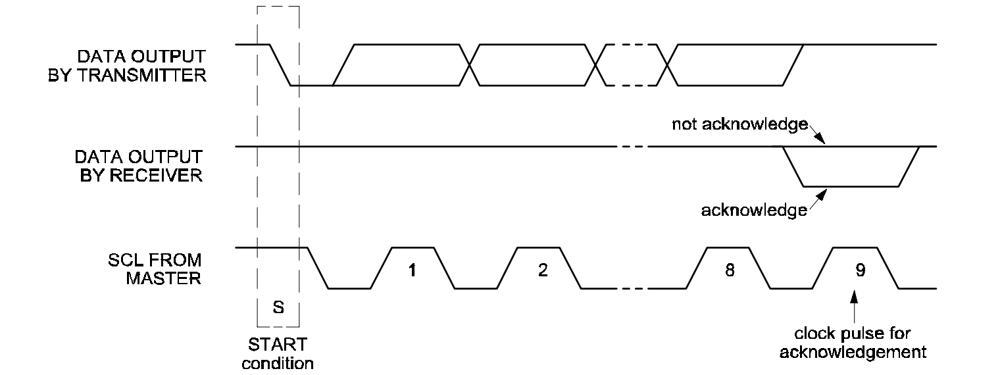


##### 写入一个字节时序

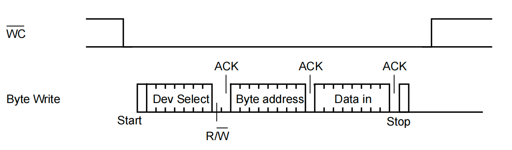


##### 读出一个字节时序

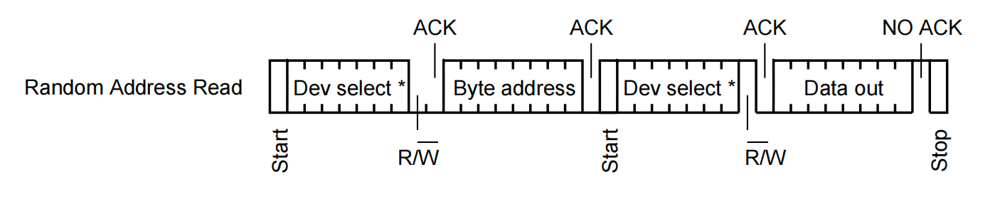


##### 单次写入多个字节时序

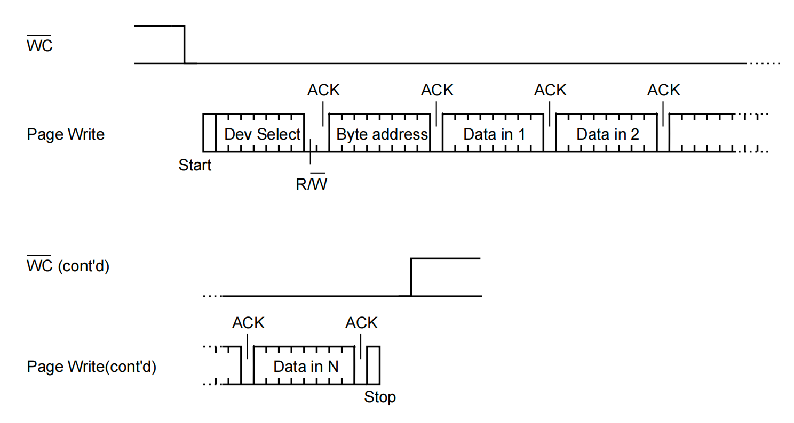

一次性写入多个字节，也叫页写入（Page Write）。AT24C02每页只有16个字节，每次只能写入单独的一个页中，所以一次性最多只能写入16个字节。当一次性写入超过16个字节的时候，则超过的部分会重新从这页的首地址重新写入。


##### 单次读出多个字节时序

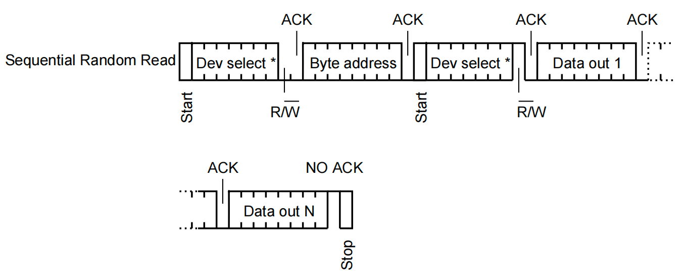

读出多个字节的时候没有限制，可以读出任意多个。


### 软件设计（寄存器）


#### main.c

```c
#include "Driver_USART.h"
#include "Inf_W24C02.h"

int main()
{
    Driver_USART1_Init();
    printf("尚硅谷 I2C 软件模式实验开始....\r\n");

    Inf_W24C02_Init();

    Inf_W24C02_WriteByte(0x00, 'a');
    Inf_W24C02_WriteByte(0x01, 'b');
    Inf_W24C02_WriteByte(0x02, 'c');
    uint8_t byte1 = Inf_W24C02_ReadByte(0x00);
    uint8_t byte2 = Inf_W24C02_ReadByte(0x01);
    uint8_t byte3 = Inf_W24C02_ReadByte(0x02);

    printf("%c\r\n", byte1);
    printf("%c\r\n", byte2);
    printf("%c\r\n", byte3);

    Inf_W24C02_WriteBytes(0x00, "123456", 6);

    uint8_t buff[100] = {0};
    Inf_W24C02_ReadBytes(0x00, buff, 6);
    printf("%s\r\n", buff);

    // 清零缓冲区
    memset(buff, 0, sizeof(buff));
    Inf_W24C02_WriteBytes(0x00, "0123456789abcdefghijk", 21);
    Inf_W24C02_ReadBytes(0x00, buff, 21);
    printf("%s\r\n", buff);
    while (1)
    {
    }
}
```


#### Driver_I2C2.h

```c
#ifndef __DRIVER_I2C2_H
#define __DRIVER_I2C2_H

#include "Delay.h"
#include "stm32f10x.h"
#include "Driver_USART.h"

#define ACK 0
#define NACK 1

#define SCL_HIGH  (GPIOB->ODR |= GPIO_ODR_ODR10)
#define SCL_LOW  (GPIOB->ODR &= ~GPIO_ODR_ODR10)

#define SDA_HIGH  (GPIOB->ODR |= GPIO_ODR_ODR11)
#define SDA_LOW  (GPIOB->ODR &= ~GPIO_ODR_ODR11)

#define READ_SDA (GPIOB->IDR & GPIO_IDR_IDR11)

void Driver_I2C2_Init(void);

void Driver_I2C2_Start(void);

void Driver_I2C2_Stop(void);

void Driver_I2C2_Ack(void);

void Driver_I2C2_NAck(void);

uint8_t Driver_I2C2_WaitAck(void);

void Driver_I2C_SendByte(uint8_t byte);

uint8_t Driver_I2C_ReadByte(void);

#endif
```


#### Driver_I2C2.c

```c
#include "Driver_I2C2.h"
#include "Delay.h"

#define I2C_DELAY Delay_us(10)

/**
 * @description: 初始化
 * @return {*}
 */
void Driver_I2C2_Init(void)
{
    /*
        PB10->SCL
        PB11->SDA
            开漏输出: 既可以用于输出也可以输入. 外界要有上拉电阻.
                    用于输入的时候,最好先输出一个1,把线的控制权交给外界.

            MODE=11 CNF=01

     */
    RCC->APB2ENR |= RCC_APB2ENR_IOPBEN;

    GPIOB->CRH |= (GPIO_CRH_MODE10 | GPIO_CRH_MODE11 | GPIO_CRH_CNF10_0 | GPIO_CRH_CNF11_0);
    GPIOB->CRH &= ~(GPIO_CRH_CNF10_1 | GPIO_CRH_CNF11_1);
}

/**
 * @description: 起始信号
 * @return {*}
 */
void Driver_I2C2_Start(void)
{
    /* 1. 拉高sda和scl */
    SDA_HIGH;
    SCL_HIGH;
    /* 2. 延时 */
    I2C_DELAY;
    /* 3. 拉低sda */
    SDA_LOW;
    /* 4. 延时 */
    I2C_DELAY;
}

/**
 * @description: 停止信号
 * @return {*}
 */
void Driver_I2C2_Stop(void)
{
    /* 1. scl 拉高 sda拉低 */
    SCL_HIGH;
    SDA_LOW;
    /* 2. 延时 */
    I2C_DELAY;
    /* 3. 拉高sda */
    SDA_HIGH;
    /* 4.  延时 */
    I2C_DELAY;
}

/**
 * @description: 接收方产生应答信号
 */
void Driver_I2C2_Ack(void)
{
    /* 1. 拉高sda和拉低scl */
    SDA_HIGH;
    SCL_LOW;
    /* 2. 延时 */
    I2C_DELAY;
    /* 3. sda拉低 */
    SDA_LOW;
    /* 4. 延时 */
    I2C_DELAY;
    /* 5. scl拉高 */
    SCL_HIGH;
    /* 6. 延时 */
    I2C_DELAY;
    /* 7. scl拉低 */
    SCL_LOW;
    /* 8. 延时 */
    I2C_DELAY;
    /* 9. sda 拉高 */
    SDA_HIGH;
    /* 10. 延时 */
    I2C_DELAY;
}

/**
 * @description: 接收方产生非应答信号
 */
void Driver_I2C2_NAck(void)
{
    /* 1. 拉高sda和拉低scl */
    SDA_HIGH;
    SCL_LOW;
    /* 2. 延时 */
    I2C_DELAY;

    /* 3. scl拉高 */
    SCL_HIGH;

    /* 4. 延时 */
    I2C_DELAY;

    /* 5. scl拉低*/
    SCL_LOW;

    /* 6. 延时 */
    I2C_DELAY;
}

/**
 * @description: 等待接收方的应答
 * @return {*} 应答或非应答
 */
uint8_t Driver_I2C2_WaitAck(void)
{
    /* 1. 把sda拉高, sda的主动权交给对方(e2prom芯片) */
    SDA_HIGH;

    /* 2. scl拉低  */
    SCL_LOW;
    /* 3. 延时 */
    I2C_DELAY;
    /* 4. 拉高scl */
    SCL_HIGH;
    /* 5. 延时 */
    I2C_DELAY;
    /* 6. 读取sda的电平 */
    uint8_t ack = ACK;
    if (READ_SDA)
    {
        ack = NACK;
    }
    /* 7. 拉低scl */
    SCL_LOW;

    /* 8. 延时 */
    I2C_DELAY;
    return ack;
}

/**
 * @description: 发送一个字节的数据
 * @param {uint8_t} byte 要发送的字节
 */
void Driver_I2C_SendByte(uint8_t byte)
{
    for (uint8_t i = 0; i < 8; i++)
    {
        /* 1. sda和scl 拉低 */
        SDA_LOW;
        SCL_LOW;

        I2C_DELAY;

        /* 2. 向sda写数据 */
        if (byte & 0x80)
        {
            SDA_HIGH;
        }
        else
        {
            SDA_LOW;
        }
        I2C_DELAY;

        /* 3. 时钟拉高 */
        SCL_HIGH;

        I2C_DELAY;

        /* 4. 时钟拉低 */
        SCL_LOW;

        I2C_DELAY;

        /* 5. 左移1位, 为下一次发送做准备 */
        byte <<= 1;
    }
}

/**
 * @description: 读一个字节的数据
 * @param {uint8_t} byte 要发送的字节
 */
uint8_t Driver_I2C_ReadByte(void)
{
    uint8_t data = 0;
    for (uint8_t i = 0; i < 8; i++)
    {
        /* 1. 拉低scl */
        SCL_LOW;
        /* 2. 延时 */
        I2C_DELAY;
        /* 3. 拉高scl */
        SCL_HIGH;
        /* 4. 延时 */
        I2C_DELAY;
        /* 5. 读取sda */
        data <<= 1;
        if (READ_SDA)
        {
            data |= 0x01;
        }
        /* 6. 拉低scl */
        SCL_LOW;

        /* 7. 延时 */
        I2C_DELAY;
    }

    return data;
}
```


#### Inf_W24C02.h

```c
#ifndef __INF_W24C02_H
#define __INF_W24C02_H

#include "Driver_I2C2.h"
#include "string.h"

#define ADDR 0xA0
void Inf_W24C02_Init(void);
void Inf_W24C02_WriteByte(uint8_t innerAddr, uint8_t byte);

uint8_t Inf_W24C02_ReadByte(uint8_t innerAddr);

void Inf_W24C02_WriteBytes(uint8_t innerAddr, uint8_t *bytes, uint8_t len);

void Inf_W24C02_ReadBytes(uint8_t innerAddr, uint8_t *bytes, uint8_t len);

#endif
```


#### Inf_W24C02.c

```c
#include "Inf_W24C02.h"

void Inf_W24C02_Init(void)
{
    Driver_I2C2_Init();
}

void Inf_W24C02_WriteByte(uint8_t innerAddr, uint8_t byte)
{
    /* 1. 开始信号 */
    Driver_I2C2_Start();

    /* 2. 发送写地址 */
    Driver_I2C_SendByte(ADDR);
    /* 3. 等待响应 */
    uint8_t ack = Driver_I2C2_WaitAck();
    if (ack == ACK)
    {
        /* 4. 发送内部地址 */
        Driver_I2C_SendByte(innerAddr);
        /* 5. 等待响应 */
        Driver_I2C2_WaitAck();
        /* 6. 发送具体数据 */
        Driver_I2C_SendByte(byte);
        /* 7. 等待响应 */
        Driver_I2C2_WaitAck();
        /* 8. 停止信号 */
        Driver_I2C2_Stop();
    }
    Delay_ms(5);
}

uint8_t Inf_W24C02_ReadByte(uint8_t innerAddr)
{
    /* 1. 起始信号 */
    Driver_I2C2_Start();
    /* 2. 发送一个写地址   假写 */
    Driver_I2C_SendByte(ADDR);
    /* 3. 等待响应 */
    Driver_I2C2_WaitAck();
    /* 4. 发送内部地址 */
    Driver_I2C_SendByte(innerAddr);
    /* 5. 等待响应 */
    Driver_I2C2_WaitAck();
    /* 6. 起始信号 */
    Driver_I2C2_Start();
    /* 7. 发送读地址  真读 */
    Driver_I2C_SendByte(ADDR + 1);
    /* 8. 等待响应 */
    Driver_I2C2_WaitAck();
    /* 9. 读取一个字节 */
    uint8_t byte = Driver_I2C_ReadByte();

    /* 10. 给对方一个非应答 */
    Driver_I2C2_NAck();

    /* 11. 停止信号 */
    Driver_I2C2_Stop();
    return byte;
}

/**
 * @description: 页写入.一次写入多个字节
 * @param {uint8_t} innerAddr
 * @param {uint8_t} *bytes
 * @param {uint8_t} len
 * @return {*}
 */
void Inf_W24C02_WriteBytes(uint8_t innerAddr, uint8_t *bytes, uint8_t len)
{
    /* 1. 开始信号 */
    Driver_I2C2_Start();

    /* 2. 发送写地址 */
    Driver_I2C_SendByte(ADDR);
    /* 3. 等待响应 */
    uint8_t ack = Driver_I2C2_WaitAck();
    if (ack == ACK)
    {
        /* 4. 发送内部地址 */
        Driver_I2C_SendByte(innerAddr);
        /* 5. 等待响应 */
        Driver_I2C2_WaitAck();

        for (uint8_t i = 0; i < len; i++)
        {
            /* 6. 发送具体数据 */
            Driver_I2C_SendByte(bytes[i]);
            /* 7. 等待响应 */
            Driver_I2C2_WaitAck();
        }
        /* 8. 停止信号 */
        Driver_I2C2_Stop();
    }
    Delay_ms(5);
}

/**
 * @description: 一次性读取多个字节的数据
 * @param {uint8_t} innerAddr 起始位置
 * @param {uint8_t} *bytes 存储读到的数据
 * @param {uint8_t} len 读取的字节数
 * @return {*}
 */
void Inf_W24C02_ReadBytes(uint8_t innerAddr, uint8_t *bytes, uint8_t len)
{

    /* 1. 起始信号 */
    Driver_I2C2_Start();
    /* 2. 发送一个写地址   假写 */
    Driver_I2C_SendByte(ADDR);
    /* 3. 等待响应 */
    Driver_I2C2_WaitAck();
    /* 4. 发送内部地址 */
    Driver_I2C_SendByte(innerAddr);
    /* 5. 等待响应 */
    Driver_I2C2_WaitAck();
    /* 6. 起始信号 */
    Driver_I2C2_Start();
    /* 7. 发送读地址  真读 */
    Driver_I2C_SendByte(ADDR + 1);
    /* 8. 等待响应 */
    Driver_I2C2_WaitAck();

    for (uint8_t i = 0; i < len; i++)
    {
        /* 9. 读取一个字节 */
        bytes[i] = Driver_I2C_ReadByte();
        if (i < len - 1)
        {
            Driver_I2C2_Ack();
        }
        else
        {
            Driver_I2C2_NAck();
        }
    }
    /* 11. 停止信号 */
    Driver_I2C2_Stop();
}
```


## I2C案例2：硬件实现I2C


### 需求描述

使用STM32的I2C外设读写E2PROM，基于寄存器操作。不需要手动控制引脚电平的输入输出，只需要操作I2C外设对应的寄存器即可。


### 硬件电路设计


#### I2C外设简介

前面我们用软件模拟I2C协议实现了通讯，代码写起来比较复杂。

其实STM32有专门负责协议的I2C外设，只要配置好该外设，它就会自动根据协议要求产生通讯信号，收发数据并缓存起来，CPU只要检测该外设的状态和访问数据寄存器，就能完成数据收发。

这种由硬件外设处理 I2C 协议的方式减轻了CPU的工作，且使软件设计更加简单。

STM32的 I2C 外设可用作通讯的主机及从机，支持100Kbit/s和400Kbit/s的速率，支持7位、10位设备地址，支持DMA数据传输，并具有数据校验功能。

它的I2C外设还支持 SMBus2.0协议，SMBus协议与I2C类似。


#### STM32的I2C外设的功能框图

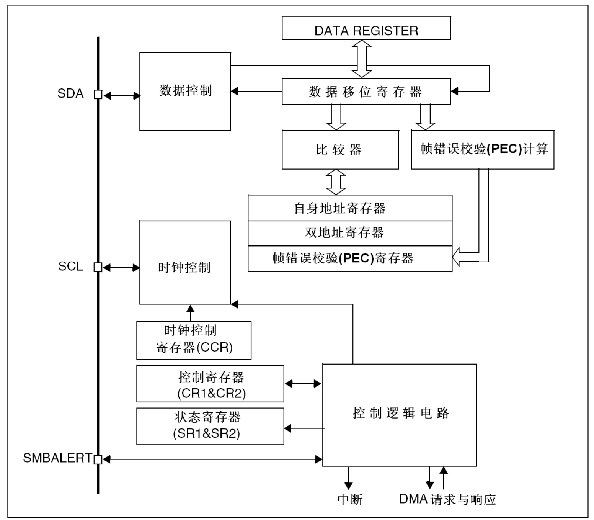

I2C的所有硬件架构都是根据图中左侧SCL线和SDA线展开的（其中的SMBA线用于SMBUS的警告信号，I2C通讯没有使用）。STM32芯片有多个I2C外设，咱们现在用的这款有2个I2C外设，它们的I2C通讯信号引出到不同的GPIO引脚上，使用时必须配置到这些指定的引脚。

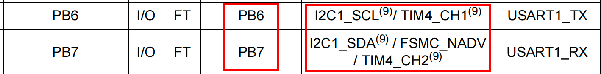

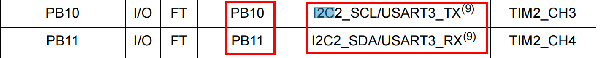


### 软件设计（寄存器）


#### main.h

```c
#include "Driver_USART.h"
#include "Inf_W24C02.h"

int main()
{
    Driver_USART1_Init();
    printf("尚硅谷 I2C 硬件 实验开始....\r\n");

    Inf_W24C02_Init();

    Inf_W24C02_WriteByte(0x00, 'x');
    Inf_W24C02_WriteByte(0x01, 'y');
    Inf_W24C02_WriteByte(0x02, 'z');
    uint8_t byte1 = Inf_W24C02_ReadByte(0x00);
    uint8_t byte2 = Inf_W24C02_ReadByte(0x01);
    uint8_t byte3 = Inf_W24C02_ReadByte(0x02);

    printf("%c\r\n", byte1);
    printf("%c\r\n", byte2);
    printf("%c\r\n", byte3);

    Inf_W24C02_WriteBytes(0x00, "123456", 6);

    uint8_t buff[100] = {0};
    Inf_W24C02_ReadBytes(0x00, buff, 6);
    printf("%s\r\n", buff);

    // 清零缓冲区
    memset(buff, 0, sizeof(buff));
    Inf_W24C02_WriteBytes(0x00, "0123456789abcdefghijk", 21);
    Inf_W24C02_ReadBytes(0x00, buff, 21);
    printf("%s\r\n", buff);
    while (1)
    {
    }
}
```


#### Driver_I2C2.h

```c
#ifndef __DRIVER_I2C2_H
#define __DRIVER_I2C2_H

#include "Delay.h"
#include "stm32f10x.h"
#include "Driver_USART.h"

#define ACK 0
#define NACK 1

#define OK 1
#define FAIL 0

void Driver_I2C2_Init(void);

uint8_t Driver_I2C2_Start(void);

void Driver_I2C2_Stop(void);

void Driver_I2C2_Ack(void);

void Driver_I2C2_NAck(void);

uint8_t Driver_I2C_SendAddr(uint8_t addr);

uint8_t Driver_I2C_SendByte(uint8_t byte);

uint8_t Driver_I2C_ReadByte(void);

#endif
```


#### Driver_I2C2.c

```c
#include "Driver_I2C2.h"
#include "Delay.h"

#define I2C_DELAY Delay_us(10)

/**
 * @description: 初始化
 * @return {*}
 */
void Driver_I2C2_Init(void)
{

    /* 1. 开启时钟 */
    /* 1.1 i2c硬件的时钟 */
    RCC->APB1ENR |= RCC_APB1ENR_I2C2EN;
    /* 1.2 GPIO时钟 */
    RCC->APB2ENR |= RCC_APB2ENR_IOPBEN;

    /* 2. 设置gpio的引脚的工作模式 */
    /*
        PB10->SCL
        PB11->SDA
            复用开漏输出: 既可以用于输出也可以输入. 外界要有上拉电阻.
                    用于输入的时候,最好先输出一个1,把线的控制权交给外界.

            MODE=11 CNF=11

     */
    GPIOB->CRH |= (GPIO_CRH_MODE10 | GPIO_CRH_MODE11 | GPIO_CRH_CNF10 | GPIO_CRH_CNF11);

    /* 3. 设置I2C2 */
    /* 3.1 配置硬件的工作模式  I2C  */
    I2C2->CR1 &= ~I2C_CR1_SMBUS;

    /* 3.2 配置给I2C设备提供的时钟的频率 36MHz*/
    I2C2->CR2 |= 36 << 0;

    /* 3.3 设置标准模式=0 or 快速模式=1 */
    I2C2->CCR &= ~I2C_CCR_FS;

    /* 3.3 配置I2C产生时钟的频率 100K or 400K
        Thigh=CCR * Tcplk1

        ccr = Thigh/=Tcplk1 = 5us / (1/36)us = 180

    */
    I2C2->CCR |= 180 << 0;

    /* 3.4 时钟信号的上升沿
          100KHz的时候要求最大上升沿不超过1us(手册)。
            时钟频率是36MHz则 写入：1 /（1/36） + 1 = 37
           其实就是计算的 最大上升沿时间/时钟周期 + 1

    */
    I2C2->TRISE |= 37;

    /* 3.5 使能I2C */
    I2C2->CR1 |= I2C_CR1_PE;
}

/**
 * @description: 起始信号
 * @return {*}
 */
uint8_t Driver_I2C2_Start(void)
{
    I2C2->CR1 |= I2C_CR1_START;

    uint16_t timeout = 0xffff;
    while (((I2C2->SR1 & I2C_SR1_SB) == 0) && timeout)
    {
        timeout--;
    }

    return timeout ? OK : FAIL;
}

/**
 * @description: 停止信号
 * @return {*}
 */
void Driver_I2C2_Stop(void)
{
    /* 产生终止条件 */
    I2C2->CR1 |= I2C_CR1_STOP;
}

/**
 * @description: 接收方产生应答信号
 */
void Driver_I2C2_Ack(void)
{
    /* 产生应答信号 */
    I2C2->CR1 |= I2C_CR1_ACK;
}

/**
 * @description: 接收方产生非应答信号
 */
void Driver_I2C2_NAck(void)
{
    I2C2->CR1 &= ~I2C_CR1_ACK;
}

/**
 * @description: 发送一个设备地址
 * @param {uint8_t} byte
 */
uint8_t Driver_I2C_SendAddr(uint8_t addr)
{
    // 把要发送的数据写入到数据寄存器
    I2C2->DR = addr;

    timeout = 0xffff;

    while (((I2C2->SR1 & I2C_SR1_ADDR) == 0) && timeout)
    {
        timeout--;
    }

    if (timeout)
    {
        I2C2->SR2;
    }

    return timeout ? OK : FAIL;
}

/**
 * @description: 发送一个字节的数据
 * @param {uint8_t} byte 要发送的字节
 */
uint8_t Driver_I2C_SendByte(uint8_t byte)
{
    uint16_t timeout = 0xffff;
    while (((I2C2->SR1 & I2C_SR1_TXE) == 0) && timeout)
    {
        timeout--;
    }
    // 把要发送的数据写入到数据寄存器
    I2C2->DR = byte;

    timeout = 0xffff;

    while (((I2C2->SR1 & I2C_SR1_BTF) == 0) && timeout)
    {
        timeout--;
    }
    return timeout ? OK : FAIL;
}

/**
 * @description: 读一个字节的数据
 * @param {uint8_t} byte 要发送的字节
 */
uint8_t Driver_I2C_ReadByte(void)
{
    uint16_t timeout = 0xffff;

    while (((I2C2->SR1 & I2C_SR1_RXNE) == 0) && timeout)
    {
        timeout--;
    }
    // 把数据寄存器的值返回
    uint8_t data = timeout ? I2C2->DR : 0;
    return data;
}
```


#### Inf_W24C02.h

```c
#ifndef __INF_W24C02_H
#define __INF_W24C02_H

#include "Driver_I2C2.h"
#include "string.h"

#define ADDR 0xA0
void Inf_W24C02_Init(void);
void Inf_W24C02_WriteByte(uint8_t innerAddr, uint8_t byte);

uint8_t Inf_W24C02_ReadByte(uint8_t innerAddr);

void Inf_W24C02_WriteBytes(uint8_t innerAddr, uint8_t *bytes, uint8_t len);

void Inf_W24C02_ReadBytes(uint8_t innerAddr, uint8_t *bytes, uint8_t len);

#endif
```


#### Inf_W24C02.c

```c
#include "Inf_W24C02.h"

void Inf_W24C02_Init(void)
{
    Driver_I2C2_Init();
}

void Inf_W24C02_WriteByte(uint8_t innerAddr, uint8_t byte)
{
    uint8_t ack;
    /* 1. 开始信号 */
    ack = Driver_I2C2_Start();
    // printf("start_ack=%d\r\n", ack);
    /* 2. 发送写地址 */
    ack = Driver_I2C_SendAddr(ADDR);
    // printf("addr_ack=%d\r\n", ack);
    /* 4. 发送内部地址 */
    ack = Driver_I2C_SendByte(innerAddr);
    // printf("inner_ack=%d\r\n", ack);
    /* 6. 发送具体数据 */
    ack = Driver_I2C_SendByte(byte);
    // printf("byte_ack=%d\r\n", ack);
    /* 8. 停止信号 */
    Driver_I2C2_Stop();

    Delay_ms(5);
}

uint8_t Inf_W24C02_ReadByte(uint8_t innerAddr)
{
    /* 1. 起始信号 */
    Driver_I2C2_Start();
    /* 2. 发送一个写地址   假写 */
    Driver_I2C_SendAddr(ADDR);

    /* 4. 发送内部地址 */
    Driver_I2C_SendByte(innerAddr);

    /* 6. 起始信号 */
    Driver_I2C2_Start();
    /* 7. 发送读地址  真读 */
    Driver_I2C_SendAddr(ADDR + 1);

    /* 10. 产生一个非应答信号 */
    Driver_I2C2_NAck();

    /* 11. 停止信号 */
    Driver_I2C2_Stop();

    /* 9. 读取一个字节 */
    uint8_t byte = Driver_I2C_ReadByte();

    return byte;
}

/**
 * @description: 页写入.一次写入多个字节
 * @param {uint8_t} innerAddr
 * @param {uint8_t} *bytes
 * @param {uint8_t} len
 * @return {*}
 */
void Inf_W24C02_WriteBytes(uint8_t innerAddr, uint8_t *bytes, uint8_t len)
{
    /* 1. 开始信号 */
    Driver_I2C2_Start();

    /* 2. 发送写地址 */
    Driver_I2C_SendAddr(ADDR);

    /* 4. 发送内部地址 */
    Driver_I2C_SendByte(innerAddr);

    for (uint8_t i = 0; i < len; i++)
    {
        /* 6. 发送具体数据 */
        Driver_I2C_SendByte(bytes[i]);
    }
    /* 8. 停止信号 */
    Driver_I2C2_Stop();

    Delay_ms(5);
}

/**
 * @description: 一次性读取多个字节的数据
 * @param {uint8_t} innerAddr 起始位置
 * @param {uint8_t} *bytes 存储读到的数据
 * @param {uint8_t} len 读取的字节数
 * @return {*}
 */
void Inf_W24C02_ReadBytes(uint8_t innerAddr, uint8_t *bytes, uint8_t len)
{
    /* 1. 起始信号 */
    Driver_I2C2_Start();

    /* 2. 发送一个写地址   假写 */
    Driver_I2C_SendAddr(ADDR);

    /* 4. 发送内部地址 */
    Driver_I2C_SendByte(innerAddr);

    /* 6. 起始信号 */
    Driver_I2C2_Start();

    /* 7. 发送读地址  真读 */
    Driver_I2C_SendAddr(ADDR + 1);
    for (uint8_t i = 0; i < len; i++)
    {
        /* 9. 读取一个字节 */
        if (i < len - 1)
        {
            Driver_I2C2_Ack();
        }
        else
        {
            Driver_I2C2_NAck();
/* 11. 停止信号 */
            Driver_I2C2_Stop();
        }
        bytes[i] = Driver_I2C_ReadByte();
    }
    
}
```


### 软件设计（HAL库）


#### STM32CubeMx中配置

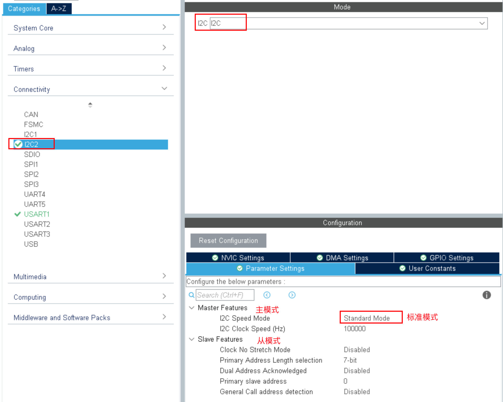


#### main.c

```c
int main(void)
{
   
    HAL_Init();
    SystemClock_Config();
    MX_GPIO_Init();
    MX_USART1_UART_Init();
 
    Inf_W24C02_Init();

    Inf_W24C02_WriteByte(0x00, 'a');
    uint8_t c = Inf_W24C02_ReadByte(0x00);
    printf("c=%c\r\n", c);

    uint8_t wbuff[10] = {'h', 'e', 'l', 'l', 'o'};
    Inf_W24C02_WriteBytes(0x01, wbuff, 5);
    printf("c=%c\r\n", Inf_W24C02_ReadByte(0x01));
    printf("c=%c\r\n", Inf_W24C02_ReadByte(0x02));
    printf("c=%c\r\n", Inf_W24C02_ReadByte(0x03));
    uint8_t buff[10] = {0};
    Inf_W24C02_ReadBytes(0x00, buff, 6);

    printf("buff=%s\r\n", buff);

    while (1)
    {
    }
}
```


#### Inf_W24C02.h

```c
#ifndef __INF_W24C02_H
#define __INF_W24C02_H

#include "string.h"
#include "i2c.h"

#define ADDR 0xA0
void Inf_W24C02_Init(void);
void Inf_W24C02_WriteByte(uint8_t innerAddr, uint8_t byte);

uint8_t Inf_W24C02_ReadByte(uint8_t innerAddr);

void Inf_W24C02_WriteBytes(uint8_t innerAddr, uint8_t *bytes, uint8_t len);

void Inf_W24C02_ReadBytes(uint8_t innerAddr, uint8_t *bytes, uint8_t len);

#endif
```


#### Inf_W24C02.c

```c
#include "Inf_W24C02.h"
#include "stdio.h"

void Inf_W24C02_Init(void)
{
    MX_I2C2_Init();
}

void Inf_W24C02_WriteByte(uint8_t innerAddr, uint8_t byte)
{
    HAL_I2C_Mem_Write(&hi2c2, ADDR, innerAddr, I2C_MEMADD_SIZE_8BIT, &byte, 1, 2000);

    HAL_Delay(5);
}

uint8_t Inf_W24C02_ReadByte(uint8_t innerAddr)
{
    uint8_t byte;
    HAL_I2C_Mem_Read(&hi2c2, ADDR + 1, innerAddr, I2C_MEMADD_SIZE_8BIT, &byte, 1, 2000);
    return byte;
}

/**
 * @description: 页写入.一次写入多个字节
 * @param {uint8_t} innerAddr
 * @param {uint8_t} *bytes
 * @param {uint8_t} len
 * @return {*}
 */
void Inf_W24C02_WriteBytes(uint8_t innerAddr, uint8_t *bytes, uint8_t len)
{
    HAL_I2C_Mem_Write(&hi2c2, ADDR, innerAddr, I2C_MEMADD_SIZE_8BIT, bytes, len, 2000);
    HAL_Delay(5);
}

/**
 * @description: 一次性读取多个字节的数据
 * @param {uint8_t} innerAddr 起始位置
 * @param {uint8_t} *bytes 存储读到的数据
 * @param {uint8_t} len 读取的字节数
 * @return {*}
 */
void Inf_W24C02_ReadBytes(uint8_t innerAddr, uint8_t *bytes, uint8_t len)
{
    HAL_I2C_Mem_Read(&hi2c2, ADDR + 1, innerAddr, I2C_MEMADD_SIZE_8BIT, bytes, len, 2000);
}
```

