# 定时器


## 系统定时器


### 系统定时器简介

系统定时器（SysTick系统）是属于CM3内核，内嵌在NVIC中。

系统定时器是一个24bit的向下递减的计数器，计数器每计数一次的时间为1 / SYSCLK，一般我们设置系统时钟SYSCLK（与AHB相同）等于72M。当重装载数值寄存器的值递减到0的时候，系统定时器就产生一次中断，以此循环往复。

SysTick定时器能产生中断，CM3为它专门开出一个异常类型，并且在向量表中有它的一席之地。它使操作系统和其它系统软件在CM3器件间的移植变得简单多了，因为在所有CM3产品间SysTick的处理方式都是相同的。

系统定时器一般用于操作系统，用于产生时基，维持操作系统的心跳。SysTick定时器除了能服务于操作系统之外，还能用于其它目的：如作为一个闹铃，用于测量时间等。

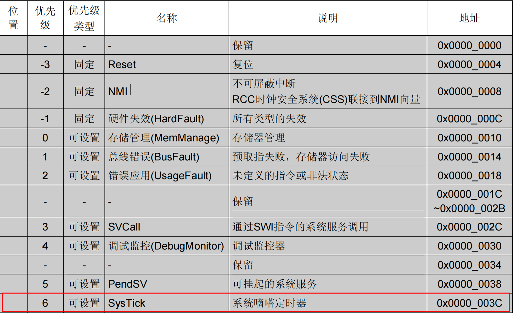

参考手册


### 与SysTick相关的寄存器

有4个寄存器与SysTick有关。在core_cm3.h中可以看到有个类型定义的就是SysTick。

```c
typedef struct
{
  __IO uint32_t CTRL;                         /*!< Offset: 0x00  SysTick Control and Status Register */
  __IO uint32_t LOAD;                         /*!< Offset: 0x04  SysTick Reload Value Register       */
  __IO uint32_t VAL;                          /*!< Offset: 0x08  SysTick Current Value Register      */
  __I  uint32_t CALIB;                        /*!< Offset: 0x0C  SysTick Calibration Register        */
} SysTick_Type;
```


##### CTRL 

SysTick控制和状态寄存器。

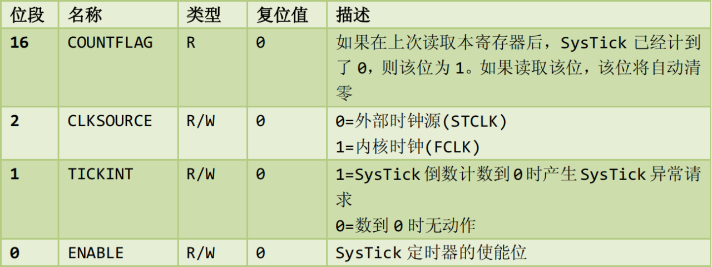

说明:关于CLKSOURCE位,当0时,时钟频率是AHB/8, 当1时,时钟频率是AHB


##### LOAD

SysTick重装载寄存器。


##### VAL

SysTick当前数值寄存器。

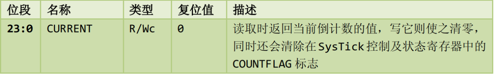


##### CALIB

SysTick 校准数值寄存器。很少用到。


### 系统中断案例：LED灯闪烁


#### 需求描述

利用系统定时器的中断，每隔1s 让LED1灯闪烁一次。


#### 硬件电路设计

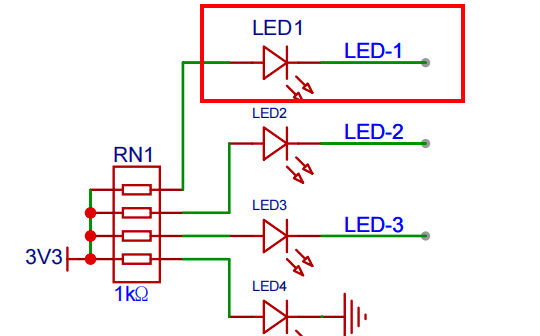

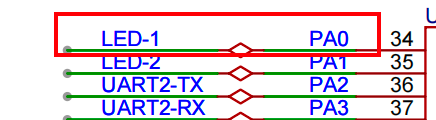


#### 软件设计（寄存器）


##### main.c

```c
#include "Driver_SysTick.h"
#include "Driver_LED.h"

int main()
{
    Driver_LED_Init();
    Driver_SysTick_Init();

    while (1)
    {
       
    }
}
```


##### Driver_SysTick.h

```c
#ifndef __DRIVER_SYSTICK_H

#define __DRIVER_SYSTICK_H

#include "stm32f10x.h"
#include "Driver_LED.h"

void Driver_SysTick_Init(void);

#endif
```


##### Driver_SysTick.c

```c
#include "Driver_SysTick.h"

void Driver_SysTick_Init(void)
{
    /* 1. 配置时钟源  1=AHB(72MHz) 0=AHB/8 */
    SysTick->CTRL |= SysTick_CTRL_CLKSOURCE;
    /* 2. 使能中断 */
    SysTick->CTRL |= SysTick_CTRL_TICKINT;
    /* 3. 定时器 1ms 产生一次中断 */
    SysTick->LOAD = 72000 - 1;
    /* 4. 使能定时器 */
    SysTick->CTRL |= SysTick_CTRL_ENABLE;

}

// 每1ms产生一次中断
uint16_t count = 0;
void SysTick_Handler(void)
{
    count++;
    if (count == 1000)
    {
        count = 0;
        Drviver_LED_Toggle(LED_1);
    }
}
```


##### Driver_LED.h

```c
#ifndef __DRIVER_LED_H
#define __DRIVER_LED_H

#include "stm32f10x.h"

#define LED_1 GPIO_ODR_ODR0
#define LED_2 GPIO_ODR_ODR1
#define LED_3 GPIO_ODR_ODR8

void Driver_LED_Init(void);

void Drviver_LED_On(uint32_t led);

void Drviver_LED_Off(uint32_t led);

void Drviver_LED_Toggle(uint32_t led);

void Drviver_LED_OnAll(uint32_t leds[], uint8_t size);

void Drviver_LED_OffAll(uint32_t leds[], uint8_t size);

#endif
```


##### Driver_LED.c

```c
#include "Driver_LED.h"

/**
 * @description: 对LED进行初始化
 */
void Driver_LED_Init(void)
{
    /* 1. 打开GPIOA的时钟 */
    RCC->APB2ENR |= RCC_APB2ENR_IOPAEN;

    /* 2. 给用到的端口的所有 PIN (PA0 PA1 PA8) 设置工作模式: 通用推挽输出 MODE:11  CNF:00 */
    GPIOA->CRL |= (GPIO_CRL_MODE0 | GPIO_CRL_MODE1);
    GPIOA->CRL &= ~(GPIO_CRL_CNF0 | GPIO_CRL_CNF1);

    GPIOA->CRH |= GPIO_CRH_MODE8;
    GPIOA->CRH &= ~GPIO_CRH_CNF8;

    /* 3. 关闭所有灯  */
    Drviver_LED_Off(LED_1);
    Drviver_LED_Off(LED_2);
    Drviver_LED_Off(LED_3);
}

/**
 * @description: 点亮指定的LED
 * @param {uint32_t} led 要点亮的LED
 */
void Drviver_LED_On(uint32_t led)
{
    GPIOA->ODR &= ~led;
}

/**
 * @description: 关闭指定的LED
 * @param {uint32_t} led 要关闭的LED
 */
void Drviver_LED_Off(uint32_t led)
{
    GPIOA->ODR |= led;
}

/**
 * @description: 翻转LED的状态
 * @param {uint32_t} led 要翻转的LED
 */
void Drviver_LED_Toggle(uint32_t led)
{
    /* 1. 读取引脚的电平,如果是1(目前是关闭), 打开, 否则就关闭 */
    if ((GPIOA->IDR & led) == 0)
    {
        Drviver_LED_Off(led);
    }
    else
    {
        Drviver_LED_On(led);
    }
}

/**
 * @description: 打开数组中所有的灯
 * @param {uint32_t} leds 所有灯
 * @param {uint8_t} size 灯的个数
 */
void Drviver_LED_OnAll(uint32_t leds[], uint8_t size)
{

    for (uint8_t i = 0; i < size; i++)
    {
        Drviver_LED_On(leds[i]);
    }
}

/**
 * @description: 关闭数组中所有的灯
 * @param {uint32_t} leds 所有灯
 * @param {uint8_t} size 灯的个数
 */
void Drviver_LED_OffAll(uint32_t leds[], uint8_t size)
{
    for (uint8_t i = 0; i < size; i++)
    {
        Drviver_LED_Off(leds[i]);
    }
}
```


#### 软件设计（HAL库）


##### STM32CubeMX设置

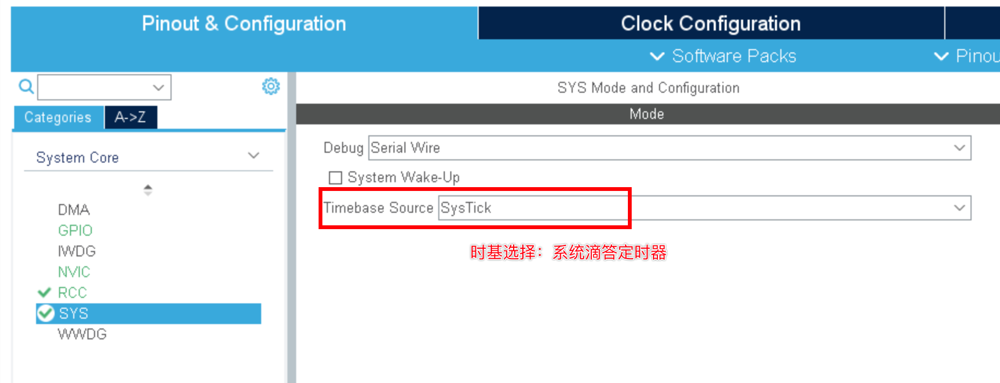


##### SysTick初始化代码解读

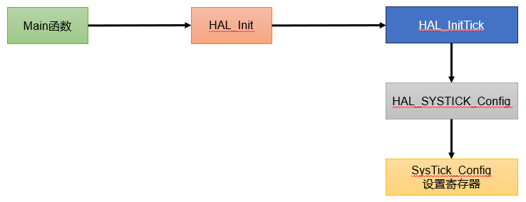

在HAL库初始化的时候，会初始化SysTick定时器。

```c
HAL_StatusTypeDef HAL_Init(void)
{
    /* Set Interrupt Group Priority */
    HAL_NVIC_SetPriorityGrouping(NVIC_PRIORITYGROUP_4);

    // 初始化系统滴答定时器：参数是滴答定时器中断优先级，默认是15
    HAL_InitTick(TICK_INT_PRIORITY);

    /* Init the low level hardware */
    HAL_MspInit();

    /* Return function status */
    return HAL_OK;
}


__weak HAL_StatusTypeDef HAL_InitTick(uint32_t TickPriority)
{
    /* Configure the SysTick to have interrupt in 1ms time basis*/
    // 配置滴答定时器：每1ms产生一次中断
    // SystemCoreClock = 72MHz
    // uwTickFreq = 1
    // 参数 = 72000 就是重转载寄存器的值。这个值减到0产生一次中断
    // 时钟频率是72MHz，计数72次是1us，所以计数72000次就是1ms
    // 所以1ms会产生一次中断
    if (HAL_SYSTICK_Config(SystemCoreClock / (1000U / uwTickFreq)) > 0U)
    {
        return HAL_ERROR;
    }

    /* Configure the SysTick IRQ priority */
    if (TickPriority < (1UL << __NVIC_PRIO_BITS))
    {
       // 设置SysTick的优先级：抢占优先级15（最低） 和响应优先级0
        HAL_NVIC_SetPriority(SysTick_IRQn, TickPriority, 0U);
        uwTickPrio = TickPriority;
    }
    else
    {
        return HAL_ERROR;
    }

    /* Return function status */
    return HAL_OK;
}


uint32_t HAL_SYSTICK_Config(uint32_t TicksNumb)
{
   return SysTick_Config(TicksNumb);
}


__STATIC_INLINE uint32_t SysTick_Config(uint32_t ticks)
{
  if ((ticks - 1UL) > SysTick_LOAD_RELOAD_Msk)
  {
    return (1UL);                                                   
  }
  // 重装载寄存器的值。计数器的初始值
  SysTick->LOAD  = (uint32_t)(ticks - 1UL); 
  // 中断优先级
  NVIC_SetPriority (SysTick_IRQn, (1UL << __NVIC_PRIO_BITS) - 1UL);
  // 设置当前数值寄存器的值 
  SysTick->VAL   = 0UL;
  // 1. 设置时钟源为内部时钟源
  // 2. 当计数至0时，产生异常
  // 3. 使能SysTick计数器
  SysTick->CTRL  = SysTick_CTRL_CLKSOURCE_Msk |
                   SysTick_CTRL_TICKINT_Msk   |
                   SysTick_CTRL_ENABLE_Msk;                         
  return (0UL);                                                     
}
```

注意：


###### 前面的这些参数都可以根据需要进行调整。


###### 一般建议把SysTick定时器的抢占优先级设置为最高（数字越小，优先级越高）。否则在其他中断中使用延时函数的时候会阻塞卡死。

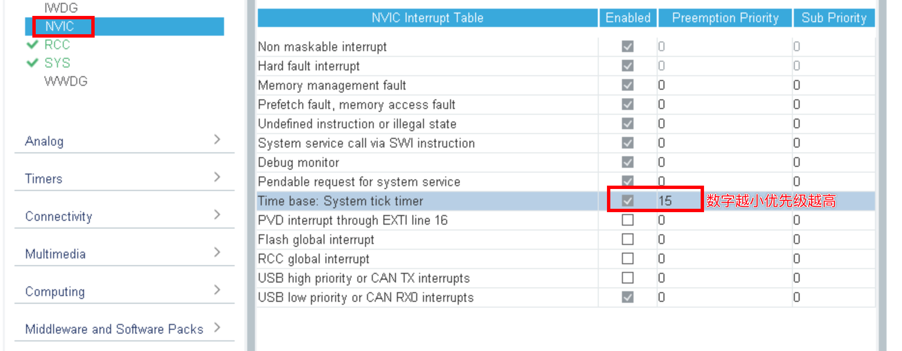


##### 系统滴答定时器中断回调函数解读

在stm32f1xx_it.c中已经定义了中断服务函数。

```c
void SysTick_Handler(void)
{
    /* USER CODE BEGIN SysTick_IRQn 0 */

    /* USER CODE END SysTick_IRQn 0 */
    HAL_IncTick();
    /* USER CODE BEGIN SysTick_IRQn 1 */

    /* USER CODE END SysTick_IRQn 1 */
}
```

HAL定义的弱中断回调函数，我们只需要重新实现这个就可以了。

uwTick是一个全局变量，每1ms中断一次，每产生一次中断就加1，所以这个变量表示的计时的ms值。

```c
__weak void HAL_IncTick(void)
{
    uwTick += uwTickFreq;
}
```


##### main.c

在main.c中添加我们自己的实现。

```c
void HAL_IncTick(void)
{
    uwTick += uwTickFreq;
    if (uwTick % 1000 == 0)
    { // 产生了1s的计时
        // 翻转LED灯
        HAL_GPIO_TogglePin(GPIOA, GPIO_PIN_0);
    }
}
```


### 延时函数工具类（寄存器）


#### delay.h

```c
#ifndef __delay_h
#define __delay_h
#include "stm32f10x.h"                  // Device header

void Delay_us(uint16_t us);
void Delay_ms(uint16_t ms);
void Delay_s(uint16_t s);

#endif
```


#### delay.c

```c
#include "delay.h" // Device header

void Delay_us(uint16_t us)
{
    /* 设计定时器重装值 */
    SysTick->LOAD = 72 * us;
    /* 清除当前计数值 */
    SysTick->VAL = 0;
    /*设置内部时钟源（2位->1）,不需要中断（1位->0），并启动定时器(0位->1)*/
    SysTick->CTRL = 0x5;
    /*等待计数到0， 如果计数到0则16位会置为1*/
    while (!(SysTick->CTRL & SysTick_CTRL_COUNTFLAG));
    /* 关闭定时器 */
    SysTick->CTRL &= ~SysTick_CTRL_ENABLE; 
}

void Delay_ms(uint16_t ms)
{
    while (ms--)
    {
        Delay_us(1000);
    }
}

void Delay_s(uint16_t s)
{
    while (s--)
    {
        Delay_ms(1000);
    }
}
```


## 基本定时器

定时器是STM32中一个非常强大的外设，功能强大，用途很广。STM32F103系列提供了8个定时器：2个基本定时器(TIM6,7)，4个通用定时器(TIM2-5)，2个高级定时器(TIM1和TIM8)。

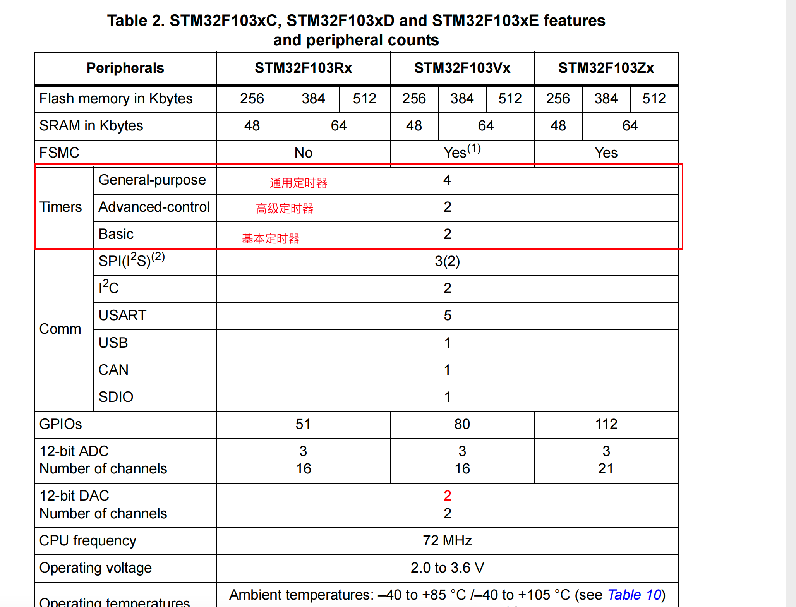

TIM6和TIM7是基本定时器。

TM2-TIM5是通用定时器。

TM1和TM8是高级定时器。


### 基本定时器介绍

基本定时器TIM6和TIM7各包含一个16位自动装载计数器，由各自的可编程预分频器驱动。

这2个定时器是互相独立的，不共享任何资源。

这个2个基本定时器只能向上计数，由于没有外部IO，所以只能计时，不能对外部脉冲进行计数。

功能：定时中断，主模式，触发DAC。


### 基本定时器案例：LED灯闪烁


#### 需求描述

利用基本定时器定时功能，实现LED_2亮->1s->LED_2灭 ->1s …。


#### 硬件电路设计

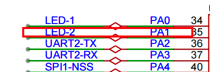

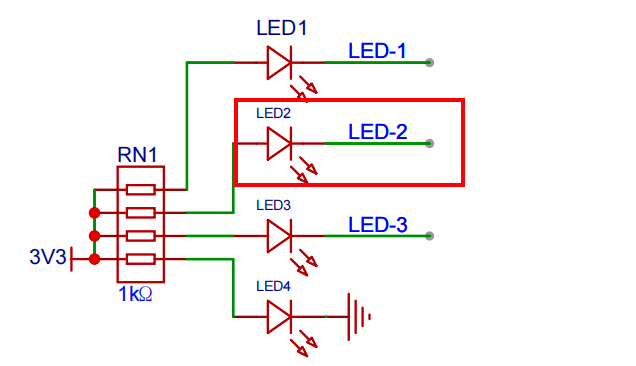


#### 软件设计（寄存器）


##### main.c

```c
#include "stm32f10x.h" // Device header
#include "led.h"

#include "usart.h"
#include "timer6.h"
int main(void)
{
    LED_Init();
    usart1_init();
    printf("尚硅谷基本定时器实验....\r\n");
    TIM6_Init();

    while (1)
    {
    }
}
```


##### Driver_TIM6.h

```c
#ifndef __DRIVER_TIM6_H
#define __DRIVER_TIM6_H

#include "stm32f10x.h"
#include "Driver_LED.h"
#include "Driver_USART.h"

void Driver_TIM6_Init(void);

#endif
```


##### Driver_TIM6.c

```c
#include "Driver_TIM6.h"

/**
 * @description: 给定时器6进行初始化
 * @return {*}
 */
void Driver_TIM6_Init(void)
{
    /* 1. 给定时器6开启时钟*/
    RCC->APB1ENR |= RCC_APB1ENR_TIM6EN;

    /* 2. 设置预分频值: 分频值7199表示7200分频。分频后频率10K，周期100us */
    TIM6->PSC = 7200 - 1;

    /*
    3. 设置自动重转载寄存器的值，决定中断发生的频率。
        假设设置为9999，表示计数器计数10000次发生一次中断。
        计数一次100us，10000次1000000us，正好1s
    */
    TIM6->ARR = 10000 - 1;

    /* 4. 使能更新中断 */
    TIM6->DIER |= TIM_DIER_UIE;

    /* NVIC配置 */
    /* 5. 设置中断优先级分组 */
    NVIC_SetPriorityGrouping(3);
    /* 6. 设置中断优先级 */
    NVIC_SetPriority(TIM6_IRQn, 1);

    /* 7. 使能定时器6的中断 */
    NVIC_EnableIRQ(TIM6_IRQn);

    /* 8. 使能计数器 */
    TIM6->CR1 |= TIM_CR1_CEN;
}

/**
 * @description: TIM6的中断服务函数
 * @return {*}
 */
void TIM6_IRQHandler(void)
{
    TIM6->SR &= ~TIM_SR_UIF;
    Drviver_LED_Toggle(LED_1);
    printf("1s\r\n");
}
```


#### 软件设计（HAL库）


###### STM32CubeMX配置

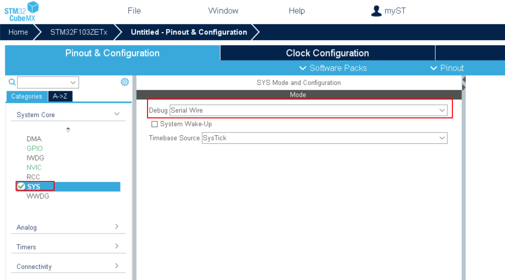

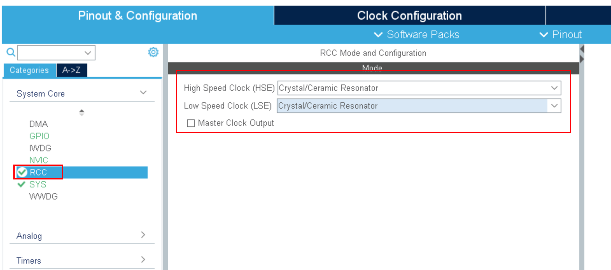

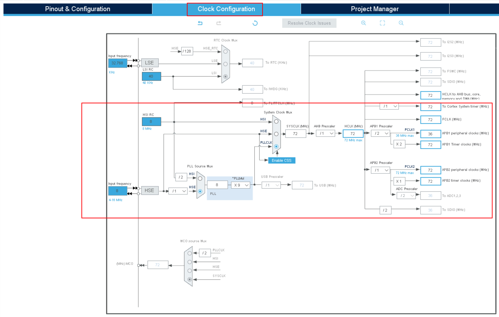

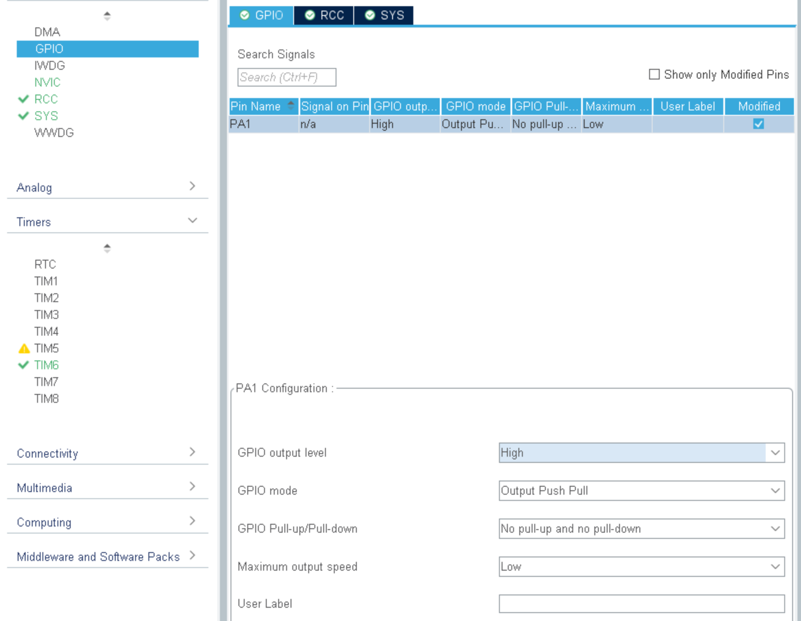

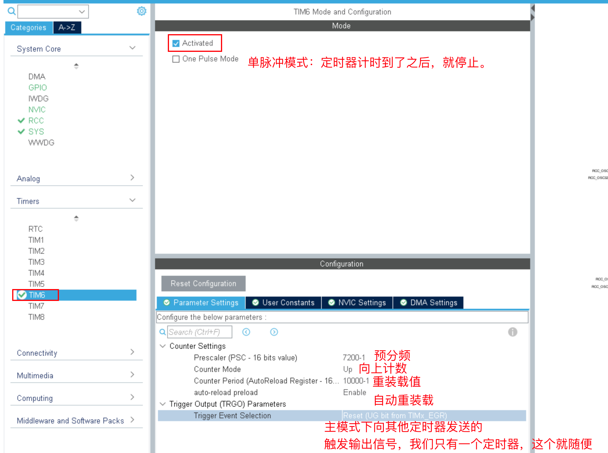


###### 生成的定时器相关代码介绍（tim.c）

```c
TIM_HandleTypeDef htim6;

/* TIM6 init function */
void MX_TIM6_Init(void)
{
    TIM_MasterConfigTypeDef sMasterConfig = {0};
    htim6.Instance = TIM6;
    htim6.Init.Prescaler = 7200 - 1;
    htim6.Init.CounterMode = TIM_COUNTERMODE_UP;
    htim6.Init.Period = 10000 - 1;
    htim6.Init.AutoReloadPreload = TIM_AUTORELOAD_PRELOAD_ENABLE;
    if (HAL_TIM_Base_Init(&htim6) != HAL_OK)
    {
        Error_Handler();
    }
    sMasterConfig.MasterOutputTrigger = TIM_TRGO_RESET;
    sMasterConfig.MasterSlaveMode = TIM_MASTERSLAVEMODE_DISABLE;
    if (HAL_TIMEx_MasterConfigSynchronization(&htim6, &sMasterConfig) != HAL_OK)
    {
        Error_Handler();
    }
}

void HAL_TIM_Base_MspInit(TIM_HandleTypeDef *tim_baseHandle)
{

    if (tim_baseHandle->Instance == TIM6)
    {
        __HAL_RCC_TIM6_CLK_ENABLE();

        /* TIM6 interrupt Init */
        HAL_NVIC_SetPriority(TIM6_IRQn, 0, 0);
        HAL_NVIC_EnableIRQ(TIM6_IRQn);
    }
}
```


###### 添加定时器6的中断回调函数 

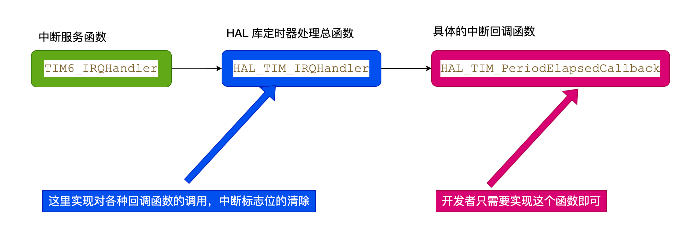

在tim.c中添加HAL库的定时器溢出中断回调函数。（定时器的回调函数比较多，这次我们只使用到了溢出中断回调函数）。

```c
/* USER CODE BEGIN 1 */
void HAL_TIM_PeriodElapsedCallback(TIM_HandleTypeDef *htim)
{
    // 定时器6产生中断。任何一个定时器产生中断都会进入到这个方法中，所以需要判断下定时器实例
    if (htim->Instance == TIM6)
    {
        // 翻转LEDB
        HAL_GPIO_TogglePin(GPIOA, GPIO_PIN_1);
    }
}
/* USER CODE END 1 */
```


###### main主函数

```c
int main(void)
{
    HAL_Init();
    SystemClock_Config();
    MX_GPIO_Init();
    MX_TIM6_Init();
    // 启动定时器6
    HAL_TIM_Base_Start_IT(&htim6);
    while (1)
    {
    }
}
```


## 通用定时器


### 通用定时器介绍

通用定时器有4个分别是：TIM2、TIM3、TIM4、TIM5。它们拥有基本定时器所有功能。并增加如下功能：


###### 多种时钟源。


###### 向上计数（加），向下计数（减），向上/向下（先加后减）。当然我们使用的时候更喜欢向上计数。


###### 输入捕获。


###### 输出比较。


###### PWM生成。


###### 支持针对定位的增量（正交）编码器和霍尔传感器电路。


### 通用定时器案例1：LED呼吸灯——PWM脉冲

使用通用定时器的输出比较功能。


#### 需求描述

输出占空比可调的PWM波形，作用到二极管，使二极管（LED2）呈现呼吸灯的效果。

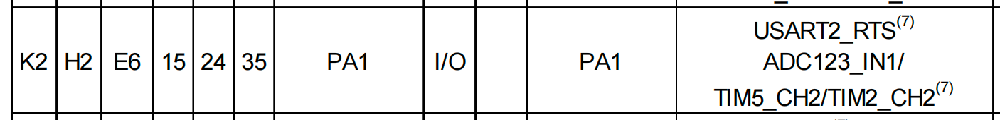

PA1复用的是TIM5_CH2和TIM2_ CH2，我们选择TIM5_CH2。


#### 如何生成PWM


##### PWM介绍


##### 定时器的输出比较功能


#### 硬件电路设计

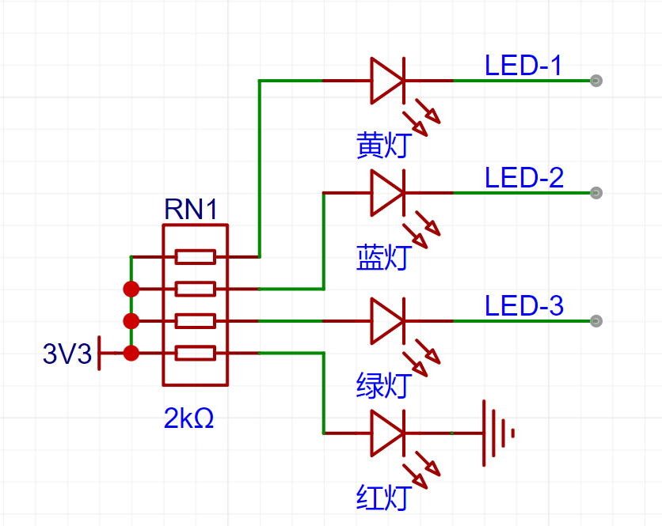

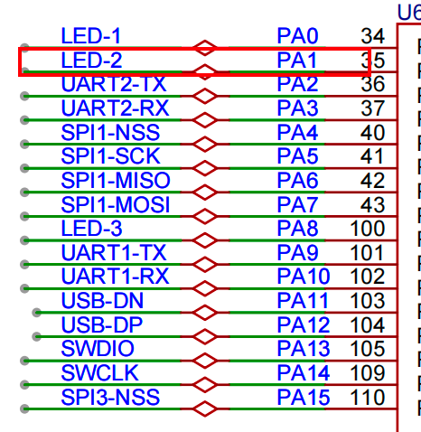


#### 软件设计（寄存器）


##### Driver_TIM5.h

```c
#ifndef __DRIVER_TIM5_H
#define __DRIVER_TIM5_H
#include "stm32f10x.h"

void Driver_TIM5_Init(void);

void Driver_TIM5_Start(void);

void Driver_TIM5_Stop(void);

void Driver_TIM5_SetDutyCycle(uint8_t dutyCycle);

#endif
```


##### Driver_TIM5.c

```c
#include "Driver_TIM5.h"

void Driver_TIM5_Init(void)
{
    /* 1.  开启时钟*/
    /* 1.1 定时器5的时钟 */
    RCC->APB1ENR |= RCC_APB1ENR_TIM5EN;
    /* 1.2 GPIO的时钟 PA */
    RCC->APB2ENR |= RCC_APB2ENR_IOPAEN;

    /* 2. 设置GPIO的复用推挽输出 PA1 CNF=10 MODE=11*/
    GPIOA->CRL |= (GPIO_CRL_CNF1_1 | GPIO_CRL_MODE1);
    GPIOA->CRL &= ~GPIO_CRL_CNF1_0;

    /* 3. 定时器配置 */
    /* 3.1 预分频器的配置 */
    TIM5->PSC = 7200 - 1;
    /* 3.2 自动重装载寄存器的配置 */
    TIM5->ARR = 100 - 1;
    /* 3.3 计数器的计数方向 0=向上 1=向下*/
    TIM5->CR1 &= ~TIM_CR1_DIR;
    /* 3.4 配置通道2的捕获比较寄存器 */
    TIM5->CCR2 = 97;
    /* 3.5 把通道2配置为输出  CCMR1_CC2S=00 */
    TIM5->CCMR1 &= ~TIM_CCMR1_CC2S;
    /* 3.6 配置通道的输出比较模式 CCMR1_OC2M=110*/
    TIM5->CCMR1 |= TIM_CCMR1_OC2M_2;
    TIM5->CCMR1 |= TIM_CCMR1_OC2M_1;
    TIM5->CCMR1 &= ~TIM_CCMR1_OC2M_0;
    /* 3.7 使能通道2  CCER_CC2E=1 */
    TIM5->CCER |= TIM_CCER_CC2E;

    /* 3.8 设置通道的极性 0=高电平有效  1=低电平有效 */
    TIM5->CCER &= ~TIM_CCER_CC2P;
}

void Driver_TIM5_Start(void)
{
    /* 使能计数器 */
    TIM5->CR1 |= TIM_CR1_CEN;
}

void Driver_TIM5_Stop(void)
{
    /* 失能计数器 */
    TIM5->CR1 &= ~TIM_CR1_CEN;
}

void Driver_TIM5_SetDutyCycle(uint8_t dutyCycle)
{
    TIM5->CCR2 = dutyCycle;
}
```


##### Driver_LED.h

```c
#ifndef __DRIVER_LED_H
#define __DRIVER_LED_H

#include "stm32f10x.h"

#define LED_1 GPIO_ODR_ODR0
#define LED_2 GPIO_ODR_ODR1
#define LED_3 GPIO_ODR_ODR8

void Driver_LED_Init(void);

void Drviver_LED_On(uint32_t led);

void Drviver_LED_Off(uint32_t led);

void Drviver_LED_Toggle(uint32_t led);

void Drviver_LED_OnAll(uint32_t leds[], uint8_t size);

void Drviver_LED_OffAll(uint32_t leds[], uint8_t size);

#endif
```


##### Driver_LED.c

```c
#include "Driver_LED.h"

/**
 * @description: 对LED进行初始化
 */
void Driver_LED_Init(void)
{
    /* 1. 打开GPIOA的时钟 */
    RCC->APB2ENR |= RCC_APB2ENR_IOPAEN;

    /* 2. 给用到的端口的所有 PIN (PA0 PA1 PA8) 设置工作模式: 通用推挽输出 MODE:11  CNF:00 */
    GPIOA->CRL |= (GPIO_CRL_MODE0 | GPIO_CRL_MODE1);
    GPIOA->CRL &= ~(GPIO_CRL_CNF0 | GPIO_CRL_CNF1);

    GPIOA->CRH |= GPIO_CRH_MODE8;
    GPIOA->CRH &= ~GPIO_CRH_CNF8;

    /* 3. 关闭所有灯  */
    Drviver_LED_Off(LED_1);
    Drviver_LED_Off(LED_2);
    Drviver_LED_Off(LED_3);
}

/**
 * @description: 点亮指定的LED
 * @param {uint32_t} led 要点亮的LED
 */
void Drviver_LED_On(uint32_t led)
{
    GPIOA->ODR &= ~led;
}

/**
 * @description: 关闭指定的LED
 * @param {uint32_t} led 要关闭的LED
 */
void Drviver_LED_Off(uint32_t led)
{
    GPIOA->ODR |= led;
}

/**
 * @description: 翻转LED的状态
 * @param {uint32_t} led 要翻转的LED
 */
void Drviver_LED_Toggle(uint32_t led)
{
    /* 1. 读取引脚的电平,如果是1(目前是关闭), 打开, 否则就关闭 */
    if ((GPIOA->IDR & led) == 0)
    {
        Drviver_LED_Off(led);
    }
    else
    {
        Drviver_LED_On(led);
    }
}

/**
 * @description: 打开数组中所有的灯
 * @param {uint32_t} leds 所有灯
 * @param {uint8_t} size 灯的个数
 */
void Drviver_LED_OnAll(uint32_t leds[], uint8_t size)
{

    for (uint8_t i = 0; i < size; i++)
    {
        Drviver_LED_On(leds[i]);
    }
}

/**
 * @description: 关闭数组中所有的灯
 * @param {uint32_t} leds 所有灯
 * @param {uint8_t} size 灯的个数
 */
void Drviver_LED_OffAll(uint32_t leds[], uint8_t size)
{
    for (uint8_t i = 0; i < size; i++)
    {
        Drviver_LED_Off(leds[i]);
    }
}
```


##### main.c

```c
#include "Driver_USART.h"

#include "Delay.h"
#include "Driver_SysTick.h"
#include "Driver_LED.h"
#include "Driver_TIM5.h"

int main()
{
    Driver_USART1_Init();
    printf("系统定时器实验开始...\r\n");

    //Driver_LED_Init();

    Driver_TIM5_Init();

    Driver_TIM5_Start();

    uint8_t dutyCycle = 0;
    uint8_t dir = 0; // 变大

    Driver_TIM5_SetDutyCycle(dutyCycle);

    while (1)
    {
        if (dir == 0)
        {
            dutyCycle += 1;
            if (dutyCycle >= 99)
            {
                dir = 1;
            }
        }
        else
        {
            dutyCycle -= 1;
            if (dutyCycle <= 1)
            {
                dir = 0;
            }
        }

        Driver_TIM5_SetDutyCycle(dutyCycle);
        Delay_ms(10);
    }
}
```


#### 软件设计（HAL库）


##### STM32CubeMX配置

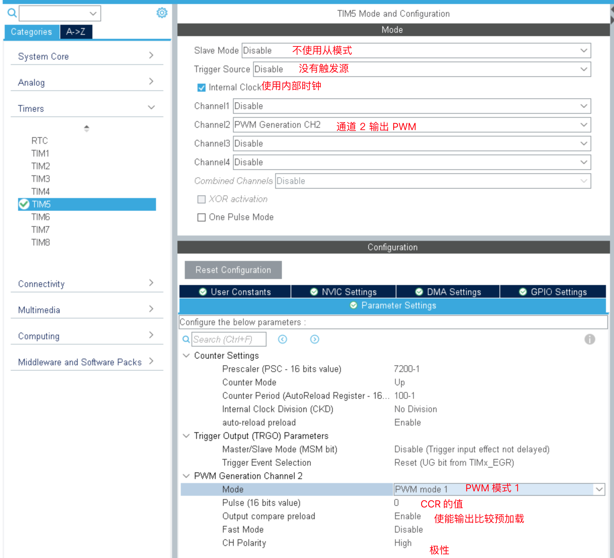


##### 定时器配置代码展示（tim.c）

```c
TIM_HandleTypeDef htim5;

/* TIM5 init function */
void MX_TIM5_Init(void)
{

    /* USER CODE BEGIN TIM5_Init 0 */

    /* USER CODE END TIM5_Init 0 */

    TIM_ClockConfigTypeDef sClockSourceConfig = {0};
    TIM_MasterConfigTypeDef sMasterConfig = {0};
    TIM_OC_InitTypeDef sConfigOC = {0};

    /* USER CODE BEGIN TIM5_Init 1 */

    /* USER CODE END TIM5_Init 1 */
    htim5.Instance = TIM5;
    htim5.Init.Prescaler = 7200 - 1;
    htim5.Init.CounterMode = TIM_COUNTERMODE_UP;
    htim5.Init.Period = 100 - 1;
    htim5.Init.ClockDivision = TIM_CLOCKDIVISION_DIV1;
    htim5.Init.AutoReloadPreload = TIM_AUTORELOAD_PRELOAD_ENABLE;
    if (HAL_TIM_Base_Init(&htim5) != HAL_OK)
    {
        Error_Handler();
    }
    sClockSourceConfig.ClockSource = TIM_CLOCKSOURCE_INTERNAL;
    if (HAL_TIM_ConfigClockSource(&htim5, &sClockSourceConfig) != HAL_OK)
    {
        Error_Handler();
    }
    if (HAL_TIM_PWM_Init(&htim5) != HAL_OK)
    {
        Error_Handler();
    }
    sMasterConfig.MasterOutputTrigger = TIM_TRGO_RESET;
    sMasterConfig.MasterSlaveMode = TIM_MASTERSLAVEMODE_DISABLE;
    if (HAL_TIMEx_MasterConfigSynchronization(&htim5, &sMasterConfig) != HAL_OK)
    {
        Error_Handler();
    }
    sConfigOC.OCMode = TIM_OCMODE_PWM1;
    sConfigOC.Pulse = 0;
    sConfigOC.OCPolarity = TIM_OCPOLARITY_HIGH;
    sConfigOC.OCFastMode = TIM_OCFAST_DISABLE;
    if (HAL_TIM_PWM_ConfigChannel(&htim5, &sConfigOC, TIM_CHANNEL_2) != HAL_OK)
    {
        Error_Handler();
    }
    /* USER CODE BEGIN TIM5_Init 2 */

    /* USER CODE END TIM5_Init 2 */
    HAL_TIM_MspPostInit(&htim5);
}

void HAL_TIM_Base_MspInit(TIM_HandleTypeDef *tim_baseHandle)
{

    if (tim_baseHandle->Instance == TIM5)
    {
        /* USER CODE BEGIN TIM5_MspInit 0 */

        /* USER CODE END TIM5_MspInit 0 */
        /* TIM5 clock enable */
        __HAL_RCC_TIM5_CLK_ENABLE();
        /* USER CODE BEGIN TIM5_MspInit 1 */

        /* USER CODE END TIM5_MspInit 1 */
    }
}
void HAL_TIM_MspPostInit(TIM_HandleTypeDef *timHandle)
{

    GPIO_InitTypeDef GPIO_InitStruct = {0};
    if (timHandle->Instance == TIM5)
    {
        /* USER CODE BEGIN TIM5_MspPostInit 0 */

        /* USER CODE END TIM5_MspPostInit 0 */

        __HAL_RCC_GPIOA_CLK_ENABLE();
        /**TIM5 GPIO Configuration
        PA1     ------> TIM5_CH2
        */
        GPIO_InitStruct.Pin = GPIO_PIN_1;
        GPIO_InitStruct.Mode = GPIO_MODE_AF_PP;
        GPIO_InitStruct.Speed = GPIO_SPEED_FREQ_LOW;
        HAL_GPIO_Init(GPIOA, &GPIO_InitStruct);

        /* USER CODE BEGIN TIM5_MspPostInit 1 */

        /* USER CODE END TIM5_MspPostInit 1 */
    }
}
```


##### 添加其他代码 


###### 添加修改占空比的函数

在tim.c中添加下面的方法，并在tim.h中声明。

```c
/* USER CODE BEGIN 1 */
void setDutyCycle(uint16_t dutyCycle)
{
    // 设置捕获比较寄存器的值
    __HAL_TIM_SetCompare(&htim5, TIM_CHANNEL_2, dutyCycle);
}
/* USER CODE END 1 */
```


###### main.c

```c
int main(void)
{
   
    HAL_Init();
    SystemClock_Config();
    MX_GPIO_Init();
    MX_TIM5_Init();
    HAL_TIM_PWM_Start(&htim5, TIM_CHANNEL_2);

    uint8_t dutyCycle = 1;
    int8_t step = 1;
    while (1)
    {
        if (dutyCycle <= 0 || dutyCycle >= 99)
        {
            step = -step;
        }
        dutyCycle += step;
        setDutyCycle(dutyCycle);
        HAL_Delay(10);
    }
}
```


### 通用定时器实验2：测量PWM的频率/周期


#### 需求描述

上一个案例我们输出了PWM波，这个案例我们使用输入捕获功能，来测试PWM波的频率/周期。

把测到的结果通过串口发送到电脑，检查测试的结果。


#### 如何测量PWM周期/频率


#### 硬件电路设计

TIM5的CH2输出PWM波。

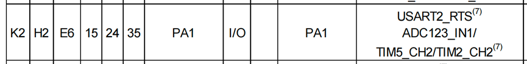

使用TIM4的CH1来捕获PWM信号。

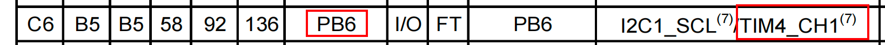

使用杜邦线把PA1连接到PB6，就可以完成我们的测量任务。


#### 软件设计（寄存器）


##### Driver_TIM4.h

```c
#ifndef __DRIVER_TIM4_H
#define __DRIVER_TIM4_H

#include "stm32f10x.h"
void Driver_TIM4_Init(void);
void Driver_TIM4_Start(void);
double Driver_TIM4_GetPWMCycle(void);
double Driver_TIM4_GetPWMFreq(void);
#endif
```


##### Driver_TIM4.c

```c
#include "Driver_TIM4.h"
#include "stdio.h"

void Driver_TIM4_Init(void)
{
    /* 1. 开启时钟 */
    /* 1.1 TIM4的时钟 */
    RCC->APB1ENR |= RCC_APB1ENR_TIM4EN;
    /* 1.2 把引脚(PB6) 对应的端口开启时钟*/
    RCC->APB2ENR |= RCC_APB2ENR_IOPBEN;

    /* 2. PB6设置为输入: 浮空输入 CNF=01 MODE=00 */
    GPIOB->CRL &= ~(GPIO_CRL_CNF6_1 | GPIO_CRL_MODE6);
    GPIOB->CRL |= GPIO_CRL_CNF6_0;

    /* 3. 配置定时器的时基部分 */
    /* 3.1 预分频系数配置 分频后计数器的时钟时1MHz 周期:1us*/
    TIM4->PSC = 72 - 1;
    /* 3.2 自动重装载寄存器的值: 设置最大,尽量避免溢出 */
    TIM4->ARR = 65535;
    /* 3.3 计数方向: 向上计数 */
    TIM4->CR1 &= ~TIM_CR1_DIR;

    /* 4. 输入捕获部分 */
    /* 4.1 TI1的选择: 把CH1直接连接到TI1 */
    TIM4->CR2 &= ~TIM_CR2_TI1S;
    /* 4.2 信号的输入滤波器: 不滤波  CCMR1_IC1F=0000 */
    TIM4->CCMR1 &= ~TIM_CCMR1_IC1F;
    /* 4.3 配置边缘检测器: 上升沿 CCER_CC1P=0  1下降沿捕获*/
    TIM4->CCER &= ~TIM_CCER_CC1P;
    /* 4.4 通道1配置为输入,并把信号映射到IC1  CC1S=01*/
    TIM4->CCMR1 &= ~TIM_CCMR1_CC1S_1;
    TIM4->CCMR1 |= TIM_CCMR1_CC1S_0;
    /* 4.5 对信号做分频(信号频率比较高的时候) CCMR1_IC1PSC=00不分频 01=2分频 10=4分频 11=8分频*/
    TIM4->CCMR1 &= ~TIM_CCMR1_IC1PSC;
    /* 4.6 通道1输入捕获使能 CCER_CC1E=1 */
    TIM4->CCER |= TIM_CCER_CC1E;
    /* 4.7 开启捕获中断 DIER_CC1IE=1 */
    TIM4->DIER |= TIM_DIER_CC1IE;

    /* 5. NVIC的配置 */
    /* 5.1 优先级组 */
    NVIC_SetPriorityGrouping(3);
    /* 5.2 优先级 */
    NVIC_SetPriority(TIM4_IRQn, 3);
    /* 5.3 使能中断 */
    NVIC_EnableIRQ(TIM4_IRQn);
}

void Driver_TIM4_Start(void)
{
    TIM4->CR1 |= TIM_CR1_CEN; /* 计数器使能 */
}

void Driver_TIM4_Stop(void)
{
    TIM4->CR1 &= ~TIM_CR1_CEN; /* 计数器失能 */
}

/* 记录上升沿的个数 */
uint8_t raiseEdgeCount = 0;
/* 存储信号的周期 */
uint16_t t = 0;

/* TIM4中断服务函数 */
void TIM4_IRQHandler(void)
{
  
    /* 判断是否是TIM4的通道1发生了捕获中断 */
    if (TIM4->SR & TIM_SR_CC1IF)
    {
        /* 中断标记位清除 */
        TIM4->SR &= ~TIM_SR_CC1IF;

        /* 上升沿个数 */
        raiseEdgeCount++;
        /* 如果是第1个上升沿,则清零计数器,让计数器从0开始计数 */
        if (raiseEdgeCount == 1)
        {
            TIM4->CNT = 0; /* 计数器清零 */
        }
        else if (raiseEdgeCount == 2)
        {
            /* 读取捕获寄存器的值,就是周期 单位是us*/
            t = TIM4->CCR1;
            /* 上升沿的计数从0重新计数 */
            raiseEdgeCount = 0;
        }
    }
}

/* 返回PWM的周期 ms*/
double Driver_TIM4_GetPWMCycle(void)
{
    return t / 1000.0;
}

/* 返回PWM的频率 */
double Driver_TIM4_GetPWMFreq(void)
{
    return 1000000 / t;
}
```


##### main.c

```c
#include "Driver_USART.h"

#include "Delay.h"

#include "Driver_TIM5.h"
#include "Driver_TIM4.h"
int main()
{
    Driver_USART1_Init();
    printf("系统定时器实验开始...\r\n");

    Driver_TIM5_Init();
    Driver_TIM5_Start();

    Driver_TIM4_Init();
    Driver_TIM4_Start();
    double t, f;
    while (1)
    {
        t = Driver_TIM4_GetPWMCycle();
        f = Driver_TIM4_GetPWMFreq();

        printf("t=%.4fms, f=%.4fHz\r\n", t, f);

        Delay_ms(1000);
    }
}
```


#### 软件设计（HAL库）


##### STM32CubeMX配置

复制上一个工程。

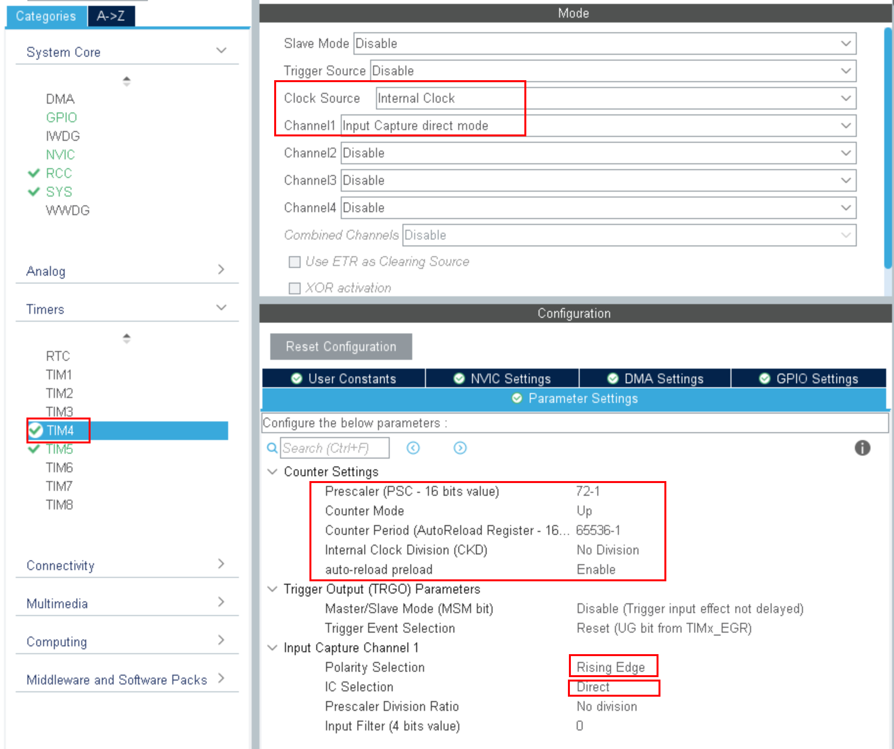

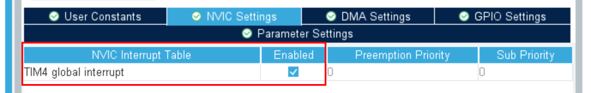

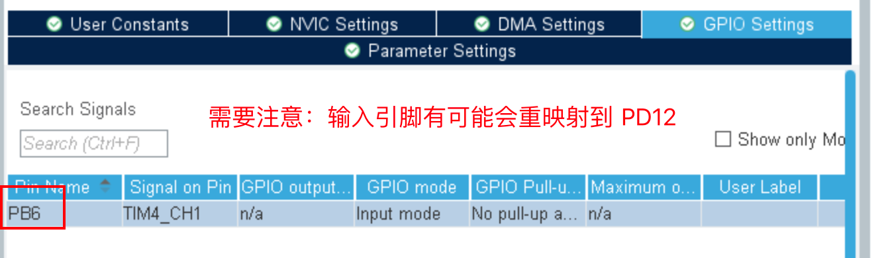


##### TIM4初始化代码（HAL库自动生成）

```c
void MX_TIM4_Init(void)
{
    /* USER CODE BEGIN TIM4_Init 0 */

    /* USER CODE END TIM4_Init 0 */

    TIM_ClockConfigTypeDef sClockSourceConfig = {0};
    TIM_MasterConfigTypeDef sMasterConfig = {0};
    TIM_IC_InitTypeDef sConfigIC = {0};

    /* USER CODE BEGIN TIM4_Init 1 */

    /* USER CODE END TIM4_Init 1 */
    htim4.Instance = TIM4;
    htim4.Init.Prescaler = 72 - 1;
    htim4.Init.CounterMode = TIM_COUNTERMODE_UP;
    htim4.Init.Period = 65536 - 1;
    htim4.Init.ClockDivision = TIM_CLOCKDIVISION_DIV1;
    htim4.Init.AutoReloadPreload = TIM_AUTORELOAD_PRELOAD_ENABLE;
    if (HAL_TIM_Base_Init(&htim4) != HAL_OK)
    {
        Error_Handler();
    }
    sClockSourceConfig.ClockSource = TIM_CLOCKSOURCE_INTERNAL;
    if (HAL_TIM_ConfigClockSource(&htim4, &sClockSourceConfig) != HAL_OK)
    {
        Error_Handler();
    }
    if (HAL_TIM_IC_Init(&htim4) != HAL_OK)
    {
        Error_Handler();
    }
    sMasterConfig.MasterOutputTrigger = TIM_TRGO_RESET;
    sMasterConfig.MasterSlaveMode = TIM_MASTERSLAVEMODE_DISABLE;
    if (HAL_TIMEx_MasterConfigSynchronization(&htim4, &sMasterConfig) != HAL_OK)
    {
        Error_Handler();
    }
    sConfigIC.ICPolarity = TIM_INPUTCHANNELPOLARITY_RISING;
    sConfigIC.ICSelection = TIM_ICSELECTION_DIRECTTI;
    sConfigIC.ICPrescaler = TIM_ICPSC_DIV1;
    sConfigIC.ICFilter = 0;
    if (HAL_TIM_IC_ConfigChannel(&htim4, &sConfigIC, TIM_CHANNEL_1) != HAL_OK)
    {
        Error_Handler();
    }
    /* USER CODE BEGIN TIM4_Init 2 */

    /* USER CODE END TIM4_Init 2 */
}
```


##### 添加其他代码 


###### 在tim.c添加代码

```c
/* USER CODE BEGIN 1 */
/* 记录上升沿的个数 */
uint8_t raiseEdgeCount = 0;
/* 存储信号的周期 */
uint16_t t = 0;
void HAL_TIM_IC_CaptureCallback(TIM_HandleTypeDef *htim)
{
    if (htim->Instance == TIM4)
    {
        if (htim->Channel == HAL_TIM_ACTIVE_CHANNEL_1)
        {
            /* 上升沿个数 */
            raiseEdgeCount++;
            /* 如果是第1个上升沿,则清零计数器,让计数器从0开始计数 */
            if (raiseEdgeCount == 1)
            {
                //TIM4->CNT = 0; /* 计数器清零 */
                __HAL_TIM_SetCounter(htim, 0);
            }
            else if (raiseEdgeCount == 2)
            {
                /* 读取捕获寄存器的值,就是周期 单位是us*/
                //t = TIM4->CCR1;
                t = __HAL_TIM_GetCompare(htim, TIM_CHANNEL_1);
                /* 上升沿的计数从0重新计数 */
                raiseEdgeCount = 0;
            }
        }
    }
}
/* 返回PWM的周期 ms*/
double Driver_TIM4_GetPWMCycle(void)
{
    return t / 1000.0;
}

/* 返回PWM的频率 */
double Driver_TIM4_GetPWMFreq(void)
{
    return 1000000 / t;
}

/* USER CODE END 1 */
```


###### main.c代码

```c
int main(void)
{
 
  HAL_Init();
  SystemClock_Config();
  MX_GPIO_Init();
  MX_TIM4_Init();
  MX_TIM5_Init();
  MX_USART1_UART_Init();
 
    HAL_TIM_PWM_Start(&htim5, TIM_CHANNEL_2); // 让tim5产生pwm

    HAL_TIM_IC_Start_IT(&htim4, TIM_CHANNEL_1);;

    double t, f;
    while (1)
    {
        t = Driver_TIM4_GetPWMCycle();
        f = Driver_TIM4_GetPWMFreq();

        printf("t=%.4fms, f=%.4fHz\r\n", t, f);

        HAL_Delay(1000);
    }
}
```


### 通用定时器实验3：同时测量PWM的频率/周期和占空比


#### 需求描述

用一个定时器的2个通道同时测量频率和占空比。

测试频率好理解，连续的两个上升沿就可以了。测试占空比就需要连续的一个上升沿和一个下降沿，用前面的知识是无法实现了，因为需要在这个通道即要检测上升沿，也要检测下降沿，是无法实现的。

所以，要测量占空比，需要用到新的知识：定时器的从模式和PWM输入模式。


#### 触发输入和从模式


#### PWM输入模式


#### 软件设计（寄存器）


##### Driver_TIM4.h

```c
#ifndef __DRIVER_TIM4_H
#define __DRIVER_TIM4_H

#include "stm32f10x.h"

void Driver_TIM4_Init(void);
void Driver_TIM4_Start(void);
double Driver_TIM4_GetPWMCycle(void);
double Driver_TIM4_GetPWMFreq(void);

double Driver_TIM4_GetDutyCycle(void);

#endif
```


##### Driver_TIM4.c

```c
#include "Driver_TIM4.h"
#include "stdio.h"

void Driver_TIM4_Init(void)
{
    /* 1. 开启时钟 */
    /* 1.1 TIM4的时钟 */
    RCC->APB1ENR |= RCC_APB1ENR_TIM4EN;
    /* 1.2 把引脚(PB6) 对应的端口开启时钟*/
    RCC->APB2ENR |= RCC_APB2ENR_IOPBEN;

    /* 2. PB6设置为输入: 浮空输入 CNF=01 MODE=00 */
    GPIOB->CRL &= ~(GPIO_CRL_CNF6_1 | GPIO_CRL_MODE6);
    GPIOB->CRL |= GPIO_CRL_CNF6_0;

    /* 3. 配置定时器的时基部分 */
    /* 3.1 预分频系数配置 分频后计数器的时钟时1MHz 周期:1us*/
    TIM4->PSC = 72 - 1;
    /* 3.2 自动重装载寄存器的值: 设置最大,尽量避免溢出 */
    TIM4->ARR = 65535;
    /* 3.3 计数方向: 向上计数 */
    TIM4->CR1 &= ~TIM_CR1_DIR;

    /* 4. 输入捕获部分 */
    /* 4.1 输入信号不滤波 */
    TIM4->CCMR1 &= ~TIM_CCMR1_IC1F;
    /* 4.2 配置边缘检测: 去IC1上升沿 去IC2的下降沿 */
    TIM4->CCER &= ~TIM_CCER_CC1P;
    TIM4->CCER |= TIM_CCER_CC2P;
    /* 4.3 把 IC1映射到TI1 CCMR1_CC1S=01 上升沿*/
    TIM4->CCMR1 &= ~TIM_CCMR1_CC1S_1;
    TIM4->CCMR1 |= TIM_CCMR1_CC1S_0;
    /* 4.4 把 IC2映射到TI1 CCMR1_CC2S=10 下降沿*/
    TIM4->CCMR1 |= TIM_CCMR1_CC2S_1;
    TIM4->CCMR1 &= ~TIM_CCMR1_CC2S_0;
    /* 4.5 IC1和IC2的预分频 都不分频 */
    TIM4->CCMR1 &= ~TIM_CCMR1_IC1PSC;
    TIM4->CCMR1 &= ~TIM_CCMR1_IC2PSC;

    /* 4.6 配置TRGI信号:  TI1FP1   SMCR_TS=101*/
    TIM4->SMCR |= (TIM_SMCR_TS_2 | TIM_SMCR_TS_0);
    TIM4->SMCR &= ~TIM_SMCR_TS_1;

    /* 4.7 配置从模式: 为复位模式 SMCR_SMS=100*/
    TIM4->SMCR |= TIM_SMCR_SMS_2;
    TIM4->SMCR &= ~(TIM_SMCR_SMS_1 | TIM_SMCR_SMS_0);

    /* 4.8 使能通道1捕获和通道2捕获 */
    TIM4->CCER |= TIM_CCER_CC1E;
    TIM4->CCER |= TIM_CCER_CC2E;
}

void Driver_TIM4_Start(void)
{
    TIM4->CR1 |= TIM_CR1_CEN; /* 计数器使能 */
}

void Driver_TIM4_Stop(void)
{
    TIM4->CR1 &= ~TIM_CR1_CEN; /* 计数器失能 */
}

/* 返回PWM的周期 ms*/
double Driver_TIM4_GetPWMCycle(void)
{
    return TIM4->CCR1 / 1000.0;
}

/* 返回PWM的频率 */
double Driver_TIM4_GetPWMFreq(void)
{
    return 1000000.0 / TIM4->CCR1;
}

// 返回占空比
double Driver_TIM4_GetDutyCycle(void)
{
    return TIM4->CCR2 * 1.0 / TIM4->CCR1;
}
```


##### main.c

```c
#include "Driver_USART.h"

#include "Delay.h"
#include "Driver_SysTick.h"

#include "Driver_TIM5.h"
#include "Driver_TIM4.h"
int main()
{
    Driver_USART1_Init();
    printf("系统定时器实验开始...\r\n");

    Driver_TIM5_Init();
    Driver_TIM5_Start();

    Driver_TIM4_Init();
    Driver_TIM4_Start();
    double t, f, dutyCycle;
    while (1)
    {
        t = Driver_TIM4_GetPWMCycle();
        f = Driver_TIM4_GetPWMFreq();
        dutyCycle = Driver_TIM4_GetDutyCycle();

        printf("t=%.4fms, f=%.4fHz, dutyCycle=%.2f%%\r\n", t, f, dutyCycle * 100);  // 40%

        Delay_ms(1000);
    }
}
```


#### 软件设计（HAL库）


##### STM32CubeMX配置

TIM5的配置参考前面案例。

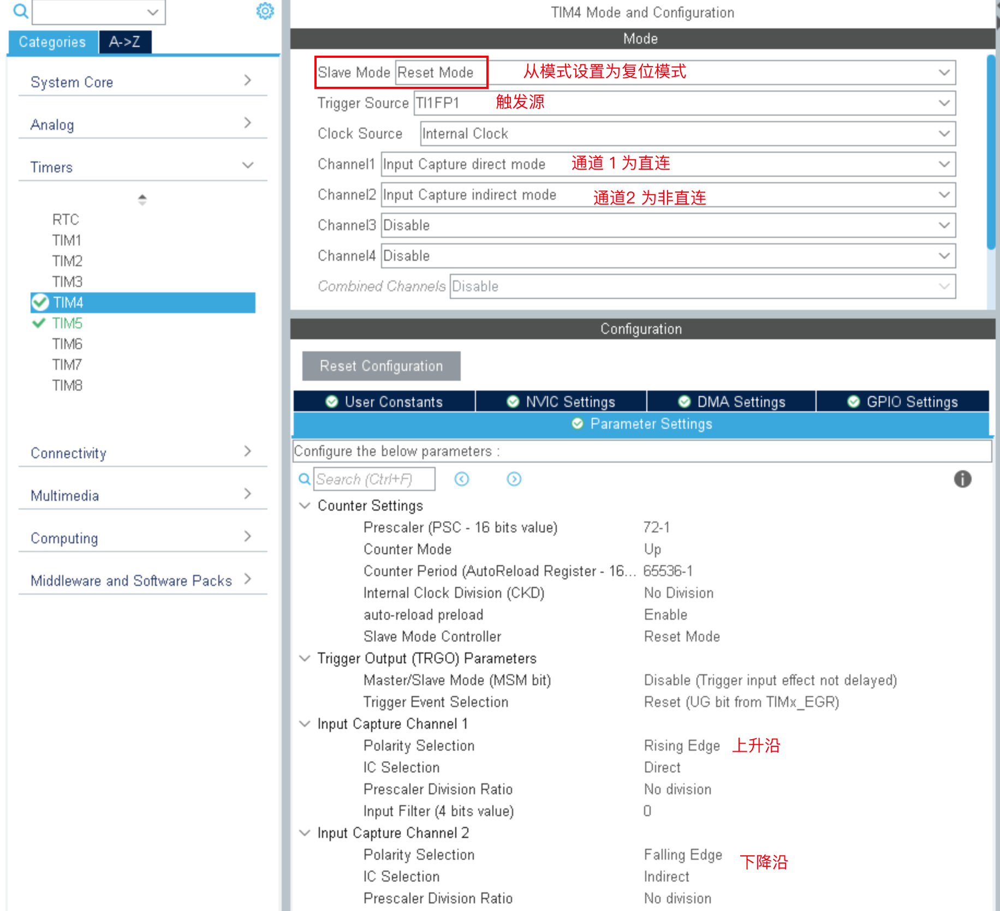


##### 添加其他代码


###### tim.c 添加代码

```c
/* USER CODE BEGIN 1 */
/* 返回PWM的周期 ms*/
double Driver_TIM4_GetPWMCycle(void)
{
    // return TIM4->CCR1 / 1000.0;;

    return (__HAL_TIM_GetCompare(&htim4, TIM_CHANNEL_1) + 1) / 1000.0;
}

/* 返回PWM的频率 */
double Driver_TIM4_GetPWMFreq(void)
{
    // return 1000000.0 / TIM4->CCR1;

    return 1000000.0 / (__HAL_TIM_GetCompare(&htim4, TIM_CHANNEL_1) + 1);
}

// 返回占空比
double Driver_TIM4_GetDutyCycle(void)
{
    // return TIM4->CCR2 * 1.0 / TIM4->CCR1;

    return (1 + __HAL_TIM_GetCompare(&htim4, TIM_CHANNEL_2)) * 1.0 / (1 + __HAL_TIM_GetCompare(&htim4, TIM_CHANNEL_1));
}

/* USER CODE END 1 */
```


###### main 函数代码

```c
int main(void)
{
 
  HAL_Init();
  SystemClock_Config();
  MX_GPIO_Init();
  MX_TIM4_Init();
  MX_TIM5_Init();
  MX_USART1_UART_Init();
 
    HAL_TIM_PWM_Start(&htim5, TIM_CHANNEL_2);

    HAL_TIM_IC_Start(&htim4, TIM_CHANNEL_1);
    HAL_TIM_IC_Start(&htim4, TIM_CHANNEL_2);
    double t, f, dutyCycle;
    while (1)
    {
        t = Driver_TIM4_GetPWMCycle();
        f = Driver_TIM4_GetPWMFreq();
        dutyCycle = Driver_TIM4_GetDutyCycle();
        printf("t=%.4fms, f=%.4fHz, dutyCycle=%.2f%%\r\n", t, f, dutyCycle * 100); // 40%
        HAL_Delay(1000);
    }
}
```


## 高级定时器


### 高级定时器介绍

高级定时器有2个分别是：TIM1、TIM8。

高级定时器除了拥有通用定时器的所有功能外，还具有以下功能：


###### 死区时间可编程的互补输出。


###### 断路输入信号（刹车输入信号）。


###### 重复计数器。


### 高级定时器实验：输出有限个周期的PWM波


#### 需求描述

用寄存器实现。输出5个周期的PWM波，频率2Hz，观察发光二极管闪烁5次，或者用示波器观察波形。

需求实现思路：使用高级定时器的重复计数器，当计数器溢出时，在溢出中断中停止定时器工作。重复计数器寄存器的值设置为4，即可输出5个周期的PWM波，发光二极管会闪烁5次。


#### 硬件电路设计

设置高级定时器TIM1的CH1。


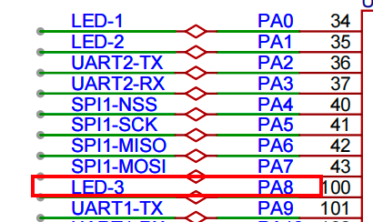

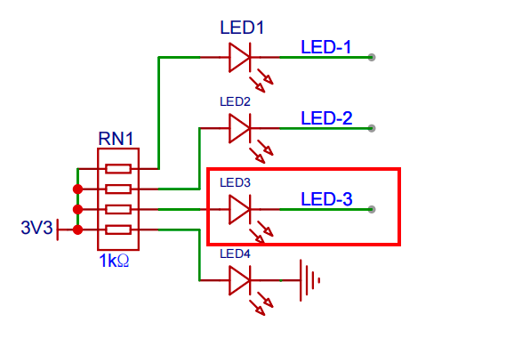


#### 软件设计（寄存器）


##### main.c

```c
#include "Driver_USART.h"

#include "Driver_TIM1.h"

int main()
{
    Driver_USART1_Init();
    printf("高级定时器实验开始...\r\n");

    Driver_TIM1_Init();
    Driver_TIM1_Start();
    while (1)
    {  

    }
}
```


##### Driver_TIM1.h

```c

#ifndef __DRIVER_TIM1_H
#define __DRIVER_TIM1_H

#include "stm32f10x.h"

void Driver_TIM1_Init(void);
void Driver_TIM1_Start(void);
#endif
```


##### Driver_TIM1.c

```c
#include "Driver_TIM1.h"
#include "stdio.h"
#include "Driver_USART.h"

void Driver_TIM1_Init(void)
{
    /* 1. 开启时钟 */
    /* 1.1 TIM1的时钟 */
    RCC->APB2ENR |= RCC_APB2ENR_TIM1EN;
    /* 1.2 GPIO的时钟 */
    RCC->APB2ENR |= RCC_APB2ENR_IOPAEN;

    /* 2. 给PA8配置复用推挽输出 CNF=10  MODE=11*/
    GPIOA->CRH |= (GPIO_CRH_CNF8_1 | GPIO_CRH_MODE8);
    GPIOA->CRH &= ~GPIO_CRH_CNF8_0;

    /* 3. 时基单元的配置  频率是2Hz的PWM*/
    /* 3.1 预分频 */
    TIM1->PSC = 7200 - 1;
    /* 3.2 自动重装载寄存器的值 */
    TIM1->ARR = 5000 - 1;
    /* 3.3 计数方向 0=向上计数 1=向下计数*/
    TIM1->CR1 &= ~TIM_CR1_DIR;
    /* 3.4 重复寄存器 RCR=4 表示CNT计数器溢出5次,才会产生更新时间(中断)*/
    TIM1->RCR = 4;

    /* 4. 输出部分配置 */
    /* 4.1 把通道1配置为输出*/
    TIM1->CCMR1 &= ~TIM_CCMR1_CC1S;
    /* 4.2 配置捕获比较寄存器的值 */;
    TIM1->CCR1 = 2500; /* 占空比 50% */
    /* 4.3 输出的极性 0=高电平有效 1=低电平有效 */;
    TIM1->CCER &= ~TIM_CCER_CC1P;
    /* 4.4 使能通道1 */;
    TIM1->CCER |= TIM_CCER_CC1E;
    /* 4.5 配置通道1输出模式: PWM1=110   */
    TIM1->CCMR1 |= (TIM_CCMR1_OC1M_2 | TIM_CCMR1_OC1M_1);
    TIM1->CCMR1 &= ~TIM_CCMR1_OC1M_0;
    /* 4.6 主输出使能(只有高级定时器需要配置)*/
    TIM1->BDTR |= TIM_BDTR_MOE;
    
    /* 4.7 防止一启动就进入更新中断: 1. 使用UG位产生一个更新事件 2.然后预分频和重复计数器的值更新到影子寄存器 */;
    TIM1->EGR |= TIM_EGR_UG;
    TIM1->SR &= ~TIM_SR_UIF;
    
    /* 5. 配置中断 */
    /* 5.1 定时器更新中断使能 */
    TIM1->DIER |= TIM_DIER_UIE;
    /* 5.2 NVIC的配置 */
    NVIC_SetPriorityGrouping(3);
    NVIC_SetPriority(TIM1_UP_IRQn, 3);
    NVIC_EnableIRQ(TIM1_UP_IRQn);
}

void Driver_TIM1_Start(void)
{
    TIM1->CR1 |= TIM_CR1_CEN;     
}

void Driver_TIM1_Stop(void)
{
    TIM1->CR1 &= ~TIM_CR1_CEN;
}

void TIM1_UP_IRQHandler(void)
{
    // 停掉计数器
    printf("a\r\n");
    TIM1->SR &= ~TIM_SR_UIF;
    Driver_TIM1_Stop();
}
```


#### 软件设计（HAL库）


##### STM32CubeMX配置

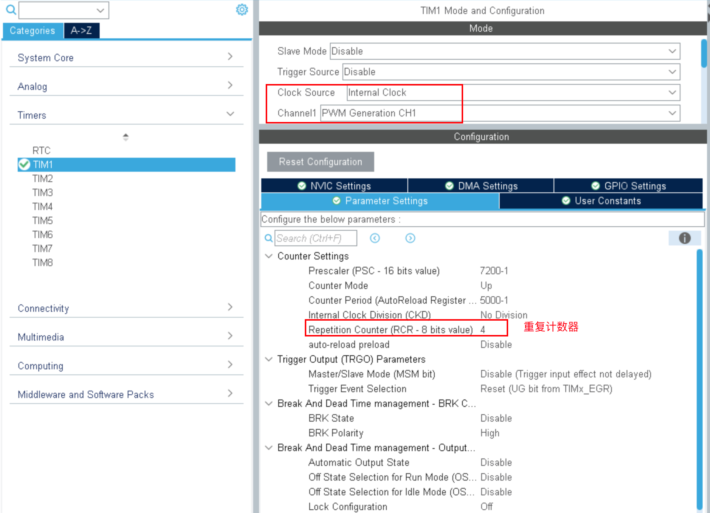


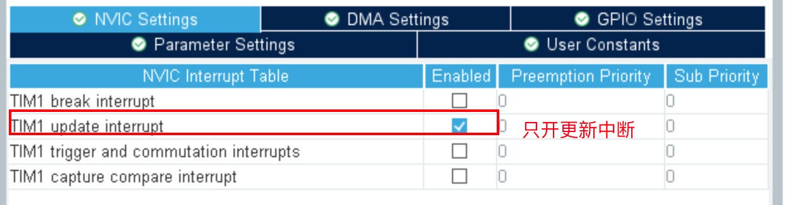


##### 添加其他代码


###### tim.c 

```c
/* USER CODE BEGIN 1 */
void HAL_TIM_PeriodElapsedCallback(TIM_HandleTypeDef *htim)
{
    /* 关闭计数器 */
    if (htim->Instance == TIM1)
    {
       //HAL_TIM_PWM_Stop(&htim1, TIM_CHANNEL_1);
       
       TIM1->CCER &= ~TIM_CCER_CC1E;
       TIM1->BDTR &= ~TIM_BDTR_MOE;
       htim->Instance->CR1 &= ~TIM_CR1_CEN;
    }
}
/* USER CODE END 1 */
```


###### main.c

```c
int main(void)
{
  
  HAL_Init();
  SystemClock_Config();
  MX_GPIO_Init();
  MX_TIM1_Init();
  MX_USART1_UART_Init();
    
    /*初始化的时候 UG已经被置位.  先清除中断标志位,防止一启动就进入中断 */
    __HAL_TIM_CLEAR_IT(&htim1, TIM_IT_UPDATE);
    /* 启用更新中断 */
    __HAL_TIM_ENABLE_IT(&htim1, TIM_IT_UPDATE);
    
    HAL_TIM_PWM_Start(&htim1, TIM_CHANNEL_1);
    while (1)

    {
    }
}
```

