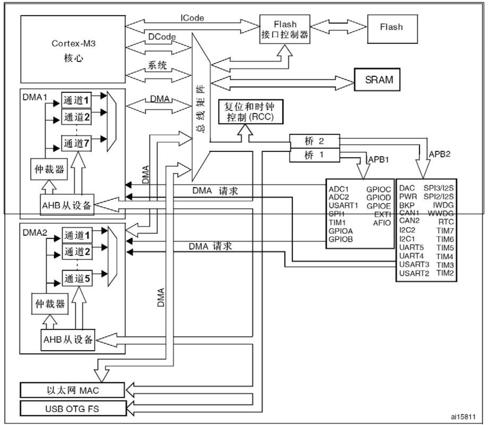
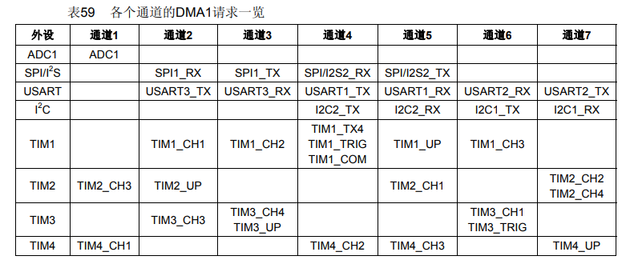
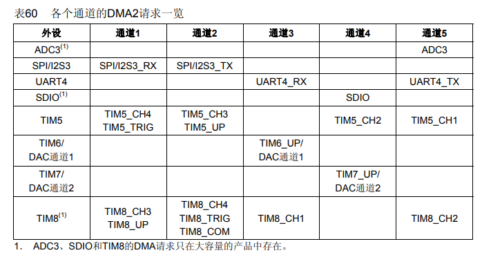
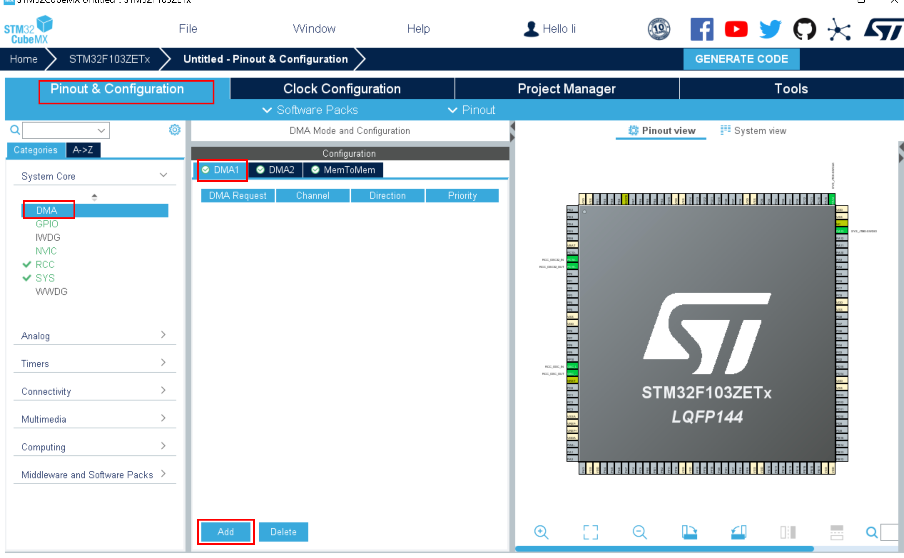
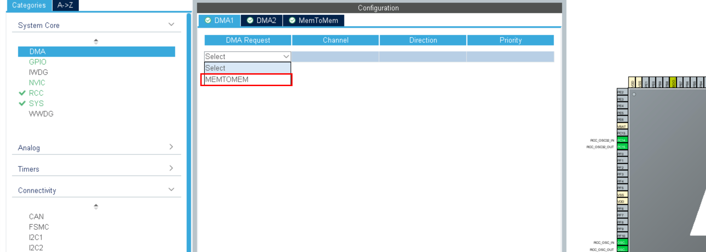
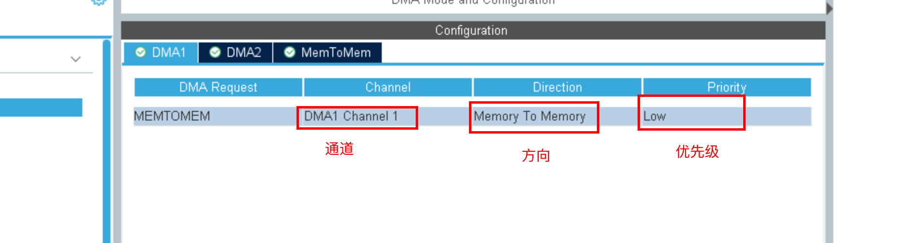
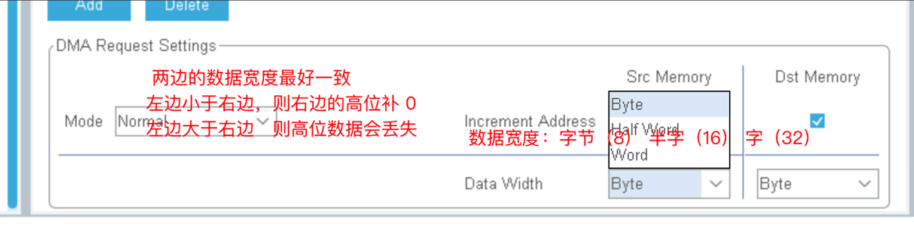
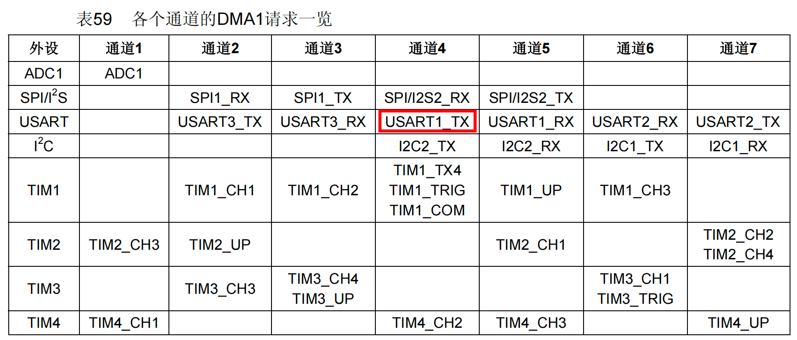
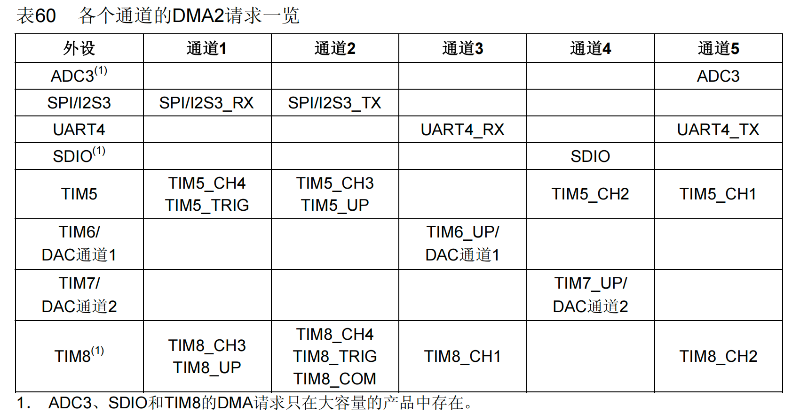
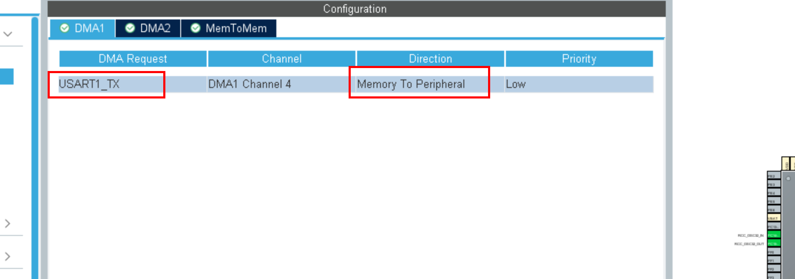

# DMA直接存储访问


## DMA介绍

直接存储器存取（direct memory access，DMA）用来提供在外设和存储器之间或者存储器和存储器之间的高速数据传输。无须CPU干预，数据可以通过DMA快速地移动，这就节省了CPU的资源来做其他操作。

2个DMA控制器有12个通道（DMA1有7个通道，DMA2有5个通道），每个通道专门用来管理来自于一个或多个外设对存储器访问的请求。还有一个仲裁器来协调各个DMA请求的优先权。

DMA控制器和Cortex™-M3核心共享系统数据总线，执行直接存储器数据传输。当CPU和DMA同时访问相同的目标（RAM或外设）时，DMA请求会暂停CPU访问系统总线达若干个周期，总线仲裁器执行循环调度，以保证CPU至少可以得到一半的系统总线（存储器或外设）带宽。

要注意的是DMA2只存在于大容量产品和互联型产品中。


## DMA框图




##### DMA请求

如果外设要想通过DMA来传输数据，必须先给DMA控制器发送DMA请求，DMA控制器收到请求信号之后，控制器会给外设一个应答信号，当外设得到控制器的应答信号后，外设会立即释放它的请求。

DMA有DMA1和DMA2两个控制器，DMA1有7个通道，DMA2有5个通道，不同DMA控制器的通道对应着不同的外设请求，这决定了我们在软件编程上该怎么设置。






##### 通道

DMA具有12个独立可编程的通道，其中 DMA1有7个通道，DMA2有5个通道，每个通道对应不同的外设的DMA请求。虽然每个通道可以接收多个外设的请求，但是同一时间只能接收一个，不能同时接收多个。


##### 仲裁器

当发生多个DMA通道请求时，就意味着有先后响应处理的顺序问题，这个就由仲裁器管理。仲裁器管理DMA通道请求分为两个阶段。

第一阶段属于软件阶段，可以在DMA_CCRx寄存器中设置，有4个等级：非常高、高、中和低四个优先级。

第二阶段属于硬件阶段，如果两个或以上的DMA通道请求设置的优先级一样，则他们优先级取决于通道编号，编号越低优先权越高，比如通道 1 高于通道 2。

在大容量产品和互联型产品中，DMA1控制器拥有高于DMA2控制器的优先级。


##### 传输方向

存储器到外设，外设到存储器，存储器到存储器。这里的存储器指的是ROM和RAM。注意DMA没有办法把数据从RAM传输到ROM（flash）。


## DMA案例1：ROM到RAM


### 需求描述

使用寄存器操作把ROM中的数据通过DMA传输到RAM，然后把数据通过printf发送到串口验证是否正确。

DMA传输不涉及外设，所以通道随便选。我们选DMA1的1通道。


### 软件设计（寄存器）


#### main.c

```c
#include "Driver_USART.h"

#include "Driver_TIM1.h"
#include "Driver_DMA.h"

const uint8_t src[] = {10, 20, 30, 40};
uint8_t des[4] = {0};

int main()
{
    Driver_USART1_Init();
    printf("DMA实验: ROM->RAM...\r\n");

    Driver_DMA1_Init();
    printf("src=%p, des=%p\r\n", src, des);

    Driver_DMA1_TransmitData((uint32_t)&src[0], (uint32_t)&des[0], 8);

    while(isTransmitFinished == 0);

    printf("%d, %d, %d, %d\r\n", des[0], des[1], des[2], des[3]);

    while (1)
    {
    }
}
```


#### Driver_DMA.h

```c
#ifndef __DRIVER_DMA_H
#define __DRIVER_DMA_H
#include "stm32f10x.h"

extern uint8_t isTransmitFinished;
void Driver_DMA1_Init(void);

void Driver_DMA1_TransmitData(uint32_t srcAddr, uint32_t desAddr, uint16_t dataLen);

#endif
```


#### Driver_DMA.c

```c

#include "Driver_DMA.h"

/**
 * @description: 初始化DMA1_Channel1
 */
void Driver_DMA1_Init(void)
{
    /* 1. 开启 DAM 时钟 */
    RCC->AHBENR |= RCC_AHBENR_DMA1EN;

    /* 2. DMA相关的配置 */
    /* 2.1 DMA方向: 从存储器(ROM)到存储器(RAM) . 通道随意*/
    DMA1_Channel1->CCR &= ~DMA_CCR1_DIR; // 0: 从外设读 1:从存储器读
    DMA1_Channel1->CCR |= DMA_CCR1_MEM2MEM;
    /* 2.2 设置存储器和外设的数据宽度:  8位(一个字节) 16位(半字) 32位(字) */
    DMA1_Channel1->CCR &= ~DMA_CCR1_PSIZE; /* 00:8位 01:16位 10:32位 11:保留 */
    DMA1_Channel1->CCR &= ~DMA_CCR1_MSIZE;
    /* 2.3 设置外设和存储器的地址是否自增 */
    DMA1_Channel1->CCR |= DMA_CCR1_PINC; /* 外设地址自增 */
    DMA1_Channel1->CCR |= DMA_CCR1_MINC; /* 存储器地址自增 */
    /* 2.4 开启传输完成的中断 */
    DMA1_Channel1->CCR |= DMA_CCR1_TCIE;
    /* 2.5 NVIC的设置 */
    NVIC_SetPriorityGrouping(3);
    NVIC_SetPriority(DMA1_Channel1_IRQn, 3);
    NVIC_EnableIRQ(DMA1_Channel1_IRQn);
}
/**
 * @description: 启动DMA传输数据
 * @param {uint32_t} srcAddr 源地址
 * @param {uint32_t} desAddr 目的地址
 * @param {uint16_t} dataLen 要传输的数据长度
 */
void Driver_DMA1_TransmitData(uint32_t srcAddr,
                               uint32_t desAddr,
                               uint16_t dataLen)
{
    /* 1. 设置外设地址 */
    DMA1_Channel1->CPAR = srcAddr;
    /* 2. 设置存储器地址 */
    DMA1_Channel1->CMAR = desAddr;

    /* 3. 设置要传输的数据量 */;
    DMA1_Channel1->CNDTR = dataLen;

    /* 4. 开启通道,开始传输 */
    DMA1_Channel1->CCR |= DMA_CCR1_EN;
}

uint8_t isTransmitFinished = 0;
void DMA1_Channel1_IRQHandler(void)
{
    if (DMA1->ISR & DMA_ISR_TCIF1)
    {
        /* 清除传输完成中断完成标志位 */
        DMA1->IFCR |= DMA_IFCR_CGIF1;

        /* 通道不需要了,可以关闭 */
        DMA1_Channel1->CCR &= ~DMA_CCR1_EN;
        isTransmitFinished = 1;
    }
}
```


### 软件设计（HAL库）


#### DMA配置










#### DMA初始化代码

```c
void MX_DMA_Init(void)
{
    /* DMA controller clock enable */
    __HAL_RCC_DMA1_CLK_ENABLE();

    /* Configure DMA request hdma_memtomem_dma1_channel1 on DMA1_Channel1 */
    hdma_memtomem_dma1_channel1.Instance = DMA1_Channel1;
    hdma_memtomem_dma1_channel1.Init.Direction = DMA_MEMORY_TO_MEMORY;
    hdma_memtomem_dma1_channel1.Init.PeriphInc = DMA_PINC_ENABLE;
    hdma_memtomem_dma1_channel1.Init.MemInc = DMA_MINC_ENABLE;
    hdma_memtomem_dma1_channel1.Init.PeriphDataAlignment = DMA_PDATAALIGN_BYTE;
    hdma_memtomem_dma1_channel1.Init.MemDataAlignment = DMA_MDATAALIGN_BYTE;
    hdma_memtomem_dma1_channel1.Init.Mode = DMA_NORMAL;
    hdma_memtomem_dma1_channel1.Init.Priority = DMA_PRIORITY_LOW;
    if (HAL_DMA_Init(&hdma_memtomem_dma1_channel1) != HAL_OK)
    {
        Error_Handler();
    }
}
```


#### 具体实现代码

```c
int main(void)
{
   
    HAL_Init();
    SystemClock_Config();
    MX_GPIO_Init();
    MX_DMA_Init();
    MX_USART1_UART_Init();
    /* 注册中断回调函数 */
    HAL_DMA_RegisterCallback(&hdma_memtomem_dma1_channel1,
                             HAL_DMA_XFER_CPLT_CB_ID,
                             dmaCompleteCallBack);

    HAL_DMA_Start_IT(&hdma_memtomem_dma1_channel1, (uint32_t)src, (uint32_t)des, 4);
    while (isFinished == 0)
        ;
    printf("%s\r\n", des);

    while (1)
    {
    }
}
```


## DMA实验2：RAM到外设（串口）


### 需求描述

使用寄存器实现把RAM中的数据直接传输到usart1的Tx引脚，然后数据被发送到电脑端。





由于不同的通道对应着不同的外设，根据上表知道，我们应该选择DMA1的通道4。


### 软件设计（寄存器）


#### main.c

```c
#include "Driver_USART.h"

#include "Driver_TIM1.h"
#include "Driver_DMA.h"
#include "Delay.h"

uint8_t src[] = {'a', 'b', 'c', 'd'};

int main()
{
    Driver_USART1_Init();
    printf("DMA实验: RAM->USART...\r\n");
    
    Driver_DMA1_Init();
    Delay_ms(1000);
    Driver_DMA1_TransmitData((uint32_t)&src[0], (uint32_t)(&(USART1->DR)), 4);
    while (1)
    {
    }
}
```


#### Driver_DMA.c

```c
#ifndef __DRIVER_DMA_H
#define __DRIVER_DMA_H
#include "stm32f10x.h"
#include "stdio.h"

extern uint8_t isTransmitFinished;
void Driver_DMA1_Init(void);

void Driver_DMA1_TransmitData(uint32_t srcAddr, uint32_t desAddr, uint16_t dataLen);

#endif
```


#### Driver_DMA.c

```c

#include "Driver_DMA.h"

/**
 * @description: 初始化DMA1_Channel4
 */
void Driver_DMA1_Init(void)
{
    /* 1. 开启 DAM 时钟 */
    RCC->AHBENR |= RCC_AHBENR_DMA1EN;

    /* 2. DMA相关的配置 */
    /* 2.1 DMA方向: 从存储器(RAM)到串口(外设) . 通道4*/
    DMA1_Channel4->CCR |= DMA_CCR4_DIR; // 0: 从外设读 1:从存储器读

    /* 2.2 设置存储器和外设的数据宽度:  8位(一个字节) 16位(半字) 32位(字) */
    DMA1_Channel4->CCR &= ~DMA_CCR4_PSIZE; /* 00:8位 01:16位 10:32位 11:保留 */
    DMA1_Channel4->CCR &= ~DMA_CCR4_MSIZE;
    /* 2.3 设置外设和存储器的地址是否自增 */
    DMA1_Channel4->CCR &= ~DMA_CCR4_PINC; /* 串口外设地址不能自增 */
    DMA1_Channel4->CCR |= DMA_CCR4_MINC; /* 存储器地址自增 */
    /* 2.4 开启传输完成的中断 */
    DMA1_Channel4->CCR |= DMA_CCR4_TCIE;
    /* 2.5 使能串口的DMA传输 */
    USART1->CR3 |= USART_CR3_DMAT;
    /* 2.6 开启循环模式 */
    DMA1_Channel4->CCR |= DMA_CCR4_CIRC;

    /* 2.5 NVIC的设置 */
    NVIC_SetPriorityGrouping(3);
    NVIC_SetPriority(DMA1_Channel4_IRQn, 3);
    NVIC_EnableIRQ(DMA1_Channel4_IRQn);
}
/**
 * @description: 启动DMA传输数据
 * @param {uint32_t} srcAddr 源地址
 * @param {uint32_t} desAddr 目的地址
 * @param {uint16_t} dataLen 要传输的数据长度
 */
void Driver_DMA1_TransmitData(uint32_t srcAddr,
                               uint32_t desAddr,
                               uint16_t dataLen)
{
    /* 1. 设置外设地址 */
    DMA1_Channel4->CPAR = desAddr;
    /* 2. 设置存储器地址 */
    DMA1_Channel4->CMAR = srcAddr;

    /* 3. 设置要传输的数据量 */;
    DMA1_Channel4->CNDTR = dataLen;

    /* 4. 开启通道,开始传输 */
    DMA1_Channel4->CCR |= DMA_CCR4_EN;
}

uint8_t isTransmitFinished = 0;
void DMA1_Channel4_IRQHandler(void)
{
    if (DMA1->ISR & DMA_ISR_TCIF4)
    {
        /* 清除传输完成中断完成标志位 */
        DMA1->IFCR |= DMA_IFCR_CGIF4;

        /* 通道不需要了,可以关闭 */
        //DMA1_Channel4->CCR &= ~DMA_CCR4_EN;
        isTransmitFinished = 1;
    }
}
```


### 软件设计（HAL库）


#### 配置DMA




#### 增加的代码

```c
uint8_t src[] = {'a', 'b', 'c', 'd', 'e'};

int main(void)
    HAL_Init();
    SystemClock_Config();
    MX_GPIO_Init();
    MX_DMA_Init();
    MX_USART1_UART_Init();
   
    HAL_UART_Transmit_DMA(&huart1, src, 5);
    while (1)
    {
    }
}
```

