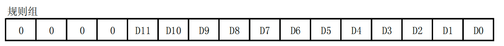
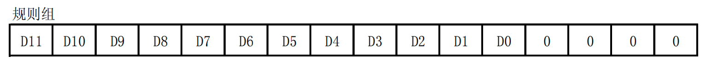
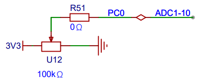
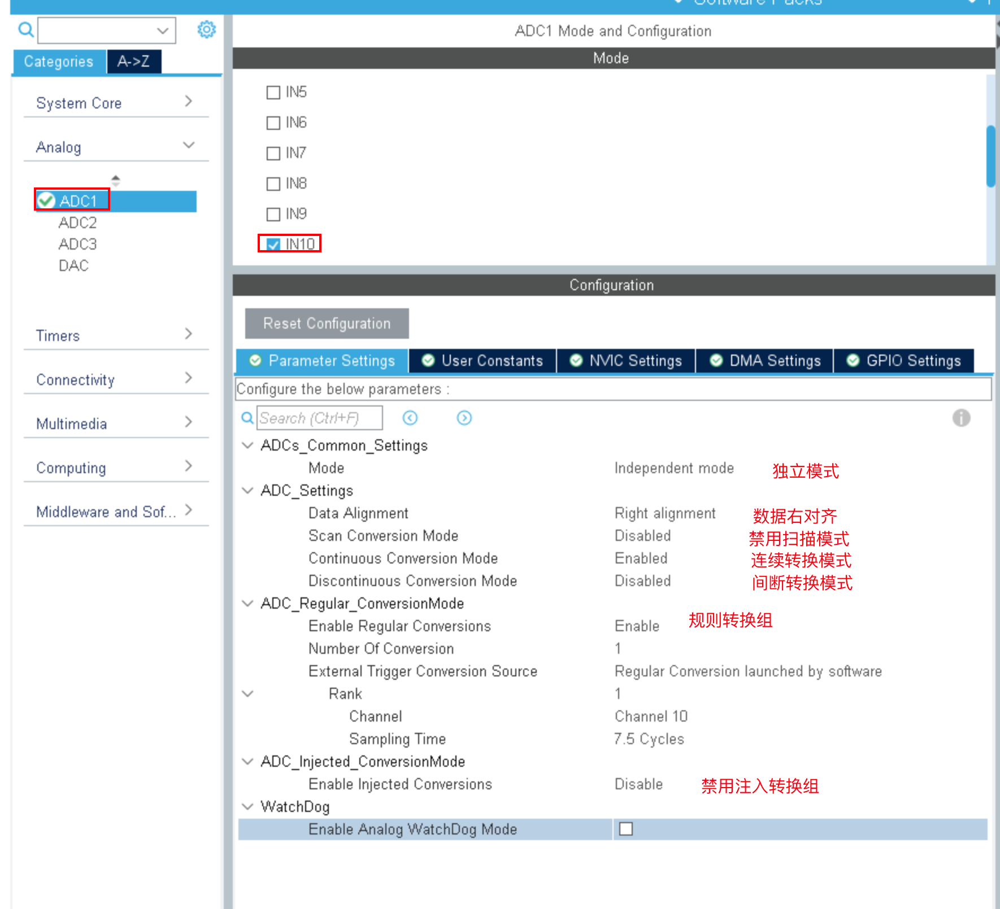
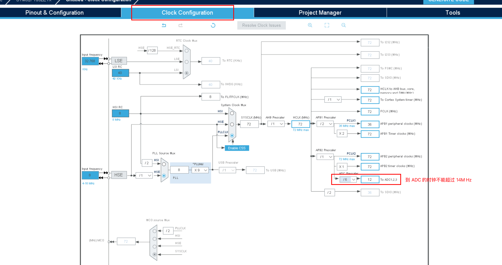
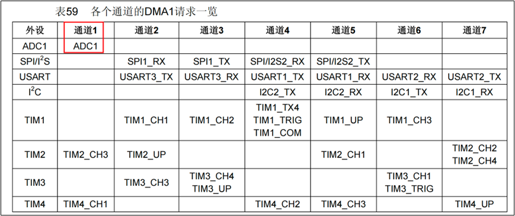
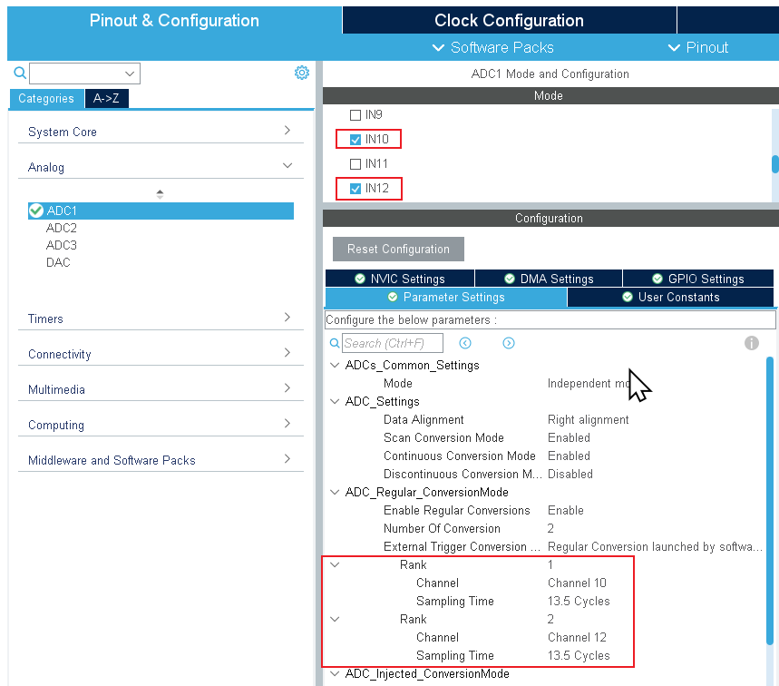
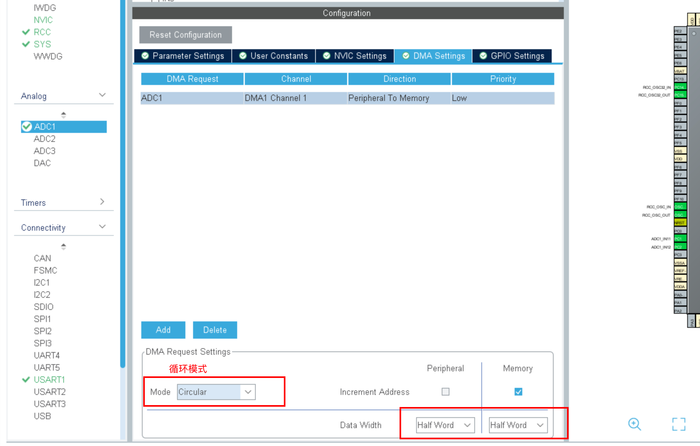
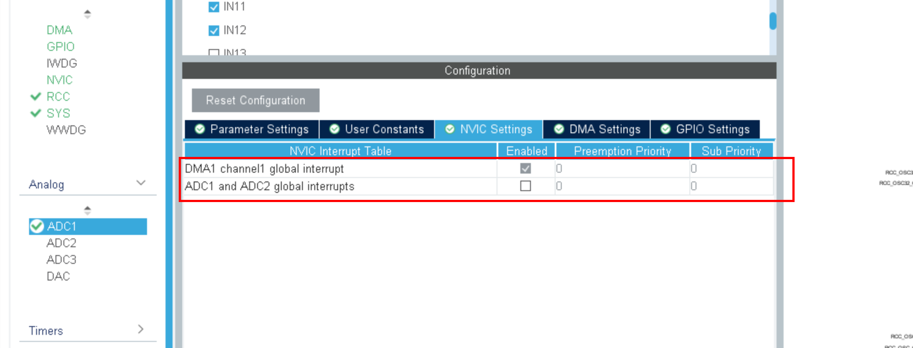

# ADC（模数转换）


## ADC概述


### ADC介绍


### STM32的ADC

STM32F103系列提供了3个ADC，精度为12位，每个ADC最多有16个通道和2个内部信号源。

STM32F103的ADC是一种逐次逼近型模拟数字转换器。各通道的A/D转换可以单次、连续、扫描或间断模式执行。ADC的结果可以左对齐或右对齐方式存储在16位数据寄存器中。模拟看门狗特性允许应用程序检测输入电压是否超出用户定义的高/低阈值。ADC的输入时钟不得超过14MHz，它是由PCLK2经分频产生。


### 逐次逼近型ADC工作原理


### STM32 ADC外设


##### 中断


###### 转换结束中断

数据转换结束后，可以产生中断，中断分为三种：规则通道转换结束中断，注入转换通道转换结束中断，模拟看门狗中断。其中转换结束中断很好理解，跟我们平时接触的中断一样，有相应的中断标志位和中断使能位，我们还可以根据中断类型写相应配套的中断服务程序。


###### 模拟看门狗中断

当被 ADC 转换的模拟电压低于低阈值或者高于高阈值时，就会产生中断，前提是我们开启了模拟看门狗中断，其中低阈值和高阈值由 ADC_LTR 和 ADC_HTR 设置。例如我们设置高阈值是2.5V，那么模拟电压超过 2.5V 的时候，就会产生模拟看门狗中断，反之低阈值也一样。


##### DMA 请求

规则和注入通道转换结束后，除了产生中断外，还可以产生DMA请求，把转换好的数据直接存储在内存里面。要注意的是只有ADC1和ADC3可以产生DMA请求。


##### 数据对齐

16位的寄存器只用到了其中的12位。

可以使用高12位，数据就是左对齐。

也可以使用低12位，数据就是右对齐。

右对齐：高4位补零，读取的值就是实际值。



左对齐：低4位补零，读取的值是实际值的16倍。



实际使用中，最好使用低16位，这样就得到数据可以直接使用。


##### 转换时间

ADC使用若干个ADC_CLK周期对输入电压采样。总转换时间如下计算：

TCONV = 采样时间 + 12.5个ADC周期。

当ADCCLK=14MHz，假设采样时间为1.5周期。

TCONV = 1.5 + 12.5 = 14周期 = 1μs。


##### 电压转换

模拟电压经过ADC转换后，是一个12位的数字值，如果通过串口以16进制打印出来的话，可读性比较差，那么有时候我们就需要把数字电压转换成模拟电压，也可以跟实际的模拟电压（用万用表测）对比，看看转换是否准确。

我们一般在设计原理图的时候会把ADC的输入电压范围设定在：0~3.3v，因为ADC是12位的，那么12位满量程对应的就是 3.3V，12位满量程（全部是1）对应的数字值是：2^12-1。数值 0 对应的就是0V。

如果转换后的数值为X ，X对应的模拟电压为 Y，那么会有这么一个等式成立：（2^12 -1）/ 3.3 = X / Y，所以Y =（3.3 * X ）/（2^12 – 1）= 3.3 * X / 4095。


## ADC案例1：独立模式单通道采集


### 需求描述

基于寄存器操作，采集可变电阻器的电压，并通过串口把电压数据发送到电脑端。


### 硬件电路设计



PC0口为ADC的10通道，范围是0-3.3V。只需要一个ADC，使用独立模式即可。


### 软件设计（寄存器）


#### main.c

```c
#include "Driver_USART.h"

#include "Delay.h"
#include "Driver_ADC.h"

int main()
{
    Driver_USART1_Init();
    printf("ADC转换实验: 单通道\r\n");
    Driver_ADC1_Init();
    Driver_ADC1_StartConvert();

    while (1)
    {
        double v = Driver_ADC1_ReadV();
        printf("v = %.2f\r\n", v);
        Delay_s(1);
    }
}
```


#### Driver_ADC.h

```c
#ifndef __DRIVER_ADC_H
#define __DRIVER_ADC_H

#include "stm32f10x.h"

void Driver_ADC1_Init(void);

void Driver_ADC1_StartConvert(void);

double Driver_ADC1_ReadV(void);

#endif
```


#### Driver_ADC.c

```c
#include "Driver_ADC.h"

void Driver_ADC1_Init(void)
{
    /* 1. 时钟配置 */
    /* 1.1 adc时钟 */
    RCC->APB2ENR |= RCC_APB2ENR_ADC1EN;
    RCC->CFGR |= RCC_CFGR_ADCPRE_1;
    RCC->CFGR &= ~RCC_CFGR_ADCPRE_0;

    /* 1.2 gpio的时钟 */
    RCC->APB2ENR |= RCC_APB2ENR_IOPCEN;

    /* 2. gpio工作模式: PC0 模拟输入  CNF=00 MODE=00 */
    GPIOC->CRL &= ~(GPIO_CRL_CNF0 | GPIO_CRL_MODE0);

    /* 2. ADC相关配置 */
    /* 2.1 禁用扫描模式. 只有一个通道不用扫描 */
    ADC1->CR1 &= ~ADC_CR1_SCAN;
    /* 2.2 启用连续转换模式 CR2=CONT 1*/
    ADC1->CR2 |= ADC_CR2_CONT;
    /* 2.3 数据对齐方式: 右对齐 左对齐 */
    ADC1->CR2 &= ~ADC_CR2_ALIGN;
    /* 2.4 设置采样时间 ADC_SMPR1  010=13.5周期*/
    ADC1->SMPR1 &= ~(ADC_SMPR1_SMP10_2 | ADC_SMPR1_SMP10_0);
    ADC1->SMPR1 |= ADC_SMPR1_SMP10_1;
    /* 2.5 通道组的配置 */
    /* 2.5.1 配置几个通道需要转换 */
    ADC1->SQR1 &= ~ADC_SQR1_L;
    /* 2.5.2 把通道号配置到组里面.  */
    ADC1->SQR3 &= ~ADC_SQR3_SQ1; /* 先把5位清零 */
    ADC1->SQR3 |= 10 << 0;       /* 设置最后5位 */
    /* 2.6 选择软件触发 */
    ADC1->CR2 |= ADC_CR2_EXTTRIG; /* 开启规则组的外部转换 */
    ADC1->CR2 |= ADC_CR2_EXTSEL;  /* 选择使用软件触发ADC */
}

void Driver_ADC1_StartConvert(void)
{
    /* 1. 上电: 把ADC从休眠模式唤醒 */
    ADC1->CR2 |= ADC_CR2_ADON;

    /* 2. 执行校准 */
    ADC1->CR2 |= ADC_CR2_CAL;
    while (ADC1->CR2 & ADC_CR2_CAL)
        ;

    /* 3. ADON = 1, 开始转换 0>1 从休眠模式唤醒 1->1 开始 */
    // ADC1->CR2 |= ADC_CR2_ADON;

    /* 4. 使用软件开始转换规则通道 */;
    ADC1->CR2 |= ADC_CR2_SWSTART;

    /* 5. 等待首次转换完成 */
    while((ADC1->SR & ADC_SR_EOC) == 0);
}

double Driver_ADC1_ReadV(void)
{
    // 12位的ADC 范围 [0, 4095]
    return ADC1->DR * 3.3 / 4095;
}
```


### 软件设计（HAL库）


#### STM32CubeMx设置






#### 添加其他代码

main函数

```c
int main(void)
{
  HAL_Init();
  SystemClock_Config();
  MX_GPIO_Init();
  MX_ADC1_Init();
  MX_USART1_UART_Init();
  /* USER CODE BEGIN 2 */
    // 启动ADC转换
    HAL_ADC_Start(&hadc1);
    while (1)
    {
        float v = HAL_ADC_GetValue(&hadc1) / 4095.0 * 3.3;
        printf("电压=%.2fV\r\n", v);
        HAL_Delay(1000);
    }
}
```


## ADC案例2：独立模式多通道采集


### 需求描述

基于寄存器操作，用一个ADC同时采集多个通道模拟电压。

PC0是10通道，采集的是可变电阻器的电压。PC2对应的是12通道，使用杜邦线连接到电源或地，测试他们的电压。

当多个通道同时采集时，一般就需要使用DMA来传输数据，否则数据如果来不及取出，则会导致数据被覆盖。




### 软件设计（寄存器）


#### main.c

```c
#include "Driver_USART.h"

#include "Delay.h"
#include "Driver_ADC.h"

uint16_t data[2] = {0};

int main()
{
    Driver_USART1_Init();
    printf("ADC转换实验: 单通道\r\n");
    Driver_ADC1_Init();
    Driver_ADC1_DMA_Init();
    Driver_ADC1_DMA_Start((uint32_t)data, 2);
    while (1)
    {
        printf("滑动变阻器=%.2f, 电源电压=%.2f\r\n",
               data[0] * 3.3 / 4095,
               data[1] * 3.3 / 4095);

        Delay_s(1);
    }
}
```


#### Driver_ADC.h

```c
#ifndef __DRIVER_ADC_H
#define __DRIVER_ADC_H

#include "stm32f10x.h"

void Driver_ADC1_Init(void);

void Driver_ADC1_DMA_Init(void);

void Driver_ADC1_DMA_Start(uint32_t desAddr, uint8_t len);

#endif
```


#### Driver_ADC.c

```c
#include "Driver_ADC.h"

void Driver_ADC1_Init(void)
{
    /* 1. 时钟配置 */
    /* 1.1 adc时钟 */
    RCC->APB2ENR |= RCC_APB2ENR_ADC1EN;
    RCC->CFGR |= RCC_CFGR_ADCPRE_1;
    RCC->CFGR &= ~RCC_CFGR_ADCPRE_0;

    /* 1.2 gpio的时钟 */
    RCC->APB2ENR |= RCC_APB2ENR_IOPCEN;

    /* 2. gpio工作模式: PC0 PC2 模拟输入  CNF=00 MODE=00 */
    GPIOC->CRL &= ~(GPIO_CRL_CNF0 | GPIO_CRL_MODE0);
    GPIOC->CRL &= ~(GPIO_CRL_CNF2 | GPIO_CRL_MODE2);

    /* 2. ADC相关配置 */
    /* 2.1 启用扫描模式. 有多个通道 */
    ADC1->CR1 |= ADC_CR1_SCAN;
    /* 2.2 启用连续转换模式 CR2=CONT 1*/
    ADC1->CR2 |= ADC_CR2_CONT;
    /* 2.3 数据对齐方式: 右对齐 左对齐 */
    ADC1->CR2 &= ~ADC_CR2_ALIGN;
    /* 2.4 设置采样时间 ADC_SMPR1  010=13.5周期*/
    ADC1->SMPR1 &= ~(ADC_SMPR1_SMP10_2 | ADC_SMPR1_SMP10_0);
    ADC1->SMPR1 |= ADC_SMPR1_SMP10_1;

    ADC1->SMPR1 &= ~(ADC_SMPR1_SMP12_2 | ADC_SMPR1_SMP12_0);
    ADC1->SMPR1 |= ADC_SMPR1_SMP12_1;
    /* 2.6 通道组的配置 */
    /* 2.6.1 配置几个通道需要转换  2个通道*/
    ADC1->SQR1 &= ~ADC_SQR1_L;
    ADC1->SQR1 |= ADC_SQR1_L_0;
    /* 2.6.1 把通道号配置到组里面.  */
    ADC1->SQR3 &= ~ADC_SQR3_SQ1; /* 先把5位清零 */
    ADC1->SQR3 |= 10 << 0;       /* 设置最后5位 */

    ADC1->SQR3 &= ~ADC_SQR3_SQ2; /* 先把5位清零 */
    ADC1->SQR3 |= 12 << 5;       /* 设置最后5位 */
    /* 2.7 选择软件触发 */
    ADC1->CR2 &= ~ADC_CR2_EXTTRIG; /* 禁用规则组的外部转换 */
    ADC1->CR2 |= ADC_CR2_EXTSEL;   /* 选择使用软件触发ADC */
}

void Driver_ADC1_DMA_Init(void)
{
    /* 1. 开启DMA时钟 */
    RCC->AHBENR |= RCC_AHBENR_DMA1EN;
    /* 2. 设置传输方向 从外设读0 从内存读1*/
    DMA1_Channel1->CCR &= ~DMA_CCR1_DIR;
    /* 3. 数据宽度 16位=01 */
    DMA1_Channel1->CCR &= ~DMA_CCR1_PSIZE_1;
    DMA1_Channel1->CCR |= DMA_CCR1_PSIZE_0;

    DMA1_Channel1->CCR &= ~DMA_CCR1_MSIZE_1;
    DMA1_Channel1->CCR |= DMA_CCR1_MSIZE_0;

    /* 4. 外设和内存的地址是否增 外设不增  内存要增*/
    DMA1_Channel1->CCR &= ~DMA_CCR1_PINC;
    DMA1_Channel1->CCR |= DMA_CCR1_MINC;

    /* 5. 开启循环模式 */
    DMA1_Channel1->CCR |= DMA_CCR1_CIRC;

    /* 6. 给ADC1开启DMA模式 */;
    ADC1->CR2 |= ADC_CR2_DMA;
}

void Driver_ADC1_DMA_Start(uint32_t desAddr, uint8_t len)
{
    /* 0. DMA 配置 */
    DMA1_Channel1->CPAR = (uint32_t)(&(ADC1->DR));
    DMA1_Channel1->CMAR = desAddr;
    DMA1_Channel1->CNDTR = len;
    DMA1_Channel1->CCR |= DMA_CCR1_EN;/* 使能通道 */

    /* 1. 上电: 把ADC从休眠模式唤醒 */
    ADC1->CR2 |= ADC_CR2_ADON;

    /* 2. 执行校准 */
    ADC1->CR2 |= ADC_CR2_CAL;
    while (ADC1->CR2 & ADC_CR2_CAL)
        ;

    /* 3. ADON = 1, 开始转换 0>1 从休眠模式唤醒 1->1 开始 */
    ADC1->CR2 |= ADC_CR2_ADON;

    /* 4. 使用软件开始转换规则通道 */;
    ADC1->CR2 |= ADC_CR2_SWSTART;

    /* 5. 等待首次转换完成 */
    while ((ADC1->SR & ADC_SR_EOC) == 0)
        ;
    
}
```


### 软件设计（HAL库）


#### STM32CubeMx设置








#### 添加其他代码

```c
int main(void)
{
    HAL_Init();
    SystemClock_Config();
    MX_GPIO_Init();
    MX_DMA_Init();
    MX_ADC1_Init();
    MX_USART1_UART_Init();
    HAL_ADC_Start_DMA(&hadc1, (uint32_t *)data, 2);
    while (1)
    {
        printf("滑动变阻器=%.2f, 电源电压=%.2f\r\n",
               data[0] * 3.3 / 4095,
               data[1] * 3.3 / 4095);

        HAL_Delay(1000);
    }
}
```

