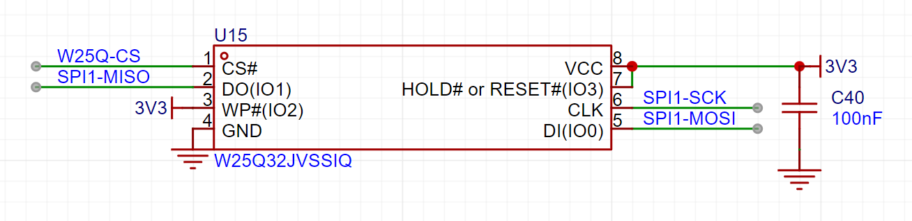
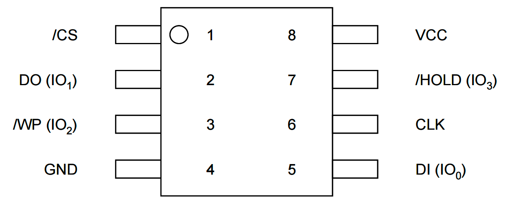
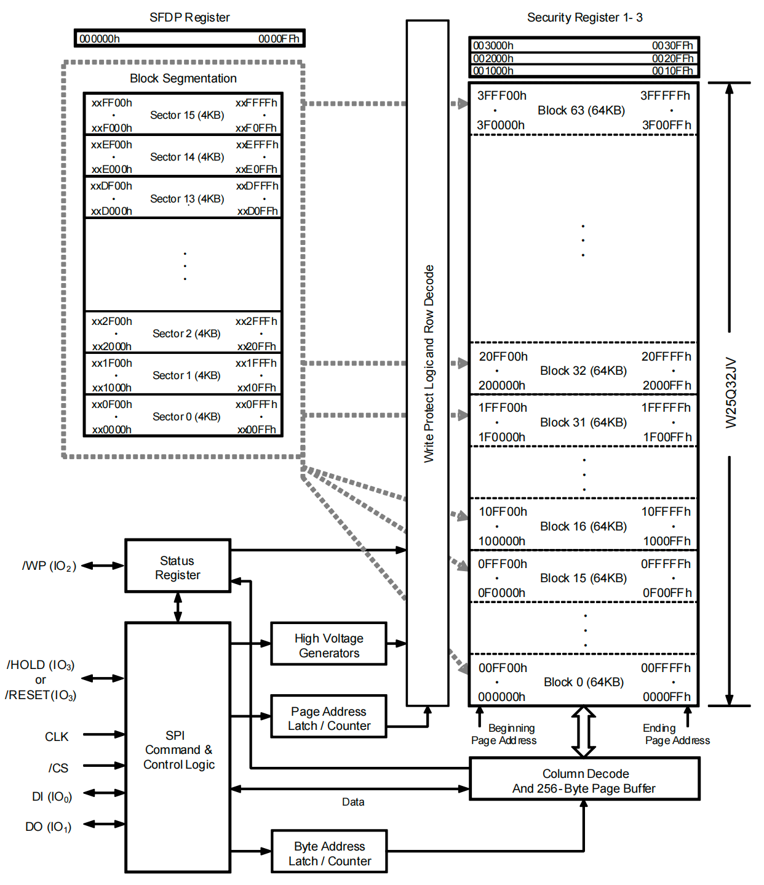
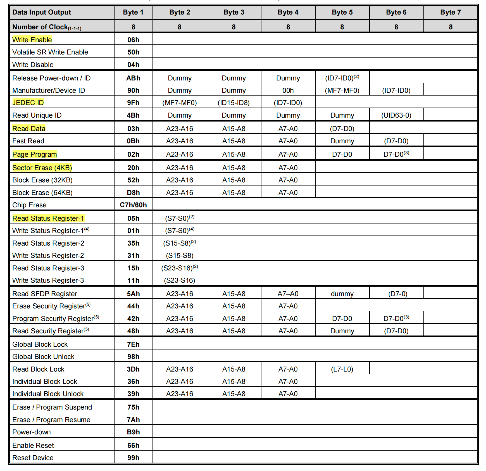
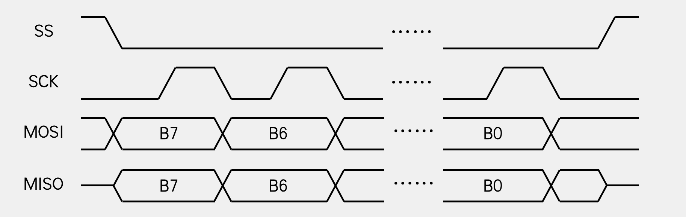
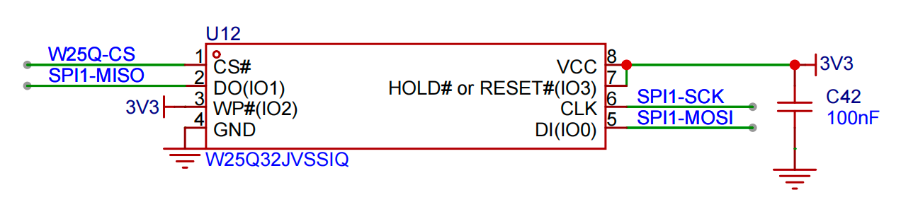
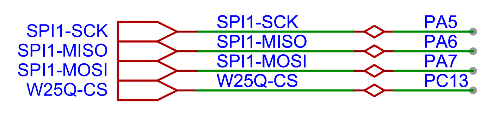
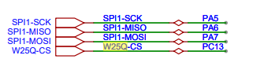
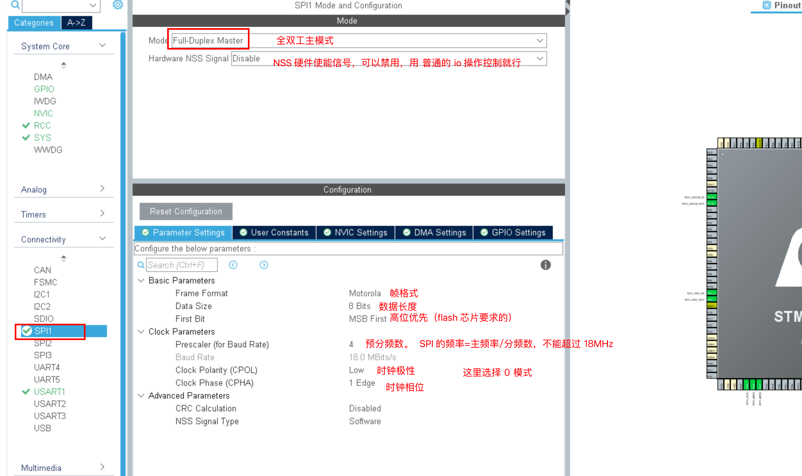
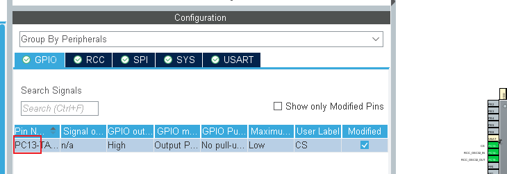

# SPI通信


## SPI通信介绍


## W25Q32介绍

W25Q32是一种使用SPI通讯协议的NOR FLASH存储器，它的CLK/DI/DO引脚分别连接到了STM32对应的SPI引脚SCK/MOSI/MISO上，其中STM32的NSS引脚虽然是其片上SPI外设的硬件引脚，但实际上后面的程序只是把它当成一个普通的GPIO，使用软件的方式控制NSS信号，所以在SPI的硬件设计中，NSS可以随便选择普通的GPIO，不必纠结于选择硬件NSS信号。

FLASH 芯片中还有WP和HOLD引脚。WP引脚可控制写保护功能，当该引脚为低电平时，禁止写入数据。我们直接接电源，不使用写保护功能。HOLD引脚可用于暂停通讯，该引脚为低电平时，通讯暂停，数据输出引脚输出高阻抗状态，时钟和数据输入引脚无效。我们直接接电源，不使用通讯暂停功能。



芯片的其他功能可以参考W25Q32参考手册。


注意：


###### 这个flash芯片只支持，模式0和模式3。


###### 写的时候必须是先擦除，擦除后再写入。


###### 移位是高位优先。

 




### W25Q32框图




### 写入操作注意事项


###### 写入操作前，必须先进行写使能。


###### 每个数据位只能由1改写为0，不能由0改写为1。


###### 写入数据前必须先檫除，檫除后，所有数据位变为1。擦除必须按最小擦除单元进行。


###### 连续写入多字节时，最多写入一页的数据，超过页尾位置的数据，会回到页首覆盖写入。


###### 写入操作结束后，芯片进入忙状态，不响应新的读写操作。


### 读取操作注意事项


###### 直接调用读取时序，无需读使能，无需额外操作，没有页的限制。


###### 读取操作结束后不会进入忙状态，但不能在忙状态时读取。


### 读写指令




### 交换数据时序

我们一般使用SPI的模式0（CPOL=0，CPHA=0），下面是模式0的数据交换时序图。




## SPI案例1：软件模拟SPI读写FLASH


### 需求描述

基于寄存器操作，使用软件模拟SPI协议，完成读写FLASH。


### 硬件电路设计






### 软件设计（寄存器）


#### main.c

```c
#include "Driver_USART.h"

#include "Delay.h"
#include "Inf_W25Q32.h"

int main()
{
    Driver_USART1_Init();
    Inf_W25Q32_Init();

    /* 读取id测试是否正常 */
    uint8_t mid = 0;
    uint16_t did = 0;
    Inf_W25Q32_ReadId(&mid, &did);
    printf("mid=0x%X, did=0x%X\r\n", mid, did);

    /* 先擦除 */;
    Inf_W25Q32_EraseSector(0,0);
    
    Inf_W25Q32_WritePage(0,0,0, "12345678", 8);
    uint8_t buff[10] = {0};
    Inf_W25Q32_Read(0,0,0, buff, 8);

    printf("%s\r\n", buff);

    while (1)
    {
     
    }
}
```


#### Driver_SPI.h

```c
#ifndef __DRIVER_SPI_H
#define __DRIVER_SPI_H

#include "stm32f10x.h"
#include "Delay.h"

#define CS_HIGH (GPIOC->ODR |= GPIO_ODR_ODR13)
#define CS_LOW (GPIOC->ODR &= ~GPIO_ODR_ODR13)

#define SCK_HIGH (GPIOA->ODR |= GPIO_ODR_ODR5)
#define SCK_LOW (GPIOA->ODR &= ~GPIO_ODR_ODR5)

#define MOSI_HIGH (GPIOA->ODR |= GPIO_ODR_ODR7)
#define MOSI_LOW (GPIOA->ODR &= ~GPIO_ODR_ODR7)

#define MISO_READ (GPIOA->IDR & GPIO_IDR_IDR6)

#define SPI_DELAY Delay_us(5)

void Driver_SPI_Init(void);

void Driver_SPI_Start(void);

void Driver_SPI_Stop(void);

uint8_t Driver_SPI_SwapByte(uint8_t byte);

#endif
```


#### Driver_SPI.c

```c
#include "Driver_SPI.h"

void Driver_SPI_Init(void)
{
    /* 1. 开启GPIO时钟 PA和PC*/
    RCC->APB2ENR |= (RCC_APB2ENR_IOPCEN | RCC_APB2ENR_IOPAEN);

    /* 2. 设置引脚的工作模式 */
    /* 2.1 cs: 推挽输出 PC13*  CNF=00 MODE=11 */
    GPIOC->CRH &= ~GPIO_CRH_CNF13;
    GPIOC->CRH |= GPIO_CRH_MODE13;
    /* 2.2 sck: 推挽输出 PA5*/
    /* 2.3 mosi: 推挽输出 PA7*/
    GPIOA->CRL &= ~(GPIO_CRL_CNF5 | GPIO_CRL_CNF7);
    GPIOA->CRL |= (GPIO_CRL_MODE5 | GPIO_CRL_MODE7);
    /* 2.4 miso: 浮空输入 PA6  CNF=01 MODE=00*/
    GPIOA->CRL &= ~(GPIO_CRL_CNF6_1 | GPIO_CRL_MODE6);
    GPIOA->CRL |= GPIO_CRL_CNF6_0;

    /* 3. spi的模式0  sck空闲状态是 0   */
    SCK_LOW;
    /* 4. 片选默认不选中 */
    CS_HIGH;

    /* 5. 延时 */
    SPI_DELAY;
}
void Driver_SPI_Start(void)
{
    CS_LOW;
    // SPI_DELAY;
}

void Driver_SPI_Stop(void)
{
    CS_HIGH;
    // SPI_DELAY;
}

uint8_t Driver_SPI_SwapByte(uint8_t byte)
{
    uint8_t rByte = 0x00;
    for (uint8_t i = 0; i < 8; i++)
    {
        //(byte & 0x80) ? MOSI_HIGH : MOSI_LOW;
        /* 1. 先把数据放入到MOSI上 */
        if (byte & 0x80)
        {
            MOSI_HIGH;
        }
        else
        {
            MOSI_LOW;
        }
        byte <<= 1;
        // SPI_DELAY;
        /* 2. 拉高时钟 (第一个跳变)*/
        SCK_HIGH;
        // SPI_DELAY;
        /* 3. 读取miso  (第一个跳变采样)*/
        rByte <<= 1;
        // MISO_READ ? rByte|= 0x01 : rByte;
        if (MISO_READ)
        {
            rByte |= 0x01;
        }
        /* 4. 拉低时钟 */
        SCK_LOW;
        // SPI_DELAY;
    }
    return rByte;
}
```


#### Inf_W25Q32.h

```c
#ifndef __INF_W25Q32_
#define __INF_W25Q32_

#include "Driver_SPI.h"

void Inf_W25Q32_Init(void);

void Inf_W25Q32_ReadId(uint8_t *mid, uint16_t *did);

void Inf_W25q32_WiteEnable(void);

void Inf_W25q32_WiteDisanable(void);

void Inf_W25Q32_WaiteNotBusy(void);

void Inf_W25Q32_EraseSector(uint8_t block, uint8_t sector);

void Inf_W25Q32_WritePage(uint8_t block, uint8_t sector, uint8_t page, uint8_t *data, uint16_t len);

void Inf_W25Q32_Read(uint8_t block, uint8_t sector, uint8_t page, uint8_t *data, uint16_t len);

#endif
```


#### Inf_W25Q32.h

```c
#include "Inf_W25Q32.h"
/*
一共64块(0-63) 每块16个扇区(0-15)  每个扇区16页(0-15)  每页256个字节
*/
void Inf_W25Q32_Init(void)
{
    Driver_SPI_Init();
}

void Inf_W25Q32_ReadId(uint8_t *mid, uint16_t *did)
{

    Driver_SPI_Start();

    /* 1. 发送 Jedec id指令 */
    Driver_SPI_SwapByte(0x9f);

    /* 2. 获取厂商id (发送的数据随意)*/
    *mid = Driver_SPI_SwapByte(0xff);

    /* 3. 获取设备id */
    *did = 0;
    *did |= Driver_SPI_SwapByte(0xff) << 8;
    *did |= Driver_SPI_SwapByte(0xff) & 0xff;

    Driver_SPI_Stop();
}

/**
 * @description: 读取内部寄存器的busy,一直等到不忙再结束函数
 * @return {*}
 */
void Inf_W25Q32_WaiteNotBusy(void)
{
    Driver_SPI_Start();
    Driver_SPI_SwapByte(0x05);

    while (Driver_SPI_SwapByte(0xff) & 0x01)
        ;
    Driver_SPI_Stop();
}

/**
 * @description: FLASH写使能  0x06
 * @return {*}
 */
void Inf_W25q32_WiteEnable(void)
{
    Driver_SPI_Start();
    Driver_SPI_SwapByte(0x06);
    Driver_SPI_Stop();
}

/**
 * @description: FLASH写失能  0x04
 * @return {*}
 */
void Inf_W25q32_WiteDisanable(void)
{
    Driver_SPI_Start();
    Driver_SPI_SwapByte(0x04);
    Driver_SPI_Stop();
}

/**
 * @description: 擦除指定块内的指定扇区
 *  一共64块(0-63) 每块16个扇区(0-15)  每个扇区16页(0-15)  每页256个字节
 * @param {uint8_t} block
 * @param {uint8_t} sector
 */
void Inf_W25Q32_EraseSector(uint8_t block, uint8_t sector)
{
    Inf_W25Q32_WaiteNotBusy();

    Inf_W25q32_WiteEnable();
    /* 计算出要擦除的扇区的首地址 */
    uint32_t sectorAddr = block * 0x010000 + sector * 0x001000;

    Driver_SPI_Start();
    Driver_SPI_SwapByte(0x20);
    // 0000 0000 0000 0000 0000 0000
    Driver_SPI_SwapByte(sectorAddr >> 16 & 0xff);
    Driver_SPI_SwapByte(sectorAddr >> 8 & 0xff);
    Driver_SPI_SwapByte(sectorAddr & 0xff);
    Driver_SPI_Stop();

    Inf_W25q32_WiteDisanable();
}

/**
 * @description: 执行页写入 写入时,从指定页的首地址开始写入.
 * @param {uint8_t} block
 * @param {uint8_t} sector
 * @param {uint8_t} page
 * @param {uint8_t*} data
 * @param {uint16_t} len
 */
void Inf_W25Q32_WritePage(uint8_t block,
                          uint8_t sector,
                          uint8_t page,
                          uint8_t *data,
                          uint16_t len)
{
    Inf_W25Q32_WaiteNotBusy();

    Inf_W25q32_WiteEnable();
    /* 计算出要写入的数据的页的首地址 */
    uint32_t pageAddr = block * 0x010000 + sector * 0x001000 + page * 0x000100;

    Driver_SPI_Start();
    Driver_SPI_SwapByte(0x02);

    Driver_SPI_SwapByte(pageAddr >> 16 & 0xff);
    Driver_SPI_SwapByte(pageAddr >> 8 & 0xff);
    Driver_SPI_SwapByte(pageAddr & 0xff);

    for (uint16_t i = 0; i < len; i++)
    {
        Driver_SPI_SwapByte(data[i]);
    }

    Driver_SPI_Stop();

    Inf_W25q32_WiteDisanable();
}

/**
 * @description: 从flash读取数据
 * @return {*}
 */
void Inf_W25Q32_Read(uint8_t block,
                     uint8_t sector,
                     uint8_t page,
                     uint8_t *data,
                     uint16_t len)
{
    Inf_W25Q32_WaiteNotBusy();
    
    uint32_t pageAddr = block * 0x010000 + sector * 0x001000 + page * 0x000100;

    Driver_SPI_Start();
    Driver_SPI_SwapByte(0x03);

    Driver_SPI_SwapByte(pageAddr >> 16 & 0xff);
    Driver_SPI_SwapByte(pageAddr >> 8 & 0xff);
    Driver_SPI_SwapByte(pageAddr & 0xff);
    for (uint16_t i = 0; i < len; i++)
    {
        data[i] = Driver_SPI_SwapByte(0xff);
    }

    Driver_SPI_Stop();
}
```


## SPI外设

与I2C外设一样，STM32芯片也集成了专门用于SPI协议通讯的外设。


##### SPI外设简介

STM32 的 SPI 外设可用作通讯的主机及从机，支持最高的 SCK 时钟频率为 fpclk/2 （STM32F103 型号的芯片默认fpclk1为36MHz，fpclk2为72MHz。），完全支持 SPI 协议的 4 种模式，数据帧长度可设置为 8 位或 16 位，可设置数据 MSB 先行或 LSB 先行。它还支持双线全双工、单线双向以及单线模式。

STM32F103系列提供了3个SPI，SPI1挂在APB2总线，SPI2/3挂在APB1总线。

用的比较多还是双线全双工模式。


##### SPI外设框图


## SPI案例2：SPI外设读写Flash


### 需求描述

基于寄存器操作，使用SPI功能，完成Flash的读写。


### 硬件电路设计





### 软件设计（寄存器）


#### main.c

```c
#include "Driver_USART.h"

#include "Delay.h"
#include "Inf_W25Q32.h"

int main()
{
    Driver_USART1_Init();
    Inf_W25Q32_Init();

    /* 读取id测试是否正常 */
    uint8_t mid = 0;
    uint16_t did = 0;
    Inf_W25Q32_ReadId(&mid, &did);
    printf("mid=0x%X, did=0x%X\r\n", mid, did);

    /* 先擦除 */;
    Inf_W25Q32_EraseSector(0,0);
    Inf_W25Q32_EraseSector(0,1);
    
    Inf_W25Q32_WritePage(0,0,0, "abc", 3);
    Inf_W25Q32_WritePage(0,1,0, "456", 3);
    uint8_t buff[10] = {0};
    Inf_W25Q32_Read(0,0,0, buff, 3);
    printf("%s\r\n", buff);
    Inf_W25Q32_Read(0,1,0, buff, 3);
    printf("%s\r\n", buff);

    while (1)
    {
     
    }
}
```


#### Driver_SPI.h

```c
#ifndef __DRIVER_SPI_H
#define __DRIVER_SPI_H

#include "stm32f10x.h"
#include "Delay.h"

#define CS_HIGH (GPIOC->ODR |= GPIO_ODR_ODR13)
#define CS_LOW (GPIOC->ODR &= ~GPIO_ODR_ODR13)

#define SPI_DELAY Delay_us(5)

void Driver_SPI_Init(void);

void Driver_SPI_Start(void);

void Driver_SPI_Stop(void);

uint8_t Driver_SPI_SwapByte(uint8_t byte);

#endif
```


#### Driver_SPI.c

```c
#include "Driver_SPI.h"

void Driver_SPI_Init(void)
{
    /* 1. 开启SPI1的时钟 开启GPIO时钟 PA和PC*/
    RCC->APB2ENR |= (RCC_APB2ENR_SPI1EN | RCC_APB2ENR_IOPCEN | RCC_APB2ENR_IOPAEN);

    /* 2. 设置引脚的工作模式 */
    /* 2.1 cs: 通用推挽输出 PC13*  CNF=00 MODE=11 */
    GPIOC->CRH &= ~GPIO_CRH_CNF13;
    GPIOC->CRH |= GPIO_CRH_MODE13;
    /* 2.2 sck: 推挽输出 PA5*/ /* cnf=10  mode=11 */
    /* 2.3 mosi: 推挽输出 PA7*/
    GPIOA->CRL |= (GPIO_CRL_MODE5 | GPIO_CRL_MODE7 | GPIO_CRL_CNF7_1 | GPIO_CRL_CNF5_1);
    GPIOA->CRL &= ~(GPIO_CRL_CNF5_0 | GPIO_CRL_CNF7_0);
    /* 2.4 miso: 浮空输入 PA6  CNF=01 MODE=00*/
    GPIOA->CRL &= ~(GPIO_CRL_CNF6_1 | GPIO_CRL_MODE6);
    GPIOA->CRL |= GPIO_CRL_CNF6_0;

    /* 3. SPI相关的配置 */
    /* 3.1 配置SPI1为主模式 */
    SPI1->CR1 |= SPI_CR1_MSTR;
    /* 3.2 NSS禁用, 从设备的片选使用普通的GPIO控制*/
    SPI1->CR1 |= SPI_CR1_SSM;
    SPI1->CR2 &= ~SPI_CR2_SSOE;
    SPI1->CR1 |= SPI_CR1_SSI;
    /* 3.3 配置SPI的工作模式 模式0   时钟极性和相位*/
    SPI1->CR1 &= ~(SPI_CR1_CPOL | SPI_CR1_CPHA);
    /* 3.4 配置波特率的分频系数 0=2分频 1=4分频 2=8分频 ....*/
    SPI1->CR1 &= ~SPI_CR1_BR;
    SPI1->CR1 |= SPI_CR1_BR_1;
    /* 3.5 配置数据帧的格式: 8位或16位 */
    SPI1->CR1 &= ~SPI_CR1_DFF;
    /* 3.6 配置LSB 或 MSB*/
    SPI1->CR1 &= ~SPI_CR1_LSBFIRST;
    /* 3.7 使能SPI */
    SPI1->CR1 |= SPI_CR1_SPE;
}
void Driver_SPI_Start(void)
{
    CS_LOW;
}

void Driver_SPI_Stop(void)
{
    CS_HIGH;
}

uint8_t Driver_SPI_SwapByte(uint8_t byte)
{
    /* 1. 写数据到发送缓冲区 */
    /* 1.1 判断发送缓冲区为空 */
    while ((SPI1->SR & SPI_SR_TXE) == 0)
        ;
    /* 1.2 把数据放入DR寄存器 */
    SPI1->DR = byte;
    /* 2. 读数据 */
    /* 2.1 先判断接收缓冲区非空 */
    while ((SPI1->SR & SPI_SR_RXNE) == 0)
        ;
    /* 2.1 从接收缓冲区读取数据 */
    return (uint8_t)(SPI1->DR & 0xff);
}
```


#### Inf_W25Q32.h

```c
#ifndef __INF_W25Q32_
#define __INF_W25Q32_

#include "Driver_SPI.h"

void Inf_W25Q32_Init(void);

void Inf_W25Q32_ReadId(uint8_t *mid, uint16_t *did);

void Inf_W25q32_WiteEnable(void);

void Inf_W25q32_WiteDisanable(void);

void Inf_W25Q32_WaiteNotBusy(void);

void Inf_W25Q32_EraseSector(uint8_t block, uint8_t sector);

void Inf_W25Q32_WritePage(uint8_t block, uint8_t sector, uint8_t page, uint8_t *data, uint16_t len);

void Inf_W25Q32_Read(uint8_t block, uint8_t sector, uint8_t page, uint8_t *data, uint16_t len);

#endif
```


#### Inf_W25Q32.c

```c
#include "Inf_W25Q32.h"
/*
一共64块(0-63) 每块16个扇区(0-15)  每个扇区16页(0-15)  每页256个字节
*/
void Inf_W25Q32_Init(void)
{
    Driver_SPI_Init();
}

void Inf_W25Q32_ReadId(uint8_t *mid, uint16_t *did)
{

    Driver_SPI_Start();

    /* 1. 发送 Jedec id指令 */
    Driver_SPI_SwapByte(0x9f);

    /* 2. 获取厂商id (发送的数据随意)*/
    *mid = Driver_SPI_SwapByte(0xff);

    /* 3. 获取设备id */
    *did = 0;
    *did |= Driver_SPI_SwapByte(0xff) << 8;
    *did |= Driver_SPI_SwapByte(0xff) & 0xff;

    Driver_SPI_Stop();
}

/**
 * @description: 读取内部寄存器的busy,一直等到不忙再结束函数
 * @return {*}
 */
void Inf_W25Q32_WaiteNotBusy(void)
{
    Driver_SPI_Start();
    Driver_SPI_SwapByte(0x05);

    while (Driver_SPI_SwapByte(0xff) & 0x01)
        ;
    Driver_SPI_Stop();
}

/**
 * @description: FLASH写使能  0x06
 * @return {*}
 */
void Inf_W25q32_WiteEnable(void)
{
    Driver_SPI_Start();
    Driver_SPI_SwapByte(0x06);
    Driver_SPI_Stop();
}

/**
 * @description: FLASH写失能  0x04
 * @return {*}
 */
void Inf_W25q32_WiteDisanable(void)
{
    Driver_SPI_Start();
    Driver_SPI_SwapByte(0x04);
    Driver_SPI_Stop();
}

/**
 * @description: 擦除指定块内的指定扇区
 *  一共64块(0-63) 每块16个扇区(0-15)  每个扇区16页(0-15)  每页256个字节
 * @param {uint8_t} block
 * @param {uint8_t} sector
 */
void Inf_W25Q32_EraseSector(uint8_t block, uint8_t sector)
{
    Inf_W25Q32_WaiteNotBusy();

    Inf_W25q32_WiteEnable();
    /* 计算出要擦除的扇区的首地址 */
    uint32_t sectorAddr = block * 0x010000 + sector * 0x001000;

    Driver_SPI_Start();
    Driver_SPI_SwapByte(0x20);
    // 0000 0000 0000 0000 0000 0000
    Driver_SPI_SwapByte(sectorAddr >> 16 & 0xff);
    Driver_SPI_SwapByte(sectorAddr >> 8 & 0xff);
    Driver_SPI_SwapByte(sectorAddr & 0xff);
    Driver_SPI_Stop();

    Inf_W25q32_WiteDisanable();
}

/**
 * @description: 执行页写入 写入时,从指定页的首地址开始写入.
 * @param {uint8_t} block
 * @param {uint8_t} sector
 * @param {uint8_t} page
 * @param {uint8_t*} data
 * @param {uint16_t} len
 */
void Inf_W25Q32_WritePage(uint8_t block,
                          uint8_t sector,
                          uint8_t page,
                          uint8_t *data,
                          uint16_t len)
{
    Inf_W25Q32_WaiteNotBusy();

    Inf_W25q32_WiteEnable();
    /* 计算出要写入的数据的页的首地址 */
    uint32_t pageAddr = block * 0x010000 + sector * 0x001000 + page * 0x000100;

    Driver_SPI_Start();
    Driver_SPI_SwapByte(0x02);

    Driver_SPI_SwapByte(pageAddr >> 16 & 0xff);
    Driver_SPI_SwapByte(pageAddr >> 8 & 0xff);
    Driver_SPI_SwapByte(pageAddr & 0xff);

    for (uint16_t i = 0; i < len; i++)
    {
        Driver_SPI_SwapByte(data[i]);
    }

    Driver_SPI_Stop();

    Inf_W25q32_WiteDisanable();
}

/**
 * @description: 从flash读取数据
 * @return {*}
 */
void Inf_W25Q32_Read(uint8_t block,
                     uint8_t sector,
                     uint8_t page,
                     uint8_t *data,
                     uint16_t len)
{
    Inf_W25Q32_WaiteNotBusy();
    
    uint32_t pageAddr = block * 0x010000 + sector * 0x001000 + page * 0x000100;

    Driver_SPI_Start();
    Driver_SPI_SwapByte(0x03);

    Driver_SPI_SwapByte(pageAddr >> 16 & 0xff);
    Driver_SPI_SwapByte(pageAddr >> 8 & 0xff);
    Driver_SPI_SwapByte(pageAddr & 0xff);
    for (uint16_t i = 0; i < len; i++)
    {
        data[i] = Driver_SPI_SwapByte(0xff);
    }

    Driver_SPI_Stop();
}
```


### 软件设计（HAL库）


#### STM32CubeMx设置






#### 添加其他代码


#### main.c

```c
int main(void)
{
   
    HAL_Init();
    SystemClock_Config();
    MX_GPIO_Init();
    MX_SPI1_Init();
    MX_USART1_UART_Init();
    /* 读取id测试是否正常 */
    uint8_t mid = 0;
    uint16_t did = 0;
    Inf_W25Q32_ReadId(&mid, &did);
    printf("mid=0x%X, did=0x%X\r\n", mid, did);

    /* 先擦除 */;
    Inf_W25Q32_EraseSector(0, 0);
    Inf_W25Q32_EraseSector(0, 1);

    Inf_W25Q32_WritePage(0, 0, 0, "abc", 3);
    Inf_W25Q32_WritePage(0, 1, 0, "456", 3);
    uint8_t buff[10] = {0};
    Inf_W25Q32_Read(0, 0, 0, buff, 3);
    printf("%s\r\n", buff);
    Inf_W25Q32_Read(0, 1, 0, buff, 3);
    printf("%s\r\n", buff);
    while (1)
    {
    }
}
```


#### spi.h

在spi.h中添加如下代码

```c
/* USER CODE BEGIN Prototypes */
void Driver_SPI_Start(void);
void Driver_SPI_Stop(void);
uint8_t Driver_SPI_SwapByte(uint8_t byte);
/* USER CODE END Prototypes */
```


#### spi.c

在spi.c中添加如下代码

```c
/* USER CODE BEGIN 1 */
void Driver_SPI_Start(void)
{
    HAL_GPIO_WritePin(CS_GPIO_Port, CS_Pin, GPIO_PIN_RESET);
}
void Driver_SPI_Stop(void)
{
    HAL_GPIO_WritePin(CS_GPIO_Port, CS_Pin, GPIO_PIN_SET);
}

uint8_t Driver_SPI_SwapByte(uint8_t byte)
{
    uint8_t rByte;
    HAL_SPI_TransmitReceive(&hspi1, &byte, &rByte, 1, 2000);
    return rByte;
}
/* USER CODE END 1 */
```


#### nf_W25Q32.h

```c
#ifndef __INF_W25Q32_
#define __INF_W25Q32_

#include "spi.h"

void Inf_W25Q32_Init(void);

void Inf_W25Q32_ReadId(uint8_t *mid, uint16_t *did);

void Inf_W25q32_WiteEnable(void);

void Inf_W25q32_WiteDisanable(void);

void Inf_W25Q32_EraseSector(uint8_t block, uint8_t sector);

void Inf_W25Q32_WritePage(uint8_t block, uint8_t sector, uint8_t page, uint8_t *data, uint16_t len);

void Inf_W25Q32_Read(uint8_t block, uint8_t sector, uint8_t page, uint8_t *data, uint16_t len);

#endif
```


#### Inf_W25Q32.c

```c
#include "Inf_W25Q32.h"
/*
一共64块(0-63) 每块16个扇区(0-15)  每个扇区16页(0-15)  每页256个字节
*/
void Inf_W25Q32_Init(void)
{
    Driver_SPI_Init();
}

void Inf_W25Q32_ReadId(uint8_t *mid, uint16_t *did)
{

    Driver_SPI_Start();

    /* 1. 发送 Jedec id指令 */
    Driver_SPI_SwapByte(0x9f);

    /* 2. 获取厂商id (发送的数据随意)*/
    *mid = Driver_SPI_SwapByte(0xff);

    /* 3. 获取设备id */
    *did = 0;
    *did |= Driver_SPI_SwapByte(0xff) << 8;
    *did |= Driver_SPI_SwapByte(0xff) & 0xff;

    Driver_SPI_Stop();
}

/**
 * @description: 读取内部寄存器的busy,一直等到不忙再结束函数
 * @return {*}
 */
void Inf_W25Q32_WaiteNotBusy(void)
{
    Driver_SPI_Start();
    Driver_SPI_SwapByte(0x05);

    while (Driver_SPI_SwapByte(0xff) & 0x01)
        ;
    Driver_SPI_Stop();
}

/**
 * @description: FLASH写使能  0x06
 * @return {*}
 */
void Inf_W25q32_WiteEnable(void)
{
    Driver_SPI_Start();
    Driver_SPI_SwapByte(0x06);
    Driver_SPI_Stop();
}

/**
 * @description: FLASH写失能  0x04
 * @return {*}
 */
void Inf_W25q32_WiteDisanable(void)
{
    Driver_SPI_Start();
    Driver_SPI_SwapByte(0x04);
    Driver_SPI_Stop();
}

/**
 * @description: 擦除指定块内的指定扇区
 *  一共64块(0-63) 每块16个扇区(0-15)  每个扇区16页(0-15)  每页256个字节
 * @param {uint8_t} block
 * @param {uint8_t} sector
 */
void Inf_W25Q32_EraseSector(uint8_t block, uint8_t sector)
{
    Inf_W25Q32_WaiteNotBusy();

    Inf_W25q32_WiteEnable();
    /* 计算出要擦除的扇区的首地址 */
    uint32_t sectorAddr = block * 0x010000 + sector * 0x001000;

    Driver_SPI_Start();
    Driver_SPI_SwapByte(0x20);
    // 0000 0000 0000 0000 0000 0000
    Driver_SPI_SwapByte(sectorAddr >> 16 & 0xff);
    Driver_SPI_SwapByte(sectorAddr >> 8 & 0xff);
    Driver_SPI_SwapByte(sectorAddr & 0xff);
    Driver_SPI_Stop();

    Inf_W25q32_WiteDisanable();
}

/**
 * @description: 执行页写入 写入时,从指定页的首地址开始写入.
 * @param {uint8_t} block
 * @param {uint8_t} sector
 * @param {uint8_t} page
 * @param {uint8_t*} data
 * @param {uint16_t} len
 */
void Inf_W25Q32_WritePage(uint8_t block,
                          uint8_t sector,
                          uint8_t page,
                          uint8_t *data,
                          uint16_t len)
{
    Inf_W25Q32_WaiteNotBusy();

    Inf_W25q32_WiteEnable();
    /* 计算出要写入的数据的页的首地址 */
    uint32_t pageAddr = block * 0x010000 + sector * 0x001000 + page * 0x000100;

    Driver_SPI_Start();
    Driver_SPI_SwapByte(0x02);

    Driver_SPI_SwapByte(pageAddr >> 16 & 0xff);
    Driver_SPI_SwapByte(pageAddr >> 8 & 0xff);
    Driver_SPI_SwapByte(pageAddr & 0xff);

    for (uint16_t i = 0; i < len; i++)
    {
        Driver_SPI_SwapByte(data[i]);
    }

    Driver_SPI_Stop();

    Inf_W25q32_WiteDisanable();
}

/**
 * @description: 从flash读取数据
 * @return {*}
 */
void Inf_W25Q32_Read(uint8_t block,
                     uint8_t sector,
                     uint8_t page,
                     uint8_t *data,
                     uint16_t len)
{
    Inf_W25Q32_WaiteNotBusy();
    
    uint32_t pageAddr = block * 0x010000 + sector * 0x001000 + page * 0x000100;

    Driver_SPI_Start();
    Driver_SPI_SwapByte(0x03);

    Driver_SPI_SwapByte(pageAddr >> 16 & 0xff);
    Driver_SPI_SwapByte(pageAddr >> 8 & 0xff);
    Driver_SPI_SwapByte(pageAddr & 0xff);
    for (uint16_t i = 0; i < len; i++)
    {
        data[i] = Driver_SPI_SwapByte(0xff);
    }

    Driver_SPI_Stop();
}
```

