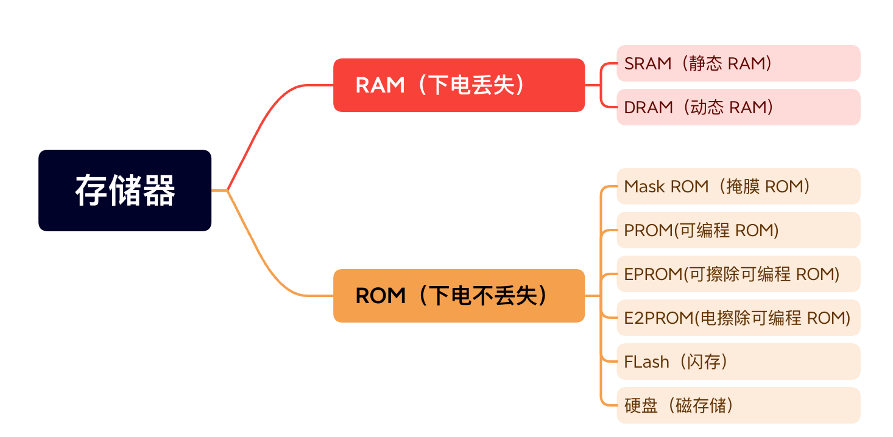
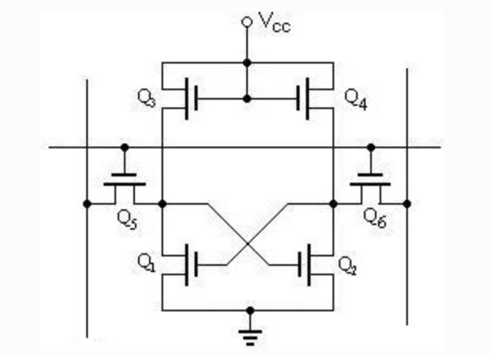
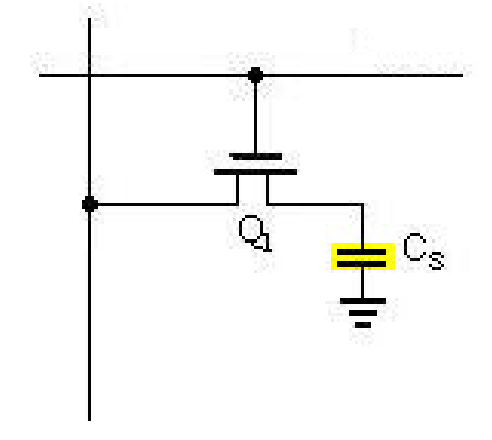
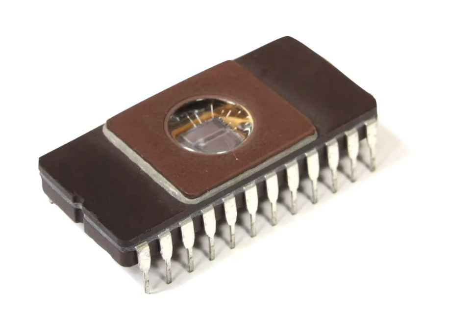
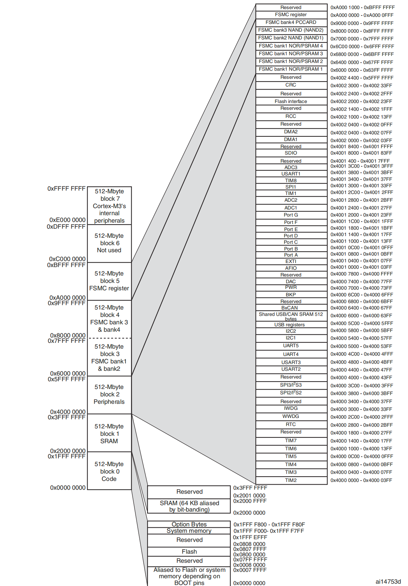
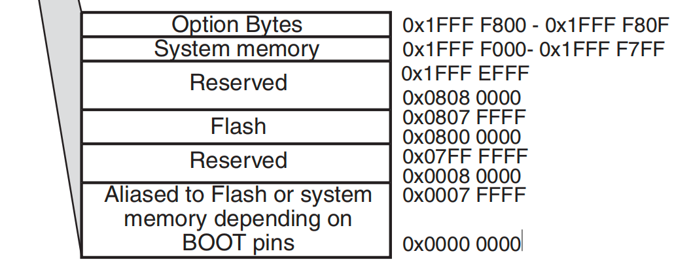
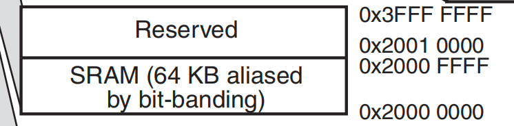
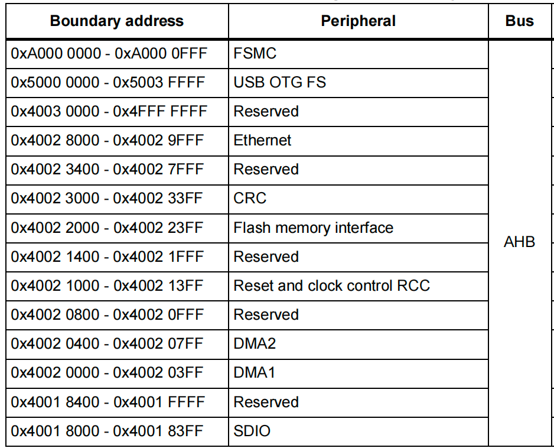
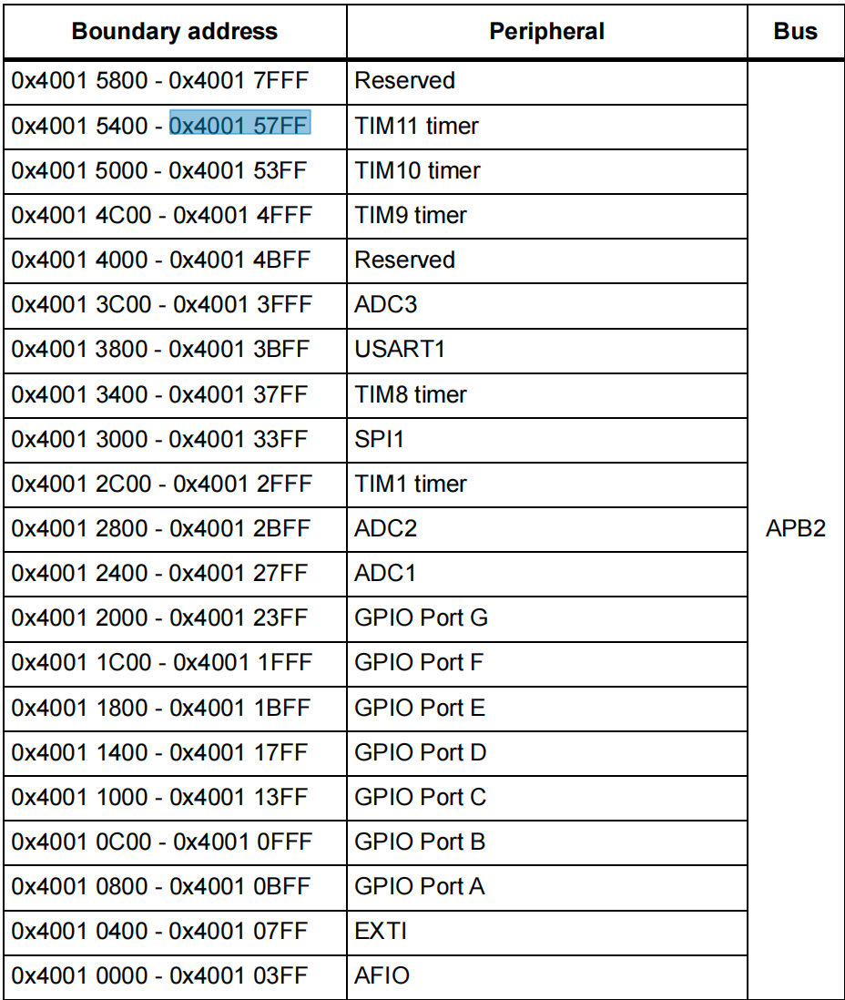
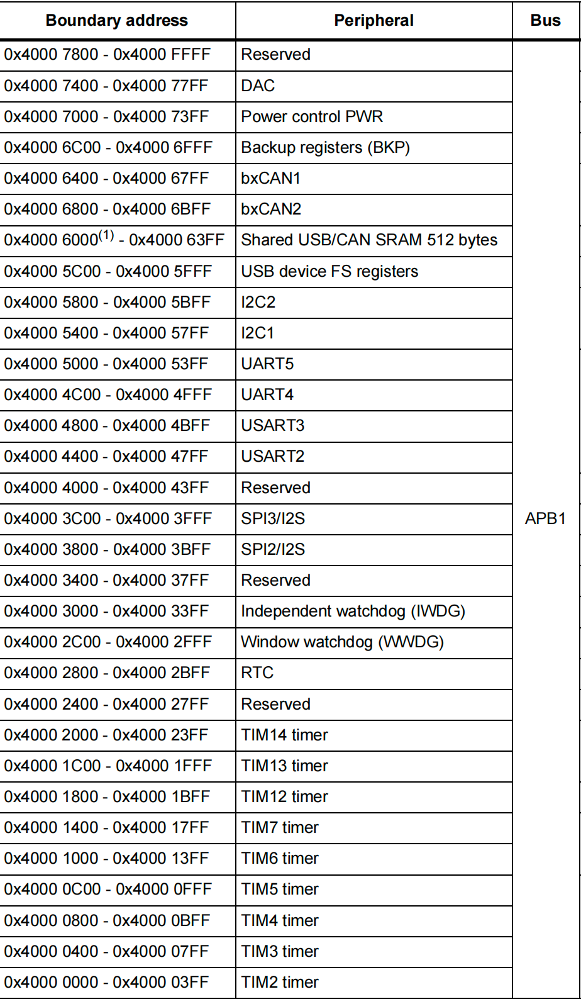

# 存储器和寄存器


## 存储器


### 常见的存储器介绍

存储器是计算机结构的重要组成部分。存储器是用来存储程序代码和数据的部件，有了存储器计算机才具有记忆功能。




#### RAM


##### SRAM

Static Random-Access Memory，静态随机存取存储器。是RAM的一种，所谓的“静态”，是指这种存储器只要保持通电，里面储存的数据就可以恒常保持。

是用电路存储数据，基本结构就是前面大家学习过的那种触发器结构（比如D触发器）。容量一般较低，用于高速缓存。比如芯片内部的寄存器就可以看成一种SRAM。




##### DRAM

动态随机存储器DRAM的存储单元以电容的电荷来表示数据，有电荷代表1，无电荷代表0。

但时间一长，代表1的电容会放电，代表0的电容会吸收电荷，因此它需要定期刷新操作，这就是“动态（Dynamic）”一词所形容的特性。

刷新操作会对电容进行检查，若电量大于满电量的1 / 2，则认为其代表1，并把电容充满电；若电量小于1 / 2，则认为其代表 0，并把电容放电，藉此来保证数据的正确性。




#### ROM

ROM 是“Read Only Memory”的缩写，意为只能读的存储器。由于技术的发展，后来设计出了可以方便写入数据的ROM，而这个“Read Only Memory”的名称被沿用下来了，现在一般用于指代非易失性半导体存储器，包括后面介绍的 FLASH 存储器，有些人也把它归到 ROM 类里边。


##### MASK ROM

MASK（掩膜）ROM 就是正宗的“Read Only Memory”，存储在它内部的数据是在出厂时使用特殊工艺固化的，生产后就不可修改，其主要优势是大批量生产时成本低。当前在生产量大，数据不需要修改的场合，还有应用。


##### PROM

PROM（Programable ROM）为可编程ROM。但是只供用户写入一次。


##### EPROM

EPROM（Erasable Programmable ROM）是可重复擦写的存储器，它解决了PROM芯片只能写入一次的问题。这种存储器使用紫外线照射（30分钟）芯片内部擦除数据，擦除和写入都要专用的设备。现在这种存储器基本淘汰，被EEPROM取代。




##### PROM


PROM（Electrically Erasable Programmable ROM）是电可擦除存储器。EEPROM可以重复擦写，它的擦除和写入都是直接使用电路控制，不需要再使用外部设备来擦写。而且可以按字节为单位修改数据，无需整个芯片擦除。现在主要使用的ROM芯片都是EEPROM。


##### Flash


FLASH存储器又称为闪存，它也是可重复擦写的存储器，部分书籍会把FLASH存储器称为 FLASH ROM，但它的容量一般比EEPROM大得多，且在擦除时，一般以多个字节为单位。


##### 硬盘（磁盘）

又称磁盘，是靠磁性来存储数据的。


### STM32的存储器

STM32包含片内SRAM（64K）：它可以以字节、半字（16位）或全字（32位）访问。SRAM的起始地址是0x2000 0000。

片内Flash（最大可达2M）。


### 存储器映射

什么叫存储器映射呢？存储器本身并不具备地址信息，那么CPU要准确找到存储某个信息的存储单元，就必须为这些单元分配一个相互可区分的标识，这个标识就是常说的地址编码。

STM32中集成多种存储器（各种外设也需要分配地址），同一类型的存储器当作一组block，为每一个block分配一个数值连续，存储单元数相等，以16进制表示的自然数集合作为存储器Block的地址编码。这种自然数集合与存储器Block的对应关系就是存储器映射。

存储器映射其实就是将芯片理论上的地址分配给各个存储器。

需要注意的是：存储器映射并不是只针对SRAM和片内Flash做地址映射，其实所有的片内外设（比如IO口）都需要地址，也都需要做映射。


### STM32具体存储器映射图

芯片能访问的存储空间有多大，是由谁定的？这个是由芯片的地址总线的数量决来定的，STM32芯片内部的地址总线为32根。所以STM32有4G的地址空间。（这个4GB的是STM32理论分配的地址空间。也就是说实际上并不是有这么大的存储单元，很多地址都是预留地址，空着还没用呢）。

程序存储器、数据存储器、寄存器和输入输出端口被组织在这个4GB的线性地址空间内。数据字节以小端格式（先存低位再存高位）存放在存储器中。

ARM把可访问的存储器空间分成8个主要块，每个块为512MB。这个容量是非常大的，因此芯片厂商就在每块容量范围内设计各自特色的外设。但是每块区域容量占用越大，芯片成本就越高，所以说我们使用的 STM32 芯片都是只用了其中一部分。ARM 在对这 4GB 容量分块的时候是按照其功能划分，每块都有它特殊的用途。



在这8个Block里面，要特别注意Block0、Block1和Block2这3个块。因为其中包含了STM32芯片的内部 Flash、RAM和片上外设。下面还是根据存储器映射图内信息来简单的介绍下这3个Block里面的具体区域功能划分。


##### Block0



0x0000 0000-0x0007 FFFF：取决于BOOT引脚，可以是 Flash 的别名，也可以是系统存储器的别名。（512K）

0x0008 0000-0x07FF FFFF：预留。（1M）

0x0800 0000-0x0807 FFFF：片内 FLASH，我们编写的程序就放在这一区域（512K）

0x0808 0000-0x1FFF EFFF：预留。（383M）

0x1FFF F000-0x1FFF F7FF：系统存储器，里面存放的是 ST 出厂时烧写好的ISP自举程序，用户无法改动。使用串口下载的时候需要用到这部分程序。（2K）

0x1FFF F800-0x1FFF F80F：可选字节，用于配置读写保护、BOR级别、软件/硬件看门狗以及器件处于待机或停止模式下的复位。当芯片不小心被锁住之后，我们可以从RAM里面启动来修改这部分相应的寄存器位。

0x1FFF F810-0x1FFF FFFF：预留。


##### Block1



Block1用于设计片内的SRAM，例如STM32F103ZET6的SRAM是64KB。从存储器映射图中可以看到Block1内部又划分了几个功能块，我们按地址从低到高顺序依次介绍。

0x2000 0000-0x2000 FFFF：SRAM，容量为 64KB。

0x2001 0000-0x3FFF FFFF：预留。


##### Block2

Block2用于设计片内外设，根据外设总线速度的不同，Block2被划分为AHB和APB 两部分，APB又被分成APB1和APB2。这些都可以在上面存储器映射图中可看到。







0x4000 0000-0x4000 77FF：APB1总线外设。

0x4001 0000-0x4001 57FF：APB2总线外设。

0x4001 8000-0x4002 33FF：AHB总线外设。


##### Block3,4,5

在Block3、Block4、Block5中包含了FSMC扩展区域，可用于扩展如 SRAM，NORFLASH 和NANDFLASH等的外部存储器。


## 寄存器


### 什么是寄存器

前面我们学习了存储器ROM和RAM，还包括我们所有的片上外设我们都可以称为存储器，STM32通过存储器映射，就可以找到这些存储器。

我们编程的时候用的最多的还是寄存器，那么什么叫寄存器呢？

在存储器 Block2 这块区域，设计的是片上外设，它们以4个字节为1个单元，共 32bit，每一个单元对应不同的功能，当我们控制这些单元时就可以驱动外设工作。我们可以找到每个单元的起始地址，然后通过 C 语言指针的操作方式来访问这些单元，如果每次都是通过这种地址的方式来访问，不仅不好记忆还容易出错，这时我们可以根据每个单元功能的不同，以功能为名给这个内存单元取一个别名。

这个别名就是我们经常说的寄存器。

一句话总结：寄存器是单片机内部一种特殊的存储器，可以实现对单片机各个功能的控制。


### 寄存器映射

这个给已经分配好地址的有特定功能的存储器单元取别名的过程就叫寄存器映射。

寄存器映射在ST提供的头文件stm32f10x.h中已经通过预编译的形式完全映射好了，以后如果再操作某个特定外设的时候，就不用直接操作地址，直接操作对应的寄存器名就可以了。

比如PA这组IO端口的映射：

```c
// 外设基址
#define PERIPH_BASE           ((uint32_t)0x40000000) 
// APB2外设的基址 
#define APB2PERIPH_BASE       (PERIPH_BASE + 0x10000) 
// GPIOA 外设的基址
#define GPIOA_BASE            (APB2PERIPH_BASE + d)
// 做了类型转换，地址仍然是GPIOA 外设的基址
#define GPIOA               ((GPIO_TypeDef *) GPIOA_BASE)
```

