# FSMC控制器


## FSMC概述

MCU自带的FLASH和SRAM资源是十分有限的，相比于PC机的存储空间而言要小的可怜。一般情况对于嵌入式应用来说这点存储空间一般也就够用了，但避免不了一些大量消耗内存的应用， 比如说图像处理。对于这类对内存要求较高的应用，我们往往需要扩展一个FLASH或者SRAM。STM32提供的FSMC就是用来完成这项功能的。

FSMC（Flexible static memory controller，灵活的静态存储器控制器），STM32可以通过FSMC与SRAM、ROM、PSRAM、Nor Flash和NandFlash存储器的引脚相连，从而进行数据的交换。要注意的是，FSMC 只能扩展静态的内存（S:static），不能是动态的内存，比如 SDRAM 就不能扩展。

FSMC把AHB总线上的数据转换为对应外设的通信协议，控制外设的访问时序，以至于我们可以直接在程序中寻址访问。


## FSMC组成


### 功能框图

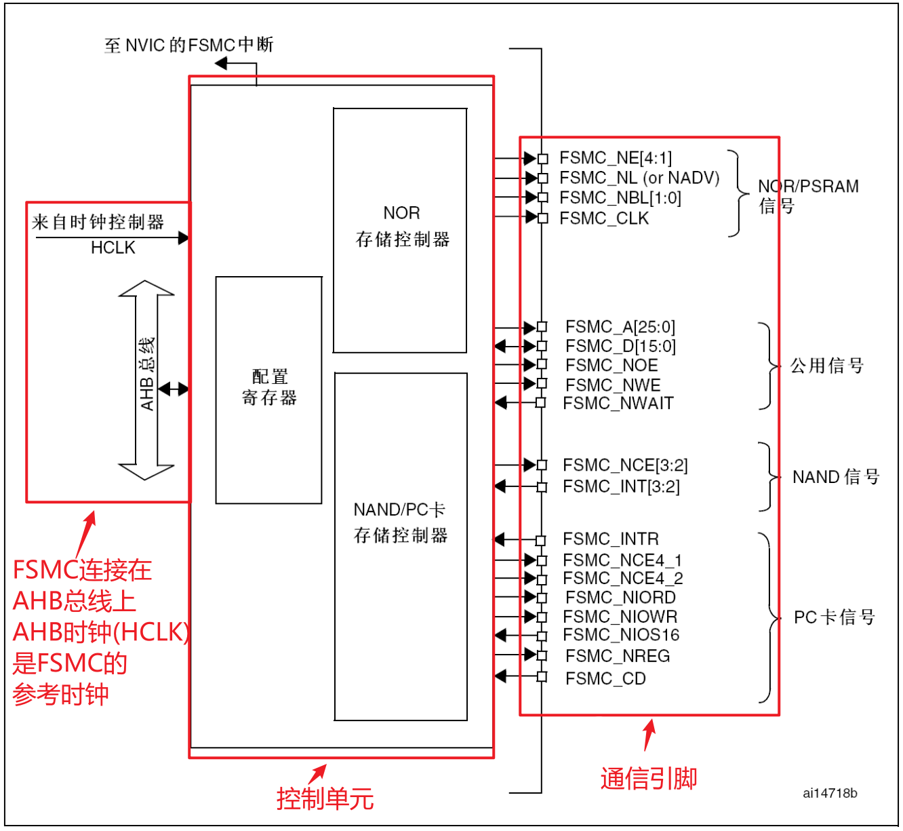

FSMC主要由4部分组成：AHB总线接口（包括FSMC的配置寄存器）、NOR闪存/SRAM控制器、NAND闪存/PC卡控制器、外设接口四个部分构成。

本次实验需要用到的引脚如下：


###### FSMC_A[25:0]：地址总线


###### FSMC_D[15:0]：双向数据总线


###### FSMC_NE[4:1]：片选引脚，低电平有效


###### FSMC_NOE：读使能，低电平有效


###### FSMC_NWE：写使能，低电平有效


### AHB总线接口

AHB总线接口是CPU、DMA等AHB总线主设备访问FSMC的通道，它负责把AHB总线事务转换成为外设通信的协议。

AHB总线事务的请求可以是8、16或者32位的，但外设器件的数据线位宽是恒定的。如果两者宽度相同就不存在什么问题，如果总线事务的位宽大于外设的位宽，那么总线接口将把总线事务拆分为多个连续的8位或16位形式访问外设。我们应当尽量避免总线事务宽度小于外设宽度的情况出现，因为这将可能导致数据的不一致，具体与外设类型有关系。

配置寄存器则描述了扩展外设的具体形式、通信协议和接口形式。用于总线接口将AHB总线事务转换为外设通信协议， 驱动NOR闪存/SRAM控制器和NAND闪存/PC卡控制器，进而控制外设。


### NOR闪存/PSRAM控制器

NOR/PSRAM内存控制器支持各种同步和异步的内存。所谓同步内存就是在读写内存的时候需要一个同步时钟来指导数据的发送和接收， 与我们在串口通信中提到的同步/异步通信是一个道理。对于同步内存，FSMC只会在读写操作的时候产生驱动时钟，而且其频率是系统总线时钟HCLK的分频。

NOR/PSRAM控制器用于生成适当的时序，以驱动8位、16位、32位的异步SRAM和ROM、异步或者突发模式的PSRAM和NOR闪存。我们通过配置寄存器描述外设的特征和时序后，控制器就可以为我们生成对应的驱动时序。


### NAND闪存/PC卡控制器

NAND/PC卡控制器用于驱动8位或者16位的NAND闪存以及16位的PC卡兼容设备。


### 外设接口

用于与要扩展外设联通用的。在接线时必须根据每个外设的特点，来进行合适的接线。


## 外部设备地址映射

从FSMC的角度看，可以把外部存储器划分为固定大小为4个256M字节的存储块。

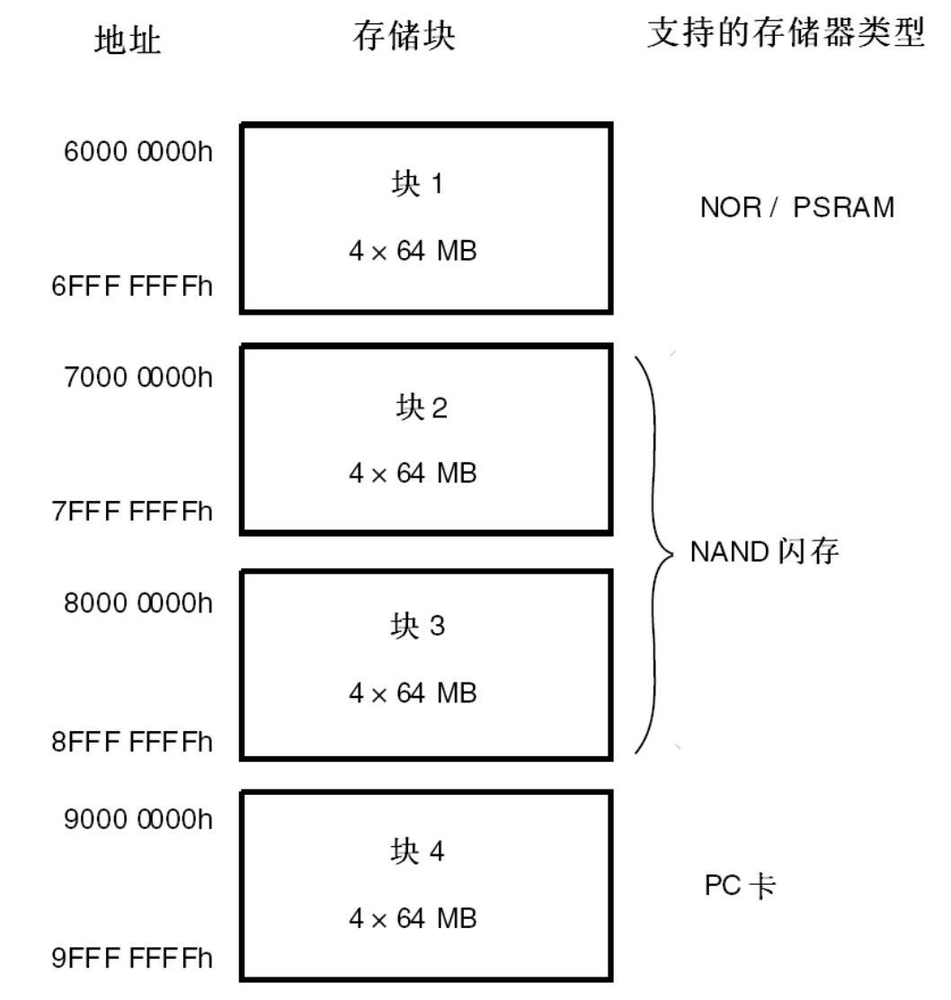

存储块1用于访问最多4个NOR闪存或PSRAM存储设备。这个存储区被划分为4个NOR/PSRAM区并有4个专用的片选。存储块2和3用于访问NAND闪存设备，每个存储块连接一个NAND闪存。存储块4用于访问PC卡设备。

每一个存储块上的存储器类型是由用户在配置寄存器中定义的。


## FSMC控制NOR闪存或PSRAM的时序

FSMC 外设支持输出多种不同的时序以便于控制不同的存储器，它具有6种模式：1，A，2/B，C，D，复用模式。

所有信号由内部时钟HCLK保持同步，但该时钟不会输出到外部扩展的存储器。FSMC始终在片选信号NE失效前对数据线采样，这样能够保证符合存储器的数据保持时序。

所有的控制器输出信号在内部时钟（HCLK）的上升沿变化，在同步写模式（PSRAM）下，读写的数据在存储器时钟（CLK）的下降沿变化。

我们以读写SRAM的模式A为例来介绍。

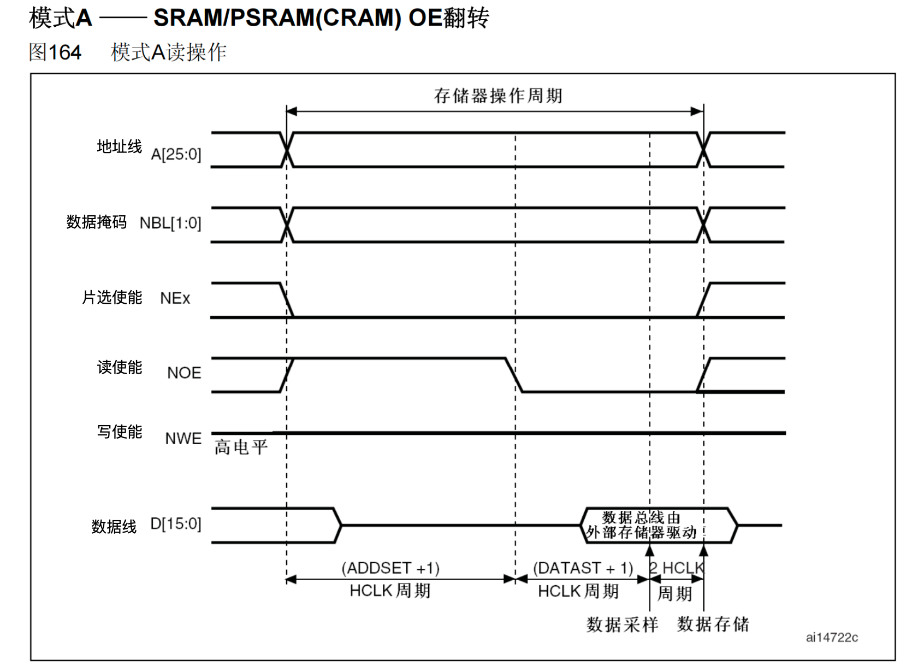

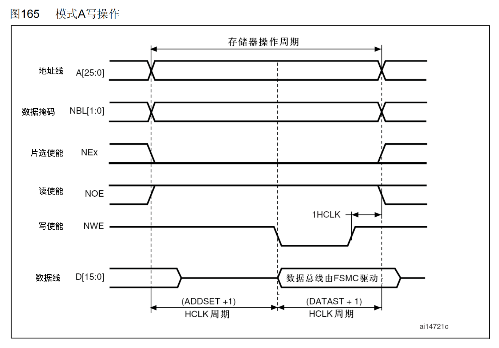

当内核发出访问某个指向外部存储器的地址时，FSMC外设会根据配置控制信号线产生时序访问存储器（硬件自动生成对应的时序），上图中的是访问外部 SRAM 时 FSMC 外设的读写时序。

在读时序中，一个存储器操作周期由1个地址建立周期（ADDSET），1个数据建立周期（DATASET）和2个HCLK周期组成。在地址建立周期中，地址线发出要访问的地址，数据掩码信号线指示出要读取地址的高、低字节部分，片选信号使能存储器芯片；地址建立周期结束后读使能信号线发出读使能信号，接着存储器通过数据信号线把目标数据传输给 FSMC，FSMC 把它交给内核。

写时序类似，区别是它的一个存储器操作周期仅由1个地址建立周期（ADDSET）和1个数据建立周期（DATAST）组成，且在数据建立周期期间写使能信号线发出写信号，接着 FSMC 把数据通过数据线传输到存储器中。


## FSMC应用案例：扩展外部SRAM


### 需求描述

使用FSMC扩展外部SRAM。然后把内存数据存储到外部SRAM中。

STM32F1 系列的芯片不支持扩展SDRAM（STM32F429 系列支持），它仅支持使用 FSMC 外设扩展 SRAM。由于引脚数量的限制，只有 STM32F103ZE 或以上型号的芯片才可以扩展外部 SRAM。


### SRAM芯片IS62WV51216


##### SRAM介绍

咱们开发板用的SRAM型号是IS62WV51216，就以这个为例来介绍SRAM。

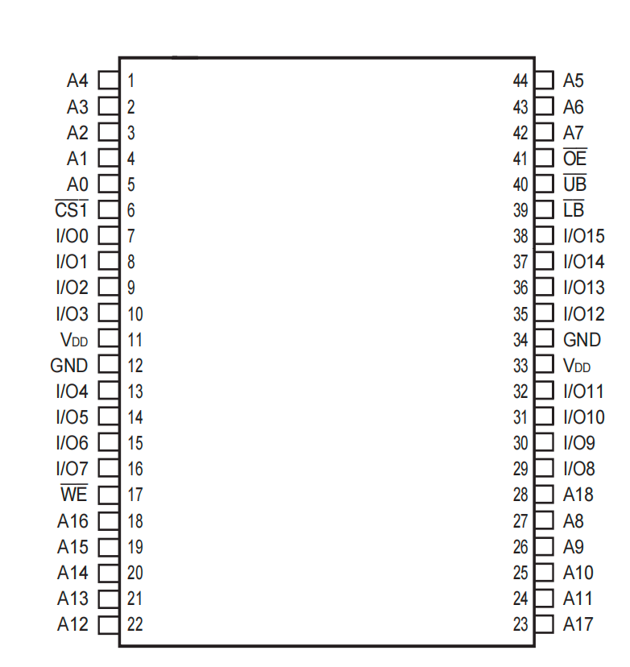


##### 功能框图

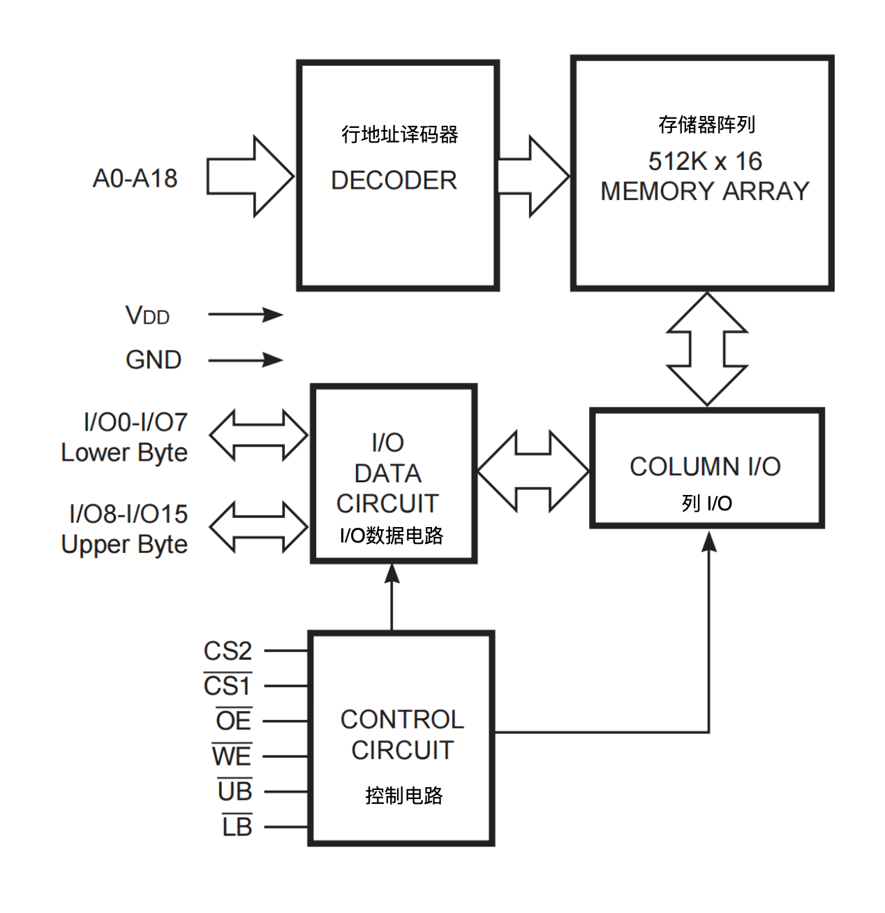


##### 信号线

信号线

类型

说明

A0-A18

I

地址输入

I/O0-I/O7

I/O

低8位字节的数据输入输出信号

I/O8-I/O15

I/O

高8位字节的数据输入输出信号

___C___S___1和CS2

I

片选信号CS2高电平有效, ___C___S___1低电平有效

___O___E

I

输出使能信号，低电平有效。

____W___E

I

写使能信号，低电平有效

___U___B

O

数据掩码信号，高位字节允许访问，低电平有效

___L___B

O

数据掩码信号，低位字节允许访问，低电平有效

SRAM 的控制比较简单，只要控制信号线使能了访问，从地址线输入要访问的地址，即可从 I/O 数据线写入或读出数据。


##### 几个重要的时间参数

这几个时间参数比较重要，设置FSMC参数的要用。

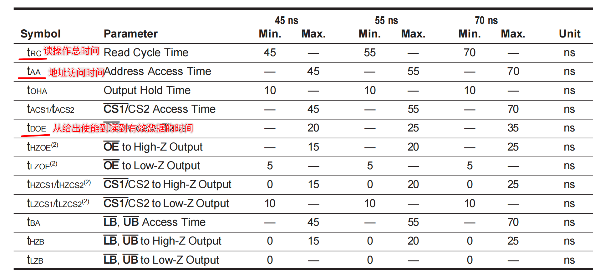

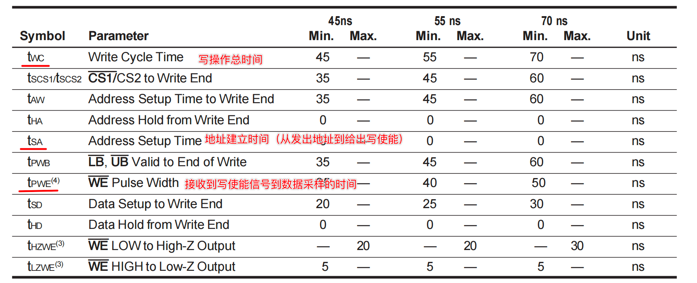


### 硬件电路设计


##### 原理图中的芯片连接

 

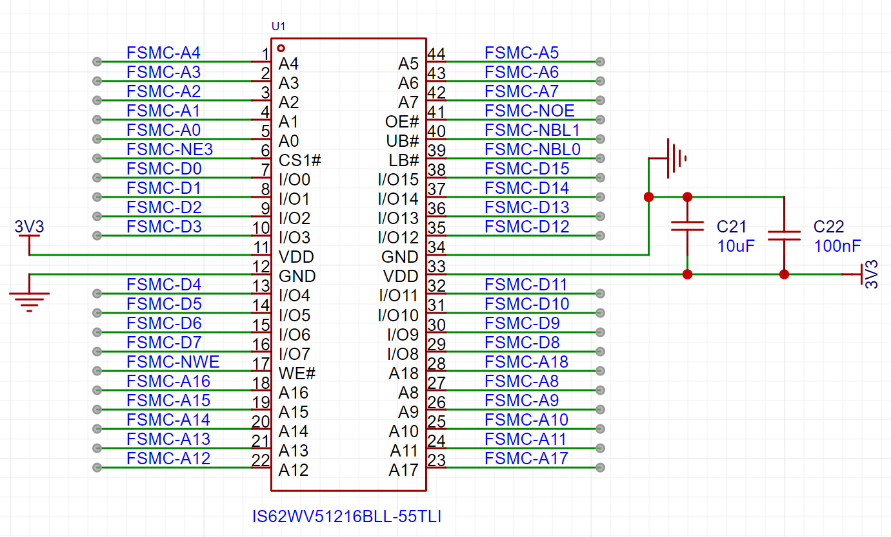


##### 芯片的CS1使能引脚对应着PG10


###### 芯片引脚连接情况

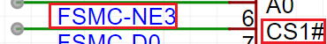


###### STM32F103ZET6引脚连接情况

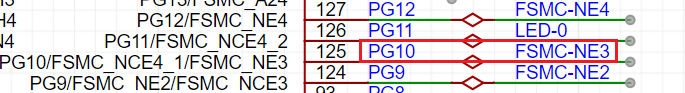


###### 数据手册中的复用引脚说明

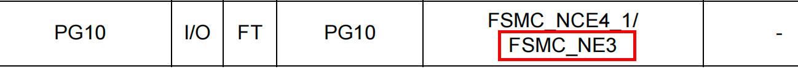


##### 地址映射范围

```c
64MB:FSMC_Bank1_NORSRAM1:0X6000 0000 ~ 0X63FF FFFF
64MB:FSMC_Bank1_NORSRAM2:0X6400 0000 ~ 0X67FF FFFF
64MB:FSMC_Bank1_NORSRAM3:0X6800 0000 ~ 0X6BFF FFFF
64MB:FSMC_Bank1_NORSRAM4:0X6C00 0000 ~ 0X6FFF FFFF
```

NE3对应的地址范围就是0x6800 0000 ~ 0x6BFF FFFF


### 软件设计（寄存器）


在访问FSMC的寄存器的时stm32f10x.h并没有给所有的寄存器起名字，而是用了一个数组存储了所有的寄存器。

每个数组长度为8，表示一共存储了8个寄存器。

```c
    typedef struct
    {
        __IO uint32_t BTCR[8];
    } FSMC_Bank1_TypeDef;
```

这个8个寄存器是按照下面的顺序来存储的。

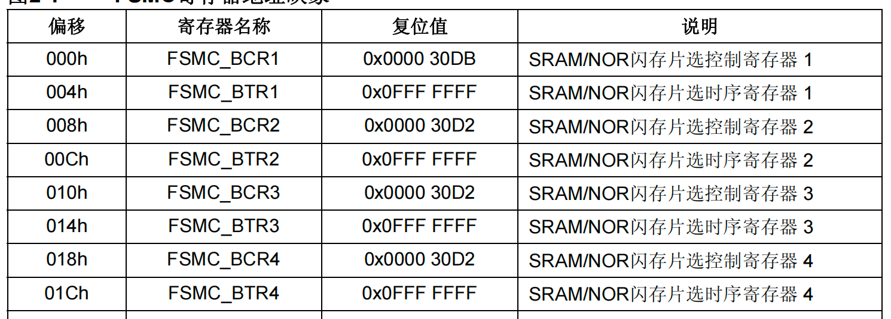

比如，你要找Bank1的3区的寄存器：FSMC_BCR3和FSMC_BTR3。它们分别对应BTCR[4]和BTCR[5]。


#### main.c

```c
#include "Driver_USART.h"

#include "Delay.h"
#include "Driver_FSMC.h"
#define I4 (uint8_t *)0x68000010
/* 定义一个变量,存储到外置的SRAM中 */;
/* 方式1: 使用关键词 __attribute__  at*/
uint8_t v1 __attribute__((at(0x68000000)));
uint8_t v2 __attribute__((at(0x68000004)));
uint16_t i1 = 20;
int main()
{
    uint8_t v3 __attribute__((at(0x68000007)));
    Driver_USART1_Init();
    printf("扩展内存\r\n");
    Driver_FSMC_Init();
    v1 = 200;
    v2 = 100;
    v3=11;

    /* 方式2: 定义指针 */
    *(uint8_t *)0x68000001 = 30;
    printf("0x68000001=%d\r\n", *(uint8_t *)0x68000001);

    printf("v1=%p, %d\r\n", &v1, v1);
    printf("v2=%p, %d\r\n", &v2, v2);
    printf("i1=%p, %d\r\n", &i1, i1);
    printf("v3=%p, %d\r\n", &v3, v3);

    *I4 = 22;
    printf("I4=%p, %d\r\n", I4, *I4);

    while (1)
    {
    }
}
/*
如何把变量存储到外置SRAM中：
方法1：
    声明全局变量，直接指定变量存储的地址  bank1的3区的起始地址是：0x6800 0000
    uint8_t testValue __attribute__((at(0x68000000)));
方法2：指针的方式使用外部SRAM的地址
    *(uint8_t *)0x68000001 = 0x20;
 */
```


#### Driver_FSMC.c

```c
#ifndef __DRIVER_FSMC_H
#define __DRIVER_FSMC_H

#include "stm32f10x.h"
void Driver_FSMC_Init(void);

#endif
```


#### Driver_FSMC.c

```c
#include "Driver_FSMC.h"

void Driver_FSMC_GPIO_Init(void)
{
    /* 1 配置 A0-A18 地址端口的输出模式 复用推挽输出CNF:10 50MHz速度 MODE:11*/
    /* =============MODE=============== */
    GPIOF->CRL |= (GPIO_CRL_MODE0 |
                   GPIO_CRL_MODE1 |
                   GPIO_CRL_MODE2 |
                   GPIO_CRL_MODE3 |
                   GPIO_CRL_MODE4 |
                   GPIO_CRL_MODE5);

    GPIOF->CRH |= (GPIO_CRH_MODE12 |
                   GPIO_CRH_MODE13 |
                   GPIO_CRH_MODE14 |
                   GPIO_CRH_MODE15);

    GPIOG->CRL |= (GPIO_CRL_MODE0 |
                   GPIO_CRL_MODE1 |
                   GPIO_CRL_MODE2 |
                   GPIO_CRL_MODE3 |
                   GPIO_CRL_MODE4 |
                   GPIO_CRL_MODE5);

    GPIOD->CRH |= (GPIO_CRH_MODE11 |
                   GPIO_CRH_MODE12 |
                   GPIO_CRH_MODE13);

    /* =============CNF=============== */
    GPIOF->CRL |= (GPIO_CRL_CNF0_1 |
                   GPIO_CRL_CNF1_1 |
                   GPIO_CRL_CNF2_1 |
                   GPIO_CRL_CNF3_1 |
                   GPIO_CRL_CNF4_1 |
                   GPIO_CRL_CNF5_1);
    GPIOF->CRL &= ~(GPIO_CRL_CNF0_0 |
                    GPIO_CRL_CNF1_0 |
                    GPIO_CRL_CNF2_0 |
                    GPIO_CRL_CNF3_0 |
                    GPIO_CRL_CNF4_0 |
                    GPIO_CRL_CNF5_0);

    GPIOF->CRH |= (GPIO_CRH_CNF12_1 |
                   GPIO_CRH_CNF13_1 |
                   GPIO_CRH_CNF14_1 |
                   GPIO_CRH_CNF15_1);
    GPIOF->CRH &= ~(GPIO_CRH_CNF12_0 |
                    GPIO_CRH_CNF13_0 |
                    GPIO_CRH_CNF14_0 |
                    GPIO_CRH_CNF15_0);

    GPIOG->CRL |= (GPIO_CRL_CNF0_1 |
                   GPIO_CRL_CNF1_1 |
                   GPIO_CRL_CNF2_1 |
                   GPIO_CRL_CNF3_1 |
                   GPIO_CRL_CNF4_1 |
                   GPIO_CRL_CNF5_1);
    GPIOG->CRL &= ~(GPIO_CRL_CNF0_0 |
                    GPIO_CRL_CNF1_0 |
                    GPIO_CRL_CNF2_0 |
                    GPIO_CRL_CNF3_0 |
                    GPIO_CRL_CNF4_0 |
                    GPIO_CRL_CNF5_0);

    GPIOD->CRH |= (GPIO_CRH_CNF11_1 |
                   GPIO_CRH_CNF12_1 |
                   GPIO_CRH_CNF13_1);
    GPIOD->CRH &= ~(GPIO_CRH_CNF11_0 |
                    GPIO_CRH_CNF12_0 |
                    GPIO_CRH_CNF13_0);

    /*
        2 数据端口 复用推挽输出
            在实际应用中，即使数据线被配置为输出模式，FSMC控制器仍然能够管理数据线的方向，使其在需要时成为输入线。
            这种自动切换是由FSMC控制器硬件管理的，不需要软件干预。
            因此，即使GPIO配置为复用推挽输出，FSMC依然可以实现读取操作。
    */
    /* =============MODE=============== */
    GPIOD->CRL |= (GPIO_CRL_MODE0 |
                   GPIO_CRL_MODE1);
    GPIOD->CRH |= (GPIO_CRH_MODE8 |
                   GPIO_CRH_MODE9 |
                   GPIO_CRH_MODE10 |
                   GPIO_CRH_MODE14 |
                   GPIO_CRH_MODE15);

    GPIOE->CRL |= (GPIO_CRL_MODE7);
    GPIOE->CRH |= (GPIO_CRH_MODE8 |
                   GPIO_CRH_MODE9 |
                   GPIO_CRH_MODE10 |
                   GPIO_CRH_MODE11 |
                   GPIO_CRH_MODE12 |
                   GPIO_CRH_MODE13 |
                   GPIO_CRH_MODE14 |
                   GPIO_CRH_MODE15);

    /* =============CNF=============== */
    GPIOD->CRL |= (GPIO_CRL_CNF0_1 |
                   GPIO_CRL_CNF1_1);
    GPIOD->CRL &= ~(GPIO_CRL_CNF0_0 |
                    GPIO_CRL_CNF1_0);

    GPIOD->CRH |= (GPIO_CRH_CNF8_1 |
                   GPIO_CRH_CNF9_1 |
                   GPIO_CRH_CNF10_1 |
                   GPIO_CRH_CNF14_1 |
                   GPIO_CRH_CNF15_1);
    GPIOD->CRH &= ~(GPIO_CRH_CNF8_0 |
                    GPIO_CRH_CNF9_0 |
                    GPIO_CRH_CNF10_0 |
                    GPIO_CRH_CNF14_0 |
                    GPIO_CRH_CNF15_0);

    GPIOE->CRL |= (GPIO_CRL_CNF7_1);
    GPIOE->CRL &= ~(GPIO_CRL_CNF7_0);

    GPIOE->CRH |= (GPIO_CRH_CNF8_1 |
                   GPIO_CRH_CNF9_1 |
                   GPIO_CRH_CNF10_1 |
                   GPIO_CRH_CNF11_1 |
                   GPIO_CRH_CNF12_1 |
                   GPIO_CRH_CNF13_1 |
                   GPIO_CRH_CNF14_1 |
                   GPIO_CRH_CNF15_1);
    GPIOE->CRH &= ~(GPIO_CRH_CNF8_0 |
                    GPIO_CRH_CNF9_0 |
                    GPIO_CRH_CNF10_0 |
                    GPIO_CRH_CNF11_0 |
                    GPIO_CRH_CNF12_0 |
                    GPIO_CRH_CNF13_0 |
                    GPIO_CRH_CNF14_0 |
                    GPIO_CRH_CNF15_0);

    /* 3 其他控制端口  复用推挽输出 */
    GPIOD->CRL |= (GPIO_CRL_MODE4 |
                   GPIO_CRL_MODE5);
    GPIOD->CRL |= (GPIO_CRL_CNF4_1 |
                   GPIO_CRL_CNF5_1);
    GPIOD->CRL &= ~(GPIO_CRL_CNF4_0 |
                    GPIO_CRL_CNF5_0);

    GPIOE->CRL |= (GPIO_CRL_MODE0 |
                   GPIO_CRL_MODE1);
    GPIOE->CRL |= (GPIO_CRL_CNF0_1 |
                   GPIO_CRL_CNF1_1);
    GPIOE->CRL &= ~(GPIO_CRL_CNF0_0 |
                    GPIO_CRL_CNF1_0);

    GPIOG->CRH |= (GPIO_CRH_MODE10);
    GPIOG->CRH |= (GPIO_CRH_CNF10_1);
    GPIOG->CRH &= ~(GPIO_CRH_CNF10_0);
}

void Driver_FSMC_Init(void)
{
    /* 1. 时钟开启 */
    RCC->APB2ENR |= (RCC_APB2ENR_IOPDEN |
                     RCC_APB2ENR_IOPEEN |
                     RCC_APB2ENR_IOPFEN |
                     RCC_APB2ENR_IOPGEN |
                     RCC_APB2ENR_AFIOEN);

    RCC->AHBENR |= RCC_AHBENR_FSMCEN;
    /* 2. 各个引脚的模式的配置 */
    Driver_FSMC_GPIO_Init();
    /* 3. fsmc的配置 Bank1的 3区 BCR3 */
    /* 3.1 存储块使能 */
    FSMC_Bank1->BTCR[4] |= FSMC_BCR3_MBKEN;
    /* 3.2 设置存储类型 00=SRAM ROM*/
    FSMC_Bank1->BTCR[4] &= ~FSMC_BCR3_MTYP;
    /* 3.3 禁止闪存访问 */
    FSMC_Bank1->BTCR[4] &= ~FSMC_BCR3_FACCEN;
    /* 3.4 地址和数据复用: 不复用 */
    FSMC_Bank1->BTCR[4] &= ~FSMC_BCR3_MUXEN;
    /* 3.5 数据总线的宽度 16位宽度=01 */
    FSMC_Bank1->BTCR[4] &= ~FSMC_BCR3_MWID_1;
    FSMC_Bank1->BTCR[4] |= FSMC_BCR3_MWID_0;
    /* 3.6 写使能 */;
    FSMC_Bank1->BTCR[4] |= FSMC_BCR3_WREN;

    /* 3. fsmc的 时序 */
    /* 3.1 地址建立时间 对同步读写来说,永远一个周期 */
    FSMC_Bank1->BTCR[5] &= ~FSMC_BTR3_ADDSET;
    /* 3.2 地址保持时间 对同步读写来说,永远一个周期 */
    FSMC_Bank1->BTCR[5] &= ~FSMC_BTR3_ADDHLD;
    /* 3.3 数据保持时间 手册不能低于55ns 我们设置1us*/
    FSMC_Bank1->BTCR[5] &= ~FSMC_BTR3_DATAST;
    FSMC_Bank1->BTCR[5] |= (71 << 8);
}


/*
地址线：
PF0   ------> FSMC_A0
PF1   ------> FSMC_A1
PF2   ------> FSMC_A2
PF3   ------> FSMC_A3
PF4   ------> FSMC_A4
PF5   ------> FSMC_A5
PF12   ------> FSMC_A6
PF13   ------> FSMC_A7
PF14   ------> FSMC_A8
PF15   ------> FSMC_A9
PG0   ------> FSMC_A10
PG1   ------> FSMC_A11
PG2   ------> FSMC_A12
PG3   ------> FSMC_A13
PG4   ------> FSMC_A14
PG5   ------> FSMC_A15
PD11   ------> FSMC_A16
PD12   ------> FSMC_A17
PD13   ------> FSMC_A18

数据线：
PD14   ------> FSMC_D0
PD15   ------> FSMC_D1
PD0   ------> FSMC_D2
PD1   ------> FSMC_D3
PE7   ------> FSMC_D4
PE8   ------> FSMC_D5
PE9   ------> FSMC_D6
PE10   ------> FSMC_D7
PE11   ------> FSMC_D8
PE12   ------> FSMC_D9
PE13   ------> FSMC_D10
PE14   ------> FSMC_D11
PE15   ------> FSMC_D12
PD8   ------> FSMC_D13
PD9   ------> FSMC_D14
PD10   ------> FSMC_D15

其他：
PD4   ------> FSMC_NOE
PD5   ------> FSMC_NWE
PG10   ------> FSMC_NE3
PE0   ------> FSMC_NBL0
PE1   ------> FSMC_NBL1
*/
```


### 软件设计（HAL库）


#### STM32CubeMX配置

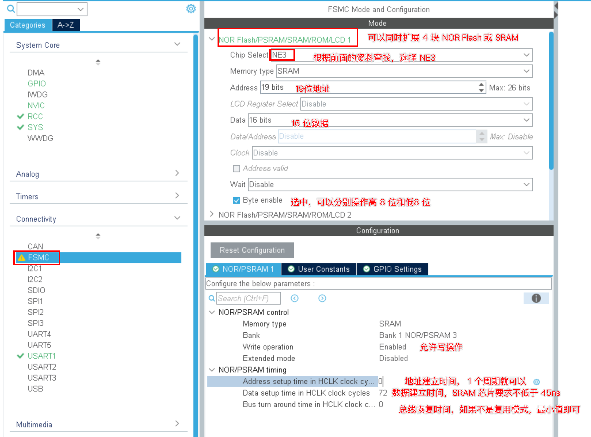


#### main.c

```c
int main(void)
{
 
    HAL_Init();
    SystemClock_Config();
    MX_GPIO_Init();
    MX_FSMC_Init();
    MX_USART1_UART_Init();
    uint8_t v3 __attribute__((at(0x68000007)));
    printf("扩展内存\r\n");
    v1 = 200;
    v2 = 100;
    v3 = 11;

    /* 方式2: 定义指针 */
    *(uint8_t *)0x68000001 = 30;
    printf("0x68000001=%d\r\n", *(uint8_t *)0x68000001);

    printf("v1=%p, %d\r\n", &v1, v1);
    printf("v2=%p, %d\r\n", &v2, v2);
    printf("i1=%p, %d\r\n", &i1, i1);
    printf("v3=%p, %d\r\n", &v3, v3);

    *I4 = 22;
    printf("I4=%p, %d\r\n", I4, *I4);
    while (1)
    {
    }
}
```

