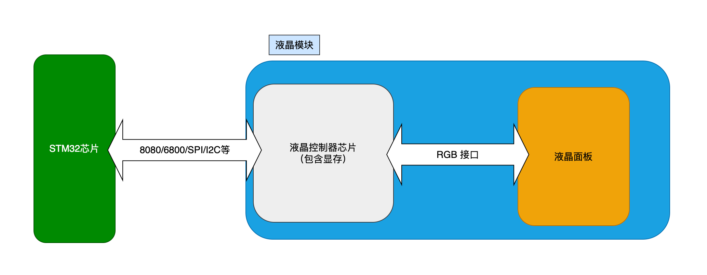
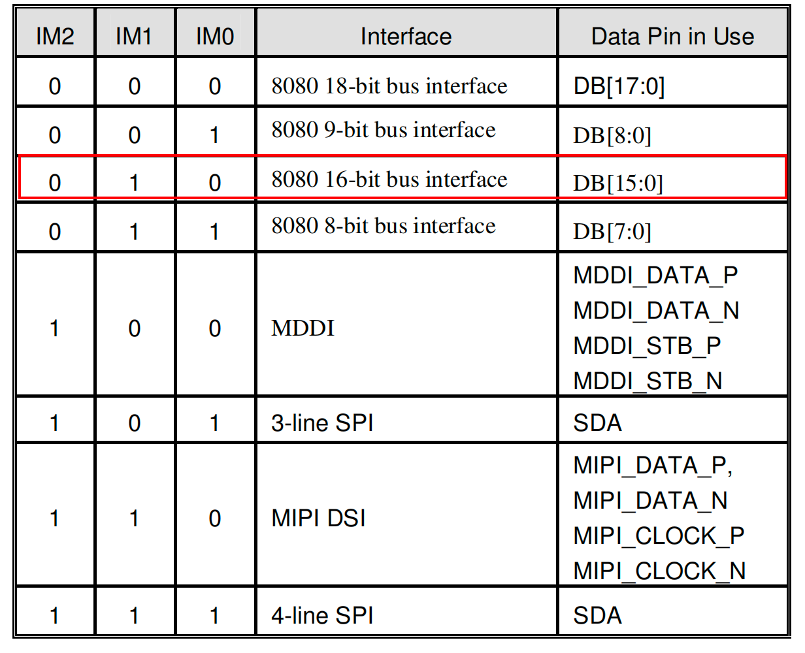
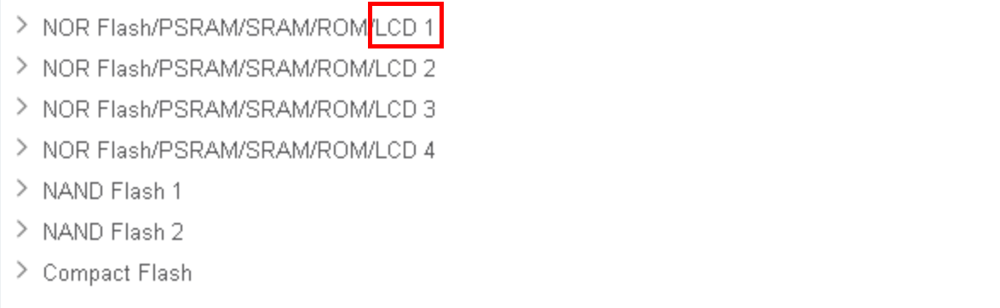
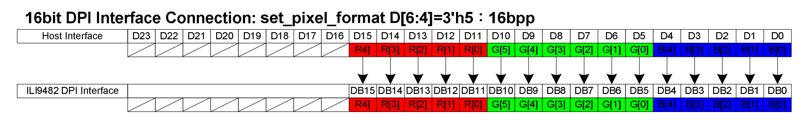
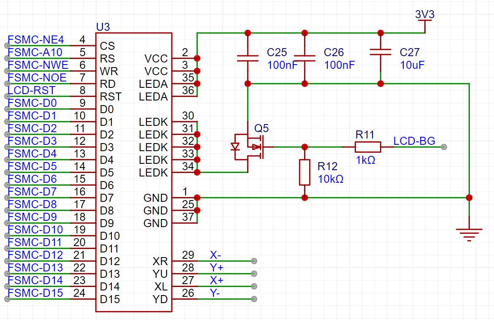
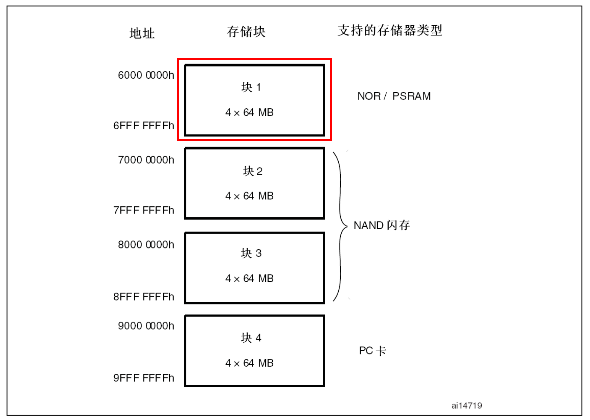
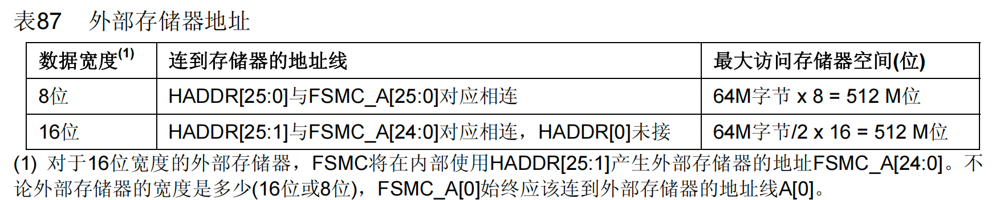
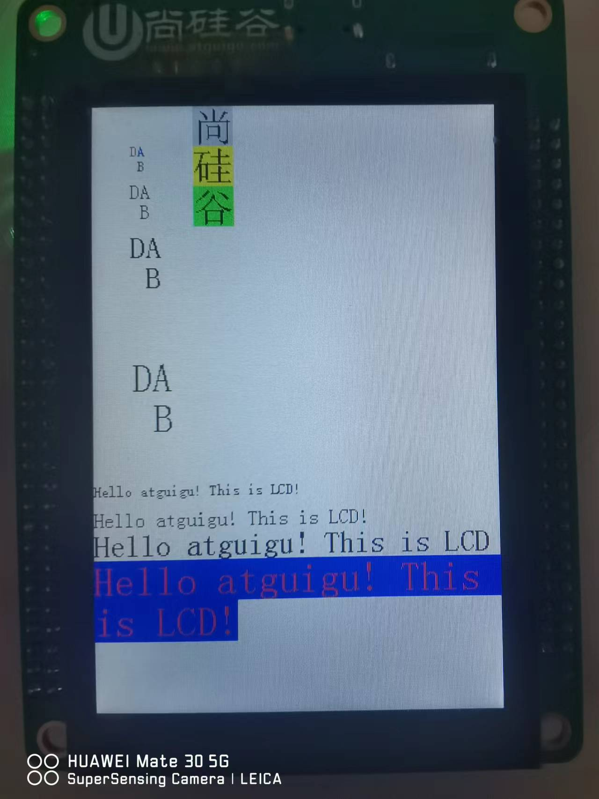
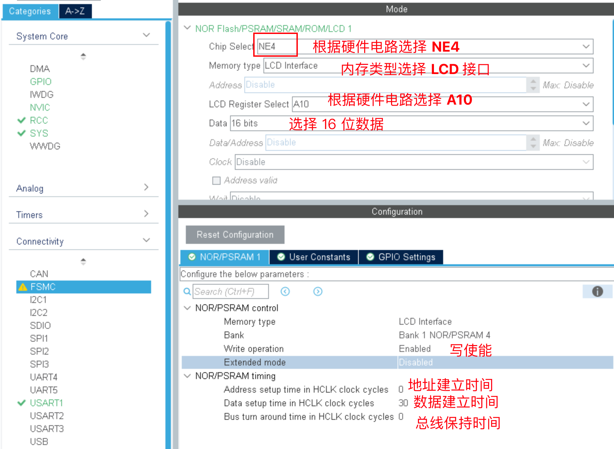
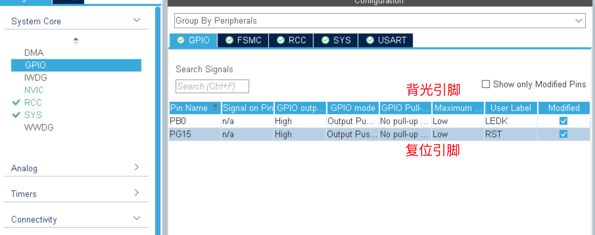

# LCD显示


## 使用的液晶显示模块介绍


### 嵌入式LCD显示模块接口类型

LCD的接口有多种，分类很细。主要看LCD的驱动方式和控制方式，目前彩色LCD的连接方式一般有这么几种：MCU模式，RGB模式，SPI模式，VSYNC模式，MDDI模式，DSI模式。

但应用比较多的就是MCU模式和RGB模式。


##### MCU模式

因为主要针对单片机的领域在使用，因此得名，其主要特点是价格便宜。MCU-LCD接口的标准术语是Intel提出的8080总线标准，因此在很多文档中用 I80 来指MCU-LCD屏。

对于MCU接口的LCM（LCD Module），其内部的芯片就叫LCD驱动器，都带GRAM（显存）。主要功能是对主机发过的数据/命令，进行变换，变成每个像素的RGB数据，使之在屏上显示出来。


##### RGB模式

RGB模式是大屏采用较多的模式，比如我们电脑显示器。

对于RGB接口的LCM，主机输出的直接是每个像素的RGB数据，不需要进行变换（GAMMA校正等除外），对于这种接口，需要在主机部分有个LCD控制器(平常所说的显卡)，以产生RGB数据和点、行、帧同步信号。


### 液晶模块Z350IT002



我们使用的液晶显示模块是Z350IT002。这是一款 TFT LCD（薄膜晶体管液晶显示器）模块。TFT LCD 以其优秀的显示性能和低功耗特性而广泛应用于各种电子设备。


###### 分辨率

模块的分辨率为 320RGB × 480 点阵。这意味着屏幕横向有 320 个像素点，每个像素点由红、绿、蓝三种颜色组成，纵向有 480 个像素点。这种分辨率适合于显示清晰的图像和文字。


###### 构造

它由 960 个源（source）和 480 个门（gate）构成。源用于横向的像素点驱动，门用于纵向的像素点驱动。这种结构有助于精确地控制每个像素点，从而提供清晰的图像显示。


###### 微控制器接口

Z350IT002 设计了易于通过微控制器访问和控制的接口。这使得它非常适合于嵌入式系统或其他需要直接由微控制器控制显示屏的应用。


###### 应用领域

考虑到其尺寸和分辨率，Z350IT002 特别适用于中小尺寸的显示需求，如便携式设备、工业控制面板、小型嵌入式系统等。


###### 显示效果

作为一款 TFT LCD，Z350IT002 可以提供良好的颜色对比度和亮度，适合于需要中等分辨率和高色彩质量的应用。

总体而言，Z350IT002 是一款适用于多种中小型电子设备的TFT LCD显示模块，其易于微控制器集成的特点使其成为许多嵌入式应用和工业产品的理想选择。


### 控制器芯片ILI9486

液晶模块Z350IT002内部使用的控制芯片是：ILI9486。

ILI9486 是一款流行的 LCD 控制器芯片，由 Ilitek 公司生产，通常用于驱动中小尺寸的 TFT（薄膜晶体管）LCD 显示屏。

具有320RGBx480点的分辨率。它包括960通道的源驱动器和480通道的门驱动器，以及用于320RGBx480点图形数据的345600字节GRAM和电源供应电路。

另外ILI9486支持多种接口类型，包括：


###### 并行CPU数据总线接口，支持8位、9位、16位和18位。


###### 3线和4线串行外设接口（SPI）。


###### 符合RGB（16位/18位）数据总线，用于视频图像显示。


###### 高速串行接口，提供一个数据和时钟通道，支持最高达500Mbps的MIPI DSI链路。


###### 支持MDDI接口。

咱们用的已经固定为使用16位的并行8080接口。




### 使用STM32的FSMC来实现8080时序

8080 通讯接口时序可以由 STM32 使用普通 I/O 接口进行模拟，但这样效率太低，STM32 提供了一种特别的控制方法——使用 FSMC 接口实现 8080 时序。我们在前面使用CubeMX扩展SRAM时候已经可以看到了这点。



时序的控制FSMC可以完成，但是如何向GRAM写数据，写什么格式的数据呢？

GRAM，作用可以理解为显存， GRAM 中每个存储单元都对应着液晶面板的一个像素点。使像素点呈现特定的颜色，而多个像素点组合起来就成为一个你想表达的东西，一段文字或者一副图。

按照标准的格式，16 位的像素点的三原色描述的位数为R:G:B=5：6：5， 描述绿色的位数比较多是因为人眼对绿色更为敏感。




## LCD实验：使用FSMC控制LCD显示


### 需求描述

使用FSMC控制LCD显示我们想要的字符。


### 硬件电路设计




###### D0-D15是16位数据总线接口。分别接FSMC的D0-D15。


###### RST是LCD复位引脚，低电平复位。接LCD-RST（PG15）。


###### RD是读控制引脚，上升沿时读数据。接FSMC-NOE（PD4）。


###### WR是写控制引脚，上升沿时写数据。接FSMC-NWE（PD5）。


###### RS是数据或命令选择引脚RS=1写数据，RS=0写命令。接FSMC-A10（PG0）。


###### CS是片选引脚，低电平有效。接FSMC-NE4（PG12）。


###### LEDA是背光电源（3.0V-3.4V）引脚。


###### LEDK是背光亮度控制引脚。通过LCD-BG（PB0）来驱动MOS管Q5的导通电流。可以通过给LCD-BG输出PWM波来控制背光的亮度。占空比越大，背光就会越亮。


###### YD，XL，YU，XR是触摸屏控制引脚。


### 软件设计（寄存器）


#### 关于FSMC的寻址



扩展LCD的时候,使用的是块1的地址，一共4*64MB = 256MB，每部分的地址如下：

```c
64MB:FSMC_Bank1_NORSRAM1:0X6000 0000 ~ 0X63FF FFFF
64MB:FSMC_Bank1_NORSRAM2:0X6400 0000 ~ 0X67FF FFFF
64MB:FSMC_Bank1_NORSRAM3:0X6800 0000 ~ 0X6BFF FFFF
64MB:FSMC_Bank1_NORSRAM4:0X6C00 0000 ~ 0X6FFF FFFF
```

我们选择的是NE4， 所以地址范围是：0X6C00 0000 ~ 0X6FFF FFFF，寄存器的基地址是6C000000。



注意：当使用16位宽的外部存储器时，用HADDR[25:1]表示外部的FSMC_A[24:0]，内部地址相当于左移了1位，所以计算地址的时候要注意。

LCD我们选择的是16位宽度的，选择地址线时，我们选择的是A10接LCD的D/CX（数据/命令引脚）。

当A10=0时，表示写命令，所以地址是：0x6C00 0000。

当A10=1时，表示写数据，所以地址是：0x6C00 0000 + 1<<11 = 0x6C00 0800


#### main.c

```c
#include "Driver_USART.h"

#include "Delay.h"
#include "Inf_LCD.h"

int main()
{
    Driver_USART1_Init();
    Inf_LCD_Init();

    uint32_t lcdId = Inf_LCD_ReadId();
    printf("lcdId = 0x%X\r\n", lcdId);
    Inf_LCD_ClearAll(WHITE);

    Inf_LCD_WriteAsciiChar(10, 10, 16, 'A', WHITE, RED);
    Inf_LCD_WriteAsciiChar(10, 30, 24, 'A', WHITE, RED);
    Inf_LCD_WriteAsciiChar(20, 60, 32, 'A', BLUE, WHITE);
    Inf_LCD_WriteAsciiChar(20, 100, 12, 'A', BLUE, WHITE);

    Inf_LCD_WriteAsciiString(200, 150, 24, "Hell\n\no!atguigu!Hello,Hello!at\nguigu!Hello", BLACK, WHITE);
    ;
    uint8_t buff[] = {'a', 'b', '\0'};
    Inf_LCD_WriteAsciiString(200, 300, 24, buff, BLACK, WHITE);

    Inf_LCD_WriteChineseChar(20, 330, 0, RED, BLUE);
    Inf_LCD_WriteChineseChar(20, 362, 1, BLUE, RED);
    Inf_LCD_WriteChineseChar(20, 394, 2, GRAY, RED);

    // Inf_LCD_WriteAtguiguLogo(57, 100);
    // Inf_LCD_WriteAtguiguLogo(0,0);

    // Inf_LCD_DrawPoint(300,300, 5, RED);

    //Inf_LCD_DrawLine(10, 10, 10, 300, 5, RED);
    Inf_LCD_DrawLine(10, 10, 300, 10, 5, RED);

    //Inf_LCD_DrawRectangle(20, 20, 300, 300, 5, RED);

    //Inf_LCD_DrawCircle_1(160, 240, 100, 5, BLUE);
    Inf_LCD_DrawCircleFill_1(160, 240, 100, 2, RED, BLUE);
    while (1)
    {
    }
}
```


#### Driver_FSMC.h

```c
#ifndef __DRIVER_FSMC_H
#define __DRIVER_FSMC_H

#include "stm32f10x.h"
void Driver_FSMC_Init(void);

#endif
```


#### Driver_FSMC.c

```c
#include "Driver_FSMC.h"

void Driver_FSMC_GPIO_Init(void)
{
    /* 1 配置 A0-A18 地址端口的输出模式 复用推挽输出CNF:10 50MHz速度 MODE:11*/
    /* =============MODE=============== */
    GPIOG->CRL |= GPIO_CRL_MODE0;
    /* =============CNF=============== */
    GPIOG->CRL |= GPIO_CRL_CNF0_1 ;
    GPIOG->CRL &= ~GPIO_CRL_CNF0_0;
    /*
        2 数据端口 复用推挽输出
            在实际应用中，即使数据线被配置为输出模式，FSMC控制器仍然能够管理数据线的方向，使其在需要时成为输入线。
            这种自动切换是由FSMC控制器硬件管理的，不需要软件干预。
            因此，即使GPIO配置为复用推挽输出，FSMC依然可以实现读取操作。
    */
    /* =============MODE=============== */
    GPIOD->CRL |= (GPIO_CRL_MODE0 |
                   GPIO_CRL_MODE1);
    GPIOD->CRH |= (GPIO_CRH_MODE8 |
                   GPIO_CRH_MODE9 |
                   GPIO_CRH_MODE10 |
                   GPIO_CRH_MODE14 |
                   GPIO_CRH_MODE15);

    GPIOE->CRL |= (GPIO_CRL_MODE7);
    GPIOE->CRH |= (GPIO_CRH_MODE8 |
                   GPIO_CRH_MODE9 |
                   GPIO_CRH_MODE10 |
                   GPIO_CRH_MODE11 |
                   GPIO_CRH_MODE12 |
                   GPIO_CRH_MODE13 |
                   GPIO_CRH_MODE14 |
                   GPIO_CRH_MODE15);

    /* =============CNF=============== */
    GPIOD->CRL |= (GPIO_CRL_CNF0_1 |
                   GPIO_CRL_CNF1_1);
    GPIOD->CRL &= ~(GPIO_CRL_CNF0_0 |
                    GPIO_CRL_CNF1_0);

    GPIOD->CRH |= (GPIO_CRH_CNF8_1 |
                   GPIO_CRH_CNF9_1 |
                   GPIO_CRH_CNF10_1 |
                   GPIO_CRH_CNF14_1 |
                   GPIO_CRH_CNF15_1);
    GPIOD->CRH &= ~(GPIO_CRH_CNF8_0 |
                    GPIO_CRH_CNF9_0 |
                    GPIO_CRH_CNF10_0 |
                    GPIO_CRH_CNF14_0 |
                    GPIO_CRH_CNF15_0);

    GPIOE->CRL |= (GPIO_CRL_CNF7_1);
    GPIOE->CRL &= ~(GPIO_CRL_CNF7_0);

    GPIOE->CRH |= (GPIO_CRH_CNF8_1 |
                   GPIO_CRH_CNF9_1 |
                   GPIO_CRH_CNF10_1 |
                   GPIO_CRH_CNF11_1 |
                   GPIO_CRH_CNF12_1 |
                   GPIO_CRH_CNF13_1 |
                   GPIO_CRH_CNF14_1 |
                   GPIO_CRH_CNF15_1);
    GPIOE->CRH &= ~(GPIO_CRH_CNF8_0 |
                    GPIO_CRH_CNF9_0 |
                    GPIO_CRH_CNF10_0 |
                    GPIO_CRH_CNF11_0 |
                    GPIO_CRH_CNF12_0 |
                    GPIO_CRH_CNF13_0 |
                    GPIO_CRH_CNF14_0 |
                    GPIO_CRH_CNF15_0);

    /* 3 其他控制端口  复用推挽输出 */
    /* 3.1 PD4: 读控制引脚  PD5： 写控制引脚 */
    GPIOD->CRL |= (GPIO_CRL_MODE4 |
                   GPIO_CRL_MODE5);
    GPIOD->CRL |= (GPIO_CRL_CNF4_1 |
                   GPIO_CRL_CNF5_1);
    GPIOD->CRL &= ~(GPIO_CRL_CNF4_0 |
                    GPIO_CRL_CNF5_0);

    /* 3.2  PG12：NE4*/
    GPIOG->CRH |= (GPIO_CRH_MODE12);
    GPIOG->CRH |= (GPIO_CRH_CNF12_1);
    GPIOG->CRH &= ~(GPIO_CRH_CNF12_0);

    /* 3.3  背光引脚PB0：通用推挽输出*/
    GPIOB->CRL |= GPIO_CRL_MODE0;
    GPIOB->CRL &= ~GPIO_CRL_CNF0;

    /* 3.4  重置引脚PG15：通用推挽输出*/
    GPIOG->CRH |= GPIO_CRH_MODE15;
    GPIOG->CRH &= ~GPIO_CRH_CNF15;

}

void Driver_FSMC_Init(void)
{
    /* 1. 时钟开启 */
    RCC->APB2ENR |= (RCC_APB2ENR_IOPDEN |
                     RCC_APB2ENR_IOPBEN |
                     RCC_APB2ENR_IOPEEN |
                     RCC_APB2ENR_IOPFEN |
                     RCC_APB2ENR_IOPGEN |
                     RCC_APB2ENR_AFIOEN);

    RCC->AHBENR |= RCC_AHBENR_FSMCEN;
    /* 2. 各个引脚的模式的配置 */
    Driver_FSMC_GPIO_Init();
    /* 3. fsmc的配置 Bank1的 4区 BCR4 */
    /* 3.1 存储块使能 */
    FSMC_Bank1->BTCR[6] |= FSMC_BCR4_MBKEN;
    /* 3.2 设置存储类型 00=SRAM ROM*/
    FSMC_Bank1->BTCR[6] &= ~FSMC_BCR4_MTYP;
    /* 3.3 禁止闪存访问 */
    FSMC_Bank1->BTCR[6] &= ~FSMC_BCR4_FACCEN;
    /* 3.4 地址和数据复用: 不复用 */
    FSMC_Bank1->BTCR[6] &= ~FSMC_BCR4_MUXEN;
    /* 3.5 数据总线的宽度 16位宽度=01 */
    FSMC_Bank1->BTCR[6] &= ~FSMC_BCR4_MWID_1;
    FSMC_Bank1->BTCR[6] |= FSMC_BCR4_MWID_0;
    /* 3.6 写使能 */;
    FSMC_Bank1->BTCR[6] |= FSMC_BCR4_WREN;

    /* 3. fsmc的 时序 */
    /* 3.1 地址建立时间 对同步读写来说,永远一个周期 */
    FSMC_Bank1->BTCR[7] &= ~FSMC_BTR4_ADDSET;
    /* 3.2 地址保持时间 对同步读写来说,永远一个周期 */
    FSMC_Bank1->BTCR[7] &= ~FSMC_BTR4_ADDHLD;
    /* 3.3 数据保持时间 手册不能低于55ns 我们设置1us*/
    FSMC_Bank1->BTCR[7] &= ~FSMC_BTR4_DATAST;
    FSMC_Bank1->BTCR[7] |= (71 << 8);
    /* 3.4 设置时序模式 */
    FSMC_Bank1->BTCR[7] &= ~FSMC_BTR4_ACCMOD;
}
```


#### Inf_LCD.h

```c
#ifndef __INF_LCD_H
#define __INF_LCD_H

#include "Driver_FSMC.h"
#include "Delay.h"
#include "math.h"

#define SRAM_BANK4 0x6C000000
#define LCD_ADDR_CMD (uint16_t *)SRAM_BANK4
#define LCD_ADDR_DATA (uint16_t *)(SRAM_BANK4 + (1 << 11))

#define DISPLAY_W 320
#define DISPLAY_H 480

/* 常见颜色 */
#define WHITE 0xFFFF
#define BLACK 0x0000
#define BLUE 0x001F
#define BRED 0XF81F
#define GRED 0XFFE0
#define GBLUE 0X07FF
#define RED 0xF800
#define MAGENTA 0xF81F
#define GREEN 0x07E0
#define CYAN 0x7FFF
#define YELLOW 0xFFE0
#define BROWN 0XBC40 // 棕色
#define BRRED 0XFC07 // 棕红色
#define GRAY 0X8430  // 灰色

void Inf_LCD_WriteData(uint16_t data);
uint16_t Inf_LCD_ReadData(void);

void Inf_LCD_RegConfig(void);

void Inf_LCD_Init(void);
uint32_t Inf_LCD_ReadId(void);
void Inf_LCD_WriteAsciiChar(uint16_t x, uint16_t y, uint16_t heigh, uint8_t c, uint16_t fColor, uint16_t bColor);
void Inf_LCD_SetArea(int16_t x, uint16_t y, uint16_t w, uint16_t h);
void Inf_LCD_ClearAll(uint16_t color);
void Inf_LCD_WriteAsciiString(uint16_t x, uint16_t y, uint16_t heigh, uint8_t *c, uint16_t fColor, uint16_t bColor);
void Inf_LCD_WriteChineseChar(uint16_t x, uint16_t y, uint8_t index, uint16_t fColor, uint16_t bColor);
void Inf_LCD_DrawPoint(uint16_t x, uint16_t y, uint16_t w, uint16_t color);
void Inf_LCD_DrawLine(uint16_t x1, uint16_t y1, uint16_t x2, uint16_t y2, uint16_t w, uint16_t color);
void Inf_LCD_DrawRectangle(uint16_t x1, uint16_t y1, uint16_t x2, uint16_t y2, uint16_t w, uint16_t color);
void Inf_LCD_DrawCircle(uint16_t xCenter, uint16_t yCenter, uint16_t r, uint16_t w, uint16_t color);
void Inf_LCD_DrawCircle_1(uint16_t xCenter, uint16_t yCenter, uint16_t r, uint16_t w, uint16_t color);
void Inf_LCD_DrawCircleFill(uint16_t xCenter, uint16_t yCenter, uint16_t r, uint16_t w, uint16_t BColor, uint16_t FColor);
void Inf_LCD_DrawCircleFill_1(uint16_t xCenter, uint16_t yCenter, uint16_t r, uint16_t w, uint16_t BColor, uint16_t FColor);
// void Inf_LCD_WriteAtguiguLogo(uint16_t x, uint16_t y);

#endif
```


#### Inf_LCD.c

```c

#include "Inf_LCD.h"
#include "Inf_LCD_Font.h"

void Inf_LCD_Reset(void)
{
    GPIOG->ODR &= ~GPIO_ODR_ODR15;
    Delay_ms(100);
    GPIOG->ODR |= GPIO_ODR_ODR15;
    Delay_ms(100);
}

/**
 * @description: 给LCD开器背光
 * @return {*}
 */
void Inf_LCD_BKOpen()
{
    GPIOB->ODR |= GPIO_ODR_ODR0;
}

/**
 * @description: 关闭LCD的背光
 * @return {*}
 */
void Inf_LCD_BKClose()
{
    GPIOB->ODR &= ~GPIO_ODR_ODR0;
}

void Inf_LCD_WriteCmd(uint16_t cmd)
{
    *LCD_ADDR_CMD = cmd;
}

void Inf_LCD_WriteData(uint16_t data)
{
    *LCD_ADDR_DATA = data;
}

uint16_t Inf_LCD_ReadData(void)
{
    return *LCD_ADDR_DATA;
}

/* 初始化寄存器的值 */
void Inf_LCD_RegConfig(void)
{
    /* 1. 设置灰阶电压以调整TFT面板的伽马特性， 正校准。一般出厂就设置好了 */
    Inf_LCD_WriteCmd(0xE0);
    Inf_LCD_WriteData(0x00);
    Inf_LCD_WriteData(0x07);
    Inf_LCD_WriteData(0x10);
    Inf_LCD_WriteData(0x09);
    Inf_LCD_WriteData(0x17);
    Inf_LCD_WriteData(0x0B);
    Inf_LCD_WriteData(0x41);
    Inf_LCD_WriteData(0x89);
    Inf_LCD_WriteData(0x4B);
    Inf_LCD_WriteData(0x0A);
    Inf_LCD_WriteData(0x0C);
    Inf_LCD_WriteData(0x0E);
    Inf_LCD_WriteData(0x18);
    Inf_LCD_WriteData(0x1B);
    Inf_LCD_WriteData(0x0F);

    /* 2. 设置灰阶电压以调整TFT面板的伽马特性，负校准 */
    Inf_LCD_WriteCmd(0XE1);
    Inf_LCD_WriteData(0x00);
    Inf_LCD_WriteData(0x17);
    Inf_LCD_WriteData(0x1A);
    Inf_LCD_WriteData(0x04);
    Inf_LCD_WriteData(0x0E);
    Inf_LCD_WriteData(0x06);
    Inf_LCD_WriteData(0x2F);
    Inf_LCD_WriteData(0x45);
    Inf_LCD_WriteData(0x43);
    Inf_LCD_WriteData(0x02);
    Inf_LCD_WriteData(0x0A);
    Inf_LCD_WriteData(0x09);
    Inf_LCD_WriteData(0x32);
    Inf_LCD_WriteData(0x36);
    Inf_LCD_WriteData(0x0F);

    /* 3.  Adjust Control 3 (F7h)  */
    /*LCD_WriteCmd(0XF7);
   Inf_LCD_WriteData(0xA9);
   Inf_LCD_WriteData(0x51);
   Inf_LCD_WriteData(0x2C);
   Inf_LCD_WriteData(0x82);*/
    /* DSI write DCS command, use loose packet RGB 666 */

    /* 4. 电源控制1*/
    Inf_LCD_WriteCmd(0xC0);
    Inf_LCD_WriteData(0x11); /* 正伽马电压 */
    Inf_LCD_WriteData(0x09); /* 负伽马电压 */

    /* 5. 电源控制2 */
    Inf_LCD_WriteCmd(0xC1);
    Inf_LCD_WriteData(0x02);
    Inf_LCD_WriteData(0x03);

    /* 6. VCOM控制 */
    Inf_LCD_WriteCmd(0XC5);
    Inf_LCD_WriteData(0x00);
    Inf_LCD_WriteData(0x0A);
    Inf_LCD_WriteData(0x80);

    /* 7. Frame Rate Control (In Normal Mode/Full Colors) (B1h) */
    Inf_LCD_WriteCmd(0xB1);
    Inf_LCD_WriteData(0xB0);
    Inf_LCD_WriteData(0x11);

    /* 8.  Display Inversion Control (B4h) （正负电压反转，减少电磁干扰）*/
    Inf_LCD_WriteCmd(0xB4);
    Inf_LCD_WriteData(0x02);

    /* 9.  Display Function Control (B6h)  */
    Inf_LCD_WriteCmd(0xB6);
    Inf_LCD_WriteData(0x0A);
    Inf_LCD_WriteData(0xA2);

    /* 10. Entry Mode Set (B7h)  */
    Inf_LCD_WriteCmd(0xB7);
    Inf_LCD_WriteData(0xc6);

    /* 11. HS Lanes Control (BEh) */
    Inf_LCD_WriteCmd(0xBE);
    Inf_LCD_WriteData(0x00);
    Inf_LCD_WriteData(0x04);

    /* 12.  Interface Pixel Format (3Ah) */
    Inf_LCD_WriteCmd(0x3A);
    Inf_LCD_WriteData(0x55); /* 0x55 : 16 bits/pixel  */

    /* 13. Sleep Out (11h) 关闭休眠模式 */
    Inf_LCD_WriteCmd(0x11);

    /* 14. 设置屏幕方向和RGB */
    Inf_LCD_WriteCmd(0x36);
    Inf_LCD_WriteData(0x08);

    Delay_ms(120);

    /* 14. display on */
    Inf_LCD_WriteCmd(0x29);
}

/**
 * @description: 初始化LCD
 * @return {*}
 */
void Inf_LCD_Init(void)
{
    /* 1. 初始化FSMC */
    Driver_FSMC_Init();
    /* 3. 重置LCD */
    Inf_LCD_Reset();
    /* 4. 开启背光 */
    Inf_LCD_BKOpen();
    /* 5. 对LCD做一些基本配置 */
    Inf_LCD_RegConfig();
}

/**
 * @description: 读取id, 一般用来验证驱动是否正常
 */
uint32_t Inf_LCD_ReadId(void)
{
    uint32_t id = 0;
    /* 首先发送读取ID的指令 */
    Inf_LCD_WriteCmd(0x04);
    Inf_LCD_ReadData();
    id |= (Inf_LCD_ReadData() & 0xff) << 16;
    id |= (Inf_LCD_ReadData() & 0xff) << 8;
    id |= (Inf_LCD_ReadData() & 0xff);
    return id;
}
/**
 * @description:
 * @param {uint16_t} x 字符的x坐标
 * @param {uint16_t} y 字符的y坐标
 * @param {uint16_t} heigh 字符的高度. 宽度是高度的一半
 * @param {uint8_t} c 要显示的字符
 * @param {uint16_t} fColor 字符颜色
 * @param {uint16_t} bColor 字符的背景色
 */
void Inf_LCD_WriteAsciiChar(uint16_t x,
                            uint16_t y,
                            uint16_t heigh,
                            uint8_t c,
                            uint16_t fColor,
                            uint16_t bColor)
{
    /* 1. 先确定区域 */
    Inf_LCD_SetArea(x, y, heigh / 2, heigh);
    /* 2. 显示字符 */
    // 发送显示颜色的指令
    Inf_LCD_WriteCmd(0x2C);
    /* 2.1 计算出字符在对应的数组中的下标 */
    uint8_t index = c - ' ';
    /* 2.2 找到这个字符的编码 */
    if (heigh == 16 || heigh == 12)
    {
        for (uint8_t i = 0; i < heigh; i++)
        {
            uint8_t tmp = heigh == 16 ? ascii_1608[index][i] : ascii_1206[index][i];
            /* 遍历字节中的每一位 */
            for (uint8_t j = 0; j < heigh / 2; j++)
            {
                if (tmp & 0x01) // 如果是1显示前景色
                {
                    Inf_LCD_WriteData(fColor);
                }
                else // 显示背景色
                {
                    Inf_LCD_WriteData(bColor);
                }
                tmp >>= 1;
            }
        }
    }
    else if (heigh == 24)
    {
        for (uint8_t i = 0; i < 48; i++)
        {
            uint8_t tmp = ascii_2412[index][i];
            uint8_t jCount = i % 2 ? 4 : 8; /* 奇数下标的时候,只需要遍历低4位 */
            for (uint8_t j = 0; j < jCount; j++)
            {
                if (tmp & 0x01) // 如果是1显示前景色
                {
                    Inf_LCD_WriteData(fColor);
                }
                else // 显示背景色
                {
                    Inf_LCD_WriteData(bColor);
                }
                tmp >>= 1;
            }
        }
    }
    else if (heigh == 32)
    {
        for (uint8_t i = 0; i < 64; i++)
        {
            uint8_t tmp = ascii_3216[index][i];
            for (uint8_t j = 0; j < 8; j++)
            {
                if (tmp & 0x01) // 如果是1显示前景色
                {
                    Inf_LCD_WriteData(fColor);
                }
                else // 显示背景色
                {
                    Inf_LCD_WriteData(bColor);
                }
                tmp >>= 1;
            }
        }
    }
}

/**
 * @description: 设置要写的字符的区域
 * @param {int16_t} x
 * @param {uint16_t} y
 * @return {*}
 */
void Inf_LCD_SetArea(int16_t x,
                     uint16_t y,
                     uint16_t w,
                     uint16_t h)
{
    /* 1. 设置列 */
    Inf_LCD_WriteCmd(0x2a);
    /* 1.1 开始列 */
    Inf_LCD_WriteData(x >> 8);   /* 列的高位 */
    Inf_LCD_WriteData(x & 0xff); /* 列低位 */
    /* 1.2 结束列 */
    Inf_LCD_WriteData((x + w - 1) >> 8);
    Inf_LCD_WriteData((x + w - 1) & 0xff);

    /* 2. 设置行 */
    Inf_LCD_WriteCmd(0x2b);
    /* 2.1 开始行 */
    Inf_LCD_WriteData(y >> 8);
    Inf_LCD_WriteData(y & 0xff);
    /* 2.2 结束行 */
    Inf_LCD_WriteData((y + h - 1) >> 8);
    Inf_LCD_WriteData((y + h - 1) & 0xff);
}

/**
 * @description: 把屏幕清除为指定的颜色
 * @param {uint16_t} color
 */
void Inf_LCD_ClearAll(uint16_t color)
{
    Inf_LCD_SetArea(0, 0, 320, 480);
    Inf_LCD_WriteCmd(0x2C);
    for (uint32_t i = 0, count = 320 * 480; i < count; i++)
    {
        Inf_LCD_WriteData(color);
    }
}

void Inf_LCD_WriteAsciiString(uint16_t x,
                              uint16_t y,
                              uint16_t heigh,
                              uint8_t *c,
                              uint16_t fColor,
                              uint16_t bColor) // "abc"
{
    uint8_t i = 0;
    while (c[i] != '\0')
    {
        if (c[i] != '\n')
        {
            if (x + heigh / 2 > DISPLAY_W)
            {
                x = 0;
                y += heigh;
            }
            Inf_LCD_WriteAsciiChar(x, y, heigh, c[i], fColor, bColor);
            x += heigh / 2;
        }
        else
        {
            x = 0;
            y += heigh;
        }

        i++;
    }
}

void Inf_LCD_WriteChineseChar(uint16_t x,
                              uint16_t y,
                              uint8_t index,
                              uint16_t fColor,
                              uint16_t bColor)
{
    Inf_LCD_SetArea(x, y, 32, 32);

    Inf_LCD_WriteCmd(0x2C);

    for (uint16_t i = 0; i < 128; i++)
    {
        uint8_t tmp = chinese[index][i];
        for (uint8_t j = 0; j < 8; j++)
        {
            if (tmp & 0x01) // 如果是1显示前景色
            {
                Inf_LCD_WriteData(fColor);
            }
            else // 显示背景色
            {
                Inf_LCD_WriteData(bColor);
            }
            tmp >>= 1;
        }
    }
}
/*
void Inf_LCD_WriteAtguiguLogo(uint16_t x, uint16_t y)
{
    Inf_LCD_SetArea(x, y, 206, 54);

    Inf_LCD_WriteCmd(0x2C);
    uint16_t len = sizeof(gImage_atguigu);
    for (uint16_t i = 0; i < len; i += 2)
    {
        uint16_t p = gImage_atguigu[i]  + (gImage_atguigu[i + 1] << 8);
        Inf_LCD_WriteData(p);
    }
}
*/
/*
void Inf_LCD_WriteAtguiguLogo(uint16_t x, uint16_t y)
{
    Inf_LCD_SetArea(x, y, DISPLAY_W, DISPLAY_H);

    Inf_LCD_WriteCmd(0x2C);
    uint32_t len = sizeof(gImage_a);
    for (uint32_t i = 0; i < len; i += 2)
    {
        uint16_t p = gImage_a[i]  + (gImage_a[i + 1] << 8);
        Inf_LCD_WriteData(p);
    }
}
*/

void Inf_LCD_DrawPoint(uint16_t x, uint16_t y, uint16_t w, uint16_t color)
{
    Inf_LCD_SetArea(x, y, w, w);
    Inf_LCD_WriteCmd(0x2C);
    uint16_t count = w * w;
    for (uint16_t i = 0; i < count; i++)
    {
        Inf_LCD_WriteData(color);
    }
}
#include "stdio.h"

void Inf_LCD_DrawLine(uint16_t x1,
                      uint16_t y1,
                      uint16_t x2,
                      uint16_t y2,
                      uint16_t w,
                      uint16_t color)
{
    if (x1 == x2)
    {
        for (uint16_t y = y1; y <= y2; y++)
        {
            Inf_LCD_DrawPoint(x1, y, w, color);
        }
        return;
    }

    /*
        y = kx + b
            k = (y2 - y1)/(x2 - x1);
            b = y1 - k * x1
    */
    double k = 1.0 * (y2 - y1) / (x2 - x1);
    double b = y1 - k * x1;

    //printf("%d,%d,%d,%d\r\n", x1, y1,x2,y2);
    //printf("k=%f,d=%f\r\n", k, b);
    

    for (uint16_t x = x1; x <= x2; x++)
    {
        uint16_t y = (uint16_t)(k * x + b);
        Inf_LCD_DrawPoint(x, y, w, color);
    }
}

void Inf_LCD_DrawRectangle(uint16_t x1,
                           uint16_t y1,
                           uint16_t x2,
                           uint16_t y2,
                           uint16_t w,
                           uint16_t color)
{
    Inf_LCD_DrawLine(x1, y1, x2, y1, w, color);
    Inf_LCD_DrawLine(x2, y1, x2, y2, w, color);
    Inf_LCD_DrawLine(x1, y1, x1, y2, w, color);
    Inf_LCD_DrawLine(x1, y2, x2, y2, w, color);
}

void Inf_LCD_DrawCircle(uint16_t xCenter,
                        uint16_t yCenter,
                        uint16_t r,
                        uint16_t w,
                        uint16_t color)
{
    for (uint16_t angle = 0; angle < 360; angle++)
    {
        uint16_t x = xCenter + r * sin(angle * 3.14 / 180);
        uint16_t y = yCenter + r * cos(angle * 3.14 / 180);

        Inf_LCD_DrawPoint(x, y, w, color);
    }
}

void Inf_LCD_DrawCircle_1(uint16_t xCenter,
                          uint16_t yCenter,
                          uint16_t r,
                          uint16_t w,
                          uint16_t color)
{
    for (uint16_t angle = 0; angle < 90; angle++)
    {
        uint16_t s = r * sin(angle * 3.14 / 180);
        uint16_t c = r * cos(angle * 3.14 / 180);

        uint16_t x = xCenter + s;
        uint16_t y = yCenter + c;
        Inf_LCD_DrawPoint(x, y, w, color);

        x = xCenter - s;
        y = yCenter + c;
        Inf_LCD_DrawPoint(x, y, w, color);

        x = xCenter + s;
        y = yCenter - c;
        Inf_LCD_DrawPoint(x, y, w, color);

        x = xCenter - s;
        y = yCenter - c;
        Inf_LCD_DrawPoint(x, y, w, color);
    }
}

void Inf_LCD_DrawCircleFill(uint16_t xCenter,
                            uint16_t yCenter,
                            uint16_t r,
                            uint16_t w,
                            uint16_t BColor,
                            uint16_t FColor)
{
    for (uint16_t i = 0; i <= r; i++)
    {
        for (uint16_t angle = 0; angle < 360; angle++)
        {
            uint16_t x = xCenter + i * sin(angle * 3.14 / 180);
            uint16_t y = yCenter + i * cos(angle * 3.14 / 180);
            if (i == r)
            {
                Inf_LCD_DrawPoint(x, y, w, BColor);
            }
            else
            {
                Inf_LCD_DrawPoint(x, y, w, FColor);
            }
        }
    }
}

void Inf_LCD_DrawCircleFill_1(uint16_t xCenter,
                              uint16_t yCenter,
                              uint16_t r,
                              uint16_t w,
                              uint16_t BColor,
                              uint16_t FColor)
{

    for (uint16_t angle = 0; angle < 90; angle++)
    {
        uint16_t s = r * sin(angle * 3.14 / 180);
        uint16_t c = r * cos(angle * 3.14 / 180);

        uint16_t x1 = xCenter + s;
        uint16_t y1 = yCenter + c;
        Inf_LCD_DrawPoint(x1, y1, w, BColor);

        uint16_t x2 = xCenter - s;
        uint16_t y2 = yCenter + c;
        Inf_LCD_DrawPoint(x2, y2, w, BColor);

        Inf_LCD_DrawLine(x2 + w, y1, x1 - w, y2, w, FColor);

        x1 = xCenter + s;
        y1 = yCenter - c;
        Inf_LCD_DrawPoint(x1, y1, w, BColor);

        x2 = xCenter - s;
        y2 = yCenter - c;
        Inf_LCD_DrawPoint(x2, y2, w, BColor);

        Inf_LCD_DrawLine(x2 + w, y1, x1 - w, y2, w, FColor);
    }
}
```


#### lcd_font.h


#### 测试




### 软件设计（HAL库）


#### STM32CubeMX配置



设置复位和背光引脚。



注意:HAL库生成的工程默认C语言的优化级别为3,会导致代码执行异常.务必把优化级别设置为0


#### main.c

```c
int main(void)
{
  
  HAL_Init();
  SystemClock_Config();
  MX_GPIO_Init();
  MX_FSMC_Init();
  MX_USART1_UART_Init();
 
    Inf_LCD_Init();
    
    printf("0x%x\r\n", Inf_LCD_ReadId());
    
    Inf_LCD_ClearAll(GREEN);

    Inf_LCD_WriteAsciiString(0, 0, 32, "hello", RED, WHITE);
    while (1)
    {
    }
}
```


#### Inf_LCD.h

```c
#ifndef __INF_LCD_H
#define __INF_LCD_H
#include "math.h"
#define SRAM_BANK4 0x6C000000
#define LCD_ADDR_CMD (uint16_t *)SRAM_BANK4
#define LCD_ADDR_DATA (uint16_t *)(SRAM_BANK4 + (1 << 11))

#define DISPLAY_W 320
#define DISPLAY_H 480

/* 常见颜色 */
#define WHITE 0xFFFF
#define BLACK 0x0000
#define BLUE 0x001F
#define BRED 0XF81F
#define GRED 0XFFE0
#define GBLUE 0X07FF
#define RED 0xF800
#define MAGENTA 0xF81F
#define GREEN 0x07E0
#define CYAN 0x7FFF
#define YELLOW 0xFFE0
#define BROWN 0XBC40 // 棕色
#define BRRED 0XFC07 // 棕红色
#define GRAY 0X8430  // 灰色

void Inf_LCD_WriteData(uint16_t data);
uint16_t Inf_LCD_ReadData(void);

void Inf_LCD_RegConfig(void);

void Inf_LCD_Init(void);
uint32_t Inf_LCD_ReadId(void);
void Inf_LCD_WriteAsciiChar(uint16_t x, uint16_t y, uint16_t heigh, uint8_t c, uint16_t fColor, uint16_t bColor);
void Inf_LCD_SetArea(int16_t x, uint16_t y, uint16_t w, uint16_t h);
void Inf_LCD_ClearAll(uint16_t color);
void Inf_LCD_WriteAsciiString(uint16_t x, uint16_t y, uint16_t heigh, uint8_t *c, uint16_t fColor, uint16_t bColor);
void Inf_LCD_WriteChineseChar(uint16_t x, uint16_t y, uint8_t index, uint16_t fColor, uint16_t bColor);
void Inf_LCD_DrawPoint(uint16_t x, uint16_t y, uint16_t w, uint16_t color);
void Inf_LCD_DrawLine(uint16_t x1, uint16_t y1, uint16_t x2, uint16_t y2, uint16_t w, uint16_t color);
void Inf_LCD_DrawRectangle(uint16_t x1, uint16_t y1, uint16_t x2, uint16_t y2, uint16_t w, uint16_t color);
void Inf_LCD_DrawCircle(uint16_t xCenter, uint16_t yCenter, uint16_t r, uint16_t w, uint16_t color);
void Inf_LCD_DrawCircle_1(uint16_t xCenter, uint16_t yCenter, uint16_t r, uint16_t w, uint16_t color);
void Inf_LCD_DrawCircleFill(uint16_t xCenter, uint16_t yCenter, uint16_t r, uint16_t w, uint16_t BColor, uint16_t FColor);
void Inf_LCD_DrawCircleFill_1(uint16_t xCenter, uint16_t yCenter, uint16_t r, uint16_t w, uint16_t BColor, uint16_t FColor);
// void Inf_LCD_WriteAtguiguLogo(uint16_t x, uint16_t y);

#endif
```


#### Inf_LCD.c

```c

#include "Inf_LCD.h"
#include "Inf_LCD_Font.h"

void Inf_LCD_Reset(void)
{
    GPIOG->ODR &= ~GPIO_ODR_ODR15;
HAL_Delay(100);
    GPIOG->ODR |= GPIO_ODR_ODR15;
HAL_Delay(100);
}

/**
 * @description: 给LCD开器背光
 * @return {*}
 */
void Inf_LCD_BKOpen()
{
    GPIOB->ODR |= GPIO_ODR_ODR0;
}

/**
 * @description: 关闭LCD的背光
 * @return {*}
 */
void Inf_LCD_BKClose()
{
    GPIOB->ODR &= ~GPIO_ODR_ODR0;
}

void Inf_LCD_WriteCmd(uint16_t cmd)
{
    *LCD_ADDR_CMD = cmd;
}

void Inf_LCD_WriteData(uint16_t data)
{
    *LCD_ADDR_DATA = data;
}

uint16_t Inf_LCD_ReadData(void)
{
    return *LCD_ADDR_DATA;
}

/* 初始化寄存器的值 */
void Inf_LCD_RegConfig(void)
{
    /* 1. 设置灰阶电压以调整TFT面板的伽马特性， 正校准。一般出厂就设置好了 */
    Inf_LCD_WriteCmd(0xE0);
    Inf_LCD_WriteData(0x00);
    Inf_LCD_WriteData(0x07);
    Inf_LCD_WriteData(0x10);
    Inf_LCD_WriteData(0x09);
    Inf_LCD_WriteData(0x17);
    Inf_LCD_WriteData(0x0B);
    Inf_LCD_WriteData(0x41);
    Inf_LCD_WriteData(0x89);
    Inf_LCD_WriteData(0x4B);
    Inf_LCD_WriteData(0x0A);
    Inf_LCD_WriteData(0x0C);
    Inf_LCD_WriteData(0x0E);
    Inf_LCD_WriteData(0x18);
    Inf_LCD_WriteData(0x1B);
    Inf_LCD_WriteData(0x0F);

    /* 2. 设置灰阶电压以调整TFT面板的伽马特性，负校准 */
    Inf_LCD_WriteCmd(0XE1);
    Inf_LCD_WriteData(0x00);
    Inf_LCD_WriteData(0x17);
    Inf_LCD_WriteData(0x1A);
    Inf_LCD_WriteData(0x04);
    Inf_LCD_WriteData(0x0E);
    Inf_LCD_WriteData(0x06);
    Inf_LCD_WriteData(0x2F);
    Inf_LCD_WriteData(0x45);
    Inf_LCD_WriteData(0x43);
    Inf_LCD_WriteData(0x02);
    Inf_LCD_WriteData(0x0A);
    Inf_LCD_WriteData(0x09);
    Inf_LCD_WriteData(0x32);
    Inf_LCD_WriteData(0x36);
    Inf_LCD_WriteData(0x0F);

    /* 3.  Adjust Control 3 (F7h)  */
    /*LCD_WriteCmd(0XF7);
   Inf_LCD_WriteData(0xA9);
   Inf_LCD_WriteData(0x51);
   Inf_LCD_WriteData(0x2C);
   Inf_LCD_WriteData(0x82);*/
    /* DSI write DCS command, use loose packet RGB 666 */

    /* 4. 电源控制1*/
    Inf_LCD_WriteCmd(0xC0);
    Inf_LCD_WriteData(0x11); /* 正伽马电压 */
    Inf_LCD_WriteData(0x09); /* 负伽马电压 */

    /* 5. 电源控制2 */
    Inf_LCD_WriteCmd(0xC1);
    Inf_LCD_WriteData(0x02);
    Inf_LCD_WriteData(0x03);

    /* 6. VCOM控制 */
    Inf_LCD_WriteCmd(0XC5);
    Inf_LCD_WriteData(0x00);
    Inf_LCD_WriteData(0x0A);
    Inf_LCD_WriteData(0x80);

    /* 7. Frame Rate Control (In Normal Mode/Full Colors) (B1h) */
    Inf_LCD_WriteCmd(0xB1);
    Inf_LCD_WriteData(0xB0);
    Inf_LCD_WriteData(0x11);

    /* 8.  Display Inversion Control (B4h) （正负电压反转，减少电磁干扰）*/
    Inf_LCD_WriteCmd(0xB4);
    Inf_LCD_WriteData(0x02);

    /* 9.  Display Function Control (B6h)  */
    Inf_LCD_WriteCmd(0xB6);
    Inf_LCD_WriteData(0x0A);
    Inf_LCD_WriteData(0xA2);

    /* 10. Entry Mode Set (B7h)  */
    Inf_LCD_WriteCmd(0xB7);
    Inf_LCD_WriteData(0xc6);

    /* 11. HS Lanes Control (BEh) */
    Inf_LCD_WriteCmd(0xBE);
    Inf_LCD_WriteData(0x00);
    Inf_LCD_WriteData(0x04);

    /* 12.  Interface Pixel Format (3Ah) */
    Inf_LCD_WriteCmd(0x3A);
    Inf_LCD_WriteData(0x55); /* 0x55 : 16 bits/pixel  */

    /* 13. Sleep Out (11h) 关闭休眠模式 */
    Inf_LCD_WriteCmd(0x11);

    /* 14. 设置屏幕方向和RGB */
    Inf_LCD_WriteCmd(0x36);
    Inf_LCD_WriteData(0x08);

HAL_Delay(100);

    /* 14. display on */
    Inf_LCD_WriteCmd(0x29);
}

/**
 * @description: 初始化LCD
 * @return {*}
 */
void Inf_LCD_Init(void)
{
    /* 1. 初始化FSMC */
    Driver_FSMC_Init();
    /* 3. 重置LCD */
    Inf_LCD_Reset();
    /* 4. 开启背光 */
    Inf_LCD_BKOpen();
    /* 5. 对LCD做一些基本配置 */
    Inf_LCD_RegConfig();
}

/**
 * @description: 读取id, 一般用来验证驱动是否正常
 */
uint32_t Inf_LCD_ReadId(void)
{
    uint32_t id = 0;
    /* 首先发送读取ID的指令 */
    Inf_LCD_WriteCmd(0x04);
    Inf_LCD_ReadData();
    id |= (Inf_LCD_ReadData() & 0xff) << 16;
    id |= (Inf_LCD_ReadData() & 0xff) << 8;
    id |= (Inf_LCD_ReadData() & 0xff);
    return id;
}
/**
 * @description:
 * @param {uint16_t} x 字符的x坐标
 * @param {uint16_t} y 字符的y坐标
 * @param {uint16_t} heigh 字符的高度. 宽度是高度的一半
 * @param {uint8_t} c 要显示的字符
 * @param {uint16_t} fColor 字符颜色
 * @param {uint16_t} bColor 字符的背景色
 */
void Inf_LCD_WriteAsciiChar(uint16_t x,
                            uint16_t y,
                            uint16_t heigh,
                            uint8_t c,
                            uint16_t fColor,
                            uint16_t bColor)
{
    /* 1. 先确定区域 */
    Inf_LCD_SetArea(x, y, heigh / 2, heigh);
    /* 2. 显示字符 */
    // 发送显示颜色的指令
    Inf_LCD_WriteCmd(0x2C);
    /* 2.1 计算出字符在对应的数组中的下标 */
    uint8_t index = c - ' ';
    /* 2.2 找到这个字符的编码 */
    if (heigh == 16 || heigh == 12)
    {
        for (uint8_t i = 0; i < heigh; i++)
        {
            uint8_t tmp = heigh == 16 ? ascii_1608[index][i] : ascii_1206[index][i];
            /* 遍历字节中的每一位 */
            for (uint8_t j = 0; j < heigh / 2; j++)
            {
                if (tmp & 0x01) // 如果是1显示前景色
                {
                    Inf_LCD_WriteData(fColor);
                }
                else // 显示背景色
                {
                    Inf_LCD_WriteData(bColor);
                }
                tmp >>= 1;
            }
        }
    }
    else if (heigh == 24)
    {
        for (uint8_t i = 0; i < 48; i++)
        {
            uint8_t tmp = ascii_2412[index][i];
            uint8_t jCount = i % 2 ? 4 : 8; /* 奇数下标的时候,只需要遍历低4位 */
            for (uint8_t j = 0; j < jCount; j++)
            {
                if (tmp & 0x01) // 如果是1显示前景色
                {
                    Inf_LCD_WriteData(fColor);
                }
                else // 显示背景色
                {
                    Inf_LCD_WriteData(bColor);
                }
                tmp >>= 1;
            }
        }
    }
    else if (heigh == 32)
    {
        for (uint8_t i = 0; i < 64; i++)
        {
            uint8_t tmp = ascii_3216[index][i];
            for (uint8_t j = 0; j < 8; j++)
            {
                if (tmp & 0x01) // 如果是1显示前景色
                {
                    Inf_LCD_WriteData(fColor);
                }
                else // 显示背景色
                {
                    Inf_LCD_WriteData(bColor);
                }
                tmp >>= 1;
            }
        }
    }
}

/**
 * @description: 设置要写的字符的区域
 * @param {int16_t} x
 * @param {uint16_t} y
 * @return {*}
 */
void Inf_LCD_SetArea(int16_t x,
                     uint16_t y,
                     uint16_t w,
                     uint16_t h)
{
    /* 1. 设置列 */
    Inf_LCD_WriteCmd(0x2a);
    /* 1.1 开始列 */
    Inf_LCD_WriteData(x >> 8);   /* 列的高位 */
    Inf_LCD_WriteData(x & 0xff); /* 列低位 */
    /* 1.2 结束列 */
    Inf_LCD_WriteData((x + w - 1) >> 8);
    Inf_LCD_WriteData((x + w - 1) & 0xff);

    /* 2. 设置行 */
    Inf_LCD_WriteCmd(0x2b);
    /* 2.1 开始行 */
    Inf_LCD_WriteData(y >> 8);
    Inf_LCD_WriteData(y & 0xff);
    /* 2.2 结束行 */
    Inf_LCD_WriteData((y + h - 1) >> 8);
    Inf_LCD_WriteData((y + h - 1) & 0xff);
}

/**
 * @description: 把屏幕清除为指定的颜色
 * @param {uint16_t} color
 */
void Inf_LCD_ClearAll(uint16_t color)
{
    Inf_LCD_SetArea(0, 0, 320, 480);
    Inf_LCD_WriteCmd(0x2C);
    for (uint32_t i = 0, count = 320 * 480; i < count; i++)
    {
        Inf_LCD_WriteData(color);
    }
}

void Inf_LCD_WriteAsciiString(uint16_t x,
                              uint16_t y,
                              uint16_t heigh,
                              uint8_t *c,
                              uint16_t fColor,
                              uint16_t bColor) // "abc"
{
    uint8_t i = 0;
    while (c[i] != '\0')
    {
        if (c[i] != '\n')
        {
            if (x + heigh / 2 > DISPLAY_W)
            {
                x = 0;
                y += heigh;
            }
            Inf_LCD_WriteAsciiChar(x, y, heigh, c[i], fColor, bColor);
            x += heigh / 2;
        }
        else
        {
            x = 0;
            y += heigh;
        }

        i++;
    }
}

void Inf_LCD_WriteChineseChar(uint16_t x,
                              uint16_t y,
                              uint8_t index,
                              uint16_t fColor,
                              uint16_t bColor)
{
    Inf_LCD_SetArea(x, y, 32, 32);

    Inf_LCD_WriteCmd(0x2C);

    for (uint16_t i = 0; i < 128; i++)
    {
        uint8_t tmp = chinese[index][i];
        for (uint8_t j = 0; j < 8; j++)
        {
            if (tmp & 0x01) // 如果是1显示前景色
            {
                Inf_LCD_WriteData(fColor);
            }
            else // 显示背景色
            {
                Inf_LCD_WriteData(bColor);
            }
            tmp >>= 1;
        }
    }
}
/*
void Inf_LCD_WriteAtguiguLogo(uint16_t x, uint16_t y)
{
    Inf_LCD_SetArea(x, y, 206, 54);

    Inf_LCD_WriteCmd(0x2C);
    uint16_t len = sizeof(gImage_atguigu);
    for (uint16_t i = 0; i < len; i += 2)
    {
        uint16_t p = gImage_atguigu[i]  + (gImage_atguigu[i + 1] << 8);
        Inf_LCD_WriteData(p);
    }
}
*/
/*
void Inf_LCD_WriteAtguiguLogo(uint16_t x, uint16_t y)
{
    Inf_LCD_SetArea(x, y, DISPLAY_W, DISPLAY_H);

    Inf_LCD_WriteCmd(0x2C);
    uint32_t len = sizeof(gImage_a);
    for (uint32_t i = 0; i < len; i += 2)
    {
        uint16_t p = gImage_a[i]  + (gImage_a[i + 1] << 8);
        Inf_LCD_WriteData(p);
    }
}
*/

void Inf_LCD_DrawPoint(uint16_t x, uint16_t y, uint16_t w, uint16_t color)
{
    Inf_LCD_SetArea(x, y, w, w);
    Inf_LCD_WriteCmd(0x2C);
    uint16_t count = w * w;
    for (uint16_t i = 0; i < count; i++)
    {
        Inf_LCD_WriteData(color);
    }
}
#include "stdio.h"

void Inf_LCD_DrawLine(uint16_t x1,
                      uint16_t y1,
                      uint16_t x2,
                      uint16_t y2,
                      uint16_t w,
                      uint16_t color)
{
    if (x1 == x2)
    {
        for (uint16_t y = y1; y <= y2; y++)
        {
            Inf_LCD_DrawPoint(x1, y, w, color);
        }
        return;
    }

    /*
        y = kx + b
            k = (y2 - y1)/(x2 - x1);
            b = y1 - k * x1
    */
    double k = 1.0 * (y2 - y1) / (x2 - x1);
    double b = y1 - k * x1;

    //printf("%d,%d,%d,%d\r\n", x1, y1,x2,y2);
    //printf("k=%f,d=%f\r\n", k, b);
    

    for (uint16_t x = x1; x <= x2; x++)
    {
        uint16_t y = (uint16_t)(k * x + b);
        Inf_LCD_DrawPoint(x, y, w, color);
    }
}

void Inf_LCD_DrawRectangle(uint16_t x1,
                           uint16_t y1,
                           uint16_t x2,
                           uint16_t y2,
                           uint16_t w,
                           uint16_t color)
{
    Inf_LCD_DrawLine(x1, y1, x2, y1, w, color);
    Inf_LCD_DrawLine(x2, y1, x2, y2, w, color);
    Inf_LCD_DrawLine(x1, y1, x1, y2, w, color);
    Inf_LCD_DrawLine(x1, y2, x2, y2, w, color);
}

void Inf_LCD_DrawCircle(uint16_t xCenter,
                        uint16_t yCenter,
                        uint16_t r,
                        uint16_t w,
                        uint16_t color)
{
    for (uint16_t angle = 0; angle < 360; angle++)
    {
        uint16_t x = xCenter + r * sin(angle * 3.14 / 180);
        uint16_t y = yCenter + r * cos(angle * 3.14 / 180);

        Inf_LCD_DrawPoint(x, y, w, color);
    }
}

void Inf_LCD_DrawCircle_1(uint16_t xCenter,
                          uint16_t yCenter,
                          uint16_t r,
                          uint16_t w,
                          uint16_t color)
{
    for (uint16_t angle = 0; angle < 90; angle++)
    {
        uint16_t s = r * sin(angle * 3.14 / 180);
        uint16_t c = r * cos(angle * 3.14 / 180);

        uint16_t x = xCenter + s;
        uint16_t y = yCenter + c;
        Inf_LCD_DrawPoint(x, y, w, color);

        x = xCenter - s;
        y = yCenter + c;
        Inf_LCD_DrawPoint(x, y, w, color);

        x = xCenter + s;
        y = yCenter - c;
        Inf_LCD_DrawPoint(x, y, w, color);

        x = xCenter - s;
        y = yCenter - c;
        Inf_LCD_DrawPoint(x, y, w, color);
    }
}

void Inf_LCD_DrawCircleFill(uint16_t xCenter,
                            uint16_t yCenter,
                            uint16_t r,
                            uint16_t w,
                            uint16_t BColor,
                            uint16_t FColor)
{
    for (uint16_t i = 0; i <= r; i++)
    {
        for (uint16_t angle = 0; angle < 360; angle++)
        {
            uint16_t x = xCenter + i * sin(angle * 3.14 / 180);
            uint16_t y = yCenter + i * cos(angle * 3.14 / 180);
            if (i == r)
            {
                Inf_LCD_DrawPoint(x, y, w, BColor);
            }
            else
            {
                Inf_LCD_DrawPoint(x, y, w, FColor);
            }
        }
    }
}

void Inf_LCD_DrawCircleFill_1(uint16_t xCenter,
                              uint16_t yCenter,
                              uint16_t r,
                              uint16_t w,
                              uint16_t BColor,
                              uint16_t FColor)
{

    for (uint16_t angle = 0; angle < 90; angle++)
    {
        uint16_t s = r * sin(angle * 3.14 / 180);
        uint16_t c = r * cos(angle * 3.14 / 180);

        uint16_t x1 = xCenter + s;
        uint16_t y1 = yCenter + c;
        Inf_LCD_DrawPoint(x1, y1, w, BColor);

        uint16_t x2 = xCenter - s;
        uint16_t y2 = yCenter + c;
        Inf_LCD_DrawPoint(x2, y2, w, BColor);

        Inf_LCD_DrawLine(x2 + w, y1, x1 - w, y2, w, FColor);

        x1 = xCenter + s;
        y1 = yCenter - c;
        Inf_LCD_DrawPoint(x1, y1, w, BColor);

        x2 = xCenter - s;
        y2 = yCenter - c;
        Inf_LCD_DrawPoint(x2, y2, w, BColor);

        Inf_LCD_DrawLine(x2 + w, y1, x1 - w, y2, w, FColor);
    }
}
```


#### lcd_font.h


