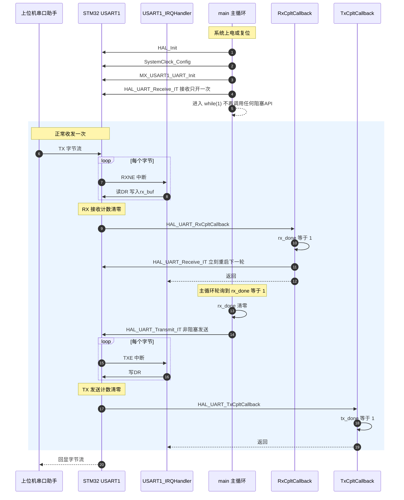
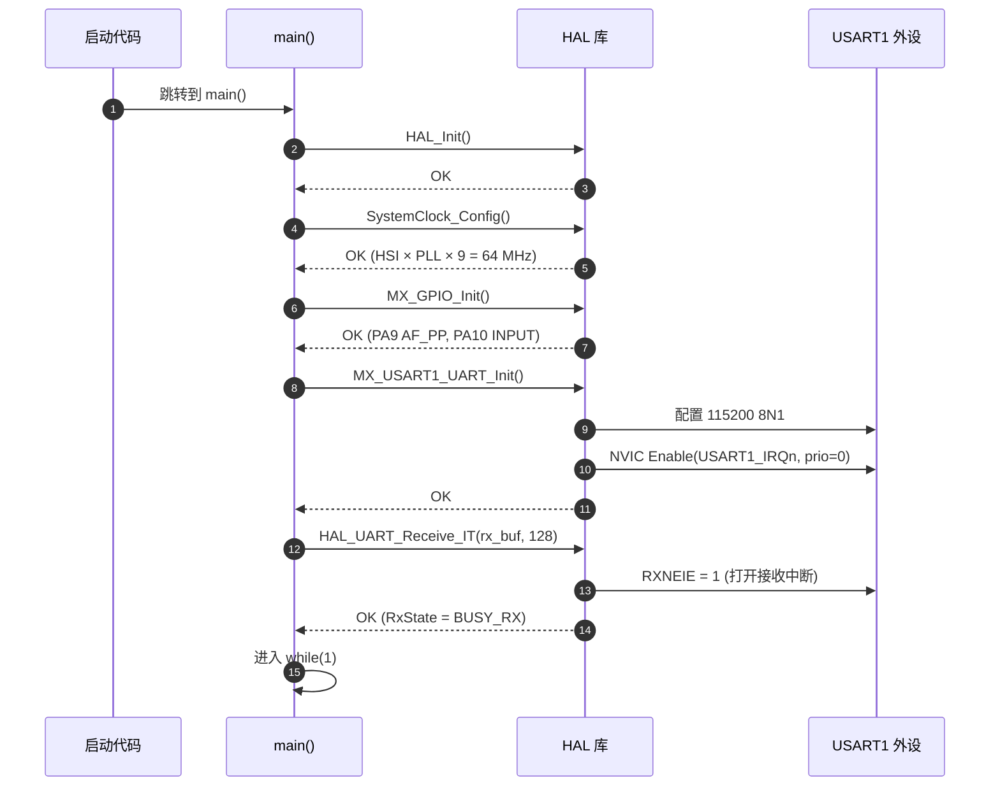
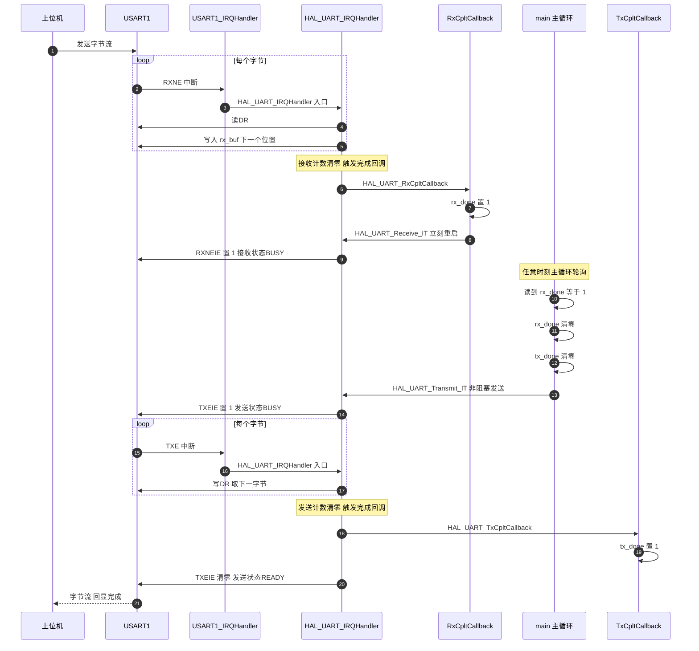
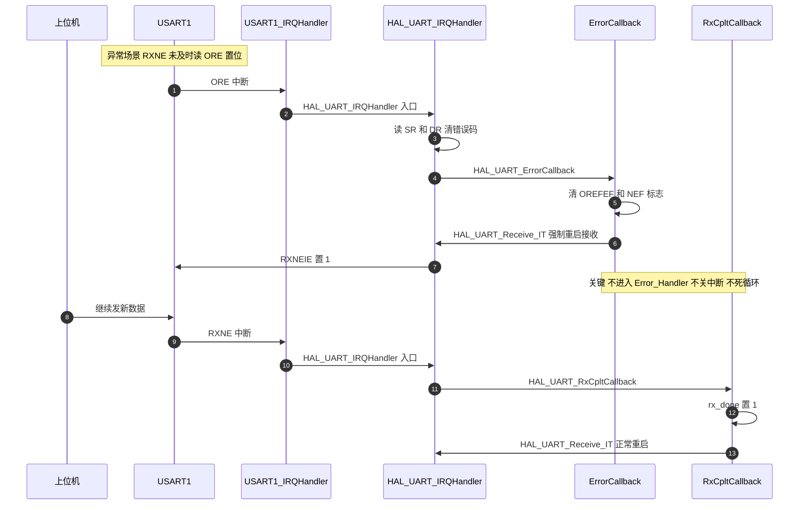

# `02_usart_interrupt` 时序图

> 对应优化后的代码：`main.c` + `stm32f1xx_it.c`
>
> 设计原则：**主循环永远不阻塞**，所有耗时操作走中断 + 标志位。

***

## 一、整体流程总览

***

## 二、初始化阶段（只发生一次）

***

## 三、正常收发一轮（核心循环）

***

## 四、出错处理（ORE / FE / NE）

***

## 五、与旧代码对比

| 维度      | 旧代码 ❌                                                  | 新代码 ✅                                                                   |
| ------- | ------------------------------------------------------ | ----------------------------------------------------------------------- |
| 主循环发送   | `HAL_UART_Transmit(..., 1000)` **阻塞**                  | `HAL_UART_Transmit_IT(...)` **非阻塞**                                     |
| 接收开启    | 每轮循环重新 `HAL_UART_Receive_IT`                           | 初始化时只开 **一次**，回调里重启                                                     |
| 接收回调    | `RxHalfCpltCallback` + `RxEventCallback`（与 IT 模式不匹配）   | `HAL_UART_RxCpltCallback`（IT 模式正确回调）                                    |
| 错误处理    | 默认进 `Error_Handler()` → `__disable_irq()` + `while(1)` | 自定义 `ErrorCallback`：清错误码 + 重启接收；`Error_Handler` 改为 `NVIC_SystemReset()` |
| NVIC 状态 | 关全局中断 → SWD 失联 → ST-LINK 报 "Target no device found"    | 中断始终可用 → 调试器随时能 halt → **永不卡死**                                         |

***

## 六、关键时序保证

1. **从** **`while(1)`** **看，CPU 永远只在做三件事**：
   - 读 `rx_done` 标志
   - 进入 `if` 分支，启动一次非阻塞发送
   - 回到循环顶
2. **从中断看，所有"长任务"都被打散成短 ISR**：
   - 每收到 1 字节进一次 RXNE ISR
   - 每发完 1 字节进一次 TXE ISR
   - 收满 / 发完才进完成回调（置标志 + 重启）
3. **状态机永不脏**：
   - `RxState` 始终是 `BUSY_RX`（被回调保证连续）
   - `TxState` 每次进 `if(rx_done)` 时是 `READY`（发送完才回 `READY`），调用 `Transmit_IT` 必然成功
4. **出错不致命**：
   - ORE/FE/NE → `ErrorCallback` 清错误 + 重启接收
   - `Error_Handler()` 仅在 `HAL_RCC_*` 等真正致命错误时触发，且只做软复位，不再关中断

