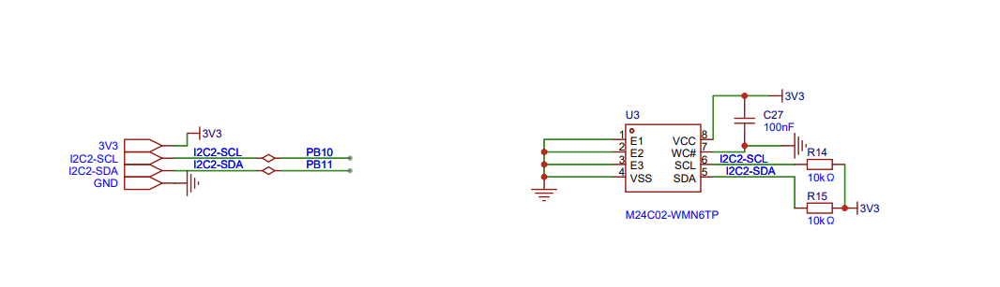
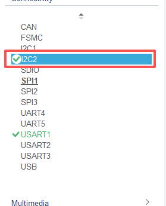
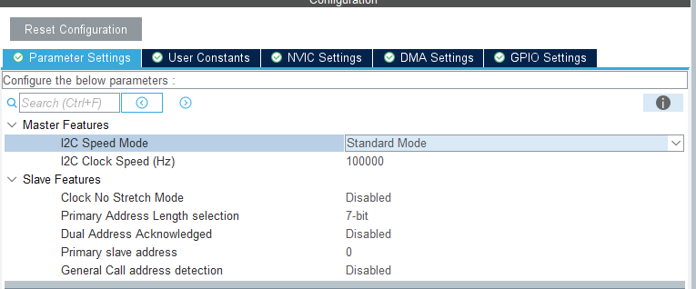
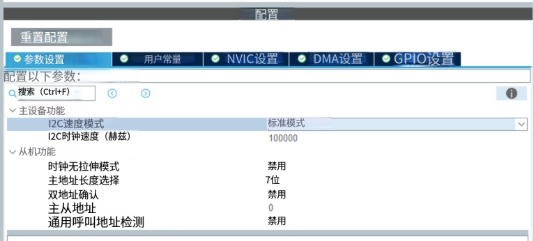

# I2C

I2C 是一种串行通信协议，用于连接多个设备到单个总线上。

# Stm32 I2C

STM32 提供了 I2C 模块，用于与 I2C 设备进行通信。
I2C 模块的配置和使用与串口类似，只是 I2C 模块的配置参数不同。

这种由硬件支持的通信协议，不需要额外的软件支持。

可以所谓主机或从机, 支持 100kbit/s 和 400kbit/s 两种速度。支持 7 位地址和 10 位地址。并且支持数据校验功能。

还支持SMBus2.0协议, 用于与SMBus2.0类似于I2c协议;

## 硬件连接

本工程使用 STM32 的 `I2C2` 与板载 **M24C02-WMN6TP**（2Kbit I2C EEPROM）通信，原理图连接如下：

- `PB10` → `I2C2_SCL` → M24C02 的 `SCL`（pin 6）
- `PB11` → `I2C2_SDA` → M24C02 的 `SDA`（pin 5）
- SCL / SDA 各通过 10kΩ 上拉电阻（R14 / R15）接 3V3
- VCC（pin 8）经 100nF 去耦电容（C27）接 3V3
- 设备 I2C 地址：`0xA0`（写）/ `0xA1`（读），由硬件管脚 E1/E2/E3 决定（本板均接地）

> 注：根目录下的 `image.png` 实为 WS2812 全彩灯模块，与本工程 I2C 主题不相关，已忽略。

## CubeMX 配置

### 1. 开启 I2C2 外设

在左侧外设列表中勾选 `I2C2`（同时保留之前已配置的 `USART1` 用于调试打印）：

### 2. I2C2 参数设置（英文界面）

`Parameter Settings` 面板：

- **Master Features**
  - `I2C Speed Mode`：`Standard Mode`
  - `I2C Clock Speed (Hz)`：`100000`（100 kHz）
- **Slave Features**
  - `Clock No Stretch Mode`：`Disabled`
  - `Primary Address Length selection`：`7-bit`
  - `Dual Address Acknowledged`：`Disabled`
  - `Primary slave address`：`0`
  - `General Call address detection`：`Disabled`

中文界面下对应选项含义一致：

本工程仅作为 I2C **主机**使用，所以从机相关特性保持默认（禁用）即可。

## I2C 从机模式

（占位，暂未使用）

## I2C 主机模式

（占位，暂未使用）
