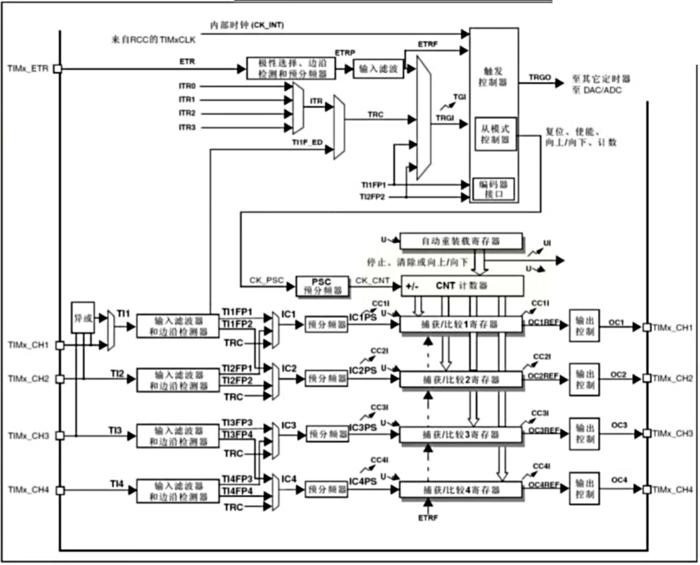
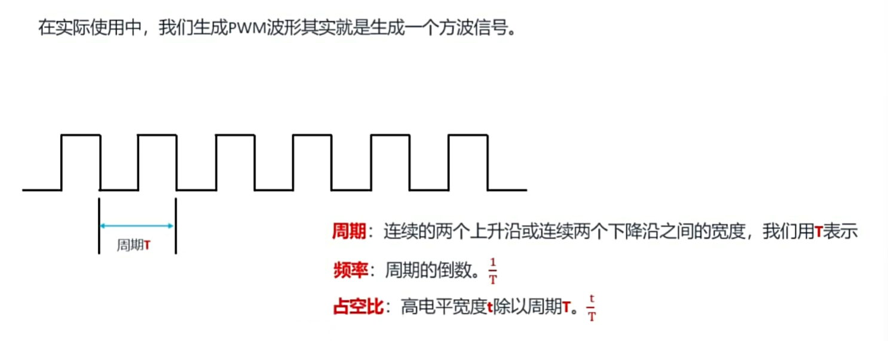
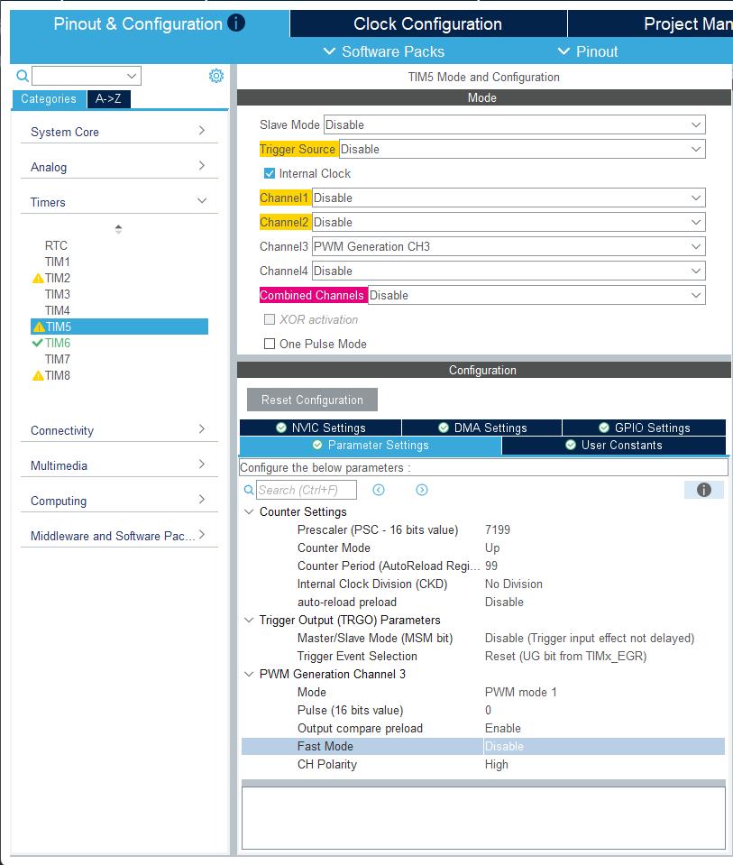
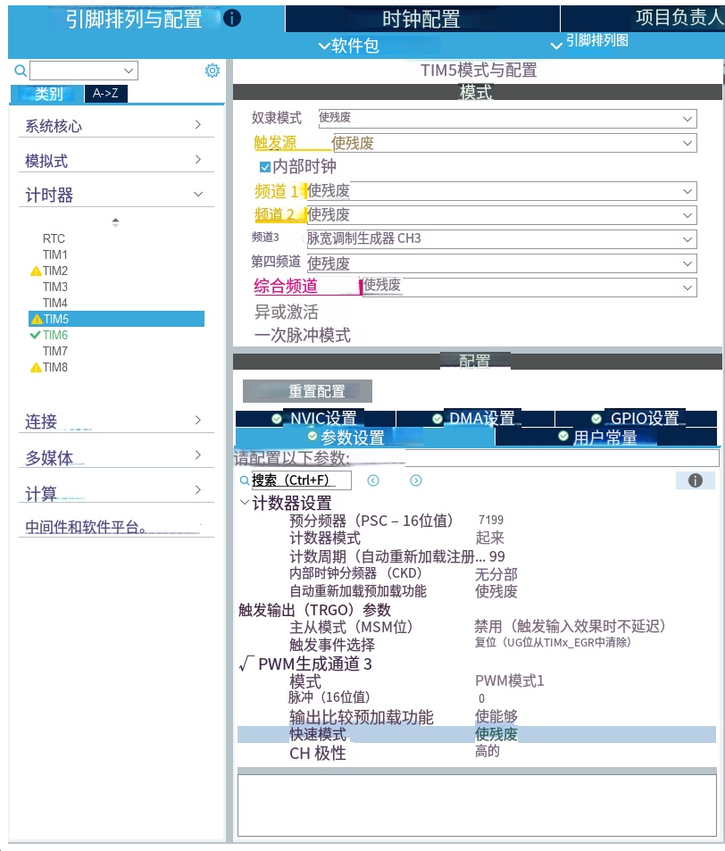

# 通用定时器

通用计时器分别有 TIM2、TIM3、TIM4、TIM5

1. 多种时钟源
2. 向上计数, 向下计数, 向上/向下计数
3. 输入捕获
4. 输出比较
5. 输出PWM
6. 支持针对定位的增量(正交)编码器和霍尔传感器电路;

功能框图

# 定时器 与 PWM(Pulse Width Modulation)

利用占空比来控制输出电平的时间比例，从而实现模拟信号的输出。

例如呼吸灯;

- 三个参数
  - 周期: 连续两个脉冲的时间间隔
  - 频率: 周期的倒数, 单位为赫兹(Hz)
  - 占空比: 输出电平的时间比例, 单位为百分比(%)

# 如何输出 PWM 波形

- 通用定时的输出比较

包含3部分:
  - 计数器部分
  - 捕获比较寄存器
        - 每个定时器有4个
        - 可以同时实现4路比较
  - 输出部分
        - 4路PWM输出

输出比较的8种模式:
  - 由CCMR1寄存器控制

1. OC1M[2:0]=000
   - 输出冻结, CNT和CCR比较结果不影响输出;
2. OC1M[2:0]=001
   - 输出高电平, CNT和CCR比较结果不影响输出;
3. OC1M[2:0]=010
   - 输出低电平, CNT和CCR比较结果不影响输出;
4. OC1M[2:0]=011
   - 输出翻转, 一旦CNT=CCR1, 则输出翻转;频率为计数器溢出的一半, 占空比为50%;
5. OC1M[2:0]=100
   - 强制输出低电平.
6. OC1M[2:0]=101
   - 强制输出高电平.
7. OC1M[2:0]=110
   - PWM模式1, CNT<CCR1, 输出高电平. CNT>=CCR1, 输出低电平.
8. OC1M[2:0]=111
   - PWM模式2, CNT<CCR1, 输出低电平. CNT>=CCR1, 输出高电平.

# MX 配置

