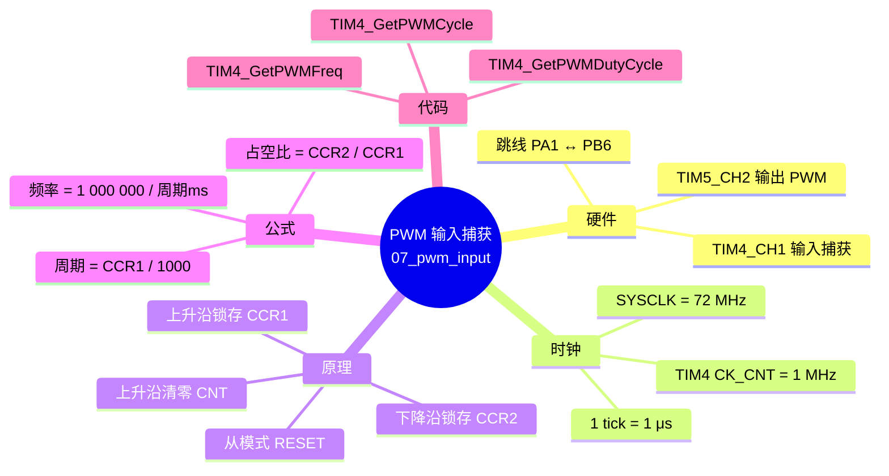
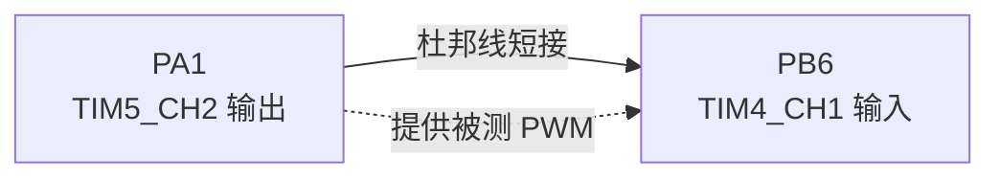
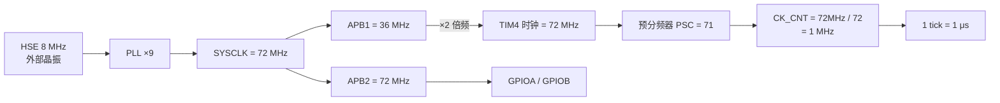
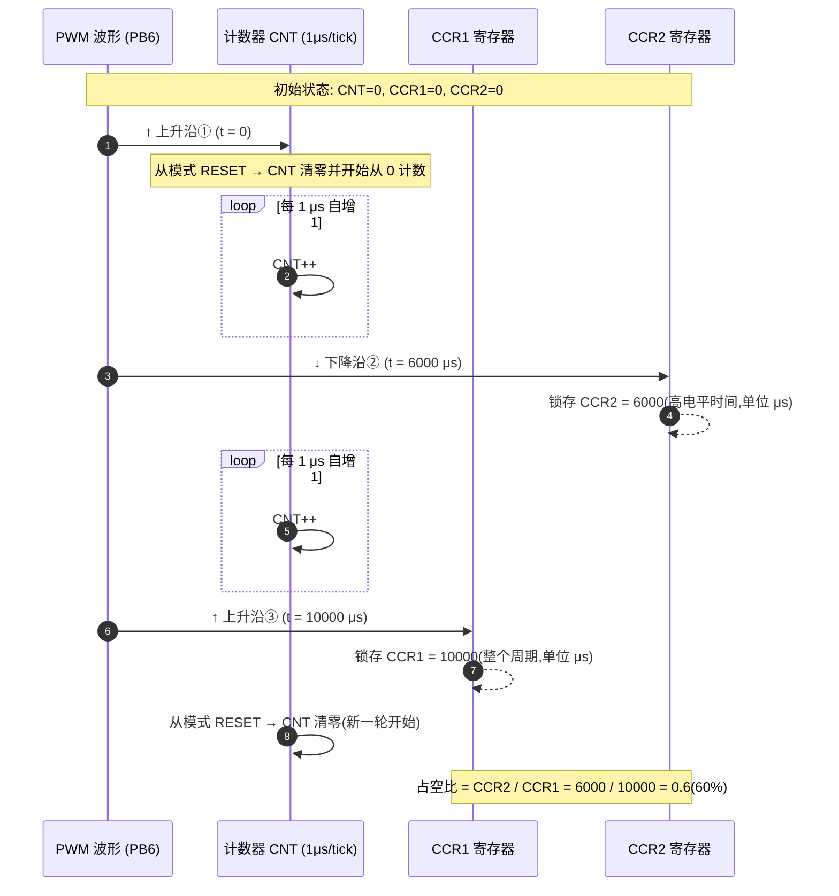
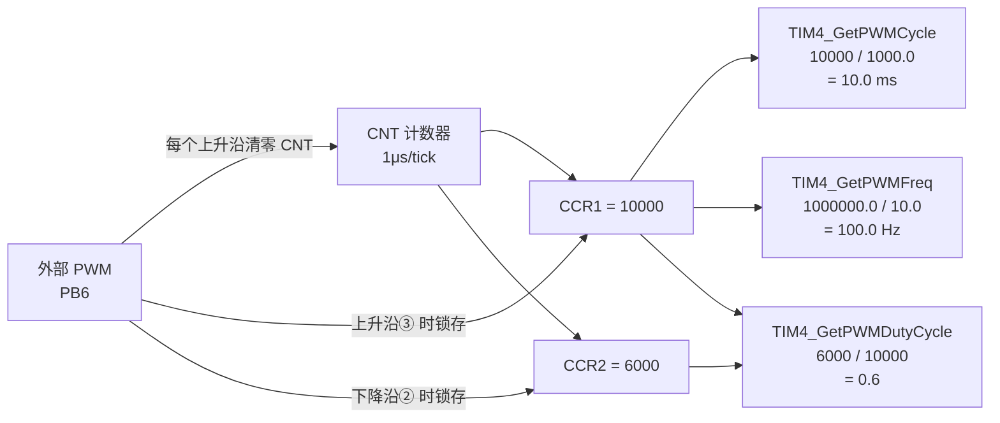
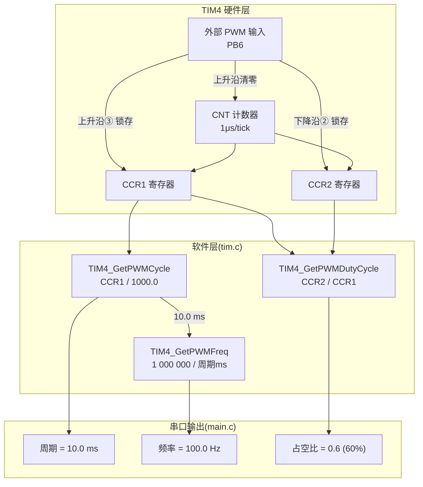
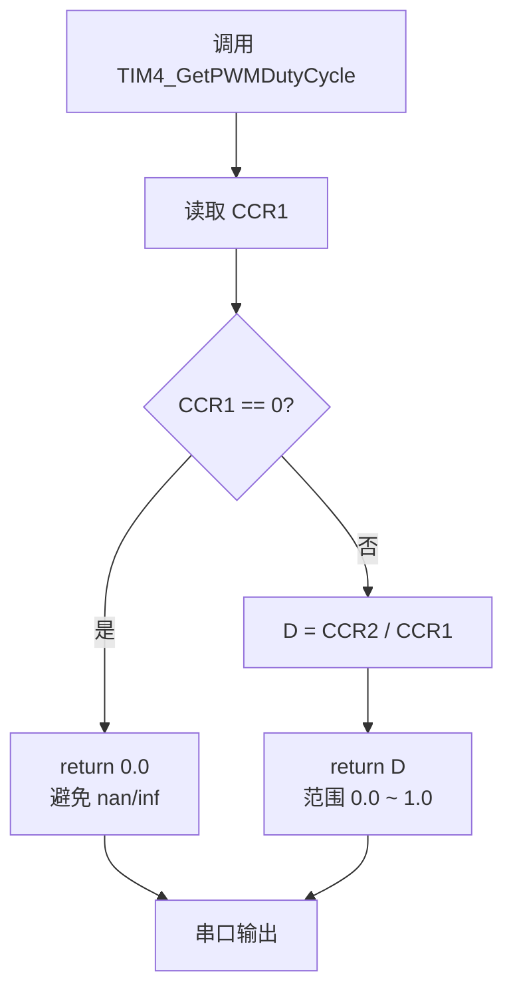
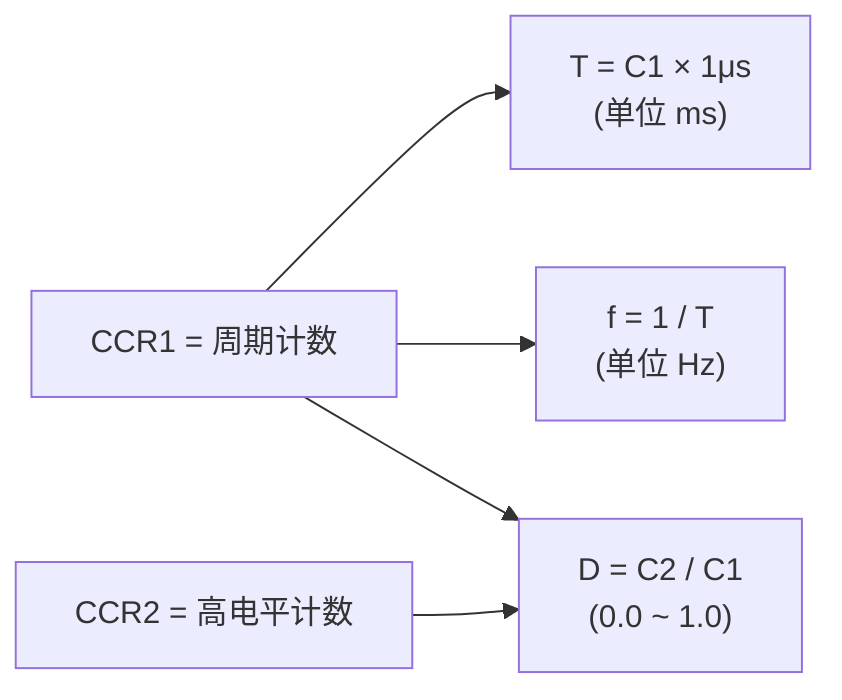

# 07_pwm_input — STM32 PWM 输入捕获与占空比测量

本项目基于 STM32F103 定时器的 **PWM 输入捕获模式**,通过 TIM4 测量外部 PWM 信号的
**周期、频率、占空比**,并通过 USART1 打印到串口。TIM5 通道 2(PA1)输出一个已知占空比的
PWM 作为信号源,实际测量前需要用杜邦线将 **PA1 ↔ PB6** 短接。

---

## 0. 导读(项目结构总览)



---

## 1. 硬件连接

| 信号源 (TIM5_CH2 PWM 输出) | 输入捕获 (TIM4_CH1) | 板内连线方式        |
|----------------------------|----------------------|---------------------|
| PA1                        | PB6                  | 杜邦线短接(必接!) |

- **TIM5_CH2 (PA1)**: 输出 PWM,作为被测信号源
  - 预分频 = 7199,计数周期 = 99,得到频率 ≈ 100 Hz、Pulse = 60(占空比 ≈ 60%)
- **TIM4_CH1 (PB6)**: 输入捕获通道,接收 PA1 的 PWM 信号
  - 预分频 = 71,计数周期 = 65535



> ⚠️ 如果不接跳线,TIM4 不会捕获到任何上升沿,CCR1/CCR2 始终为 0,
> 计算结果会出现 `nan/inf`。详见后文“防除零保护”。

---

## 2. 时钟与计数原理

### 2.1 时钟链(mermaid)



### 2.2 TIM4 计数频率

定时器时钟 `CK_CNT = 72 MHz / (PSC + 1) = 72 MHz / (71 + 1) = 1 MHz`

因此定时器每次计数 +1 对应 **1 μs**,这是后续把 CCR 值换算成时间的核心系数。

---

## 3. PWM 输入模式工作原理

STM32 的“PWM 输入模式”通过 **从模式 RESET + 两个通道异沿捕获** 来同时测量
**周期** 与 **高电平宽度**,硬件自动完成清零动作,无需软件干预。

### 3.1 关键配置(TIM4)

| 项                          | 值                                  | 说明                                |
|-----------------------------|-------------------------------------|-------------------------------------|
| 从模式(SlaveMode)           | `TIM_SLAVEMODE_RESET`               | 触发时计数器自动清零                 |
| 触发源(InputTrigger)        | `TIM_TS_TI1FP1`                     | 由 CH1 的上升沿触发                  |
| CH1 极性                    | 上升沿                              | 测一个完整周期                       |
| CH2 选择                    | `TIM_ICSELECTION_INDIRECTTI`        | 间接连到 TI1,与 CH1 共用同一条输入   |
| CH2 极性                    | 下降沿                              | 测高电平时间                         |

### 3.2 用具体数值走一遍(假设周期 10 ms,占空比 60%)

TIM5 输出的 PWM 是:周期 = 10 ms、高电平 = 6 ms、低电平 = 4 ms。
对应到 1 MHz 计数器上:每周期计 10000 次,高电平计 6000 次。

**PWM 波形 + 计数器 CNT + 寄存器锁存 一一对应关系:**

```mermaid
gantt
    title TIM4 PWM 输入捕获时序(周期 10ms,占空比 60%)
    dateFormat X
    axisFormat %sμs

    section PWM 波形 (PB6)
    高电平 #1     :active, pwm1, 0, 6000
    低电平 #1     :active, pwm2, after pwm1, 4000
    高电平 #2     :active, pwm3, after pwm2, 6000

    section 计数器 CNT (1μs/tick)
    计数 0→6000    :crit, cnt1, 0, 6000
    计数 6000→10000 :crit, cnt2, after cnt1, 4000
    计数 0→6000    :crit, cnt3, after cnt2, 6000

    section 锁存事件 (milestone)
    上升沿① CNT 清零  :milestone, m1, 0, 0
    下降沿② CCR2 锁存=6000 :milestone, m2, 6000, 0
    上升沿③ CCR1 锁存=10000 :milestone, m3, 10000, 0
```



**关键事实:**

| 时刻 | 发生什么                | CNT 当时值 | 谁被锁存 | 锁存的值 | 含义              |
|------|------------------------|------------|----------|----------|-------------------|
| ①    | 上升沿 → CNT 清零      | 0          | —        | —        | 周期开始           |
| ②    | 下降沿(高电平结束)     | 6000       | **CCR2** | 6000     | 高电平持续了 6000 μs = 6 ms |
| ③    | 上升沿 → CNT 清零      | 10000      | **CCR1** | 10000    | 整个周期经历了 10000 μs = 10 ms |
| ④    | 下降沿                  | 4000       | CCR2     | 4000     | (下一轮高电平:低电平) |

**结论:**

- **CCR1 = 一个完整周期的计数值 = 周期(μs)**
- **CCR2 = 高电平阶段的计数值 = 高电平时间(μs)**

### 3.3 时序交互图



---

## 4. 占空比计算公式推导

### 4.1 从寄存器到最终输出,数据流图



### 4.2 数学推导

由于 CCR1、CCR2 单位都是 **μs**(因为 1 tick = 1 μs),在计算比值时单位自动约掉,
因此占空比公式无需再做单位换算。

设:

- \(C_1\) = CCR1 寄存器的值(单位:计数个数 = μs)
- \(C_2\) = CCR2 寄存器的值(单位:计数个数 = μs)
- \(T\) = PWM 周期(秒), \(T_h\) = 高电平时间(秒)

由 §3.2 可知:

\[
C_1 = \frac{T}{1\,\mu s},\qquad C_2 = \frac{T_h}{1\,\mu s}
\]

高电平占空比定义为:

\[
D = \frac{T_h}{T} = \frac{C_2 \cdot 1\,\mu s}{C_1 \cdot 1\,\mu s} = \frac{C_2}{C_1}
\]

代入具体数值:

\[
D = \frac{C_2}{C_1} = \frac{6000}{10000} = 0.6 = 60\,\%
\]

最终公式:

\[
\boxed{D = \frac{C_2}{C_1} = \frac{\text{CCR2}}{\text{CCR1}}}
\]

输出范围 `0.0 ~ 1.0`,例如 `0.6` 表示 **60 %** 占空比。

### 4.3 一图看懂整个计算过程(mermaid 框图)



对应的数值代入:

```
  周期(ms) = CCR1 / 1000.0          = 10000 / 1000.0 = 10.0  ms
  频率(Hz) = 1 000 000.0 / 周期(ms) = 1000000 / 10.0    = 100.0 Hz
  占空比    = CCR2 / CCR1            =  6000  / 10000   = 0.6 = 60 %
```

---

## 5. 代码实现

`Core/Src/tim.c` 中三个函数都基于上述原理:

```c
// 周期(ms):CCR1 寄存器的值(μs) / 1000
double TIM4_GetPWMCycle(void)
{
    return __HAL_TIM_GetCompare(&htim4, TIM_CHANNEL_1) / 1000.0;
}

// 频率(Hz):1 / 周期(秒) = 1 000 000 / 周期(ms)
double TIM4_GetPWMFreq(void)
{
    return 1000000.0 / TIM4_GetPWMCycle();
}

// 占空比(0.0 ~ 1.0):CCR2 / CCR1
double TIM4_GetPWMDutyCycle(void)
{
    return (__HAL_TIM_GetCompare(&htim4, TIM_CHANNEL_2) * 1.0)
           / __HAL_TIM_GetCompare(&htim4, TIM_CHANNEL_1);
}
```

`main.c` 中每秒打印一次结果:

```c
double tim4_get_pwm_cycle       = TIM4_GetPWMCycle();
double tim4_get_pwm_duty_cycle  = TIM4_GetPWMDutyCycle();
double tim4_get_pwm_freq        = TIM4_GetPWMFreq();

printf("PWM 周期:   %f\r\n", tim4_get_pwm_cycle);        // ms
printf("PWM 占空比: %f\r\n", tim4_get_pwm_duty_cycle);   // 0.0 ~ 1.0
printf("PWM 频率:   %f\r\n", tim4_get_pwm_freq);         // Hz
```

按本工程的 TIM5 输出参数(`PSC=7199, Period=99, Pulse=60`),预期串口输出:

```
PWM 周期:   10.000000
PWM 占空比: 0.600000
PWM 频率:   100.000000
```

---

## 6. 注意事项

### 6.1 防除零保护(NaN / Inf 防护)

当 TIM4 还没有捕获到有效边沿时(`CCR1 = 0`),直接除以 `CCR1` 会得到 `nan` 或 `inf`,
后续 `printf("%f", ...)` 在 Newlib-nano 下甚至不会打印任何字符。

**保护逻辑流程图:**



推荐改造(参见 [tim.c](file://C:\workspace\stm32\src\07_pwm_input\Core\Src\tim.c)):

```c
double TIM4_GetPWMDutyCycle(void)
{
    uint32_t ccr1 = __HAL_TIM_GetCompare(&htim4, TIM_CHANNEL_1);
    uint32_t ccr2 = __HAL_TIM_GetCompare(&htim4, TIM_CHANNEL_2);

    if (ccr1 == 0U) return 0.0;            // 尚未捕获到有效信号

    return (double)ccr2 / (double)ccr1;
}
```

`TIM4_GetPWMFreq()` 也建议做同样处理:

```c
double TIM4_GetPWMFreq(void)
{
    double cycle_ms = TIM4_GetPWMCycle();
    if (cycle_ms <= 0.0) return 0.0;
    return 1000.0 / cycle_ms;
}
```

### 6.2 跳线必须接

TIM5_CH2(PA1)和 TIM4_CH1(PB6)在板上是 **两个独立引脚**,必须用杜邦线物理短接
才能让 TIM4 捕获到 TIM5 输出的 PWM。

### 6.3 测量精度上限

- TIM4 计数频率 1 MHz → 理论分辨率 **1 μs**
- 计数器 16 位 → 最大周期 = 65535 μs ≈ 65.5 ms
  (对应最低可测频率 ≈ 15 Hz)

若需测量更低频率的 PWM,可在 `MX_TIM4_Init()` 中增大 `htim4.Init.Period`,
或换用 32 位定时器(TIM2/TIM5)。

### 6.4 整数除法陷阱

`CCR2 / CCR1` 都是 `uint32_t`,直接相除会按整数除法运算,小数部分被截断。
代码中使用 `* 1.0` 把其中一个操作数提升为 `double`,触发浮点除法,保留小数部分。
不要写成 `CCR2 / CCR1` 的纯整型形式,否则结果恒为 `0` 或 `1`。

---

## 7. 速查:核心公式一览

| 量        | 公式                              | 单位         | 来源           |
|-----------|-----------------------------------|--------------|----------------|
| 周期 T    | \(T = C_1 \times 1\,\mu s\)       | μs(代码转 ms)| CCR1           |
| 频率 f    | \(f = \dfrac{1}{T} = \dfrac{10^6}{C_1}\) | Hz           | CCR1           |
| 占空比 D  | \(D = \dfrac{C_2}{C_1}\)          | 0.0 ~ 1.0    | CCR2 / CCR1    |

### 7.1 公式关系图



> 一句话总结:**占空比 = 高电平计数值 ÷ 周期计数值 = CCR2 ÷ CCR1**,单位 μs 自动约掉。