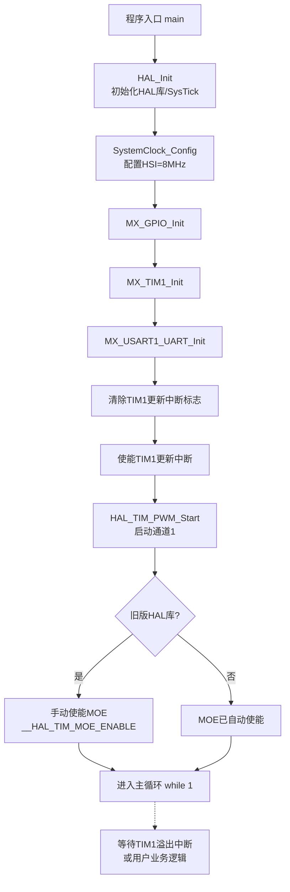
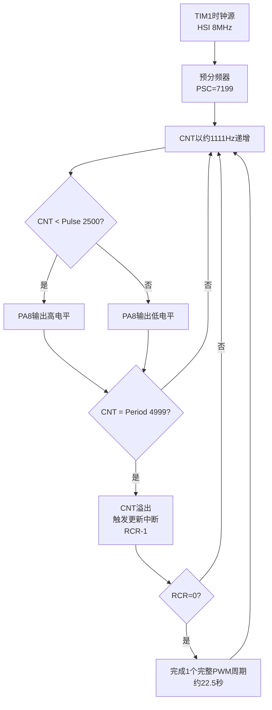

# 08_pwm_super — STM32 PWM 演示工程

> 基于 STM32F103ZE，使用 TIM1 通道 1 输出 PWM 信号驱动 PA8 引脚的 LED。

---

## 一、问题诊断：PA8 LED 不闪烁

### 1.1 现象
上电后 PA8 引脚上的 LED 没有任何可见的亮灭变化。

### 1.2 原因分析

本工程存在 **两个相互叠加** 的问题，导致 LED 看起来"不亮 / 不闪烁"。

#### 原因 A：高级定时器未使能 MOE（主输出）

TIM1 是 **高级定时器（Advanced-control Timer）**。在调用 `HAL_TIM_PWM_Start()` 启动 PWM 之后，PA8 引脚默认是 **没有信号输出** 的，必须额外使能 MOE 位（Main Output Enable）：

```c
__HAL_TIM_MOE_ENABLE(&htim1);
```

| 定时器类型 | 是否需要手动使能 MOE |
|------------|----------------------|
| 普通定时器（TIM2/TIM3/TIM4/TIM5…） | 否，`HAL_TIM_PWM_Start()` 自动使能输出 |
| 高级定时器（TIM1/TIM8） | **是**，必须显式调用 `__HAL_TIM_MOE_ENABLE()` |

> **HAL 库版本差异**：较新版 STM32CubeF1 HAL（v1.8+）在 `HAL_TIM_PWM_Start()` 内部已自动调用 `__HAL_TIM_MOE_ENABLE()`；而较旧版本（v1.7 及更早）不会自动调用。本工程若使用旧版 HAL，就会出现 LED 无输出的现象。

#### 原因 B：PWM 周期过长

当前 `tim.c` 中的 TIM1 配置：

| 参数 | 值 |
|------|-----|
| 预分频 (PSC) | 7199 |
| 周期 (ARR) | 4999 |
| 重复计数 (RCR) | 4 |
| 比较值 (Pulse) | 2500 |
| 系统时钟 | HSI 8 MHz（未启用 PLL） |

实际 PWM 周期：

\[
T = \frac{(PSC+1) \times (ARR+1) \times (RCR+1)}{f_{SYS}} = \frac{7200 \times 5000 \times 5}{8 \times 10^6} \approx 22.5 \,\text{s}
\]

LED 每 **22.5 秒** 才切换一次亮灭状态，肉眼几乎察觉不到，因此被误认为"不闪烁"。

### 1.3 解决方案

#### 方案 ①：使能 MOE（推荐先做）

在 `Core/Src/main.c` 的 `USER CODE BEGIN 2` 区域、`HAL_TIM_PWM_Start()` 之后追加一行：

```c
__HAL_TIM_MOE_ENABLE(&htim1);
```

#### 方案 ②：调整参数使 PWM 频率可观察

修改 `Core/Src/tim.c` 中 TIM1 的初始化参数：

| 参数 | 旧值 | 新值 |
|------|------|------|
| Prescaler | 7199 | **71** |
| Period | 4999 | **999** |
| RepetitionCounter | 4 | **0** |
| Pulse | 2500 | 500（占空比 50%） |

修改后 PWM 频率：

\[
f_{PWM} = \frac{8 \times 10^6}{(71+1) \times (999+1)} \approx 111 \,\text{Hz}
\]

肉眼可看到明显的亮灭。

---

## 二、`main.c` 非生成代码注释说明

STM32CubeMX 在 `main.c` 中使用 `USER CODE BEGIN xxx` / `USER CODE END xxx` 标记用户维护的代码块，重新生成工程不会被覆盖。

### 2.1 `USER CODE BEGIN 2` — 外设启动

```c
/* 清除 TIM1 更新中断标志，避免上电后立刻误触发一次中断 */
__HAL_TIM_CLEAR_FLAG(&htim1, TIM_IT_UPDATE);
/* 使能 TIM1 更新中断（计数器溢出时进入 TIM1_UP_IRQHandler） */
__HAL_TIM_ENABLE_IT(&htim1, TIM_IT_UPDATE);
/* 启动 TIM1 通道 1 的 PWM 输出，使能 PA8 复用功能 */
HAL_TIM_PWM_Start(&htim1, TIM_CHANNEL_1);
```

### 2.2 `USER CODE BEGIN WHILE` / `USER CODE BEGIN 3` — 主循环

主循环当前为空，所有 PWM 输出由 TIM1 硬件自动完成。预留扩展点：

```c
/* - 动态修改 __HAL_TIM_SET_COMPARE(&htim1, TIM_CHANNEL_1, pulse) 调节亮度
   - 按键扫描
   - 串口数据处理
   - 配合 DMA 实现呼吸灯效果 */
```

### 2.3 `USER CODE BEGIN 4` — 用户自定义函数区

可添加：
- 定时器回调 `HAL_TIM_PeriodElapsedCallback()`
- USART 接收/发送完成回调
- 业务逻辑函数（呼吸灯算法、按键扫描等）

### 2.4 `Error_Handler` — 错误处理入口

```c
__disable_irq();   /* 关闭全局中断，避免错误状态下产生意外中断 */
while (1) { /* 死循环停留，便于在线调试 */ }
```

### 2.5 `assert_failed` — 参数断言回调

`assert_param` 宏检测到非法参数时调用，需要在 `stm32f1xx_hal_conf.h` 中开启 `USE_FULL_ASSERT` 才会生效。

---

## 三、程序执行流程



---

## 四、TIM1 PWM 硬件生成原理



---

## 五、关键参数速查

| 参数 | 值 | 说明 |
|------|-----|------|
| MCU | STM32F103ZE | Cortex-M3 |
| 系统时钟 | HSI 8 MHz | 未启用 PLL |
| 预分频 (PSC) | 7199 | 计数频率 ≈ 1111 Hz |
| 周期 (ARR) | 4999 | 单次计数 0→4999 |
| 重复计数 (RCR) | 4 | 完整周期需重复 5 次 |
| 比较值 (Pulse) | 2500 | 占空比 50% |
| **PWM 频率** | **≈ 0.044 Hz** | 周期 ≈ **22.5 秒** |
| 输出通道 | TIM1_CH1 | 对应引脚 **PA8** |
| 串口 | USART1 | 调试输出 |

---

## 六、目录结构

```
08_pwm_super/
├── Core/
│   ├── Inc/        # 头文件（main.h / tim.h / gpio.h / usart.h …）
│   └── Src/        # 源文件（main.c / tim.c / gpio.c / usart.c …）
├── Drivers/
│   ├── CMSIS/      # Cortex-M3 内核支持
│   └── STM32F1xx_HAL_Driver/  # ST 官方 HAL 库
├── EWARM/          # IAR 工程文件
├── cmake/          # CMake 工具链配置
├── startup_stm32f103xe.s
├── STM32F103xx_FLASH.ld
├── 08_pwm_super.ioc   # STM32CubeMX 工程配置
└── README.md       # 本文档
```

---

## 七、构建与烧录

工程支持多种 IDE：

| IDE | 工程文件 |
|-----|----------|
| IAR | `EWARM/08_pwm_super.eww` |
| STM32CubeIDE | 直接 `Import` 根目录 |
| CMake + arm-none-eabi-gcc | 根目录 `CMakeLists.txt` + `cmake/gcc-arm-none-eabi.cmake` |
| CMake + clang | `cmake/starm-clang.cmake` |

---

## 八、参考

- STM32F103 参考手册 RM0008 — 第 13 章 高级定时器（TIM1/TIM8）
- STM32CubeF1 HAL 库说明 — `Drivers/STM32F1xx_HAL_Driver/`