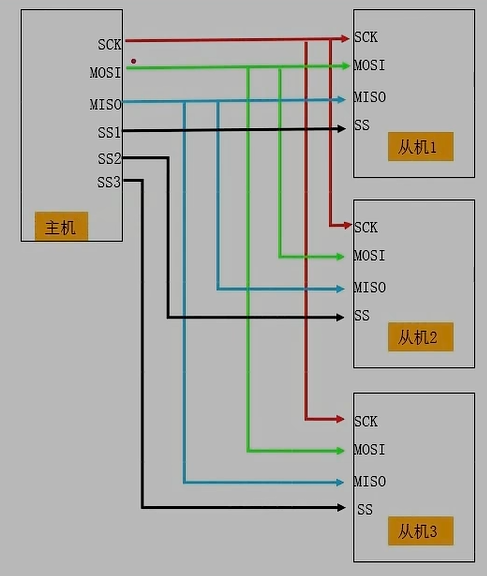
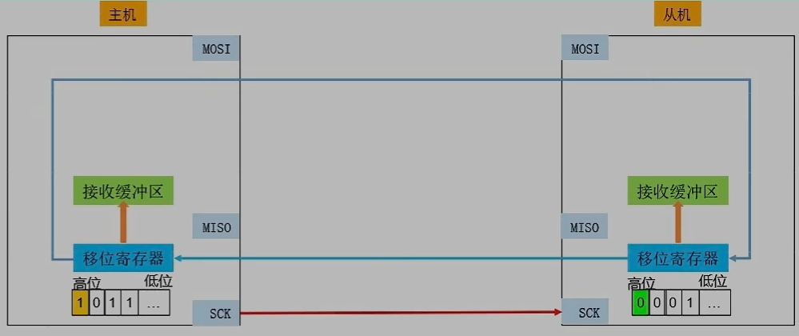
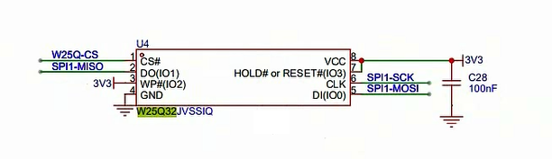
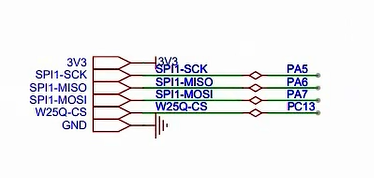
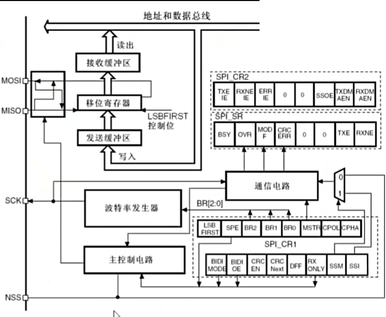

# spi

物理层

SCK: 时钟
MOSI: 主输出/从输入
MISO: 主输入/从输出
SS: 使能开关 (NSS或CS)

物理协议层

主从同时发送, 时钟静默可以是停止通讯;
时钟的极性和相位
- 极性 CPOL(Clock Polarity) : 空闲时刻和通讯时刻; 
    - 例如: CPOL=0, 低电平
- 相位 CPHA(Clock Phase) : 就是时钟相位;
    - 例如: CPHA=1, 表示从第二个沿变开始有效;

模式:
| mode | CPOL | CPHA |
| ---- | ---- | ---- |
| mode1 | 0 | 0 |
| mode2 | 0 | 1 |
| mode3 | 1 | 0 |
| mode4 | 1 | 1 |

# W25Q32 存储器

块号
段号
页号
业内地址

## 写入注意
1. 写使能
2. 每个数据只能写入为0, 不能写入为1; 默认为1;
3. 写入前必须先擦除, 所有数据都变为1, 擦除必须按照最小单元进行
4. 连续写入多个字节时, 最多写一个页, 超过一个页时, 会回到首页覆盖写入;
5. 写入操作结束后, 芯片进入忙状态,不影响新的读写操作;

## 读取注意
1. 直接调用读取指令, 即可读取到对应地址的数据, 无需额外操作, 没有页限制;
2. 读取数据时, 不会进入忙状态, 但不能再忙状态读取;

## 指令

## SPI 外设框图

- NSS是片选信号
    - 可以硬件自动控制
    - 也可以软件软件控制
- 数据寄存器
    - 数据寄存器对应两个缓冲区

- 移位寄存器
    - 写入到发送缓存区
    - 按位通过MOSI把数据发送出去
    - 按位把通过MISO接收的数据写入到接收缓存区中
    - 接受完成后,数据会背诵如到接收缓存区中
