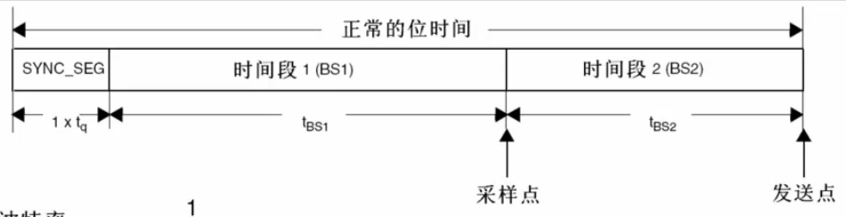

# CAN

# STM32 CAN

支持CANA和CANB两个CAN控制器;

bxCan

支持基础数据帧和扩展数据帧。

## 控制器 需要外接收发器

## 三种工作模式

1. 初始化模式
2. 正常模式
3. 睡眠模式

## 调试模式
- 静默模式
    - 只接收数据帧
    - 不发送数据帧
    主要用作监控CAN总线上的数据帧
- 环回模式
    - 对外只发不收
    - 对内自发自收
    主要用作测试CAN总线上的数据帧是否正常发送
- 环回静默模式
    - 对外不发不收
    - 对内自发自收
    主要用作自测试, 和Can网络无关

## can 的过滤器

**接收过滤器**

标识符列表模式, 只接收标识符在列表中的数据帧。相当与一个白名单。

掩码模式, 只接收标识符符合掩码的数据帧。可以理解为关键字过滤。

## 位时序
stm32 中合并了CANA和CANB两个CAN控制器的位时序。
CANA和CANB的位时序是相同的。

波特率 = 1 / 正常的位时间

正常位时间 = 1 * t_q + t_bs1 + t_bs2

