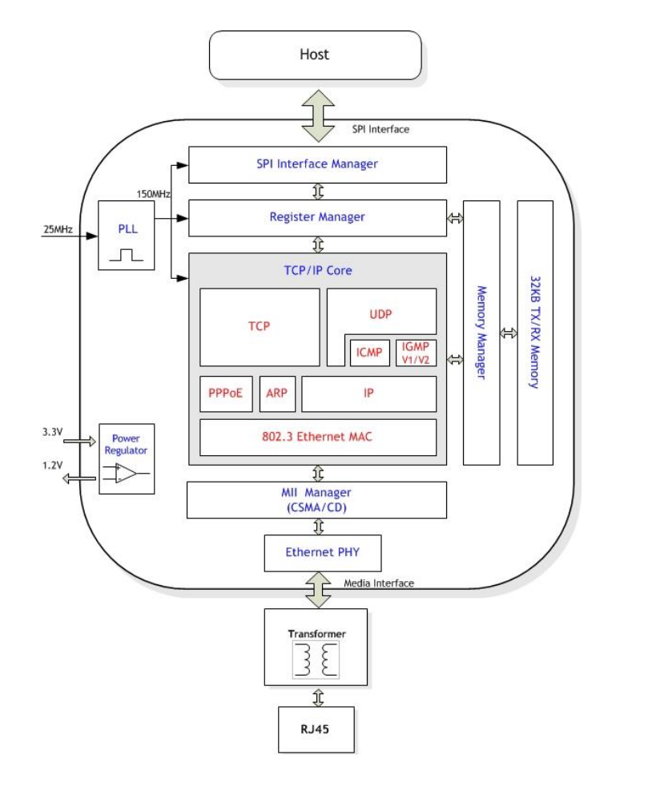
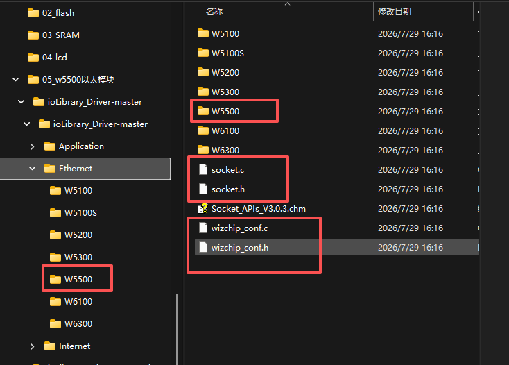

# w5500

W5500 是韩国半导体公司 WIZnet 提供的一款高性价比的**以太网芯片**。其全球独一无二的**全硬件 TCPIP 协议栈专利技术**，解决了**嵌入式以太网**的接入问题，简单易用，安全稳定，是物联网设备的首选解决方案。

W5500 集成了 TCP/IP 协议栈，10/100M 以太网数据链路层（MAC）及物理层（PHY），使用户使用单芯片就能够**在他们的应用中拓展网络连接**。

久经市场考验的 WIZnet 全硬件 TCP/IP 协议栈支持 TCP、UDP、IPv4、ICMP、ARP、IGMP 以及 PPPoE 协议。W5500 内嵌 **32K 字节片上缓存** 供以太网包处理。如果你使用 W5500，你只需要一些简单的 Socket 编程就能实现以太网应用。这将会比其他嵌入式以太网方案更加快捷、简便。

用户可以同时使用 **8 个硬件 Socket 独立通讯**。W5500 提供了 SPI（外设串行接口）从而能够更加容易与外设 MCU 整合。而且，W5500 使用了新的高效 SPI 协议支持 80MHz 速率，从而能够更好的实现高速网络通讯。为了减少系统能耗，W5500 提供了**网络唤醒模式（WOL）** 及掉电模式供客户选择使用。


# 芯片特点

（1）支持**硬件 TCP/IP 协议**：TCP、UDP、ICMP、IPv4、ARP、IGMP、PPPoE。

（2）支持 **8 个独立端口（Socket）同时通讯**。

（3）支持掉电模式。

（4）支持网络唤醒。

（5）支持高速串行外设接口（SPI 模式 0、3）。

（6）内部 **32K 字节收发缓存**。

（7）内嵌 **10BaseT/100BaseTX 以太网物理层（PHY）**。

（8）支持**自动协商（10/100-Based 全双工/半双工）**。

（9）**不支持 IP 分片**。

# 应用目标

W5500 适合于以下嵌入式应用：

（1）**家庭网络设备**：机顶盒、个人录像机、数码媒体适配器。

（2）**串行转以太网**：门禁控制、LED 显示屏、无线 AP 继电器等。

（3）**并行转以太网**：POS/微型打印机、复印机。

（4）**USB 转以太网**：存储设备、网络打印机。

（5）**GPIO 转以太网**：家庭网络传感器。

（6）**安全系统**：数字录像机、网络摄像机、信息亭。

（7）**工厂和楼宇自动化控制系统**。

（8）**医疗监测设备**。

（9）**嵌入式服务器**。

# 接入框图



[pdf在线文档](https://www.lcsc.com/datasheet/C32843.pdf)


# 官方库
[官方库](https://github.com/Wiznet/ioLibrary_Driver.git)

## 库的导入



只导入有用的库
```txt
W5500
- wiz5500.h
- wiz5500.c
socket.h
socket.c
wizchip.c
wizchip.h
```

在wizchip_conf.h中修改, 选择W5500, 否则编译会有问题;
```c
#define _WIZCHIP_                      5500   // W5100, W5100S, W5200, W5300, W5500, 6300
```

**cloin 需要手动 add 到 cmake中;**

**也可以右击文件, 选择添加到cmake项目中;**

## 如何使用

### 片选模式选择

在 wizchip_conf.h 中修改, 选择 SPI+VDM 模式;

```c
#define _WIZCHIP_IO_MODE_           _WIZCHIP_IO_MODE_SPI_
```

修改为
```c
#define _WIZCHIP_IO_MODE_           _WIZCHIP_IO_MODE_SPI_VDM_
```
### 默认禁用中断的函数

此函数有助于防止访问错误地址。如果您未描述此函数或注册任何函数，则会调用空函数。

在 wizchip_conf.c 中有默认实现; 实现为空函数。

```c
void 	wizchip_cris_enter(void)      {} // 进入中断模式
void 	wizchip_cris_exit(void)       {} // 退出中断模式
void 	wizchip_cs_select(void)       {} // 选择片选
void 	wizchip_cs_deselect(void)     {} // 取消选择片选
```

以上方法需要我们自己定义填写;


```c
void wizchip_cris_enter(void)
{
    __disable_irq();
}
void wizchip_cris_exit(void)
{
    __enable_irq();
}

void wizchip_cs_select(void)
{
    HAL_GPIO_WritePin(CS_GPIO_Port, CS_Pin, GPIO_PIN_RESET); // 选择片选
}
void wizchip_cs_deselect(void)
{
    HAL_GPIO_WritePin(CS_GPIO_Port, CS_Pin, GPIO_PIN_SET); // 取消选择片选
}
```


修改一下方法, 的内容, 为SPI的读取和写入字;

```c
uint8_t wizchip_spi_readbyte(void)
{
    uint8_t rByte;
    uint8_t byte = 0xff;
    HAL_SPI_TransmitReceive(&hspi1, &byte, &rByte, 1, 100); // 读取字节
    return rByte;
}
void wizchip_spi_writebyte(uint8_t wb)
{
    uint8_t rByte;
    HAL_SPI_TransmitReceive(&hspi1, &wb, &rByte, 1, 100); // 写入字节
}

``` 

修改后不会立即有效, 找到如下声明
```c
_WIZCHIP WIZCHIP = {
    _WIZCHIP_IO_MODE_,
    _WIZCHIP_ID_,
    {
        wizchip_cris_enter,
        wizchip_cris_exit
    },
    {
        wizchip_cs_select,
        wizchip_cs_deselect
    },
    {
        {
            //M20150601 : Rename the function
            //wizchip_bus_readbyte,
            //wizchip_bus_writebyte
            wizchip_bus_readdata,
            wizchip_bus_writedata
        },

    }
};
```

修改为
```c
_WIZCHIP WIZCHIP = {
    _WIZCHIP_IO_MODE_,
    _WIZCHIP_ID_,
    {
        wizchip_cris_enter,
        wizchip_cris_exit
    },
    {
        wizchip_cs_select,
        wizchip_cs_deselect
    },
    {
        {
            //M20150601 : Rename the function
            //wizchip_bus_readbyte,
            //wizchip_bus_writebyte
            wizchip_bus_readdata,
            wizchip_bus_writedata
        },

    }
};
```

# TCP 示例
# UDP 示例