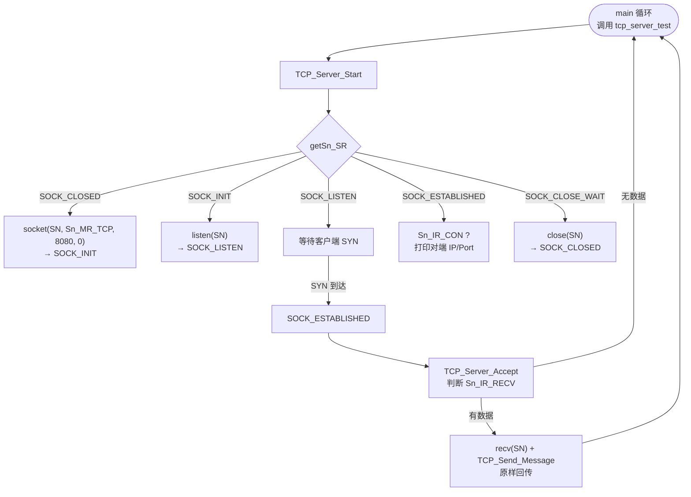
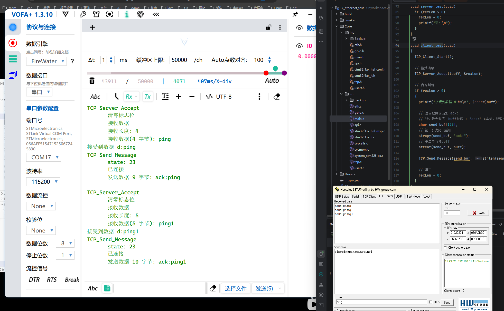
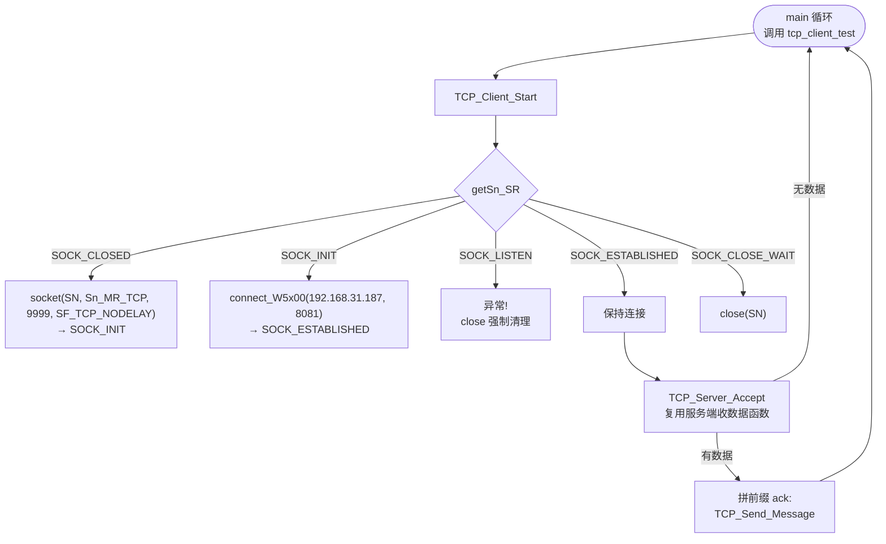
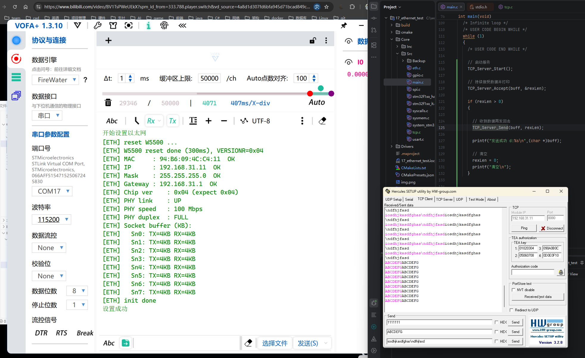
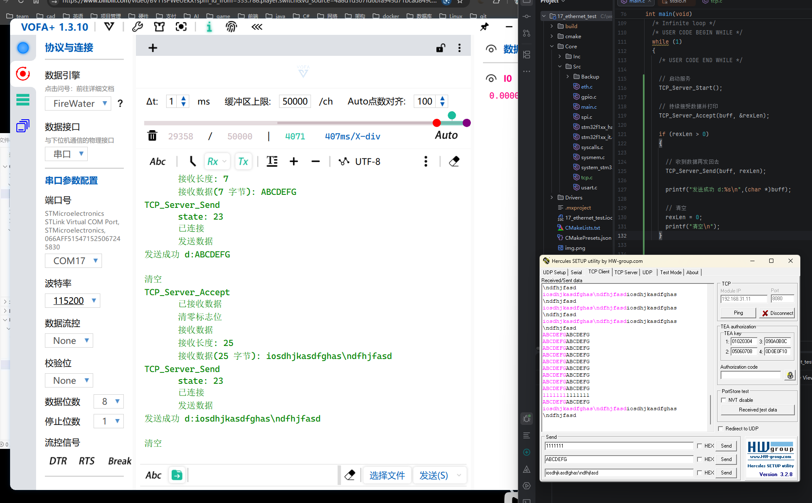
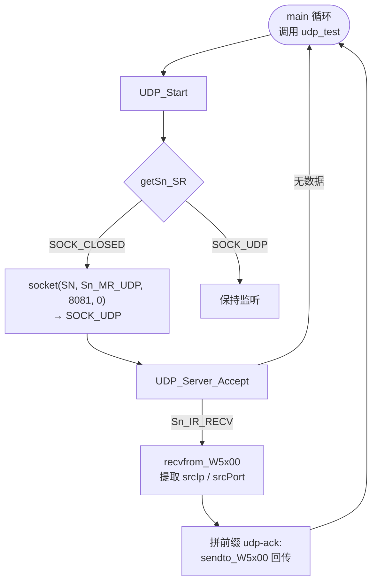
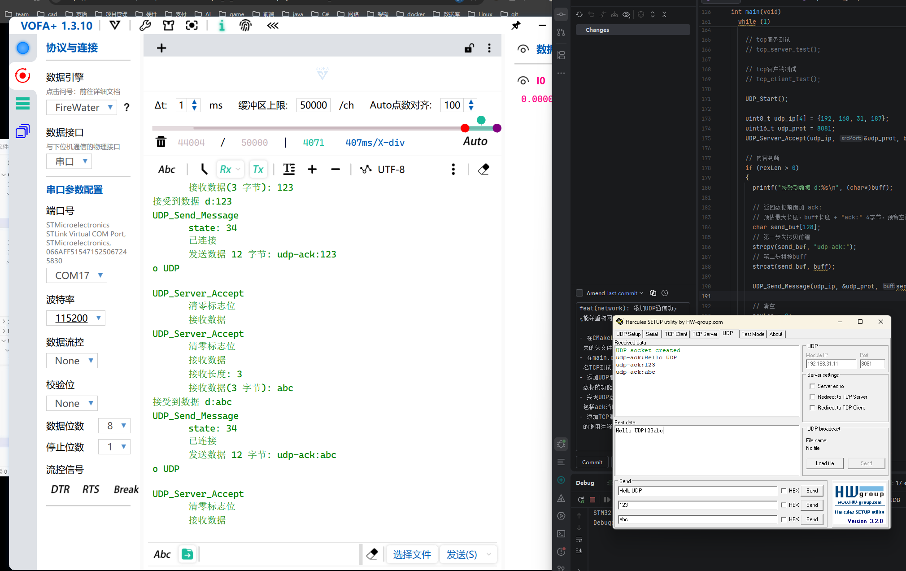

# w5500

W5500 是韩国半导体公司 WIZnet 提供的一款高性价比的**以太网芯片**。其全球独一无二的**全硬件 TCPIP 协议栈专利技术**，解决了**嵌入式以太网**的接入问题，简单易用，安全稳定，是物联网设备的首选解决方案。

W5500 集成了 TCP/IP 协议栈，10/100M 以太网数据链路层（MAC）及物理层（PHY），使用户使用单芯片就能够**在他们的应用中拓展网络连接**。

久经市场考验的 WIZnet 全硬件 TCP/IP 协议栈支持 TCP、UDP、IPv4、ICMP、ARP、IGMP 以及 PPPoE 协议。W5500 内嵌 **32K 字节片上缓存** 供以太网包处理。如果你使用 W5500，你只需要一些简单的 Socket 编程就能实现以太网应用。这将会比其他嵌入式以太网方案更加快捷、简便。

用户可以同时使用 **8 个硬件 Socket 独立通讯**。W5500 提供了 SPI（外设串行接口）从而能够更加容易与外设 MCU 整合。而且，W5500 使用了新的高效 SPI 协议支持 80MHz 速率，从而能够更好的实现高速网络通讯。为了减少系统能耗，W5500 提供了**网络唤醒模式（WOL）** 及掉电模式供客户选择使用。


# 芯片特点

（1）支持**硬件 TCP/IP 协议**：TCP、UDP、ICMP、IPv4、ARP、IGMP、PPPoE。

（2）支持 **8 个独立端口（Socket）同时通讯**。

（3）支持掉电模式。

（4）支持网络唤醒。

（5）支持高速串行外设接口（SPI 模式 0、3）。

（6）内部 **32K 字节收发缓存**。

（7）内嵌 **10BaseT/100BaseTX 以太网物理层（PHY）**。

（8）支持**自动协商（10/100-Based 全双工/半双工）**。

（9）**不支持 IP 分片**。

# 应用目标

W5500 适合于以下嵌入式应用：

（1）**家庭网络设备**：机顶盒、个人录像机、数码媒体适配器。

（2）**串行转以太网**：门禁控制、LED 显示屏、无线 AP 继电器等。

（3）**并行转以太网**：POS/微型打印机、复印机。

（4）**USB 转以太网**：存储设备、网络打印机。

（5）**GPIO 转以太网**：家庭网络传感器。

（6）**安全系统**：数字录像机、网络摄像机、信息亭。

（7）**工厂和楼宇自动化控制系统**。

（8）**医疗监测设备**。

（9）**嵌入式服务器**。

# 接入框图


[pdf在线文档](https://www.lcsc.com/datasheet/C32843.pdf)


# 官方库
[官方库](https://github.com/Wiznet/ioLibrary_Driver.git)

## 库的导入


只导入有用的库
```txt
W5500
- wiz5500.h
- wiz5500.c
socket.h
socket.c
wizchip.c
wizchip.h
```

在wizchip_conf.h中修改, 选择W5500, 否则编译会有问题;
```c
#define _WIZCHIP_                      5500   // W5100, W5100S, W5200, W5300, W5500, 6300
```

**cloin 需要手动 add 到 cmake中;**

**也可以右击文件, 选择添加到cmake项目中;**

## 如何使用

### 片选模式选择

在 wizchip_conf.h 中修改, 选择 SPI+VDM 模式;

```c
#define _WIZCHIP_IO_MODE_           _WIZCHIP_IO_MODE_SPI_
```

修改为
```c
#define _WIZCHIP_IO_MODE_           _WIZCHIP_IO_MODE_SPI_VDM_
```
### 默认禁用中断的函数

此函数有助于防止访问错误地址。如果您未描述此函数或注册任何函数，则会调用空函数。

在 wizchip_conf.c 中有默认实现; 实现为空函数。

```c
void 	wizchip_cris_enter(void)      {} // 进入中断模式
void 	wizchip_cris_exit(void)       {} // 退出中断模式
void 	wizchip_cs_select(void)       {} // 选择片选
void 	wizchip_cs_deselect(void)     {} // 取消选择片选
```

以上方法需要我们自己定义填写;


```c
void wizchip_cris_enter(void)
{
    __disable_irq();
}
void wizchip_cris_exit(void)
{
    __enable_irq();
}

void wizchip_cs_select(void)
{
    HAL_GPIO_WritePin(CS_GPIO_Port, CS_Pin, GPIO_PIN_RESET); // 选择片选
}
void wizchip_cs_deselect(void)
{
    HAL_GPIO_WritePin(CS_GPIO_Port, CS_Pin, GPIO_PIN_SET); // 取消选择片选
}
```


修改一下方法, 的内容, 为SPI的读取和写入字;

```c
uint8_t wizchip_spi_readbyte(void)
{
    uint8_t rByte;
    uint8_t byte = 0xff;
    HAL_SPI_TransmitReceive(&hspi1, &byte, &rByte, 1, 100); // 读取字节
    return rByte;
}
void wizchip_spi_writebyte(uint8_t wb)
{
    uint8_t rByte;
    HAL_SPI_TransmitReceive(&hspi1, &wb, &rByte, 1, 100); // 写入字节
}

``` 

修改后不会立即有效, 找到如下声明
```c
_WIZCHIP WIZCHIP = {
    _WIZCHIP_IO_MODE_,
    _WIZCHIP_ID_,
    {
        wizchip_cris_enter,
        wizchip_cris_exit
    },
    {
        wizchip_cs_select,
        wizchip_cs_deselect
    },
    {
        {
            //M20150601 : Rename the function
            //wizchip_bus_readbyte,
            //wizchip_bus_writebyte
            wizchip_bus_readdata,
            wizchip_bus_writedata
        },

    }
};
```

修改为
```c
_WIZCHIP WIZCHIP = {
    _WIZCHIP_IO_MODE_,
    _WIZCHIP_ID_,
    {
        wizchip_cris_enter,
        wizchip_cris_exit
    },
    {
        wizchip_cs_select,
        wizchip_cs_deselect
    },
    {
        {
            //M20150601 : Rename the function
            //wizchip_bus_readbyte,
            //wizchip_bus_writebyte
            wizchip_bus_readdata,
            wizchip_bus_writedata
        },

    }
};
```

# TCP 示例

本节代码基于 `Core/Src/tcp.c` + `main.c` 中的 `tcp_server_test()` / `tcp_client_test()`。
W5500 共有 8 个硬件 Socket，本工程固定使用 **Socket 0**（`tcp.h` 中 `#define SN 0`），本地端口 `8080`（`SERVER_PORT`）。

## TCP 服务端

### 流程图



### 核心代码

[tcp.c](file:///c:/workspace/stm32/src/17_ethernet_test/Core/Src/tcp.c) 中的服务端状态机 `TCP_Server_Start()` —— **循环调用时按当前状态分支推进**：

```c
void TCP_Server_Start(void)
{
    uint8_t state = getSn_SR(SN);

    if (state == SOCK_CLOSED)
    {
        int8_t sn = socket(SN, Sn_MR_TCP, SERVER_PORT, SOCK_FLAG);
        if ((int)sn == SN) printf("\tSOCK_OPEN\n");
    }
    else if (state == SOCK_INIT)
    {
        int8_t res = listen(SN);
        if (res == SOCK_OK) printf("\tSOCK_LISTEN\n");
    }
    else if (state == SOCK_LISTEN)
    {
        // 等待客户端 SYN
    }
    else if (state == SOCK_ESTABLISHED)
    {
        if (getSn_IR(SN) & Sn_IR_CON)
        {
            uint8_t dip[4] = {0};
            getSn_DIPR(SN, dip);
            printf("创建链接 %d.%d.%d.%d:%d\n",
                   dip[0], dip[1], dip[2], dip[3], getSn_DPORT(SN));
            setSn_IR(SN, Sn_IR_CON);   // 写 1 清 0
        }
    }
    else if (state == SOCK_CLOSE_WAIT)
    {
        close(SN);                    // 对端先断开，清理资源
    }
}
```

`tcp_server_test()` 是 `main` 循环里的"调度器"，把状态推进、数据收发粘合起来：

```c
void tcp_server_test(void)
{
    TCP_Server_Start();                              // 推进状态机
    TCP_Server_Accept(buff, &rexLen);                // 收数据

    if (rexLen > 0)
    {
        TCP_Send_Message(buff, rexLen);              // 原样回传
        rexLen = 0;
    }
}
```

### 验证



用网络调试助手连接 `192.168.31.11:8080`，发送任意文本，串口日志显示收到字节数 + 原文内容，调试助手同步收到回显。

---

## TCP 客户端

### 流程图



### 核心代码

`TCP_Client_Start()` 与服务端的差异：**跳过 `listen`，直接 `connect`**：

```c
uint8_t  client_ip[4]   = {192, 168, 31, 187};   // 对端 IP
uint16_t client_prot    = 8081;                    // 对端端口

void TCP_Client_Start(void)
{
    uint8_t state = getSn_SR(SN);

    if (state == SOCK_CLOSED)
    {
        int8_t sn = socket(SN, Sn_MR_TCP, 9999, SF_TCP_NODELAY);
        if ((int)sn == SN) printf("\tSOCK_OPEN\n");
    }
    else if (state == SOCK_INIT)
    {
        int8_t res = connect_W5x00(SN, client_ip, client_prot);
        if (res == SOCK_OK)
        {
            printf("\tconnect_ok\n");
            TCP_Send_Message("hello world\n", 12);  // 建链后主动发一条
        }
    }
    else if (state == SOCK_LISTEN)
    {
        printf("\t异常: 处于 LISTEN 状态, 强制关闭\n");
        close(SN);                                  // 客户端不应进入 LISTEN
    }
    else if (state == SOCK_ESTABLISHED) { /* 保持 */ }
    else if (state == SOCK_CLOSE_WAIT) { close(SN); }
}
```

`tcp_client_test()` 把收到数据前加 `ack:` 前缀再回传：

```c
void tcp_client_test(void)
{
    TCP_Client_Start();
    TCP_Server_Accept(buff, &rexLen);

    if (rexLen > 0)
    {
        char send_buf[128];
        strcpy(send_buf, "ack:");
        strcat(send_buf, buff);
        TCP_Send_Message(send_buf, strlen(send_buf));
        rexLen = 0;
    }
}
```

### 验证





> 关键点：本例**复用了 `TCP_Server_Accept` 作为收数据函数**。因为 W5500 的 `recv()` 只看 Socket 状态，不区分服务端/客户端角色，处于 `SOCK_ESTABLISHED` 时调用即可。

---

# UDP 示例

UDP 没有三次握手，Socket 只经历 `CLOSED → UDP` 两个状态。**`getSn_SR()` 返回 `SOCK_UDP (0x22)` 时即可收发**。

## 流程图



## 核心代码

[udp.c](file:///c:/workspace/stm32/src/17_ethernet_test/Core/Src/udp.c)：

```c
void UDP_Start(void)
{
    uint8_t state = getSn_SR(SN);

    if (state == SOCK_CLOSED)
    {
        int8_t sn = socket(SN, Sn_MR_UDP, 8081, 0);
        if ((int)sn == SN) printf("\tUDP_OPEN\n");
    }
}

int UDP_Server_Accept(uint8_t* srcIp, uint16_t* srcPort, uint8_t buff[], uint16_t* len)
{
    uint8_t state = getSn_SR(SN);

    if (state == SOCK_UDP)
    {
        if (getSn_IR(SN) & Sn_IR_RECV)
        {
            setSn_IR(SN, Sn_IR_RECV);

            uint16_t tmp_len = getSn_RX_RSR(SN);
            if (tmp_len <= 8) return 0;            // 仅 8 字节首部, 无负载

            *len = tmp_len - 8;                    // 减去 8 字节 UDP 首部
            recvfrom_W5x00(SN, buff, *len, srcIp, srcPort);

            if (*len > 0 && *len < 0xFFFF) buff[*len] = '\0';
            return 0;
        }
    }
    return 1;
}

int UDP_Send_Message(uint8_t* dstIp, uint16_t* dstPort, uint8_t buff[], uint16_t len)
{
    if (getSn_SR(SN) == SOCK_UDP)
    {
        if (len > 0 && buff[len - 1] != '\n') { buff[len] = '\n'; len++; }
        sendto_W5x00(SN, buff, len, dstIp, *dstPort);
        return 0;
    }
    return 1;
}
```

`main.c` 里的 `udp_test()`：

```c
void udp_test(void)
{
    UDP_Start();

    uint8_t  udp_ip[4]   = {192, 168, 31, 187};
    uint16_t udp_prot    = 8081;
    UDP_Server_Accept(udp_ip, &udp_prot, buff, &rexLen);

    if (rexLen > 0)
    {
        char send_buf[128];
        strcpy(send_buf, "udp-ack:");
        strcat(send_buf, buff);
        UDP_Send_Message(udp_ip, &udp_prot, send_buf, strlen(send_buf));
        rexLen = 0;
    }
}
```

## 验证



---

## 三种模式对比

| 维度 | TCP 服务端 | TCP 客户端 | UDP |
|------|-----------|-----------|-----|
| 状态机分支数 | 5（CLOSED/INIT/LISTEN/ESTABLISHED/CLOSE_WAIT） | 5（无 LISTEN 实际停留） | 1（仅 CLOSED → UDP） |
| 主动建链命令 | `listen` | `connect_W5x00` | 无 |
| 收数据 API | `recv(SN, buf, len)` | 同左 | `recvfrom_W5x00(SN, buf, len, &srcIp, &srcPort)` |
| 发数据 API | `send(SN, buf, len)` | 同左 | `sendto_W5x00(SN, buf, len, dstIp, dstPort)` |
| 对端信息 | 连接时 `getSn_DIPR / DPORT` | 同左 | 每包 `recvfrom` 输出 |
| 关闭方式 | `SOCK_CLOSE_WAIT` → `close` | 同左 | 无显式关闭，靠 `socket()` 重建 |