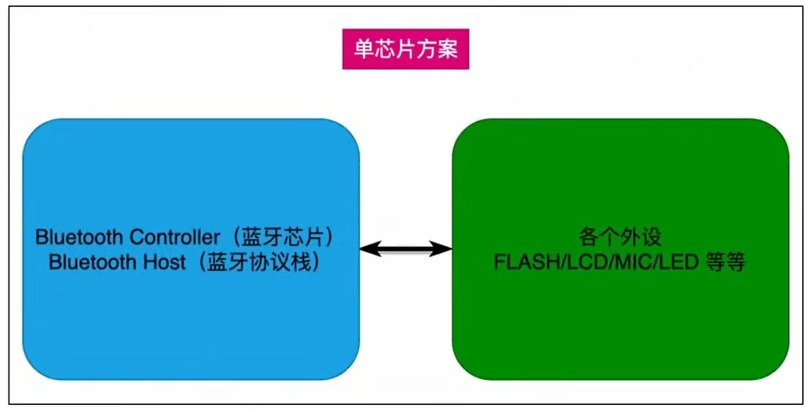
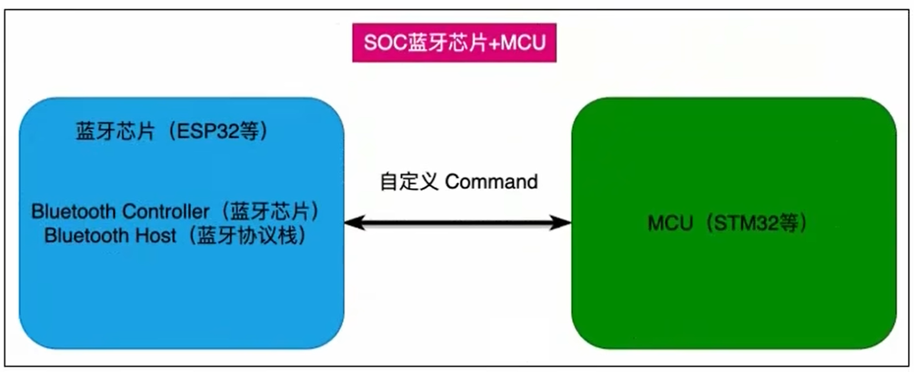
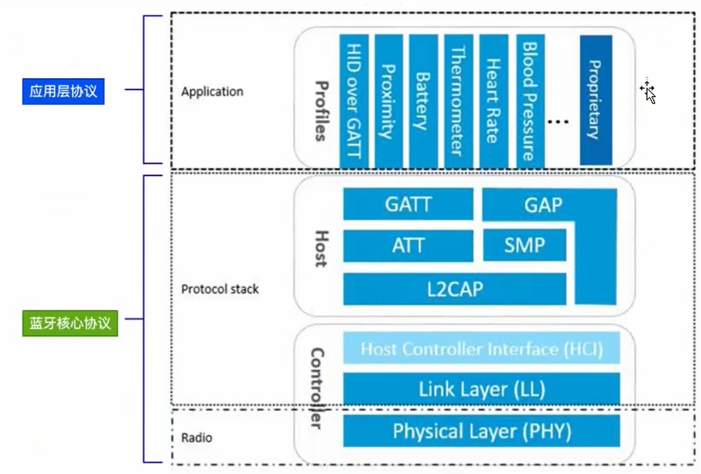
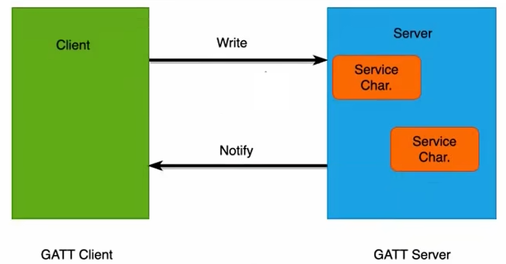

# 经典蓝牙

BR: Basic Rate 正宗蓝牙技术; 最早的蓝牙技术，1Mbps
EDR: Enhanced Data Rate 增强数据传输技术; 1.2Mbps
AMP: Advanced Power Management 高级功率管理技术; 2.1Mbps

# 低功耗蓝牙 (BLE)
BLE: Bluetooth Low Energy 低功耗蓝牙; 2.4Ghz

低功耗和经典的频率差异不大，都是2.4Ghz, 所以共享同一个频率。一个天线;

# 常见的蓝牙协议架构

## SOC 蓝牙单芯片方案



此类芯片一般可直接作为MCU 使用, 芯片内部封装了蓝牙协议栈。集成度高, 占用空间小, 适合于BLE开发; 例如蓝牙耳机;

## SOC + MCU 蓝牙单片机方案



在继承好的SOC 基础上，通过特定的接口(UART居多), 发送自定义的 cmd 来控制蓝牙协议栈。

例如: 蓝牙电话, 音乐播放器, 手机, 手环; 

# 蓝颜的协议层



# ESP32 中的蓝牙协议栈

AT 指令操作

## BLE 角色划分

- LL: 主从设别;
- GAP: 广播者,观察者, 外围设备, 中心设备;
- GATT: 服务端, 客户端;

## 地址
- 公共地址
- 随机地址

### 公共地址
全球唯一, 需要向IEEE购买;很多企业不用, 私密性不高;

### 随机地址
分为静态地址和私有地址;

- 静态地址, 永远不会改变
- 私有地址, 有规律的生成, 随机地址, 或者使用秘钥推算;

## 广播
从机定期发送一个一个数据包;

包含内容:
- 设备名称
- 是否可连接

## 扫描
主机定期扫描从机, 获取从机的广播数据包;


## 通讯
GATT 的 Profile 来完成;

从机: 会提供多个服务, 每个服务会有一个或多个Characteristic;
主机: 会请求从机提供的服务, 获取Characteristic, 从而获取通讯;



# 蓝牙透传模式

是蓝牙通信的重要工作模式, 也称之为透明传输模式. 在这种模式就行一个无形的数据管道, 数据会原封不动的传输到另一端, 而不需要对数据进行复杂的解析或处理


# AT 命令的使用功能

## AT+BLEGATTSSRVCRE：GATTS 创建服务

使用 ESP32-C3 作为 Bluetooth LE server 创建服务，需烧录带有 GATTS 配置的 mfg_nvs.bin 文件到flash 中。

Bluetooth LE server 初始化后，请及时调用本命令创建服务；如果先建立 Bluetooth LE 连接，则无法创建服务。


## AT+BLEADVPARAM：查询/设置 Bluetooth LE 广播参数

### 查询命令

**功能：** 查询广播参数

**命令：**
```
AT+BLEADVPARAM?
```

**响应：**
```
+BLEADVPARAM:<adv_int_min>,<adv_int_max>,<adv_type>,<own_addr_type>,<channel_map>,<adv_filter_policy>,<peer_addr_type>,<peer_addr>,<primary_PHY>,<secondary_PHY>
OK
```

### 设置命令

**功能：** 设置广播参数

**命令：**
```
AT+BLEADVPARAM=<adv_int_min>,<adv_int_max>,<adv_type>,<own_addr_type>,<channel_map>[,<adv_filter_policy>][,<peer_addr_type>,<peer_addr>][,<primary_PHY>,<secondary_PHY>]
```

**响应：**
```
OK
```

### 参数说明

| 参数 | 说明 |
|------|------|
| `<adv_int_min>` | 最小广播间隔。参数范围：`[0x0020, 0x4000]`。广播间隔 = 该参数 × 0.625 ms，实际范围 `[20, 10240]` ms。应小于等于 `adv_int_max`。 |
| `<adv_int_max>` | 最大广播间隔。参数范围：`[0x0020, 0x4000]`。广播间隔 = 该参数 × 0.625 ms，实际范围 `[20, 10240]` ms。应大于等于 `adv_int_min`。 |
| `<adv_type>` | 广播类型（见下表） |
| `<own_addr_type>` | 地址类型：`0`=PUBLIC, `1`=RANDOM |
| `<channel_map>` | 广播信道：`1`=CHNL_37, `2`=CHNL_38, `4`=CHNL_39, `7`=ALL |
| `[<adv_filter_policy>]` | 过滤器规则（可选）：`0`=允许任意扫描和连接, `1`=允许白名单扫描任意连接, `2`=允许任意扫描白名单连接, `3`=仅允许白名单扫描和连接 |
| `[<peer_addr_type>]` | 对方地址类型（可选）：`0`=PUBLIC, `1`=RANDOM |
| `[<peer_addr>]` | 对方 Bluetooth LE 地址（可选） |
| `[<primary_phy>]` | Primary PHY（可选）：`1`=1M PHY, `3`=Coded PHY。默认 1M PHY |
| `[<secondary_phy>]` | Secondary PHY（可选）：`1`=1M PHY, `2`=2M PHY, `3`=Coded PHY。默认 1M PHY |

#### adv_type 广播类型

| 值 | 类型 | 说明 |
|----|------|------|
| 0 | ADV_TYPE_IND | 可连接、可扫描的无定向广播 |
| 1 | ADV_TYPE_DIRECT_IND_HIGH | 可连接的高占空比定向广播 |
| 2 | ADV_TYPE_SCAN_IND | 可扫描的无定向广播 |
| 3 | ADV_TYPE_NONCONN_IND | 不可连接、不可扫描的无定向广播 |
| 4 | ADV_TYPE_DIRECT_IND_LOW | 可连接的低占空比定向广播 |
| 5 | ADV_TYPE_EXT_NOSCANNABLE_IND | 扩展不可扫描无定向广播 |
| 6 | ADV_TYPE_EXT_CONNECTABLE_IND | 扩展可连接无定向广播 |
| 7 | ADV_TYPE_EXT_SCANNABLE_IND | 扩展可扫描无定向广播 |

> **注意：**
> - 类型 0-4：使用 `AT+BLEADVDATA` 最多设置 31 字节，更长数据需用 `AT+BLESCANRSPDATA`
> - 类型 5-7：使用 `AT+BLEADVDATA` 最多设置 119 字节

### 说明

- 如果从未设置过 `peer_addr`，查询结果会是全零
- `primary_phy` 和 `secondary_phy` 需要一起设置，未设置的参数默认使用 1M PHY

### 示例

**示例 1：**
```
AT+BLEINIT=2                              // 角色：服务器
AT+BLEADVPARAM=50,50,0,0,4,0,1,"12:34:45:78:66:88"
AT+BLEADVPARAM=32,32,6,0,7,0,0,"62:34:45:78:66:88",1,3
```

**示例 2：**
```
AT+BLEINIT=2                              // 角色：服务器
AT+BLEADDR=1,"c2:34:45:78:66:89"
AT+BLEADVPARAM=50,50,0,1,4,0,1,"12:34:45:78:66:88"
// 此时 Bluetooth LE 客户端扫描到的 ESP 设备的 MAC 地址为 "c2:34:45:78:66:89"
```

