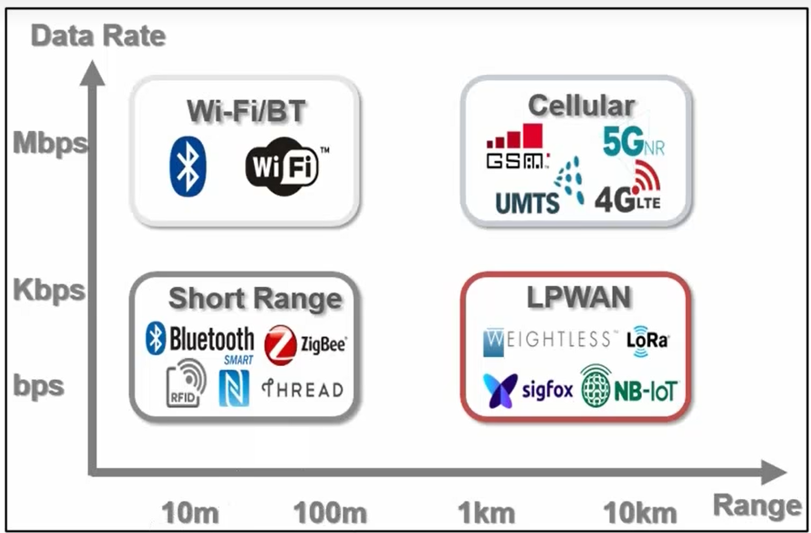
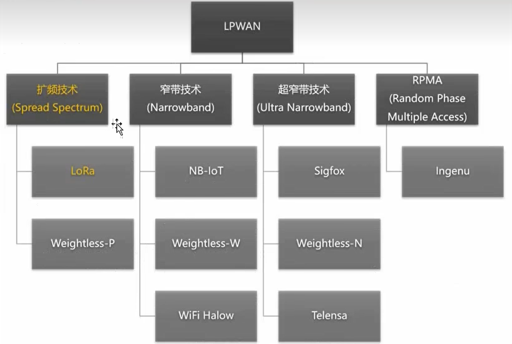
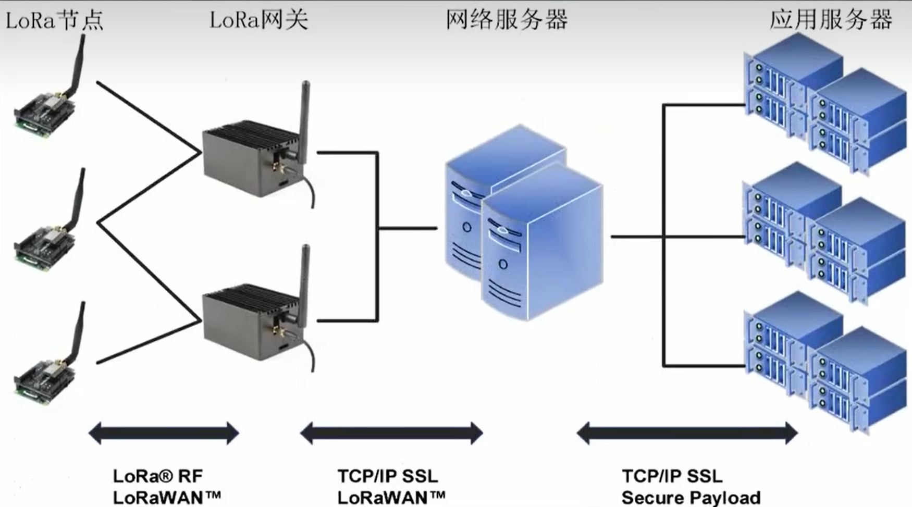

# 网络分类



# 低功耗广域网

LPWAN (Low Power Wide Area Network) 指的是低功耗广域网。其特点是：
- 低功耗
- 广域覆盖
- 长距离通信

LPWAN 不是一种技术, 而是代表了所有低功耗广域网技术, 如图



低功耗广域网发展成为了适合大规模物联网应用场景的连接技术。LPWAN 兼具短距离无线网络低功耗和蜂窝网络超大覆盖范围的优点，覆盖范围广、通信能耗低。因此对于分布在大范围区域内的低功耗物联网设备来说，LPWAN 是最佳的连接选择。
在 LPWAN 网络中，这些物联网设备可以随意部署或移动，因此 LPWAN 可以满足智能城市中的诸多应用，如智能化计量、家庭自动化、可穿戴电子、物流、环境监测等。这些应用需要交换数据量少，交换的频率也不高。
LPWAN 应用场景包括但不限于智能交通、工厂、农业、采矿等领域。由于 LPWAN 具有传统的蜂窝网络和传统无线技术所不具备的特点（例如相比于蜂窝网络来说功耗更低，相比于传统无线网覆盖更广），同时由于其独特的设计，使得 LPWAN 通常能在更低的信噪比下工作，因此能够适合在复杂环境中的联网。

# 现有LPWAN技术按照工作平路分为

## 授权频段

3GPP (3rd Generation Partnership Project) 主导的 NB-IoT 技术, 其采用现有蜂窝网络, 通过审计来实现;

## 非授权频段

遍地开花的盛况; LoRa, SigFox, ISM (蓝牙就属于);

LoRa 技术，其采用非授权频段，无需审计，无需申请，无需支付费用；

发射功率低于 1W，不能对其他频段的设备造成干扰；

# LoRa

www.semtech.cn/lora

LoRa (Long Range Communication)，狭义上指的是一种物理层的信号调制方式；

Semtech 公司开发的 LoRa 技术，其采用非授权频段，无需审计，无需申请，无需支付费用；

可达到 148dBm 的接收灵敏度；

速率偏小 0.3-50kbps；市区距离可达 3km，郊区距离可达 15km；

低功耗在特定场景下，可以实现 10 年以上的电池寿命；

从系统角度看，LoRa 也由终端节点、网关、网络服务、应用服务的系统架构；

从应用角度看，LoRa 技术提供了低成本、低功耗、超远距离通信的解决方案；可以使用 10mW 的发射功率，实现 15km 的距离通信；

# LoRa 的特点

1. 远距离  
    15km 的距离通信
2. 低功耗  
    10 年以上的电池寿命
3. 安全  
    采用 AES128 加密，双向认证，提供了数据传输的安全性；
4. 标准化  
    LoRa 技术已被国际标准化组织 (ISO) 标准化，并在 2016 年 10 月 1 日正式发布；具有 LoRaWAN 网络的设备互操作性和全球可用性，为物联网应用提供了统一的通信标准；
5. 地理定位  
    无需 GPS 定位，具有其他技术难以实现的地理定位功能；
6. 移动性  
    设备可以随意部署或固定安装在某个位置；
7. 高性能  
    每个基站可以处理 100 万条数据；
8. 低成本  
    无需审计，无需申请，无需支付费用；基础建设成本低，电池更换成本低；运营成本低；

# LoRa 应用
- 智能交通
- 农业
- 采矿
- 环境监测
- 智慧路灯

# LoRa 组网架构



节点, 网关, 服务器;
```
LoRa RF -> TCP/IP SSL -> TCP/IP SSL
LoRaWan -> LoRaWan    -> Secure Payload
```

# LoRa 通讯的关键参数

## 载波频率

工作频率在, 410MHz-493MHz 之间;

常见
- 433MHz
- 470MHz
- 490MHz

## 发射功率
最大一般在 22dbm-25dbm 之间;

dbm (分贝毫瓦), 是基于 10 的对数, 表示信号功率的相对大小; 表示功率的相对与1mw的级别

## 空中速率
收到多种因素的影响, 如 扩频因子, 带宽, 编码率

## 扩频因子
扩频因子是LoRa 扩频调制技术里最核心的参数，代表：
每 1 个原始数据比特，会被扩展成多少个码片（chirp 线性调频符号）。
公式关系：符号长度 = \(2^{SF}\) 个码片

简写：SF，取值 SF5、SF6、SF7 … SF12、SF14，仅代表扩频倍数指数。

1. 通信距离、抗干扰能力 ↑（SF 越大越强）
2. 传输速率 ↓（SF 越大越慢）
3. 功耗、空中时长 ↑（SF 越大耗电越高）

\(T_s = \frac{2^{SF}}{BW}\)

## 带宽
带宽是指传输频率的范围, 越宽, 空中传输速率越高;

## 编码率
LoRa 采用循环纠错码（前向纠错 FEC），编码率 CR 代表：有效数据比特占总传输比特的比例，用来抗干扰、修复空中传输误码。

LoRa 标准编码率用分母表示，格式：CR=4/(4+CR值)

CR 取值：CR1、CR2、CR3、CR4

计算公式：
\(\text{编码率} = \frac{4}{4+CR_x}\)

核心特性（和扩频因子 SF 对比记忆）
CR 越大，纠错冗余越多
CR4：抗干扰最强，强遮挡、工业矿山、电磁复杂环境首选；
CR1：几乎无冗余，仅空旷近距离场景用。
CR 越大，传输速率越低、空中时长越长、功耗更高
额外校验比特会拉长数据包发送时间，射频工作更久，电池耗电加快。
CR 与 SF 互不冲突，可自由组合
远距离场景常用组合：SF12 + CR4；
近距离电表 / 水表：SF7 + CR1。

## 同步字
同步字是 LoRa 物理帧前导码 Preamble 后面的 2 个 chirp 符号，属于物理层标记，两个核心作用：精确定时同步 + 网络识别过滤数据包。

只有发送端、接收端同步字完全匹配，接收芯片才继续解码数据包；同步字不匹配，硬件直接丢弃帧，不交给 MCU 处理，节省功耗。

帧顺序：前导码Preamble → 同步字Sync Word → SFD帧起始分隔符 → Header → Payload

## 前导码
前导码是 LoRa 物理帧前导码 Preamble，属于物理层标记，两个核心作用：精确定时同步 + 网络识别过滤数据包。

只有发送端、接收端前导码完全匹配，接收芯片才继续解码数据包；前导码不匹配，硬件直接丢弃帧，不交给 MCU 处理，节省功耗。

# LoRa 核心参数速查表（SF / CR / BW / SyncWord / Preamble / SFD）

|参数|全称|本质|取值/单位|核心作用|性能影响规律|典型配置|
|---|---|---|---|---|---|---|
|**SF 扩频因子**|Spreading Factor|数据比特扩频倍数指数|无量纲SF5～SF12|决定通信距离、接收灵敏度、抗噪能力|SF↑：距离↑、灵敏度↑、速率↓、延时↑、功耗↑|远距：SF12常规：SF9近距：SF7|
|**CR 编码率**|Coding Rate|前向纠错冗余比例 FEC|无量纲档位CR1～CR4公式：4\(4\+CR\)|增加校验冗余，纠正空中误码，提升抗干扰|CR↑：纠错能力↑、速率↓、包时长↑、功耗↑|恶劣环境：CR4普通环境：CR1/CR2|
|**BW 带宽**|Bandwidth|射频信道带宽|单位：kHz125  250 / 500|决定码片速率，平衡速度与接收灵敏度|BW↑：传输速率↑、接收灵敏度↓、抗窄带干扰↓|远距离通用：125kHz高速短距：250500kHz|
|**SyncWord 同步字**|Sync Word|网络识别\+同步特征码|十六进制1字节2字节|精准时间同步 \+ 物理层网络隔离过滤|不影响速率、距离、灵敏度；不匹配直接硬件丢包|私有P2P：0x12LoRaWAN公网：0x34|
|**Preamble 前导码**|Preamble|前置检测 Chirp 序列|单位：符号数常用 8～12|信道检测、粗同步、唤醒接收机|前导越长：信号越易捕获、抗弱信号越好、开销越大|私网：8符号LoRaWAN标准：12符号|
|**SFD 帧起始分隔符**|Start of Frame Delimiter|特殊下行 Chirp 标记|硬件固定2符号|标记同步结束、有效数据正式开始|固定参数，不可配置；识别失败整帧丢弃|默认固定，无需修改|