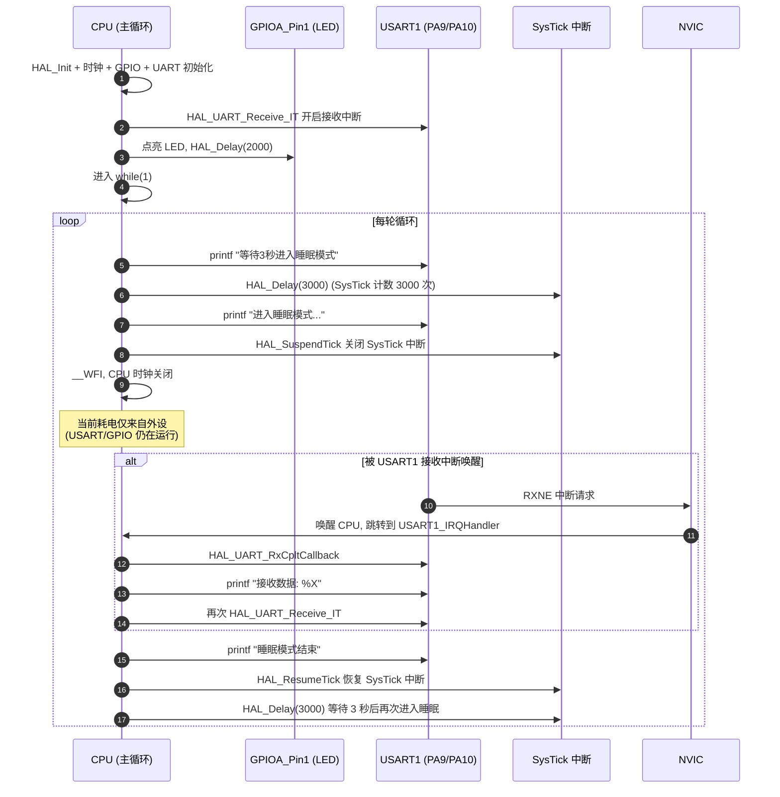

# STM32 睡眠模式详解 (Sleep Mode)

> 基于 `23_power_control` 工程 (`main.c` + `HAL_PWR` 驱动) 的实际实现整理

---

## 1. 概述

睡眠模式是 STM32F1 三种低功耗模式中**最浅**的一档:

| 项目 | 睡眠模式 | 停机模式 | 待机模式 |
|------|---------|---------|---------|
| CPU 时钟 | **关闭** | 关闭 | 关闭 |
| 外设时钟 (NVIC / SysTick / GPIO / UART…) | **保持运行** | 全部停止 | 全部停止 |
| 电压调节器 | 开启 (主调节器) | 开 / 低功耗 | 关 |
| 1.8V 域 SRAM / 寄存器 | 保持 | 保持 | **丢失** |
| 后备域 (RTC / 备份寄存器) | 保持 | 保持 | 保持 |
| 典型电流 | mA 级 | μA 级 | nA 级 |
| 唤醒时间 | **几 μs** | 几十 μs | 几 ms (相当于复位) |

睡眠模式的核心特点是 **CPU 时钟关闭, 但所有外设仍然运行**。
NVIC 还在工作, SysTick 还在计数, USART 还能接收数据触发中断唤醒 CPU。

---

## 2. 进出机制

进入睡眠模式是通过执行 Cortex-M3 的两条内核指令之一:

### 2.1 进入方式

| 指令 | 含义 | 唤醒源 |
|------|------|--------|
| `WFI` (Wait For Interrupt) | 等待中断 | 任何被 NVIC 使能的外设中断 |
| `WFE` (Wait For Event) | 等待事件 | EXTI 线事件 / 未配置 NVIC 但置位 SEVONPEND 的中断 |

**注意**: 进入睡眠前必须清除 `SCB->SCR` 中的 `SLEEPDEEP` 位,否则会被当作深度睡眠 (停机/待机)。

### 2.2 唤醒方式

- **WFI 进入**: 任意一个 NVIC 已使能的外设中断即可唤醒 (例如 USART1 接收中断)
- **WFE 进入**: 任意 EXTI 线 (内部或外部) 配置为事件模式后产生的事件可唤醒

### 2.3 HAL 接口

```c
void HAL_PWR_EnterSLEEPMode(uint32_t Regulator, uint8_t SLEEPEntry);
```

参数说明:

| 参数 | 取值 | 作用 |
|------|------|------|
| `Regulator` | `PWR_MAINREGULATOR_ON` / `PWR_LOWPOWERREGULATOR_ON` | **睡眠模式下无效, 仅作占位以保持 API 一致性** |
| `SLEEPEntry` | `PWR_SLEEPENTRY_WFI` / `PWR_SLEEPENTRY_WFE` | 选择进入指令 |

驱动内部实际做的事 (`stm32f1xx_hal_pwr.c`):

```c
// 1. 清除 SLEEPDEEP 位 (确保进入普通睡眠而非深度睡眠)
CLEAR_BIT(SCB->SCR, SCB_SCR_SLEEPDEEP_Msk);

// 2. 根据入参选择指令
if (SLEEPEntry == PWR_SLEEPENTRY_WFI) {
    __WFI();                                // 等待中断
} else {
    __SEV();                                // 置位事件寄存器
    __WFE(); __WFE();                       // 清空事件后再等待
}
```

---

## 3. 本工程的实现解析

### 3.1 整体目标

> 让 CPU 大部分时间处于睡眠模式 (低电流), 当 **USART1 接收到外部数据** 时被唤醒, 唤醒后再继续运行, 然后再次进入睡眠, 循环往复。

### 3.2 代码全景

`Core/Src/main.c` 中的 `main()` 函数:

```c
int main(void)
{
    HAL_Init();
    SystemClock_Config();      // HSE 8MHz × 9 = 72MHz 系统时钟
    MX_GPIO_Init();             // PA1 (LED_BLUE) 配置为推挽输出
    MX_USART1_UART_Init();      // USART1: 115200, 8N1, PA9/PA10

    /* ① 关键: 开启 USART1 接收中断,作为睡眠唤醒源 */
    HAL_UART_Receive_IT(&huart1, aRxBuffer, 1);

    HAL_GPIO_WritePin(led_blue_GPIO_Port, led_blue_Pin, GPIO_PIN_RESET);
    HAL_Delay(2000);            // 启动后点亮 LED 2 秒

    while (1)
    {
        printf("执行完毕, 等待3秒进入睡眠模式\r\n");
        HAL_Delay(3000);        // ① 正常打印 3 秒

        printf("进入睡眠模式...\r\n");

        /* ② 关键: 暂停 SysTick, 避免它每毫秒唤醒一次 CPU */
        HAL_SuspendTick();

        /* ③ 进入睡眠模式: 主调节器保持, 通过 WFI 指令进入 */
        HAL_PWR_EnterSLEEPMode(PWR_MAINREGULATOR_ON, PWR_SLEEPENTRY_WFI);

        printf("睡眠模式结束\r\n");

        /* ④ 关键: 恢复 SysTick, 否则 HAL_Delay / printf 等都失效 */
        HAL_ResumeTick();

        HAL_Delay(3000);
    }
}
```

`Core/Src/usart.c` 中, 中断已在 MSP 初始化里使能:

```c
HAL_NVIC_SetPriority(USART1_IRQn, 0, 0);
HAL_NVIC_EnableIRQ(USART1_IRQn);
```

`Core/Src/stm32f1xx_it.c` 中的中断入口:

```c
void USART1_IRQHandler(void) {
    HAL_UART_IRQHandler(&huart1);   // 最终调用 HAL_UART_RxCpltCallback
}
```

`main.c` 中的接收完成回调 (中断唤醒后会进入这里):

```c
void HAL_UART_RxCpltCallback(UART_HandleTypeDef *huart)
{
    if (huart->Instance == USART1) {
        printf("接收数据: %c\r\n", aRxBuffer[0]);
        HAL_UART_Receive_IT(huart, aRxBuffer, 1);   // 重新开启接收,为下一次唤醒做准备
    }
}
```

### 3.3 为什么必须 `HAL_SuspendTick` / `HAL_ResumeTick`

`HAL_Delay()` 是基于 SysTick 中断 (`HAL_IncTick`) 实现的:

- `SysTick_Handler()` 每 1ms 执行一次, 通过 `HAL_IncTick()` 让 `uwTick` 自增
- 默认情况下 SysTick 中断是使能的, **每毫秒都会触发一次 NVIC 中断**
- 睡眠模式 WFI 对 NVIC 中断是敏感的 — **SysTick 中断会持续不断地把 CPU 唤醒**,根本达不到省电目的

解决: 调用 `HAL_SuspendTick()` 后, HAL 会通过 `SysTick->CTRL` 关闭 SysTick 中断, 此时再进入 WFI 就可以真正睡下去。唤醒后必须 `HAL_ResumeTick()` 把 SysTick 中断重新打开, 否则 `HAL_Delay` / `printf` / `HAL_GetTick()` 等所有基于 tick 的 API 都会失效。

---

## 4. 执行时序



---

## 5. 关键点速查表

| # | 要点 | 本工程做法 | 反例 / 错误 |
|---|------|------------|-----------|
| 1 | 必须有唤醒源 | `HAL_UART_Receive_IT` + NVIC 使能 | 没有中断源 → 永远唤醒不了 |
| 2 | 必须暂停 SysTick | `HAL_SuspendTick()` 前置 | 不暂停 → 每 ms 被 SysTick 唤醒, 失去意义 |
| 3 | 必须恢复 SysTick | `HAL_ResumeTick()` 后置 | 不恢复 → `HAL_Delay` 永久卡死 |
| 4 | Regulator 参数无效 | 写 `PWR_MAINREGULATOR_ON` 占位 | 无所谓,睡眠模式不检 |
| 5 | 入参选择 | `PWR_SLEEPENTRY_WFI` | `WFE` 需要额外配 EXTI 事件 |
| 6 | 中断优先级 | `USART1_IRQn` 优先级 0 | 若被 BASEPRI / PRIMASK 屏蔽, 无法唤醒 |
| 7 | I/O 状态 | 睡眠时所有引脚保持原电平 | 无需重新配置,唤醒后 GPIO 仍工作 |
| 8 | 再次进入 | 唤醒后**重新调用** `HAL_UART_Receive_IT` | 否则只有第一次能唤醒 |

---

## 6. 常见疑问

### 6.1 睡眠模式下 USART 是怎么收到数据的?

USART 是独立于 CPU 时钟工作的外设, 它的波特率发生器挂在 APB 时钟上。
**CPU 睡眠时, APB 时钟并未关闭**, 所以 USART 仍然可以正常采样 RX 引脚, 接收完一字节后将 `RXNE` 置位, 产生 NVIC 中断请求, 唤醒 CPU。

### 6.2 为什么 WFI 模式下需要 NVIC 使能?

WFI 的唤醒条件是 **"发生了被 NVIC 使能的外设中断"**。
如果外设产生了中断标志但 NVIC 中该 IRQ 被 `DISABLE`, CPU 就检测不到这个中断, 无法唤醒。
本工程 `usart.c` 中 `HAL_NVIC_EnableIRQ(USART1_IRQn)` 就是这一步。

### 6.3 唤醒后是从哪里继续执行?

CPU 时钟恢复, 程序从 `__WFI()` 指令之后的下一条语句继续执行, 即:

```c
HAL_PWR_EnterSLEEPMode(...);   // 唤醒后从这里继续
printf("睡眠模式结束\r\n");
HAL_ResumeTick();
HAL_Delay(3000);
```

### 6.4 能否不使用 SysTick, 自己实现延时?

可以。在 `HAL_SuspendTick()` 之后 `HAL_Delay()` 已经不可用, 因为它依赖 `uwTick` 递增。
如果确实需要在睡眠前做精确延时, 可改用硬件定时器 (例如 TIM2) 或者 DWT 周期计数器, 但本工程使用 `HAL_Delay(3000)` 是因为它调用发生在 `HAL_SuspendTick()` **之前**, 仍然有效。

### 6.5 睡眠模式的电流真的能降到 mA 级吗?

- 72MHz 全速运行时, STM32F103 典型运行电流 ~ 30 mA
- 睡眠 (WFI, CPU 停, 外设跑) 通常可降到 5 ~ 10 mA 区间
- 进一步降功耗可考虑: 进入睡眠前**关闭未用的外设时钟**, 用完再开 (`__HAL_RCC_xxx_CLK_DISABLE`)

### 6.6 睡眠 vs 停机, 该选谁?

- 需要保留 UART / 定时器 / ADC 等外设持续运行 → **睡眠**
- 不需要外设运行, 几 μs 唤醒后能容忍 → **停机** (电流更低)

---

## 7. 进阶扩展思路

1. **多唤醒源**: 再开启一个 EXTI 中断 (例如按键 PA0), 在中断里也能唤醒。
2. **串口空闲唤醒**: 使用 `HAL_UARTEx_ReceiveToIdle_IT`, 在一帧结束时空闲中断唤醒。
3. **降低系统时钟**: 进入睡眠前切换到 HSI 8MHz (`HAL_RCC_ClockConfig`), 唤醒后再切回 PLL 72MHz。
4. **WFE + EXTI 事件**: 把 PA0 配置为 EXTI 事件模式, `HAL_PWR_EnterSLEEPMode(..., PWR_SLEEPENTRY_WFE)`, 无需 NVIC 介入。

---

## 8. 相关文件索引

| 文件 | 作用 |
|------|------|
| `Core/Src/main.c` | 主循环、SysTick 挂起/恢复、调用 `HAL_PWR_EnterSLEEPMode` |
| `Core/Src/usart.c` | USART1 MSP 初始化、NVIC 使能、`_write` 重定向 |
| `Core/Src/stm32f1xx_it.c` | `USART1_IRQHandler` → `HAL_UART_IRQHandler` |
| `Core/Src/gpio.c` | LED (PA1) 推挽输出配置 |
| `Drivers/STM32F1xx_HAL_Driver/Src/stm32f1xx_hal_pwr.c` | `HAL_PWR_EnterSLEEPMode` 实现 |
| `Drivers/STM32F1xx_HAL_Driver/Src/stm32f1xx_hal.c` | `HAL_SuspendTick` / `HAL_ResumeTick` 实现 |
| `power_control.md` | 电源系统总览 (包含本模式的表格) |