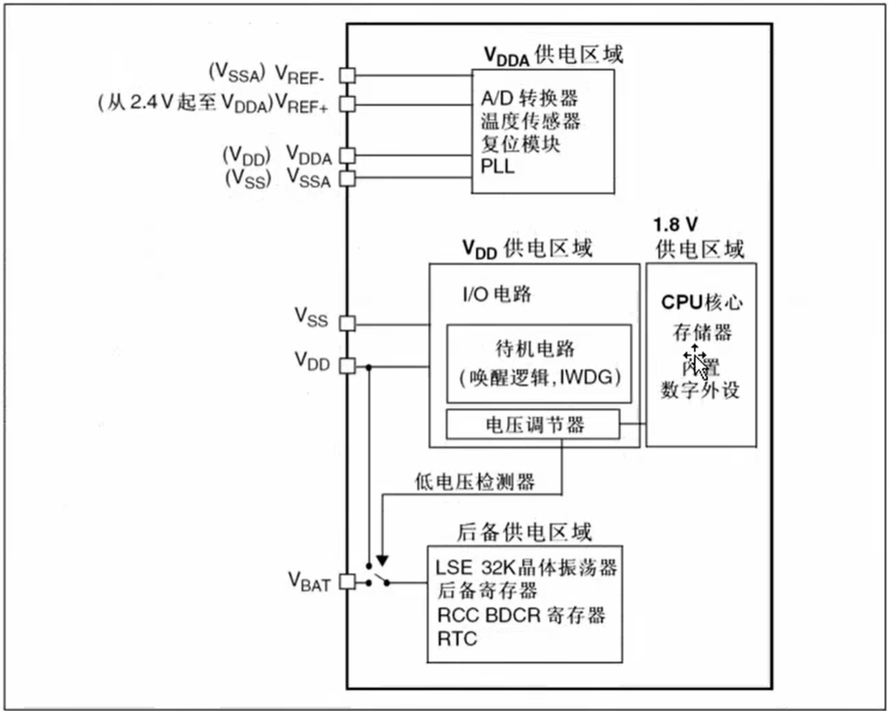
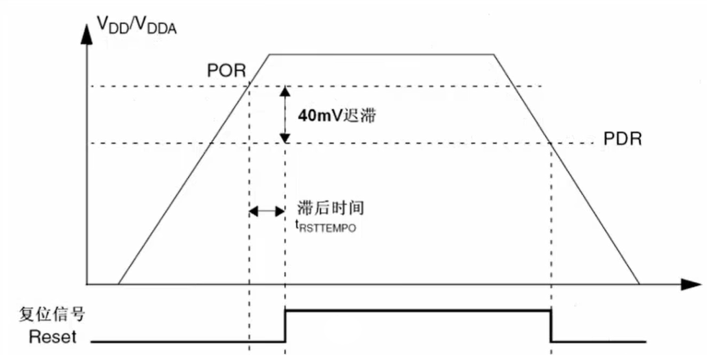

# stm32 电源控制

stm32 提供了专门的电源管理, 可以根据不同的应用需求, 对电源进行不同的管理.

## 电源框图

- **VCC** 是 stm32 的电源输入, 通常连接到电池或电源模块.
- **GND** 是 stm32 的地, 通常连接到电源模块的地.
- **VDD** 是 stm32 芯片的工作正电压.
- **VSS** 是 stm32 芯片的工作负电压.
- **VDDA** 是 stm32 芯片的模拟正电压
- **VSSA** 是 stm32 芯片的模拟负电压
- **VDDD** 是 stm32 芯片的数字正电压
- **VSSD** 是 stm32 芯片的数字负电压
- **VREF+** 是 stm32 芯片的参考电压
- **VREF-** 是 stm32 芯片的参考电压
- **VBAT** 是 stm32 芯片的电池电压
- **VEE** 是 stm32 负电压供电

### VDDA 供电区域

主要负责模拟部分供电, 为了提供转换的高精度, ADC使用一个独立的电源, 过滤和屏蔽来自印刷电路的毛刺干扰.

### VDD 供电区域

数字部分供电, 主要负责数字部分的供电, 电压 3.3v. I/O端口的电源

### 1.8V 低压供电区域

CPU核心, 内部存储, 内置数字外设都是使用 1.8V 供电的.

### 后备供电区域

Vbat 是电池电压, 用于提供备用电源.可以保存备份寄存器的内容和RTC供电;

Vbat 引脚会接 RTC LSE 振荡器和 PC13 PC15 供电, 确保电源切断后 RTC 可以正常工作;

## 电压调节器

复位后, 电压调节器工作是使能的,

1. 运转模式: 电压调节器工作在正常模式, 提供 3.3V 电压.
2. 停止模式: 电压调节器工作在低功耗模式, 提供 1.8V 电压. 用于 **保存寄存器和SRAM的内容**.
3. 待机模式: 电压调节器工作在停止供电, 处理备用电路和备份域以外, 用于 **保存寄存器和SRAM的内容**.

## 上电复位和掉电复位

为了防止波动, 设置一个 POR PDR, 最为一个区间, 防止频繁抖动

## 可编程的电压检测器 PVD (Power Voltage Detector - 电源电压检测器)

用户可以利用 PVD 的设置, 来控制 stm32 芯片的复位和待机模式.

寄存器 PVD\_CR , 用于配置 PVD 的工作模式.

# 低功耗

| 模式 | 进入 | 唤醒 | 对1.8V 区域时钟的影响 | 对 VDD 区域时钟的影响 | 电压调节器 |
|------|------|------|----------------------|----------------------|------------|
| **睡眠**（SLEEP-NOW / SLEEP-ON-EXIT） | `WFI` / `WFE` | 任一中断 / 唤醒事件 | CPU 时钟关闭，对其他时钟和 ADC 时钟无影响 | 无 | 开 |
| **停机** | `PDDS` 位 + `LPDS` 位 + `SLEEPDEEP` 位 + `WFI` 或 `WFE` | 任一外部中断（在外部中断寄存器中设置） | 关闭所有 1.8V 区域的时钟 | HSI 和 HSE 的振荡器关闭 | 开启或处于低功耗模式（依据电源控制寄存器 PWR_CR 的设定） |
| **待机** | `PDDS` 位 + `SLEEPDEEP` 位 + `WFI` 或 `WFE` | WKUP 引脚的上升沿、RTC 闹钟事件、NRST 引脚上的外部复位、IWDG 复位 | 关闭所有 1.8V 区域的时钟 | HSI 和 HSE 的振荡器关闭 | 关 |

### 关键缩写

- **WFI** — Wait For Interrupt，等待中断
- **WFE** — Wait For Event，等待事件
- **PDDS** — Power Down Deep Sleep，深度睡眠掉电位
- **LPDS** — Low Power Deep Sleep，低功耗深度睡眠位
- **SLEEPDEEP** — 深度睡眠控制位
- **WKUP** — Wake-Up 唤醒引脚
- **IWDG** — Independent Watch Dog，独立看门狗
- **HSI / HSE** — 内部 / 外部高速时钟
- **PWR\_CR** — 电源控制寄存器

### 模式功耗对比（经验值）

- **睡眠** — mA 级电流，唤醒时间几 μs
- **停机** — μA 级电流，唤醒时间几十 μs
- **待机** — nA 级电流，唤醒时间几 ms（相当于复位）

## 睡眠模式

1. 进入睡眠模式: 通过执行 `WFI` 或 `WFE` 指令, 进入睡眠模式.
    - SLEEP-NOW: 立即进入睡眠模式, 不等待中断或事件
    - SLEEP-ON-EXIT: 等待中断或事件, 再进入睡眠模式
2. 唤醒睡眠模式: 任一中断 / 唤醒事件, 会唤醒睡眠模式.
    - WFI执行进入: 任意一个中断控制器外部中断都将唤醒;
    - WFE执行进入: 任意一个事件将唤醒;

## 停机模式

1. 进入停机模式: 通过控制寄存器(PWR_CR) 来设置.
    - 如果正在闪存编程, 直到闪存访问完成, 再进入停机模式.
    - 如果正在对APB的访问, 直到访问完成, 再进入停机模式.

2. 退出停机模式: 通过控制寄存器(PWR_CR) 来设置.
    - 进入: 等待中断(WFI)或等待事件(WFE), 设置 SLEEPDEEP 位, 清除 PWR_CR, 为了进入停机模式. 外部中断必须全部挂起, RTC必须清除, 否则会导致停机失败
    - 退出: 
        - WFI进入, 在 NVIC 中必须使能响应的外部中断向量;
        - WFE进入, 设置任意外部中断线为事件模式;
    - 唤醒延迟: 
        - HSI RC 设置唤醒时间;

> 停机模式, 结束后, 需要恢复所有时钟的配置, 待机情况下会清空所有时钟寄存器的配置;

## 待机模式

可以实现系统最低功耗;

只有备份和待机电路维持;

1. 进入待机模式: 设置 SLEEPDEEP 位, 设置 PWR_CR, 设置 PWR_CR 位.
2. 退出待机模式: WKUP 引脚的上升沿, RTC 闹钟事件, NRST 引脚上的外部复位, IWDG 复位.

所有引脚处于高阻态, 除了以下引脚:

1. 复位引脚;
2. 防止入侵或校准输出的TAMPER引脚;
3. 被使能唤醒的引脚;
